# Volets Somfy RTS avec pseudo retour d’état

Dans ce tutoriel nous allons voir comment **calculer l’état d’ouverture des volets Somfy** dans Jeedom. Le principe est simple, il suffit de calculer le temps que mets le volet pour s’ouvrir ou se fermer et avec une règle de trois on détermine l’état. Il sera même **possible** par la suite de **commander** les volets **avec Google Assistant**.

Sachez toute fois qu’il n’y a **pas de vrai retour d’état** avec les volets **Somfy RTS**, donc toutes manipulations par les boutons manuels provoquera un décalage entre Jeedom et l’état réel.

-  **Coté Software** j’utilise les plugins :
  - [RFXCom](https://www.jeedom.com/market/index.php?v=d&p=market&type=plugin&categorie=&&name=RFXcom) (4€).
  - [Virtuel](https://www.jeedom.com/market/index.php?v=d&p=market&type=plugin&name=Virtuel&certification=Officiel&&categorie=programming) (Gratuit).

- **Coté hardware** j’utilise :
  - [Volets Somfy](https://amzn.to/2Jo7kSX).
  - [RFXtrx433XL](https://amzn.to/2XlUrO4).

Evidemment le principe est le même avec d’autres appareils permettant de contrôler les volets Somfy RTS.

## Création du Virtuel Volets Somfy dans Jeedom

**Le virtuel** permet **d’afficher** les commandes **Monter, Descendre, Stop** mais aussi **l’état calculé**. Personnellement j’ai ajouter des touches rapide 25%, 50% 75% mais cela est facultatif.

Je crée **un virtuel par volet**, cela permet de faire un simple **dupliquer** dès que l’on veut **ajouter un volet**.

Ce virtuel est mis en forme grâce à la disposition **« Tableau »**, un widget disponible sur le [Market](https://www.jeedom.com/market/index.php?v=d&p=market&type=widget&&name=SlidVertical_v3) et des widgets fait maison.


Virtuel Volets Somfy

- Aller dans Plugins / Programmation / Virtuel.
- Cliquer sur Ajouter.
- Nommer le virtuel **« Volets \[Pièce\] ».**
  - Exemple : **« Volets Salon »**.
- Sélectionner un Objet parent, une Catégorie et cocher Activer & Visible.
- **Sauvegarder.**

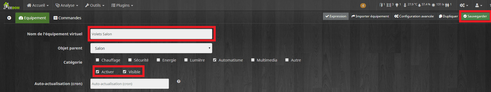

Virtuel Volets Somfy Onglet Equipement

- Aller dans l’onglet Commandes.
- Cliquer sur **« Ajouter une info virtuelle »**.
- Nommer la commande **« Etat_save ».**
  - Sélectionner les Sous-Type : **« Numérique ».**
  - Décocher **« Afficher ».**
- **Sauvegarder.**

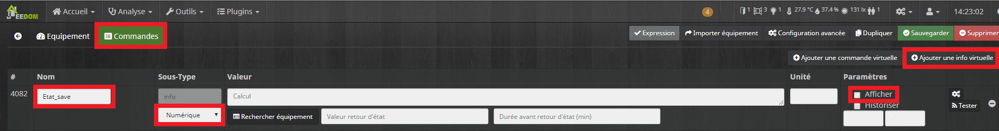

Virtuel Volets Somfy Onglet Commandes

- Cliquer 4 fois sur **« Ajouter une commande virtuelle »**.
- Nommer une commande **« Volet »**.
  - Dans Nom information saisir **« Etat »**.
  - Dans Sous-Type choisir **« Curseur ».**
- Nommer la commande suivante **« Monter »**.
  - Dans Nom information saisir **« Etat »**.
  - Dans Valeur saisir **« 100 ».**
- Nommer la commande suivante **« Descendre »**.
  - Dans Nom information saisir **« Etat »**.
  - Dans Valeur saisir **« 0 ».**
- Nommer la commande suivante **« Stop »**.
  - Dans Nom information cliquer sur **« Rechercher équipement »** et rechercher la commande Stop de votre volet.
    - Exemple : **#\[Salon\]\[Volet\]\[Stop\]#**.
  - Cliquer sur la **« Roue crantée »**.
  - Aller dans l’onglet **« Configuration ».**
  - Dans Action avant exécution de la commande cliquer sur : **« + Ajouter ».**
  - Saisir **« variable »**.
    - Nom : **VoletSalonStop**
    - Valeur : **#timestamp#**
- **Sauvegarder.**

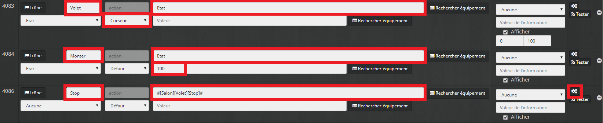

Ajouter une commande virtuelle

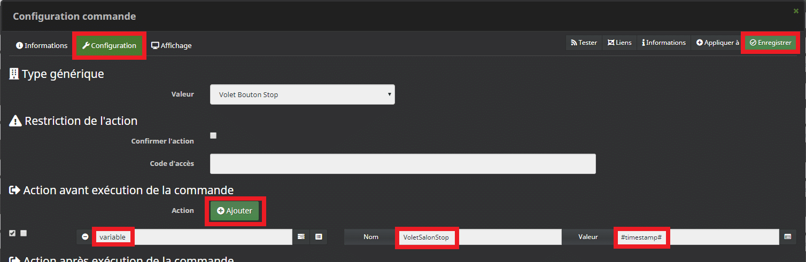

Commande « Stop ».

- Lier la nouvelle commande info **« Etat »** aux commandes **Volet, Monter et Descendre.**

Modifier la nouvelle commande info **« Etat » :**

- Sélectionner le Sous-Type : **« Numérique ».**
- Dans unité saisir **« % ».**
- Cliquer sur la **« Roue crantée »**.
  - Aller dans l’onglet **« Configuration ».**
  - Dans Arrondi (chiffre après la virgule) saisir : **« 0 ».**
- **Sauvegarder.**

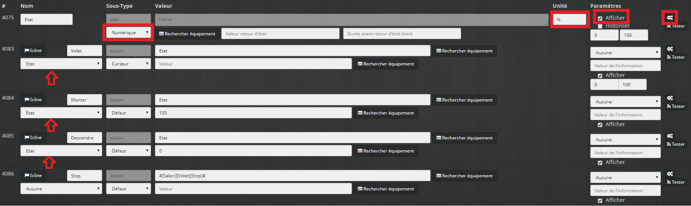

Lier la nouvelle commande info « Etat ».

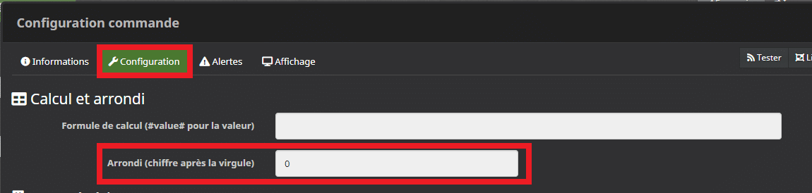

Arrondi (chiffre après la virgule).

Si vous voulez des touches rapide 25%, 50%…. il faut :

- Cliquer sur **« Ajouter une info virtuelle »**.
- Nommer la commande **« 25 ».**
  - Dans Nom information saisir **« Etat »**.
  - Dans Valeur saisir **« 25 ».**
  - Lier la commande info **« Etat ».**
- **Sauvegarder.**

Recommencez pour chacune des touches rapides.

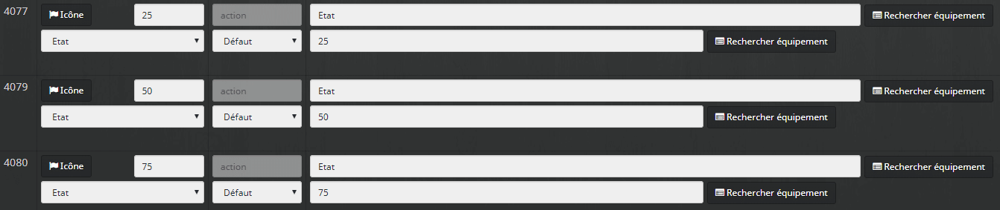

Touches rapide 25%, 50%….

Voilà pour le virtuel, la commande **Etat** correspond à la valeur choisi pour l’ouverture du volet et la commande **Etat_Save** correspond à la valeur précédente qui servira pour les calculs.

La commande Stop mets à jour la variable **« VoletSalonStop »** avec l’heure d’arrêt.

Il ne vous reste plus qu’à mette en forme votre virtuel.

## Création du scénario Volets Somfy dans Jeedom

Comme pour les virtuels nous allons créer **un scénario** par volet puis le **dupliquer** autant de fois que nécessaire. Il sera alors simple d’adapter les scénarios en fonction des besoins, les volets du salon ne sont pas forcément gérés comme ceux des chambres.

Pour le tutoriel je prendrais comme exemple les volets du salon. J’ai découpé le scénario en 4 parties pour que vous puissiez plus facilement vous repérez.

Les commandes du plugin RFXCom sont sous la forme **#\[Salon\]\[Volet\]\[COMMANDE\]#** et les commandes du virtuel sont sous la forme **#\[Salon\]\[Volets Salon\]\[COMMANDE\]#**.

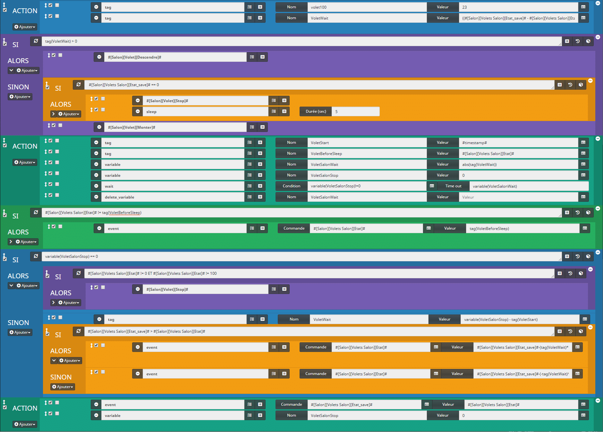

Scénario Volets Somfy

- Aller dans Outils / Scénarios.
- Cliquer sur Ajouter.
- Nommer le scénario **« Volet Salon ».**
- Sélectionner un Groupe, Objet parent, une Catégorie et cocher Activer & Visible.
- Laisser le Mode de scénario sur **« Provoqué »**.
- Cliquer sur **« + Déclencher ».**
- Ajouter la commande Etat du virtuel **« #\[Salon\]\[Volets Salon\]\[Etat\]# ».**
- Aller dans l’onglet Scénario.
- Cliquer sur **« + Ajouter Bloc »** pour ajouter un nouveau bloc**.**
- Sélectionner **« Action ».**
- **Enregistrer.**
- Ajouter 2 commandes Action en cliquant deux fois sur **« + Ajouter »** et **« Action ».**

```
Action : tag
Nom : volet100
Valeur : 23
```

Ce tag représente le temps que mets le volet pour bouger de 0 à 100%.

Chez moi les volets mettent le même temps pour monter ou descendre. Si ce n’est pas le cas chez vous il faudra faire 2 tags.

Par contre avant de monter il y a une étape de dépliage, je commence donc à compter une fois le dépliage effectué.

Dans mon salon il faut 23 secondes.

```
Action : tag
Nom : VoletWait
Valeur : ((#[Salon][Volets Salon][Etat_save]# - #[Salon][Volets Salon][Etat]#)*tag(volet100))/100
```

Ici nous avons la première formule qui permet de convertir les pourcentages en secondes afin de déterminer combien de temps s’écoule entre le démarrage et l’arrêt.

((Etat précèdent – Etat choisi) multiplié par le temps pour parcourir 100%) divisé par 100.

_Exemple d’un volet à 80% que l’on baisse à 30% : ((80 – 30) X 23) / 100 = 11,5 secondes._

- Cliquer sur **« + Ajouter Bloc »** pour ajouter un nouveau bloc**.**
- Sélectionner **« Si/Alors/Sinon ».**
- **Enregistrer.**

```js
SI tag(VoletWait) >= 0 ALORS
```

Ici on vérifie si la formule renvoi un nombre supérieur à 0 ou pas. Si c’est le cas on descend le volet sinon on le monte.

Ajouter une commande action en cliquant sur **« + Ajouter »** et **« Action ».**

```js
Action : #[Salon][Volet][Descendre]#
```

On ajout l’action descendre du **plugin RFXCom**.

```js
SINON;
```

Le sinon correspond à la montée du volet. 

- Cliquer sur **« > »** à côté du « **\+ Ajouter** ».
- Cliquer sur **« + Ajouter »** de la partie **Sinon**.
- Cliquer sur **« Action ».**

```js
Action : #[Salon][Volet][Monter]#
```

On ajout l’action monter du **plugin RFXCom.**

Si vous voulez ajouter une pause pour le dépliage du volet il faudra ajouter ce bloc avant la commande monter.

- Cliquer sur **« + Ajouter »** de la partie Sinon.
- Cliquer sur **« Bloc ».**
- Sélectionner **« Si/Alors/Sinon »**.
- **Enregistrer.**

```js
SI #[Salon][Volets Salon][Etat_save]# == 0 ALORS
```

Ici on vérifie si le volet est à 0% (fermé).

Ajouter 2 commande action en cliquant sur **« + Ajouter »** et **« Action »** deux fois.

```js
Action : #[Salon][Volet][Stop]#
```

On ajout l’action stop du plugin RFXCom qui permet, chez moi, de déplier le volet (My).

```
Action : sleep
Durée(sec) : 5
```

Pour finir, on fait une pause de 5 secondes afin de laisser le temps au volet de se mettre en position déplié.

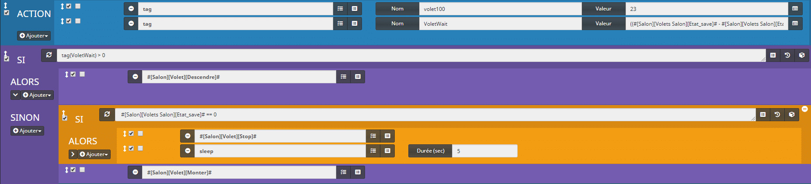

Scénario Volets Somfy Part 1

- Cliquer sur **« + Ajouter Bloc »** pour ajouter un nouveau bloc**.**
- Sélectionner **« Action ».**
- **Enregistrer.**
- Ajouter 6 commandes Action en cliquant sur **« + Ajouter »** et **« Action »** 6 fois.

```
Action : tag
Nom : VoletStart
Valeur : #timestamp#
```

On sauvegarde l’heure de démarrage du mouvement.

```
Action : tag
Nom : VoletBeforeSleep
Valeur : #[Salon][Volets Salon][Etat]#
```

On sauvegarde l’état en cas de changement pendant le mouvement.

```
Action : variable
Nom : VoletSalonWait
Valeur : abs(tag(VoletWait))
```

Ici on est obligé d’utiliser une variable car les tags ne fonctionnent pas avec la fonction « Wait ». On en profite pour rendre VoletWait positif avec la fonction abs.

```
Action : variable
Nom : VoletSalonStop
Valeur : 0
```

Là on réinitialise la variable VoletSalonStop qui sera mise à jour depuis la commande stop en cas d’arrêt manuel avant la fin du mouvement.

```
Action : wait
Condition : variable(VoletSalonStop)!=0
TimeOut : variable(VoletSalonWait)
```

La fonction Wait permet de vérifier si la variable VoletSalonStop devient différente de 0, cela signifie que l’on a cliqué sur Stop pour arrêter manuellement le mouvement. Si la variable reste à 0 alors on utilise la variable VoletSalonWait dans le time out pour arrêter le mouvement.

```
Action : delete_variable
Nom : VoletSalonWait
```

On supprime la variable VoletSalonWait qui n’est plus utile.

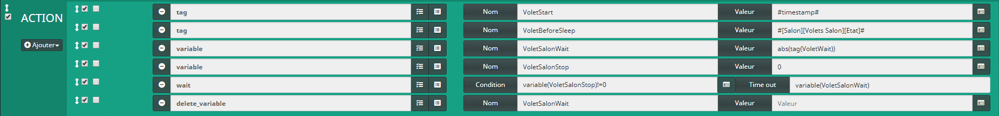

Scénario Volets Somfy Part 2

- Cliquer sur **« + Ajouter Bloc »** pour ajouter un nouveau bloc**.**
- Sélectionner **« Si/Alors/Sinon ».**
- **Enregistrer.**

`SI #[Salon][Volets Salon][Etat]# != tag(VoletBeforeSleep) ALORS` Ce test permet de vérifier si l’état a été modifié pendant le mouvement et si c’est le cas on remet l’état initial que l’on avait sauvegardé dans le tag VoletBeforeSleep.

- Ajouter 1 commande Action en cliquant sur **« + Ajouter »** et **« Action »**.

```
Action : event
Commande : #[Salon][Volets Salon][Etat]#
Valeur : tag(VoletBeforeSleep)
```

On applique une commande Event pour mettre à jour l’état avec le tag VoletBeforeSleep.

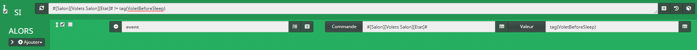

Scénario Volets Somfy Part 3

- Cliquer sur **« + Ajouter Bloc »** pour ajouter un nouveau bloc**.**
- Sélectionner **« Si/Alors/Sinon ».**
- **Enregistrer.**

```js
SI variable(VoletSalonStop) == 0 ALORS
```

Ici on test la variable VoletSalonStop, si elle est à 0 alors il n’y a pas eu d’arrêt manuel du volet via le bouton Stop.

- Cliquer sur **« + Ajouter »**.
- Cliquer sur **« Bloc ».**
- Sélectionner **« Si/Alors/Sinon »**.
- **Enregistrer.**

```js
SI #[Salon][Volets Salon][Etat]# != 0 ET #[Salon][Volets Salon][Etat]# != 100 ALORS
```

Dans les cas où les volets vont à 0% ou 100% il n’y a pas besoin d’actionner le bouton Stop car le volet s’arrête automatiquement, dans les autres cas on stop le volet pour qu’il s’arrête à la bonne hauteur.

- Ajouter 1 commande Action en cliquant sur **« + Ajouter »** et **« Action »**.

```js
Action : #[Salon][Volet][Stop]#
```

On ajout l’action stop du plugin RFXCom.

- Cliquer sur **« > »** à côté du « **\+ Ajouter**».
- Cliquer sur **« + Ajouter »** de la partie **Sinon**.
- Cliquer sur **« Action ».**

```
Action : tag
Nom : VoletWait
Valeur : variable(VoletSalonStop) - tag(VoletStart)
```

Dans le cas où l’on a cliqué sur le bouton Stop on recalcule le temps de mouvement avec l’heure de l’arrêt du mouvement moins l’heure du démarrage du mouvement.

- Cliquer sur **« + Ajouter »** de la partie **Sinon**.
- Sélectionner **« Bloc ».**
- Sélectionner **« Si/Alors/Sinon »**.
- **Enregistrer.**

```js
SI #[Salon][Volets Salon][Etat_save]# > #[Salon][Volets Salon][Etat]# ALORS
```

Avant de calculer le pourcentage de mouvement nous avons besoin de savoir si le volet allait vers le bas ou le haut. Pour vérifier cela on regarde si l’état précèdent (Etat_Save) et supérieur ou inférieur à l’état choisi (Etat).

- Ajouter 1 commande Action en cliquant sur **« + Ajouter »** et **« Action »**.

```
Action : event
Commande : #[Salon][Volets Salon][Etat]#
Valeur : #[Salon][Volets Salon][Etat_save]#-(tag(VoletWait)*100/tag(volet100))
```

Dans le cas où le volet est descendu on applique cette règle de trois pour convertir le temps en pourcentage.

Etat précèdent – (le temps parcouru multiplié par 100 divisé par le temps pour parcourir 100%).

_Exemple d’un volet à 80% que l’on baisse pendant 11,5 secondes : 80 – (11,5\*100/23) = 30%._

- Cliquer sur **« > »** à côté du **« + Ajouter »**.
- Cliquer sur **« + Ajouter »** de la partie Sinon.
- Cliquer sur **« Action ».**

```
Action : event
Commande : #[Salon][Volets Salon][Etat]#
Valeur : #[Salon][Volets Salon][Etat_save]#-(-tag(VoletWait)*100/tag(volet100))
```

Dans le cas où le volet est monté on applique cette règle de trois pour convertir le temps en pourcentage.

Etat précèdent – (–  le temps parcouru multiplié par 100 divisé par le temps pour parcourir 100%).

_Exemple d’un volet à 30% que l’on monte pendant 11,5 secondes : 80 – (–11,5\*100/23) = 80%._

- Cliquer sur **« + Ajouter Bloc »** pour ajouter un nouveau bloc**.**
- Sélectionner **« Action ».**
- **Enregistrer.**
- Ajouter 2 commandes Action en cliquant sur **« + Ajouter »** et **« Action »** 2 fois.

```
Action : event
Commande : #[Salon][Volets Salon][Etat_save]#
Valeur : #[Salon][Volets Salon][Etat]#
```

On met à jour la commande Etat_save avec la valeur de la commande Etat pour le prochain lancement du scénario.

```
Action : variable
Nom : VoletSalonStop
Valeur : 0
```

Pour finir on réinitialise la variable VoletSalonStop à 0.

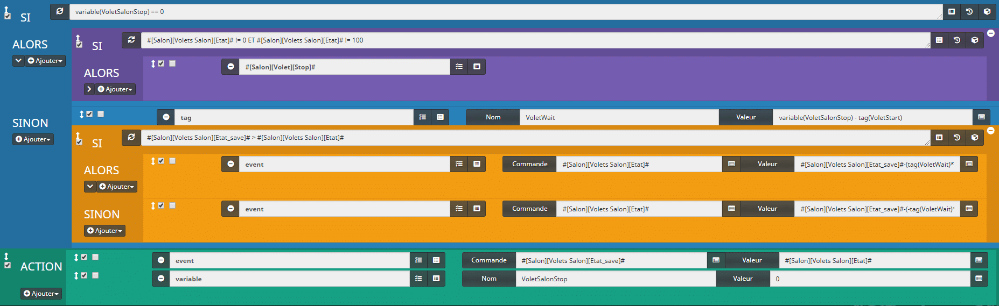

Scénario Volets Somfy Part 4

## Dupliquer le scénario Volets Somfy

Maintenant que notre scénario est terminé nous allons pouvoir le dupliquer pour **contrôler d’autres volets**. Jeedom propose **2 options** pour cela. La fonction **« Dupliquer »** qui va recréer à l’identique votre scénario et la fonction **« Template »** qui va nous permettre de remplacer les commandes existante (Salon) par les nouvelles commandes, par exemple Chambre. Personnellement je préfère l’option Template.

### Fonction « Dupliquer ».

- Cliquer sur le bouton **« Dupliquer »** en haut à droite.
- Donner un nom au scénario.
- Modifier **« Nom à afficher »** et **« Objet parent »**.
- Modifier **« Evénement »** avec la nouvelle commande Etat du virtuel.
- Aller dans l’onglet **Scénario**.
- Faite une recherche **CTRL + F** ou **touche F3** du clavier.
- Taper **« Salon »** pour voir apparaitre les éléments à changer.
- Modifier les éléments en **surbrillance**.
- **Sauvegarder.**

Cette technique est la plus simple à utiliser mais aussi la plus longue et la moins sure surtout si les commandes de vos virtuels ou volets ne sont pas enregistrés sous la même forme.

### Fonction « Template ».

- Cliquer sur le bouton **« Template »** en haut à droite.
- Saisir un nom dans **« Nom du Template »**. _Exemple **« Modèle Volet »**._
- Cliquer sur **« + »**.
- **Fermer** la fenêtre et **sortir** du scénario.
- Cliquer sur **Ajouter** pour créer un **nouveau** **scénario**.
- Nommer le nouveau scénario **« Volet Chambre ».**
- Cliquer sur le bouton **« Template »** en haut à droite.
- Rechercher le Template **« Modèle Volet »**.
- Rechercher les **nouvelles** **commandes** et modifier le **nom** des **variables**.
- Cliquer sur **« Appliquer »**.
- Cliquer sur **« D’accord »**.
- **Fermer** la fenêtre et **sortir** du scénario **sans** enregistrer.

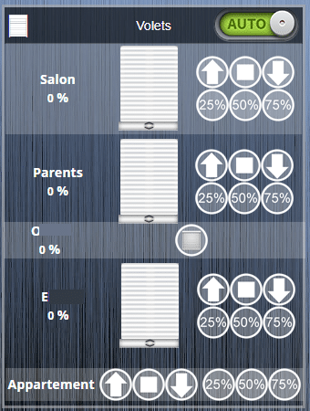

Virtuel Volets Somfy


Scénario Volets Somfy

Voilà j’espère avoir été clair pour ce tutoriel sur les Volets Somfy RTS avec pseudo retour d’état dans Jeedom. Regardez bien les copies d’écrans pour la hiérarchie des blocs.

Le problème du RTS sans retour d’état reste présent et si vous utilisez les commandes manuelles vous aurez des décalages avec les informations de Jeedom.

Pour éviter au maximum ce désagrément il est possible d’utiliser les commandes vocales comme Google Assistant ou [Alexa](https://amzn.to/2JpaQO8) afin de passer par Jeedom. Vous pouvez aussi remplacer les télécommandes d’origine par des [commandes compatible Jeedom](https://amzn.to/2YHdwfa).

Personnellement sur certaines portes je passe l’état des volets à 100% dès que la porte est ouverte. Plus vous automatisez les volets moins vous aurez à utiliser les commandes manuelles.
