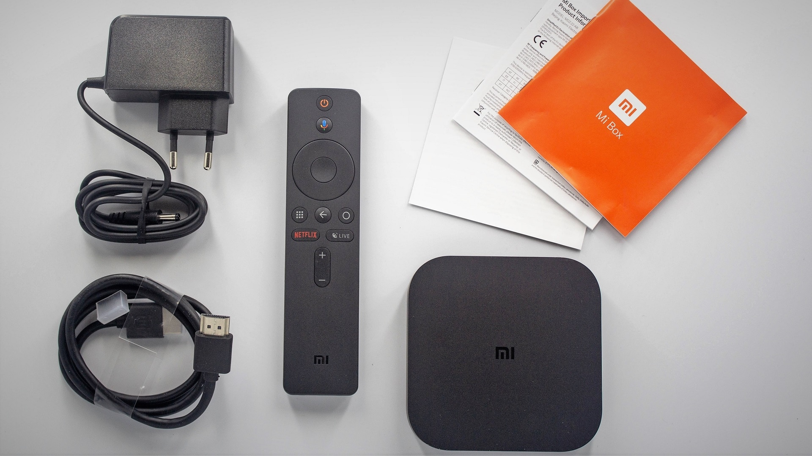
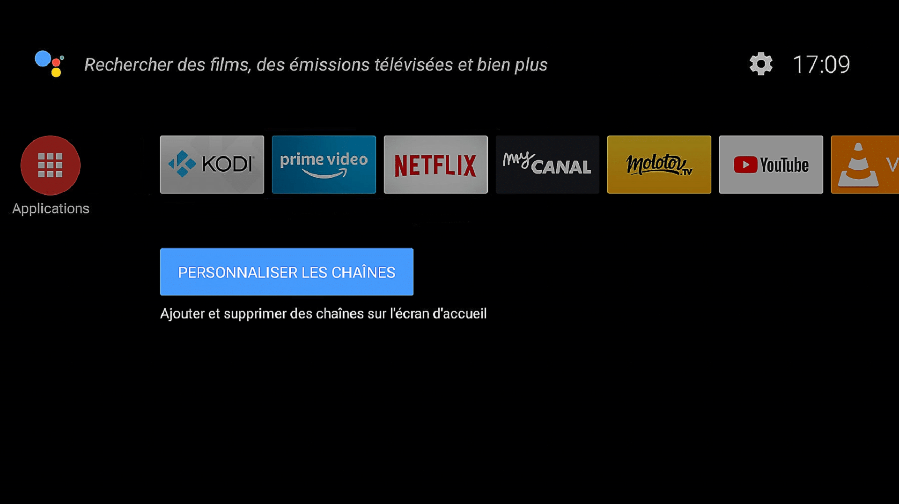
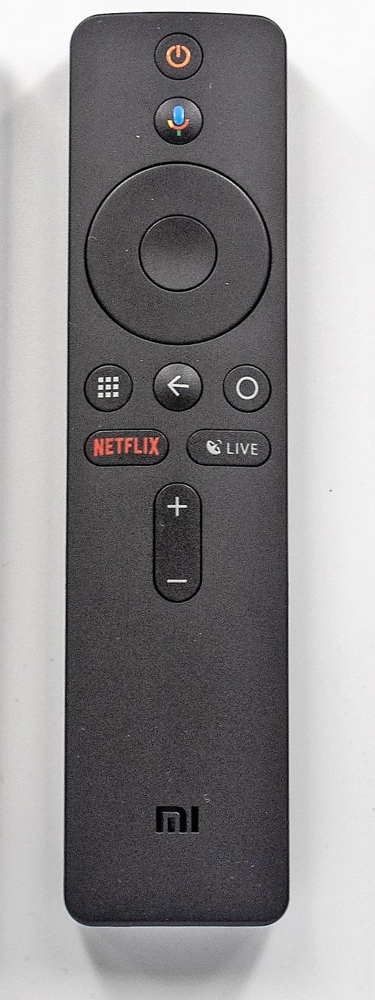

# Xiaomi Mi-Box S sous Android TV

> Le site Gearbest m’a proposé de tester la nouvelle box Android TV Xiaomi Mi-Box S. A quoi ça sert ? Est-ce vraiment utile ? Que peut-on faire avec ? Je vous donne toutes les réponses et plus encore.
>
> Si vous avez un abonnement internet fixe, votre fournisseur (FAI) vous a surement fourni une box TV. Cela vous permet de regarder les chaines de la TNT, de vous abonnez à des bouquets TV, de voir vos programmes en Replay, d’écouter de la musique en Streaming et peut-être même d’aller sur YouTube. En général ça se limite à ça, avec quelques exceptions comme la Freebox Mini 4K qui fonctionne aussi sous Android TV. Ne parlons pas du multi-TV qui est souvent facturé et limité à 2 télés par foyer.
> Ces boxes étant fournies par votre fournisseur internet (FAI) elles sont liées à votre abonnement et donc, ne fonctionnent qu’avec ce dernier. Vous devez les rendre lorsque vous résiliez votre abonnement, ou les acheter, souvent très cher.
>
> Une box Android TV comme la Xiaomi Mi-Box S peut remplacer ou venir en complément de la box TV de votre FAI.

Pour faire simple, la Xiaomi Mi-Box S vous permet de faire autant de choses qu’avec une box TV de FAI, mais en plus vous pourrez utiliser et installer des applications comme vous le faites sur un smartphone Android. Google Home, Google Photos, Google Music, YouTube, Tune In, Netflix, Spotify, Deezer, MyCanal, Molotov, VLC, Amazon Prime Vidéo & Music, IPTV, Kodi, Plex, des jeux et j’en passe.

Dernier point intéressant, la box est petite et facilement transportable. Vous pouvez l’emmener avec vous lorsque vous partez en vacances. Il suffit de brancher la box sur la prise HDMI d’une télé et de vous connectez a un réseau wifi pour retrouver les mêmes services qu’à la maison.

**Spécifications Générales :**

- GPU: Mali-450
- Système: Android 8.1
- CPU: Cortex A53
- Noyau: Quad Core
- RAM: 2G
- Type de RAM: DDR3
- ROM: 8G
- WiFi: 5G
- Bluetooth: Bluetooth 4.2
- Interface: HDMI, USB 2.0
- Langue: multi-langue
- Version HDMI: 2.0
- Fonction HDMI: HDCP
- Consommation électrique: 2W
- Vitesse du port RJ45: 1000Mbps
- Système: 64 bits
- Poids du produit: 0,3000 kg
- Taille du produit (L x l x h): 9,52 x 9,52 x 1,68 cm

## Regarder la télé sur la MiBox S:

Pour regarder les programmes télé de la TNT c’est comme sur un smartphone. Il suffit d’installer l’application de votre choix depuis l’Android Store.

Les applications les plus connues sont Molotov et MyCanal. Elles permettent toutes les deux d’accéder gratuitement aux chaines de la TNT, au Replay, au contrôle du direct et à des bouquets payant comme chez votre FAI.

Ces applications sont aussi disponible et utilisable sur PC, Smartphones et tablettes.

## Regarder des vidéos en streaming :

Comme c’est un produit Google, YouTube est aussi installé par défaut. Vous pouvez, comme sur votre smartphone, accéder à vos playlists et à toutes les vidéos YouTube.

Pour visionner des films et séries, vous devez avoir souscrit à un abonnement sur une plateforme de Streaming telle que OCS ou NetFlix.

Netflix est installé par défaut sur la Mi box et il y a même une touche d’accès direct sur la télécommande.

Sachez qu’il est possible de visionner des vidéos en Streaming sur des plateformes illégales.

## Google Home et Xiaomi Mi-Box S

Que vous ayez une Google Home à la maison ou pas, vous pouvez contrôler votre Mi box TV vocalement pour lancer une application, écouter de la musique, avoir la météo ou même contrôler des objets connectés, comme des ampoules ou le thermostat du chauffage.

La Mi box est compatible Chromecast, vous pouvez donc envoyer directement sur la Mi Box, musique, photos, vidéos, jeux et même dupliquer l’écran de votre smartphone.

## La Xiaomi Mi-Box S en Ethernet

Pour ceux qui ne sont pas fan du Wifi, sachez qu’il est possible de brancher un adaptateur Ethernet sur le port USB de la box et cela sans aucun réglage ou installation de logiciel.

Personnellement, j’utilise l’Ethernet à la maison et le wifi lorsque je ne suis pas chez moi, il est très simple de passer de l’un a l’autre.

Adaptateur Ethernet USB 3.0 à RJ45 compatible

## Kodi sur Mi Box S

Que vous stockiez vos films et séries sur un NAS ou sur un disques dur externe, grâce à Kodi vous pouvez transformer votre Mi Box en véritable bibliothèque multimédias.

L’installation se fait simplement depuis le [Google Store](https://play.google.com/store/apps/details?id=org.xbmc.kodi&hl=fr). Une fois installé vous indiquez ou se trouve vos médias et c’est parti pour des soirées ciné à la maison.

Kodi est un logiciel très complet qui permet aussi de gérer sa bibliothèque musicale, sa photothèque, de regarder la TV et grâce aux multiples addons, d’ajouter des fonctions comme le Streaming avec Vstream par exemple.

Xiaomi sait faire des box Android et cette nouvelle version S est aussi robuste et facile à utiliser que les anciennes versions. Complètement compatible avec les services Google, dont le Google Store, compatible 4K, DTS-HD, DTS X, Dolby TrueHD, Dolby ATMOS et en plus 2 X ½ moins cher qu’une [NVIDIA Shield TV](https://amzn.to/2QUnKcd).

Le HDMI CEC qui permet de contrôler une télé ou un ampli avec la même télécommande est aussi de la partie.

Aussi simple à utiliser qu’un smartphone, vous pouvez en installer dans toutes les pièces de la maison et pour peu que vous ayez un abonnement à un service de streaming vidéo, ou un serveur multimédia Plex ou Kodi, vous n’aurez plus à supporter les programmes télé imposés par les chaines et ainsi redécouvrir le plaisir de regarder un bon film ou une bonne série.

Si vous en avez assez de la box de votre fournisseur internet qui permet seulement de regarder la télé, qui tombe en panne tout le temps et qui prend toute la place à coté de votre télé, la Mi-box est faite pour vous. C’est la solution parfaite en complément ou en remplacement de la box TV de votre fournisseur internet.

Possesseurs d’un abonnement Amazon prime ? Découvrez comment accéder au catalogue [Amazon Prime vidéo directement depuis votre Mi-Box](/articles/installation-damazon-prime-video-sur-xiaomi-mi-box-tv).

Pour les Jeedomiens la Xiaomi Mi box peut être associé à la box domotique via le plugin Gcast ou [JPI](/articles/jpi-sur-mi-box-xiaomi-android-tv).
