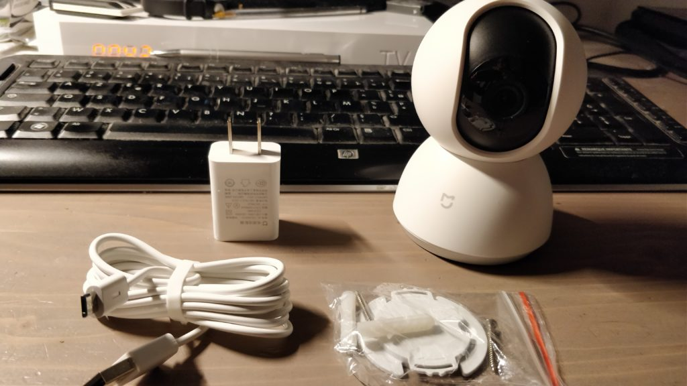
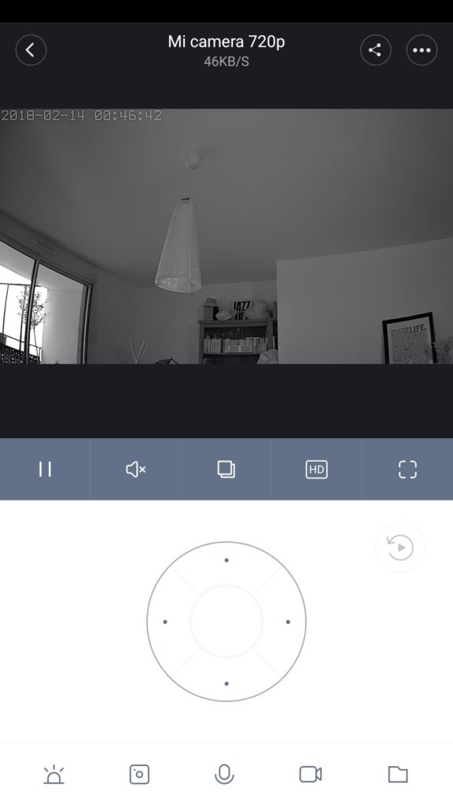
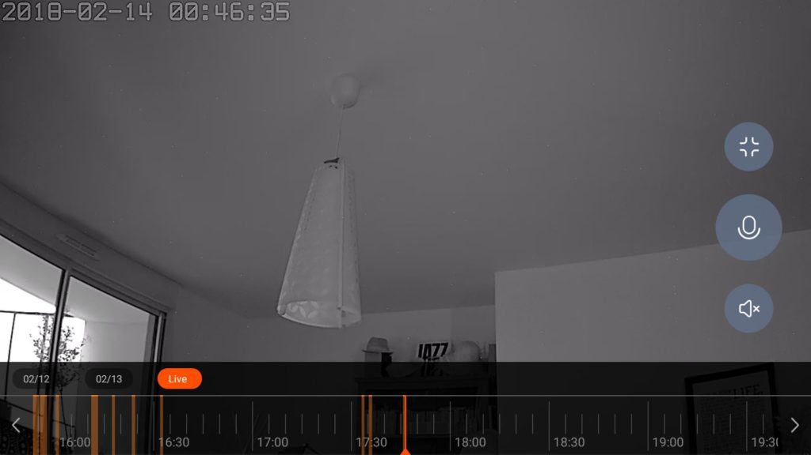
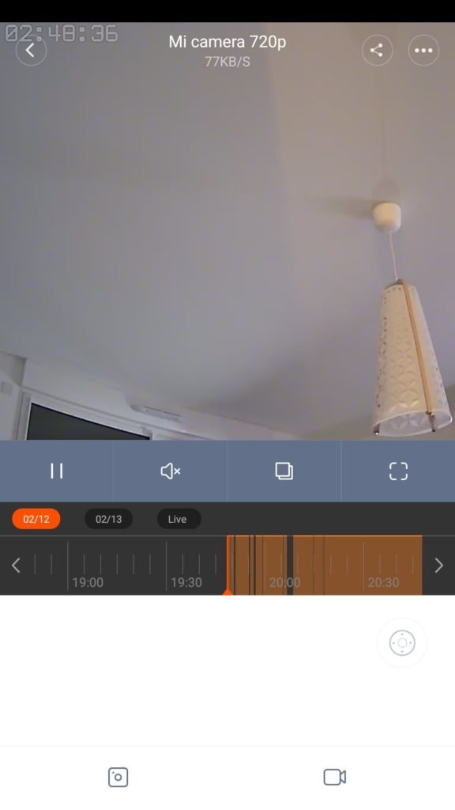
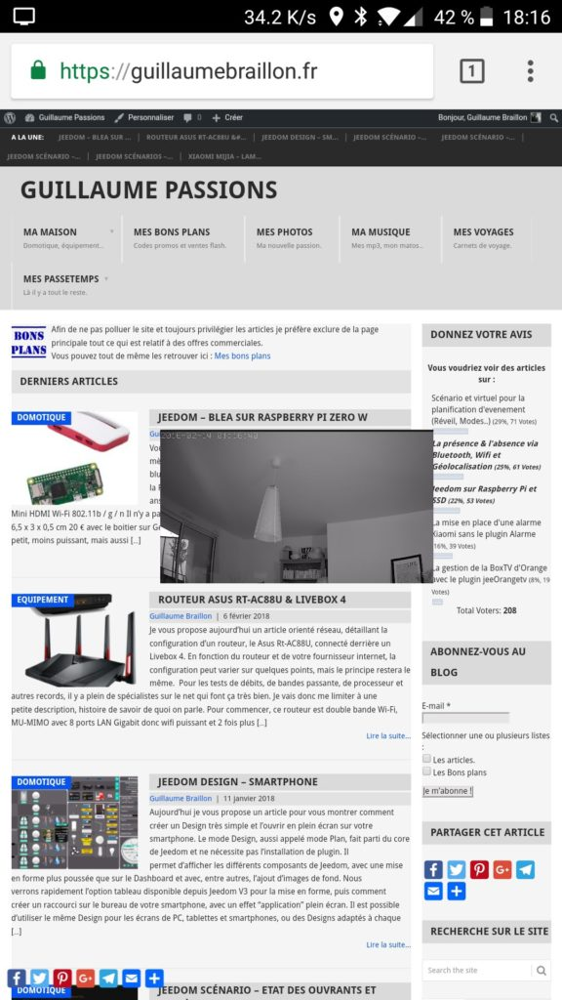

# Xiaomi mijia Caméra IP 720P Pan-tilt

> Je vous présente aujourd’hui la caméra Xiaomi mijia Camera IP 720P WiFi Pan-tilt. L’article est assez court. Je fais simplement une **description**, suivie des **plus** et des **moins**, afin que vous puissiez **rapidement** vous faire une **idée** du produit.

## Description de la Xiaomi mijia Camera IP 720P

La caméra Xiaomi mijia Camera IP 720P WiFi Pan-tilt mesure **11 cm par 8 cm**, pour un poids de **240 gr.** Elle est fournie avec un **câble USB relativement long**, car il mesure 192 cm et un **adaptateur** secteur **format US**, il faudra donc penser à **acheter** un adaptateur [Us vers Europe](http://amzn.to/2H8zWxn).

Pour pouvoir **fixer** la caméra au **mur**, il y a un **support** mural très pratique, avec les **vis**. Une **option rotation** permet de **retourner** **l’image** si vous fixez votre caméra la **tête en bas**.

Le **manuel** fournis est en chinois, mais il est **disponible** en **anglais** ici : [Manuel en Anglais pour la caméra Xiaomi mijia Camera IP 720P WiFi Pan-tilt](http://files.xiaomi-mi.com/files/mijia_smart_camera_360/MiJia_360%C2%B0_Smart_Home_PTZ_Camera_EN.pdf).

Cette **caméra intérieure Wifi** (802.11 b/g/n) est **motorisée**, ce qui lui permet de **pivoter** de haut en bas sur **115°** et de droite à gauche sur à **360°**.  Attention ! il y a une **butée** en fin de course qui ne **permet pas** de la faire tourner sur **elle-même**, il faut repartir dans l’autre sens.

La **qualité** de la **vidéo** est de 720p, soit une résolution de **1280 x 720 en 15fps** avec un angle de vue de **100°.** La qualité est plutôt **bonne**, surtout lors de la visualisation sur un **écran** de la **taille** d’un téléphone ou d’une tablette. Personnellement, je trouve la **qualité** en **mode nuit meilleure** que sur le modèle en **1080p**.

Un emplacement pour un **carte micro SD jusqu’à 32GB**, permet l’enregistrement de vidéos lors de la **détection de mouvement**. Il est possible d’enregistrer des **photos** ou des **vidéos** directement sur son **téléphone** depuis l’application **Mi-Home**, compatible **Android** et **IOS**.

**L’application** Mi-Home, complètement **traduite** en **Anglais** sous Android et IOS, permet de facilement **contrôler** et **paramétrer** les différentes fonctions de la caméra, comme par exemple :

- Détection de mouvement.
- Vision nocturne.
- L’interphone entre la caméra et le smartphone.
- Mode repos. La caméra se retourne et ne film pas.
- Extinction de la lumière en façade.
- Grand angle.
- Enregistrement en boucle.
- Accès protégé par mot de passe.
- Partage avec d’autres utilisateurs Xiaomi.
- …

Le **contrôle** de la **rotation** se fait depuis l’application.

- En **mode réduit** il faut utiliser le **joystick**.

  

  Mode réduit avec le joystick pour contrôler la caméra.

- En **mode plein écran** il suffit de faire **glisser le doigt sur l’écran**. Écartez vos doigts pour effectuer un zoom sur la vidéo.

  

  Mode plein écran avec la barre chronologique des enregistrements.

Si vous installez une **carte micro SD**, la caméra **enregistrera** une **vidéo avec le son** à chaque détection de mouvement, l’enregistrement dure **environ une minute**. Il est possible de la **visionner** grâce à la **barre chronologique**.

Mode réduit avec la barre chronologique.

Il est possible d’avoir une **miniature** de l’image en **superposition** sur votre **téléphone.** Vous pouvez la déplacer n’importe où, en la faisant glisser avec le doigt.

Miniature de la vidéo en superposition.

### Les plus

- **Câble USB** fourni et relativement **long** (192 cm).
- **Support mural** avec les vis **fournies**.
- **Application** totalement **traduite** en **anglais** sous Android et IOS.
- [**Manuel d’utilisation**](http://files.xiaomi-mi.com/files/mijia_smart_camera_360/MiJia_360%C2%B0_Smart_Home_PTZ_Camera_EN.pdf) en **anglais** sur le site de Xiaomi.
- **Micro** intégré.
- **Contrôle** de la caméra avec le **doigt,** en mode **plein écran**.
- Accès facile à **l’historique** des **enregistrements**.
- Les **heures** de la **chronologie,** ou des **réglages,** sont bien celle du **téléphone**.
- Il est possible de **paramétrer** des **positions** pour que la caméra se déplace **automatiquement** à des heures **définies**.
- **Récupération** des fichiers vidéo en SMB sur **NAS, Freebox..**.
- La **qualité** de l’image est très **bonne**, particulièrement en **mode nuit**. _Meilleure que la version 1080p._
- Il est possible **d’enregistrer** les images même **sans carte SD**, en utilisant le **cloud Xiaomi**.
- **Mode repos,** la caméra se retourne et ne film pas.
- **Extinction** de la **lumière** du statut en **façade**.
- Mode **grand angle**.
- Enregistrement en **boucle**.
- Accès protégé par **mot de passe**.
- **Partage** avec d’autres utilisateurs Xiaomi en mode **lecture** **seul**.
- Disponible sur le **serveur Xiaomi Europe,** soumis au RGPD.
- **Solide**, je l’ai fixé avec de scotch la tête en bas et elle est **tombé** plusieurs fois.

### Les moins

- La **butée** ne permet **pas** à la caméra de **tourner** sur elle-même.
- **L’heure** affichée sur la vidéo est **chinoise,** soit GMT+8. _(Il est possible de la cacher)_.
- Fonction **interphone** à mon avis pas très utile.
- **Pas** d’intégration dans **Jeedom,** ni de capter le **flux vidéo** sur un **NAS** ou un **PC**.
- Les seules **actions** possibles avec les autres composants **smart home** sont : **Sleep Mode On / Off**.
- **Dépendant** du **cloud Xiaomi**.
- J’ai **parfois** eu besoin de d’effectuer des **reboot**.
