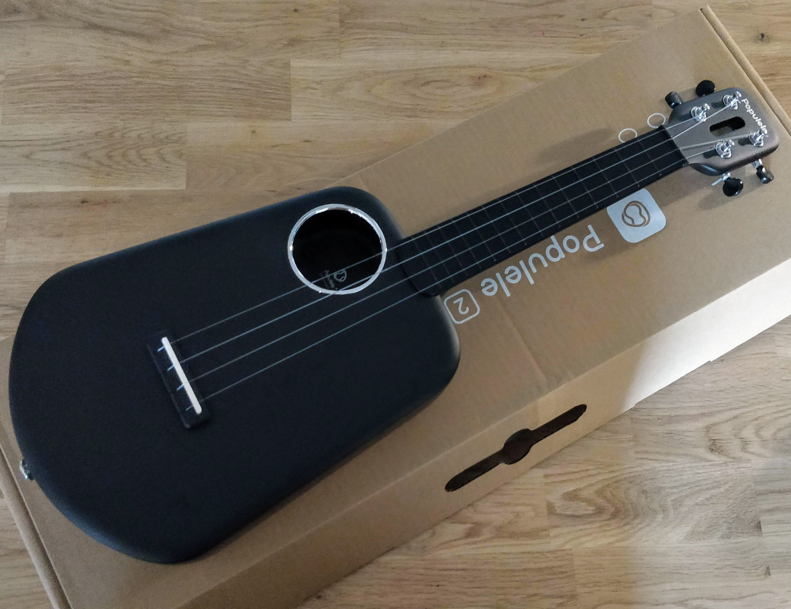

# Xiaomi Mijia Populele 2, un Ukulélé connecté

A la place d’un long texte de présentation j’ai préféré vous faire une **petite vidéo**, je trouve que c’est plus adapté pour vous montrer le fonctionnement de ce Ukulélé. J’ai choisi un morceau emblématique du ukulélé, le très connu **« Over the Rainbow »**. Voilà tout de même pour commencer **quelques informations** sur le produit.

**Caractéristiques techniques:**

- Fibre de carbone
- Corde nylon
- Touche: ABS
- Bluetooth 4.0BLE Distance Bluetooth 5M

- Alimentation: 2 piles AAA (non incluses)
- Android 4.3 ou supérieur, IOS 8.0 ou supérieur
- Poids du produit: 0,8000 kg
- Taille du produit (L xlxh): 61,00 x 25,00 x 7,08 cm
- Contenu de la boite: 1 x Ukulélé

## Test du Populele2 en vidéo

Bonjour, avant de jouer un morceau il faut **allumer le ukulélé** et le **connecter** à l’application pour smartphone **via le Bluetooth**. La première chose à faire c’est de **l’accorder**. Pour cela il faut aller dans **« Tools »** puis **« Tuner »**. Un graphique s’affiche sur l’écran et les leds s’allument sur le manche pour vous guidez. **Je vous conseille d’accorder deux fois de suite**.

Ensuite vous pouvez aller dans **« Game »** pour a**pprendre à jouer** ou directement dans **« Song Library »** pour choisir un morceau. Il y a une **centaine de morceaux**. Un fois le morceau choisi il se télécharge. On peut **écouter le rythme** du morceau en cliquant en bas à droite. On peut aussi **voir les accords** qui sont utilisé dans le morceau avec les positions sur le manche **grâce aux leds**.

Il suffit de cliquer sur le bouton **« Play »** pour que le playback commence. Les **accords** sont affichés **sur la partition** ainsi que **le rythme** représenté par des flèches.

Sur le manche les **leds s’allument** légèrement un peu avant pour pouvoir positionner ces doigts puis intensément lorsqu’il faut jouer l’accord.

Sur la portée il y a **aussi les paroles** pour ceux qui souhaites chanter. Je trouve que **le son** des **playbacks** n’est **pas de très bonne qualité** mais suffisant pour s’entrainer.

Il est possible de s’**enregistrer**, il faudra **brancher un casque** sur votre smartphone pour entendre le playback. Par contre il n’y a **pas le retour** du son du **ukulélé** ce qui n’est pas très pratique. Il faut donc **une oreille** avec le casque pour le **playback** et **une** sans pour le **ukulélé**.

A la fin de l’enregistrement il est possible de **régler les volumes** et de **synchroniser le playback** et le **ukulélé**. Autant pour le volume c’est assez simple autant pour la synchronisation ce n’est pas très pratique. Après je ne me suis pas trop appliqué à respecter le rythme lors du test. Pour **sauvegarder le morceau** il faut cliquer sur **« Compound »** (Composé) et non sur **« Finished »** qui a pour effet d’**annuler l’enregistrement**.

Pour retrouver votre composition il faudra aller dans le menu **« Profil »** puis **« My songs »**, vous pourrez alors **écouter** et **partager** le **fichier**.

## [Ne ratez pas :](/videoprojecteur-xgimi-h2)

Populele 2 Smart Ukulele

Voilà vous savez maintenant comment fonctionne ce Populélé 2. En résumé je dirais que le concept est original, évidement vous serez plus vite alaise si vous savez un peu jouer de la guitare mais les tutos et les playbacks sont bien pensés et permettent de vite prendre l’instrument en main.

Ce ukulélé est un vrai instrument avec un son agréable et une belle qualité de finition.
