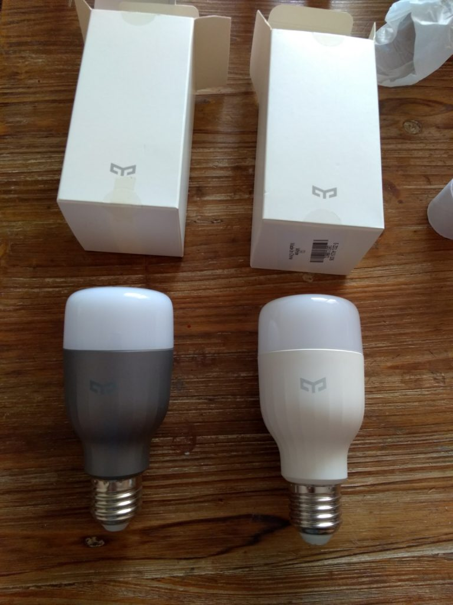
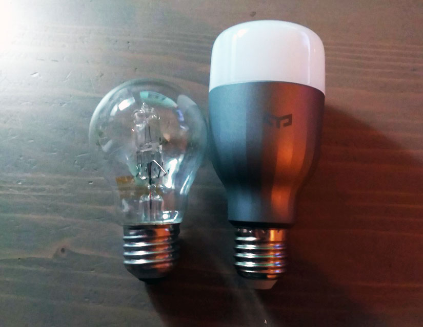

# Ampoules connectées couleur et blanc Xiaomi Yeelight

> Il y a quelques temps, je vous ai présenté un produit **Yeelight** dans l’article [Xiaomi Yeelight -Lampe de chevet (Bedside Lamp)](/articles/lampe-de-chevet-xiaomi-yeelight).
>
> Aujourd’hui, nous allons évoquer les **ampoules E27**, c’est à dire avec un **gros culot à vis**.
>
> Une **ampoule blanche** et une **ampoule de couleur** sont disponibles et peuvent être **contrôlées** via l’application **Mi-home** que nous connaissons bien, avec les produits Xiaomi smart home, ou avec l’application dédié appelé **Yeelight**.
>
> **A noter** : Elles ont toutes les 2 **besoin** d’être **connectées** au réseau **wifi** de votre logement pour **fonctionner** par contre elles n’ont **pas** besoin de la **gateway**.
>
> _**Les ampoules Xiaomi Yeelight sont compatible avec la box domotique Jeedom, grâce au plugin Xiaomi, le tutoriel d’installation est disponible ici : [Ampoules Xiaomi Yeelight dans Jeedom](/articles/ampoules-xiaomi-yeelight-dans-jeedom).**_

## Présentation

Les ampoules **Yeelight** ont plusieurs caractéristique en commun. Elles se **connectent** en **Wifi,** ce qui est bien **mieux** que le **Bluetooth** qui a une portée limitée à 10 mètres.

D’après Xiaomi, elles **dureraient** jusqu’à **11 ans**…

**L’ampoule** **blanche** ne propose que le **réglage** de la **luminosité.** Il n’est malheureusement **pas** possible de choisir la **temperature** du **blanc** qui est fixé à 4000K.

Pour **l’ampoule** **RGB** de 16 millions de couleurs, il y a plusieurs **réglages** dont :

- La **couleur**.
- La **température** de blanc.
- La **luminosité**.

**L’application** permet de **choisir** parmi une des **scènes** pré-enregistrées (couché et levé de soleil, films, bougie, lecture…). Comme pour la [Lampe de chevet](/articles/lampe-de-chevet-xiaomi-yeelight) , il est également **possible** de choisir une **couleur** sur une **photo**. C’est original, mais pas très utile à mon avis.

_**Quelques informations techniques pour les puristes :**_

- Flux lumineux 580lm
- Wi-Fi IEEE 802.11 b / g / n 2.4GHz
- Température de couleur 4000K
- Durée de vie 25000hrs
- Connecteur: E27
- Certification: CE, ROHS
- Garantie: 12 mois
- Puissance: 8W
- Tension: AC220V
- Dimmable: Oui
- Dimension: 12.000 x 5.500 x 5.500 cm / 4.724 x 2.165 x 2.165 pouces

**Pour la version couleur :**

- Couleur de Lumière: RVB
- Température de Couleur: 1700-6500k
- Lumens Flux:
  - Rouge 45-75Lm
  - Vert 100-150Lm
  - Bleu 20-50Lm
  - Blanc Chaud 400-550Lm

## Installation des Ampoules

Vous savez **installer** une **ampoule classique** ? Et bien vous savez **installer** une **Yeelight**.

Rien de bien compliqué, car elles ont les **mêmes** pas de **vis** que les **ampoules** **normales**. Attention tout de même, car elles sont un peu **plus** **longues**, ce qui pourrait poser problème sur certains modèles de lustres.

Dés le **branchement,** l’ampoule **s’allume.** Pour **l’éteindre,** appuyez sur **l’interrupteur** de la lampe et **appuyer** à nouveau pour **l’allumer**. 🙂

Voila pour la **partie** utilisation en ampoule **normale,** mais nous, on veut la **connecter !** Pour cela, il faut **utiliser** l’application **Yeelight** ou **Mi-home** que vous trouverez sur les app store de vos téléphones. Le **principe** est sensiblement le **même** sur les **2 applications**.

Vous connaissez sans doute l’utilisation de **Mi-home** si vous avez d’autres **appareils** connectés à **Xiaomi Smart Home.** Nous en avons déjà parlé de nombreuses fois.

Aujourd’hui, nous allons **utiliser** l’application **Yeelight.** Non seulement parce que ça évite de se répéter, mais aussi parce-qu’il y a une **option** nécessaire à **l’activation** dans **Jeedom**, disponible uniquement dans **Yeelight**.

Après avoir **installé** l’application **Yeelight** et vous être **logué** avec vos **identifiants Mi**, **attendez** quelques minutes pour que l’application **découvre** automatiquement **l’ampoule**.
Si ce n’est pas le cas, cliquer alors sur les **3 petits points** en haut à droite, puis aller dans **Add Device**, votre **ampoule** devrait **apparaître**, sélectionnez la.

Il faut ensuite **choisir** votre réseau **Wifi** et saisir le **mot de passe.** Après validation, **attendre** la fin complète de la **configuration.** Voilà, votre **ampoule** est **connectée**.

Arrivé à cette étape, je vous conseille **d’aller** dans les **réglages** de votre **routeur** et de mettre une **IP** **fixe** à votre ampoule. C’est toujours mieux d’avoir des IP fixes pour vos appareils connectés.

Si vous utilisez aussi **Mi-home,** l’ampoule sera **ajoutée** automatiquement après la configuration dans l’application **Yeelight.** L’inverse est vrai aussi.

Avant de « jouer avec », n’hésitez pas à **faire** les **mises à jour** depuis **l’application,** pour être certains d’avoir toutes les fonctions disponibles. **3 points / Firmware**.

## Utilisation

Les ampoules **Yeelight** ont **l’avantage** de pouvoir être utilisées via le **wifi,** mais **aussi en local.** Par contre, quelques **restrictions** sont à prendre en compte.

### En local

Comme je vous le disais au début de cet article, il est tout à fait possible **d’allumer** et **d’éteindre** l’ampoule simplement **avec** **l’interrupteur** du luminaire sur laquelle elle est branchée.

Dans le cas où **l’ampoule** à été **éteinte** **via** le **Wifi,** il suffit **d’actionner** **2 fois** l’interrupteur (On et Off), pour **allumer** l’ampoule.

**Attention:** Pensez bien que si vous **éteignez** via **l’interrupteur,** vous ne pourrez **plus** **allumer** l’ampoule en **wifi,** car le **courant** sera **coupé** et donc, **l’ampoule** **ne sera plus** **alimentée**.

### Via Wifi

**L’application** est **simple** à utiliser et très **intuitive**.

**L’écran** se divise en **2 parties** :

1.  La partie **inférieure** permet de **choisir** les différents **modes**.
    - **Hue** (Teinte) : Gestion des couleurs.
    - **White** (Blanc) : Gestion du blanc.
    - **Flow** (Alternance) : La lampe alterne automatiquement entre 4 couleurs.
    - **Favoris** : Vous pouvez choisir des scènes pré-réglées. (Couché et levé de soleil, mode nuit, anniversaire, film..)
    - **Snap** (instantané) : Permet de sélectionner des couleurs via la camera de l’écran.
2.  Le **reste** de l’écran permet **d’ajuster** les différents **modes,** en faisant glisser son doigt.
    - Droite & Gauche
      - **Hue** : Sélection de la couleur.
      - **White** : Température du blanc.
      - **Flow** : Vitesse de l’alternance.
    - Haut & Bas
      - Luminosité.
    - Setting (pour Flow uniquement)
      - **Colors** : Permet de choisir les 4 couleurs à alterner.
      - **Color Picker** : Permet de sélectionner les couleurs à alterner depuis une image.

#### Menu configuration

Le menu **configuration** est (presque) le **même** que celui de la **lampe** **de chevet.** Donc je vous invite à [(re)lire cet article pour plus de détail](/articles/lampe-de-chevet-xiaomi-yeelight#Le_menu_de_configuration).
Ci-dessous, les réglages qui les différencient.

- **Default State Upon Power** : Lorsque cette option est activée, vous pouvez allumer la lampe localement (hors wifi) en faisant ON et Off deux fois de suite.
- **Developer mode** : Permet le contrôle de l’ampoule par d’autres applications. Jeedom par exemple.
- **Music Flow** : Permet de transformer votre maison en boite de nuit ! Une fois la fonction activée, l’ampoule clignote au rythme de la musique écoutée via le micro du téléphone. L’ampoule et le téléphone doivent, bien évidemment, être sur le même réseau. (Disponible seulement sur l’ampoule **couleur**.)

_**Edit du 07/11/2017 :** Je viens de me rendre compte qu’il fallait que les ampoules aient accès à internet pour fonctionner._

## Conclusion

Ces **ampoules** sont de très bonne **qualité**. A voir maintenant comment elles **évoluent** dans le temps. La possibilité de **contrôler** l’ampoule en **local** est une bonne surprise qui fait gagner des points **WAF**.

Les **ampoules** de **couleur** sont vraiment **mieux** que les **blanches**, car ces dernières ne **permettent pas** de régler la **température** des blancs ! Personnellement je ne suis pas fan de la couleur, mais si je devais **acheter** de nouvelles ampoules **Yeelight**, je prendrais quand même des ampoules **couleurs**, en raison des **nombreuses** **possibilités** qu’elles offrent.
