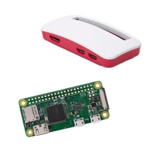
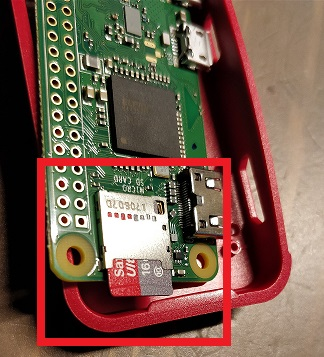
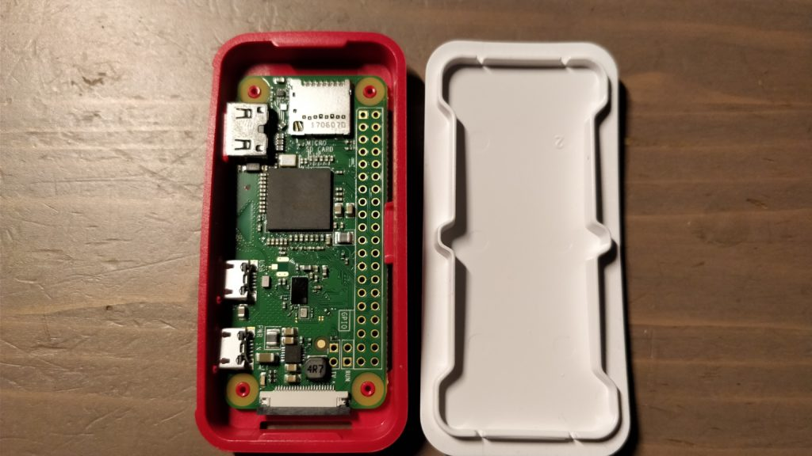
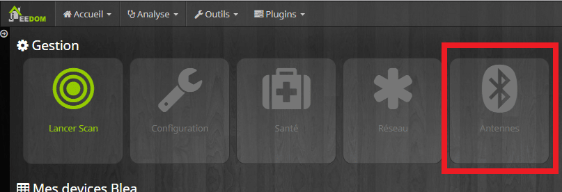
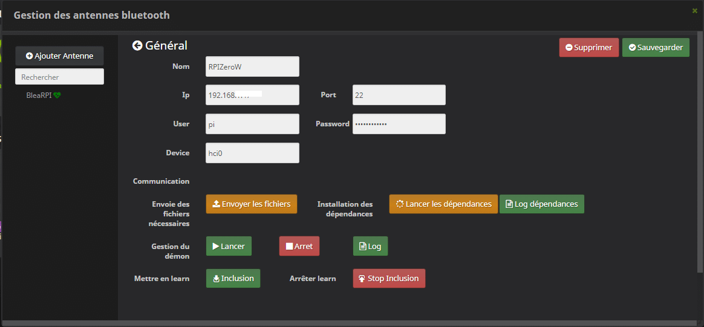
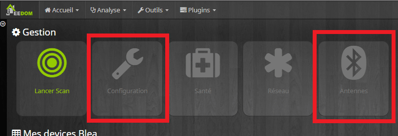
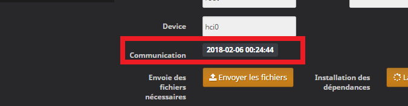
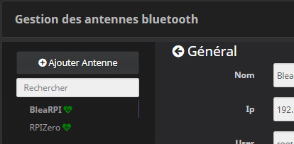

# Raspberry pi Zero W et antenne BLEA

> Vous connaissez certainement les fameuses nano cartes mères **Raspberry Pi** et surtout la version 3 qui apporte le **Wifi** et le **bluetooth**.
> Permettez-moi de vous présenter sa petite sœur, la **Raspberry Pi Zero W,** sortie il y a tout juste un an à l’occasion des 5 ans du premier modèle de Raspberry.
>
> - Processeur 1Ghz
> - 512 Mo de RAM
> - Mini HDMI
> - Wi-Fi 802.11b / g / n
> - Il n’y a pas de port ethernet
> - Bluetooth 4.1 faible consommation d’énergie (BLE)
> - 6,5 x 3 x 0,5 cm
> - **20 €** avec le boitier sur Gearbest.
> - **26 €** avec le boitier sur [Amazon](http://amzn.to/2BHHvfc) (prime).
>
> **Plus petit**, **moins** **puissant**, mais aussi **moins** **cher**, ce **nano-ordinateur** convient parfaitement pour une **antenne bluetooth** associée au plugin (gratuit) **Bluetooth Advertisement**, plus connu sous le nom de **BLEA**.
>
> Pour ceux qui ne connaissent pas ce plugin, il permet de rendre **Jeedom** **compatible** avec les appareils **bluetooth**.
>
> Par **exemple**, vous pouvez utiliser la **balance connectée** Xiaomi Mi-scale, les **bracelets** Mi-Band, la **lampe de chevet** Mi-Bedside, les **trackers** NUT, des [boutons connecté](http://amzn.to/2shOdVo)s et bien plus encore.
>
> Vous trouverez la **liste des appareils compatibles**, sur la documentation officielle du plugin, **[ici](https://jeedom.github.io/documentation/blea/fr_FR/equipement.compatible.html)**.
>
> Pour plus de **détails** sur le plugin BLEA, je vous renvoie vers le **site du développeur, un certain** [Sarakha63](http://sarakha63-domotique.fr/blea-plugin-bluetooth-jeedom/), bien connu des Jeedomiens.
>
> Dans cet article, je vais me concentrer sur **l’installation** de Raspbian sur le **Raspberry Pi Zero W** et la configuration d’une **antenne BLEA**.
>
> Les antennes BLEA permettent d’**augmenter la portée du bluetooth**, car cette dernière n’est que de quelques mètres. C’est un **défaut**, mais qui peut aussi être un **avantage** pour la **précision** lorsqu’on veut gérer la **présence** d’une personne avec un bracelet Mi-Band, par exemple.

_Dans cet article je reprends des passages de l’article [Installation de Raspbian et Jeedom sur Raspberry](/jeedom-installation-de-raspbian-et-jeedom-sur-raspberry) en adaptant la configuration au Raspberry Zero W qui n’a pas de port ethernet._[](http://amzn.to/2E6FQBq)

## Installation de Raspbian

**Raspbian** s’installe sur une carte **MicroSD**. Si vous avez une vieille carte [micro SD de 2 Go](http://amzn.to/2Er0yeM), ça ira très bien pour installer Raspbian et en faire une antenne Blea.

### Récupérer l’image de Raspbian

Avant de commencer, il faut **récupérer** l’image de **Raspbian**, disponible sur [Raspberrypi.org](https://www.raspberrypi.org/downloads/raspbian/).

Deux versions sont disponibles, mais c’est la **RASPBIAN LITE** qui nous intéresse, car elle est plus **légère** et ne propose pas d’environnement graphique. C’est tant mieux, car on n’en a pas besoin.

Le **téléchargement** peut être **long** en fonction de votre connexion ADSL, car l’image pèse environ **1.5 Go**. Une fois le téléchargement terminé, **dé-zipper l’image** sur votre disque dur.

### Installer l’image de Raspbian

1.  Cliquer sur ce lien :  [win32diskimager](https://sourceforge.net/projects/win32diskimager/).
2.  **Accepter** les **messages**, puis cliquer sur le bouton vert « **Download**« .
3.  Une fois **téléchargé**, double-cliquer sur le fichier pour **l’installer** et **l’ouvrir**.
4.  Dans « **Image file** » rechercher votre image **Raspbian**, préalablement dé-zippée sur votre disque dur. (**2017-11-29-raspbian-stretch-lite.img**)
5.  Dans « **Device**« , sélectionner le lecteur de **carte SD** sur lequel vous voulez installer Jeedom.
    **ATTENTION !** ***Ne vous trompez par de lecteur car toutes les données vont être effacées.***
6.  Cliquer sur « **Write**« , un message d’avertissement s’affiche, si vous êtes prêts, cliquez sur « **Yes**« .
7.  A la fin de la copie, un **message** vous prévient que l’installation est **finie**.

Si tout s’est bien passé, vous devriez voir dans **l’explorateur de fichier Windows** un lecteur appelé « **boot**« , c’est votre carte SD avec **Raspbian**.

## Configuration de Raspbian

Comme il n’y a **pas de port Ethernet** sur le Raspberry Pi Zero W, il faut pouvoir se **connecter** au **wifi**, on pourrait brancher un adaptateur micro HDMI et un clavier, mais il y a beaucoup plus simple.

### Configuration Wifi du Raspberry Pi Zero W

- **Ouvrir** un éditeur de texte, exemple [NotePad++](https://notepad-plus-plus.org/download/v7.5.4.html).
- **Copier** le code suivant :

`` `ctrl_interface=DIR=/var/run/wpa_supplicant GROUP=netdev   update_config=1   country=FRnetwork={   ssid="` ``**\[NomDeVotreWifi\]**`` `"   psk="` ``**\[MotDePasseDeVotreWifi\]**`"   key_mgmt=WPA-PSK   scan_ssid=1   }`

- Remplacer **\[NomDeVotreWifi\]** et **\[MotDePasseDeVotreWifi\]**par vos informations personnelles.
- **Enregistrer** ce fichier sous le nom **`wpa_supplicant.conf`** à la **racine** de la **carte SD**, le lecteur « **boot**« .

### Activer le SSH

**Créer** un **fichier** vide appelé « **ssh »** à la **racine** de la **carte SD**.

**Attention !!! il ne doit pas y avoir d’extension à ce fichier.**

### Démarrer le Raspberry Pi Zero W

Vous n’avez rien à faire de particulier pour **démarrer**, si ce n’est de **mettre** la **carte SD** dans le **Raspberry** Pi.



Si vous utilisez le **boîtier officiel**, il n’y a pas de fente pour la carte SD. Il faut donc l’installer **avant** de placer le raspberry dans le boîtier (Voir photo). Il suffit en suite de **clipser** la carte dans la partie rouge du boitier, **pas** besoin **d’outils**.

Pour finir, **brancher** l’alimentation électrique sur le **port USB Power**.

Apres quelques secondes, vous devriez voir votre **Raspberry W** se **connecter** au réseau **wifi**.

### Trouver l’adresse IP de votre Raspberry Pi

- Avec une **Freebox Revolution** (V6) c’est par [là](/articles/installation-de-jeedom-netinstall-sur-raspberry-3#Trouver_Ladresse_IP_de_votre_Raspberry_Pi_sur_Freebox_Revolution).
- Avec une **Livebox** c’est par [là](/jeedom-installation-de-raspbian-et-jeedom-sur-raspberry#Trouver_l8217adresse_IP_de_votre_Raspberry_Pi_sur_Livebox).

### Changer le mot de passe de l’utilisateur Pi

Il faut pour cela se [connecter en SSH](/jeedom-installation-de-raspbian-et-jeedom-sur-raspberry#Connexion_en_SSH).

- _**Taper** : `passwd`_
- **Saisir le mot de passe actuel** : raspberry
- **Saisir le mot de passe de votre choix**, 2 fois.

### Créer un utilisateur Root

Nous allons créer un utilisateur avec **les droits root** pour l’antenne **BLEA,** cela peut être utile pour des questions de sécurité, afin de ne **pas** utiliser l’utilisateur **root**.

- **Taper** : sudo adduser **\[nomUtilisateur\]**
- **Taper** : sudo visudo
- **Saisir à la fin du fichier** : **\[nomUtilisateur\]** ALL=(ALL) NOPASSWD: ALL
- **Faire** : CTRL + X
- **Faire** : CTRL + Y
- **Taper** : logout
- **Connectez** vous avec ce **nouvel** utilisateur.

### Mise à jour de Raspbian

- **Taper** :`apt-get update`
- **Patienter**…
- **Taper** :`apt-get upgrade`
- C’est prêt !

## Configurer une antenne BLEA

Si vous avez **bien réalisé** les étapes **précédentes**, vous avez donc un **Raspberry W** connecté au **Wifi** avec **Raspbian**, ainsi qu’un nouvel utilisateur avec les droits **root**.
On va maintenant pouvoir commencer **l’installation** de l’antenne **Blea** pour **Jeedom**.

La configuration est la même pour les **autres modèles de Raspberry** disposants du **bluetooth**, comme un [Raspberry Pi3](http://amzn.to/2E4wcz2).

### Ajouter un antenne BLEA à Jeedom

Pour **ajouter** une antenne **Blea** il faut bien sûr avoir installé le **plugin Blea**. Faites le si ce n’est pas déjà fait.



- Aller dans : **Plugins / Protocol domotique / Bluetooth Advertisement.**
- Cliquer sur : **Antennes.**
- Cliquer sur : **Ajouter une Antenne.**
- Remplir le formulaire :
  - **Nom** : Exemple : _RPIZeroW_.
  - **Ip** : *192.168.XX.XX* L’adresse IP de votre Raspberry W.
  - **Port** : *22* Le port par défaut pour le SSH.
  - **User** : **\[nomUtilisateur\]** L’utilisateur root que nous avons créé précédemment.
  - **Password** : •••••••••••• Le mot de passe.
  - **Device** : *hci0.* C’est l’identifiant du bluetooth. Si vous avez un doute, taper « *hciconfig* » en SSH.
- **Sauvegarder**.



A ce niveau, l’antenne **Blea** est **créée** dans Jeedom, mais **pas** encore **active**.

### Installer l’antenne BLEA sur le Raspberry W

Maintenant, il va falloir **envoyer** les fichiers et **installer** les **dépendances** sur le **Raspberry W**. Pas besoin de se connecter en SSH. Tout est faisable **depuis** Jeedom.

- Cliquer sur : **Envoyer les fichiers**.
  - Pour vérifier que les fichiers ont bien été copiés dans le répertoire, taper en ssh : « **ls /home/pi/blead/resources**« . *La commande **ls** permet d’afficher le contenu du répertoire.*
- Cliquer sur : **Lancer les dépendances**.
- **Patientez,** ça peut être long.
  - Pour voir l’état d’avancement :

    1.  1.  Cliquer sur : _« **Log dépendances**« ._ _Permet de récupérer les log._
        2.  Fermer la fenêtre « **Gestion des antennes Bluetooth**« .
        3.  Cliquer sur : **Configuration.**
        4.  Cliquer sur : **Blea\_\[nomdelantenne\]\_dependancy.** *Permet d’ouvrir les log.*
        5.  Vous devriez avoir :

    ```js
    running install_scriptsInstalling blescan script to /usr/local/binInstalling thingy52 script to /usr/local/binInstalling sensortag script to /usr/local/binEverything is successfullyinstalled!
    ```

  - Si ce n’est pas le cas et que vous n’avez **pas** un message d’erreur, **patientez** encore, **fermez** la fenêtre et retournez dans « **Antennes** » et **recommencez** l’opération**.**
  - Lorsque que vous avez le message « **`Everything is successfully installed!`** » vous pouvez continuer.

- Cliquer sur : **Lancer**.
- **Sauvegarder**.
- Vous devriez voir apparaître la **date et l’heure** en face de « **Communication**« . N’hésitez pas à **fermer** et **rouvrir** la fenêtre, ou à cliquer sur **Sauvegarder** si besoin.
- Une fois que le **cœur** de votre antenne **bat**, c’est que ça **fonctionne !**

### Dépannage

Si le **cœur ne se met pas à battre**, c’est qu’il y a un **problème** quelque part. Là, il va falloir aller **chercher** des indices dans les **fichiers log** de l’antenne.

Voici les cas que j’ai rencontré avec les résolutions. Il y en a plus sur le [forum Jeedom du plugin](https://www.jeedom.com/forum/viewforum.php?f=157).

- **Message d’erreur dans les LOG :**

`Traceback (most recent call last):`
`File "/home/pi/blead/resources/blead/blead.py", line 26, in <module>`
`from bluepy.btle import Scanner, DefaultDelegate`
`ImportError: No module named bluepy.btle`

- **Résolution :** 

Relancer l’installation avec l’utilisateur root depuis la console SSH.

`` `/home/` ``**\[User\]**`/blead/resources/install.sh`

```js
[User];
```

- **Message d’erreur dans les LOG :** 

```js
Error: importing module from jeedom folder
```

- **Résolution :**

Depuis la console SSH en **root** taper :

```js
sudo pip install requests
```

## Conclusion

Vous savez maintenant comment **installer Raspbian** sur un **Raspberry Pi Zero W** et **ajouter une antenne Blea** à votre système domotique Jeedom.

Grace à ce **plugin** et aux **antennes**, vous pouvez utiliser les appareils **bluetooth** dans toute la maison comme, la **salle de bain** pour la Mi-scale, la **chambre** avec la Mi-Bedside, le **jardin** avec les [Mi-plant](http://amzn.to/2E5nQU0) et même gérer éventuellement la **présence** des membres de votre famille avec les [Mi-Band](http://amzn.to/2E7rxfY).

_Ps: Rassurez-vous, **Blea** ne fonctionne pas seulement avec les appareils Xiaomi, c’est juste que j’en ai beaucoup. 😉_

Pour info, les **smartphones ne sont pas reconnus** dans **Blea** et certains appareils ne sont **pas (encore)  référencés**, mais il est tout de même possible de gérer la **présence** des appareils inconnus.

Pour **l’utilisation** du plugin je vous invite à lire la [doc officiel](https://github.com/jeedom/plugin-blea/blob/stable/doc/fr_FR/configuration.asciidoc).

Matériel **nécessaire** pour installer une **antenne** **Blea** :

- **Raspberry Pi zero W+ Case**
  - [26 €](http://amzn.to/2FSk4h5) (Amazon).
  - 20 € (Gearbest).
- **Carte micro-SD**
  - 2 Go : [6 €](http://amzn.to/2E3aPy6) (Amazon).
  - 8 Go : 3€ (Gearbest).
- **Alimentation** pour Raspberry
  - [10 €](http://amzn.to/2x5pVzv) (Amazon).
  - 3€ (Gearbest).
- **Total**
  - **42 €** ([Amazon](http://amzn.to/2EaA4i4))
  - **26€** (Gearbest) _Intéressant si vous voulez en installer plusieurs._

PS : J’ai récemment reçu la **nouvelle Yeelight Candela**, mais elle n’est **pas** encore **reconnue** par le plugin. J’ai laissé un **message** sur le site de **[sarakha63](http://sarakha63-domotique.fr/blea-le-plugin-bluetooth-jeedom-part-2/comment-page-4/#comment-9319),** je vous tiendrai au courant dès qu’elle sera **intégrée** au plugin.

- [Raspberry Pi Zero W](https://www.amazon.fr/gp/aw/d/B078YXBKXM?&tag=guilbraimespa-21)
- [Carte microSD 16 Go](https://www.amazon.fr/gp/aw/d/B072LWBL37?&tag=guilbraimespa-21)
- [Alimentation Raspberry Pi](https://www.amazon.fr/gp/aw/d/B071ZBDFTQ?&tag=guilbraimespa-21)
- [Boîtier Raspberry Pi Zero W](https://www.amazon.fr/gp/aw/d/B06XD18H6K?&tag=guilbraimespa-21)
