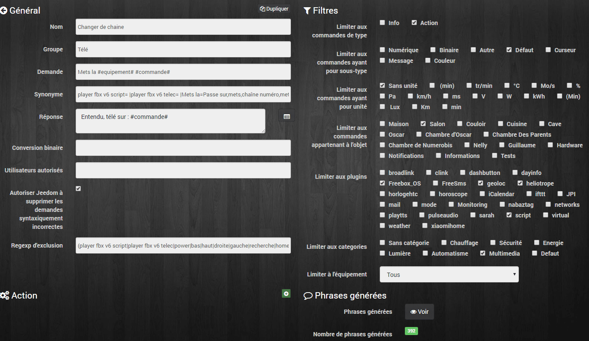
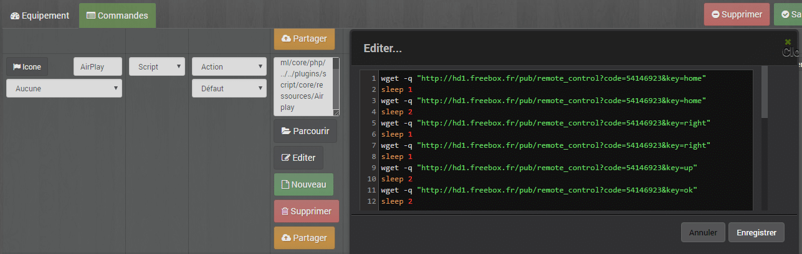

# Contrôler le Freebox Player

> Nous allons voir comment contrôler le Player de la Freebox V6, ou simplement changer de chaîne via les interactions. Pour plus de détails sur les interactions, je vous invite à (re)lire l’article [Jeedom Interactions – Gestion des lumières](/articles/gestion-des-lumieres).
>
> Pour cela, on va configurer des commandes dans Jeedom, pour qu’il génère des phrases types. Le but étant qu’il comprenne les différentes demandes nécessaires pour contrôler le Player de la Freebox.
>
> Exemple de phrases que je peux être amené à dire :
>
> - Mets la 5.
> - Mets France 5.
> - Mets la chaîne numéro 5.
> - Mets la radio.
> - Passe sur bfmtv.
> - Touche enregistrer.
> - Zappe sur la chaîne précédente.
> - Chaîne suivante.
> - Mets la pause.
> - Mon bouquet.
> - Passes sur Airplay.
> - Etc…
>
> Jeedom va créer les phrases pour chaque commande grâce à une liste de synonymes.

_Il est important que vous soyez un peu rigoureux dans l’organisation de vos objets, commandes et équipements dans Jeedom. En règle générale, les objets correspondent aux pièces de la maison, les équipements (Lumière, porte, température…) et commandes (On, Off…) doivent être cohérents. On est pas encore sur de l’intelligence artificielle. 🙂_



## Pré-requis.

Avant de mettre en place les interactions dans Jeedom, il faut déjà pouvoir contrôler le Player et pour cela, j’utilise les plugins (gratuit) FreeBox_OS et Script.

### Plugin : Freebox_OS.

Le plugin permet de récupérer des informations sur la Freebox Serveur, mais aussi de contrôler le Player grâce à une télécommande virtuelle. En bonus, il peut même donner l’état du Player, Allumé ou éteint. Cela est très pratique si l’on n’a pas de télé connectée, le [HDMI-CEC](http://www.universfreebox.com/article/18200/Freebox-Revolution-Parametrez-la-fonction-HDMI-CEC) permet de contrôler la TV, ou l’ampli et de connaitre leur état.

### Plugin : Script.

Ce plugin va nous permettre de programmer des combinaisons de commandes, comme par exemple, taper 1 et 5 pour la chaîne 15, mais aussi, pour naviguer dans les menus. Il est possible de faire la même chose avec des scénarios et le plugin Freebox_Os, mais c’est moins pratique, car il faut une interaction par commande. De plus, c’est l’occasion d’appréhender le très intéressant plugin Script.

## Créations des phrases types.

- **Nom :** Contrôle Player.
- **Groupe** : Ce que vous voulez, par exemple : Télé.
- **Demande** : La phrase type de la demande, par exemple « Mets la 5. » que l’on va modifier pour correspondre aux différentes demandes possibles.
  - **Mets la #equipement# #commande#**.
    - **Mets la =** Phrase d’action de base que nous utiliserons pour les synonymes.
    - **#equipement# =** Variable pour les équipements « **player fbx v6 telec** » du plugin Freebox_OS ou « **player fbx v6 script** » du plugin Script.
    - **#commande#** = Variable pour les touches de la télécommande. 1, 2, 3, Home, Flèches…
- **Synonyme** : Liste des synonymes pour remplacer les différentes commandes.
  - **player fbx v6 script= |player fbx v6 telec= |Mets la=Passe sur,mets,chaîne numéro,mets la chaîne numéro,zap sur,zap sur la,touche,chaîne,Passe sur, |programme +=chaîne suivante|programme -=chaîne précédente|lecture=pause| 1=TF1| 2=France2,France 2| 3=France3,France 3| 5=France5,France 5| 6=M6| 7=Arte| 8=C8| 9=W9|France4=France 4|**
- **Réponse** : La phrase type de la réponse à la question par exemple « Entendu, télé sur : BFMTV » que l’on va modifier, pour correspondre aux différentes réponses possibles.
  - **Entendu, télé sur : #commande#**.
- **Conversion binaire** : Pas utile dans notre cas.
- **Utilisateurs autorisés** : Pas indispensable dans notre cas.
- **Regexp d’exclusion** : Permet de supprimer des mots, des équipements ou même des commandes inutiles . Attention il faut savoir comment fonctionnent les Regexp pour créer la bonne syntaxe.
  - **(player fbx v6 script|player fbx v6 telec|power|bas|haut|droite|gauche|recherche|home|info|mute|Volume -|Volume +|rafraîchir)i**

Voir la [doc de Jeedom](https://jeedom.com/doc_old/documentation/core/fr_FR/doc-core-interact.html) pour plus de détails.

### Complément d’informations pour les synonymes.

_Les synonymes pour un même mot doivent être séparés par des virgules et chaque groupe, par des barres verticales « | » (AltGr + 6)._

« **player fbx v6 script= |player fbx v6 telec= |** Cela veut dire que les équipements sont remplacés par un espace  »  » lors de la génération des phrases. Du coup, « Mets la player fbx v6 telec 5 » devient « Mets la 5 ». Jeedom à besoin de connaitre l’équipement (Player fbx v6 telec), mais je ne veux pas avoir à le nommer à chaque fois que je fais une demande.

### Complément d’informations pour les Regexp d’exclusion.

_Les Regexp doivent être séparés par des barres verticales « | » (AltGr + 6), il faut bien prendre en compte les espaces entre les mots._

Comme pour les synonymes j’ai ajouté « **player fbx v6 script|player fbx v6 telec** » pour que les phrases contenant les équipements soient supprimées des propositions.
J’ai aussi ajouté d’autres touches comme « **Power** » car j’utilise un scénario pour allumer ou éteindre le Player. Pour le « **volume** » je passe par un RM-Pro qui contrôle mon ampli.

Le « **i** » à la fin permet de ne pas tenir compte de la casse des regexp.

## Sélection des Filtres.

Les filtres permettent de limiter l’interaction aux élément sélectionnés. Voila ma sélection, mais elle sera sûrement différente chez vous, en fonction de vos réglages.

- **Limiter aux commandes de type** : Action.
- **Limiter aux commandes ayant pour unité :** Sans unité.
- **Limiter aux commandes appartenant à l’objet :** Salon.
- **Limiter aux plugins** : Freebox_OS et script.
- **Limiter aux catégories** : Multimédia.

## Scripts de contrôle (facultatif).

Les scripts permettent de créer des combinaisons de commandes pour choisir une chaîne supérieure à 9, ou un menu spécifique. (Radio, Airplay…).

_L’utilisation des scripts est facultative, car vous pouvez combiner les commandes en utilisant le plugin Freebox_Os via des scénarios, mais cela vous oblige à créer une interaction par scénario._



### Exemple de script (Airplay).

- Ouvrir le plugin script.
- Ajouter un dispositif et le nommer par exemple « **Player FBX V6 Script**« .
- Aller dans commandes et cliquer sur « **Ajouter une commande script**« .
- Donner un nom à la commande par exemple « **Airplay**« .
- Sélectionner le type « **Action** » et cliquer sur « **Nouveau**« .
- Saisir le code suivant :

```
wget -q "http://hd1.freebox.fr/pub/remote_control?code=********&key=home"
sleep 1
wget -q "http://hd1.freebox.fr/pub/remote_control?code=********&key=home"
sleep 2
wget -q "http://hd1.freebox.fr/pub/remote_control?code=********&key=right"
sleep 1
wget -q "http://hd1.freebox.fr/pub/remote_control?code=********&key=right"
sleep 1
wget -q "http://hd1.freebox.fr/pub/remote_control?code=********&key=up"
sleep 2
wget -q "http://hd1.freebox.fr/pub/remote_control?code=********&key=ok"
sleep 2
```

1.  L’adresse du Player, « **http://hd1.freebox.fr**« , peut être différente chez vous si vous avez plusieurs Players. Vous pouvez aussi utiliser l’adresse IP que vous trouverez sur [http://mafreebox.freebox.fr](http://mafreebox.freebox.fr/#Fbx.os.app.lanbrowser.app).
2.  Remplacer les \*\*\*\*\*\*\*\* par le code de la télécommande que vous avez déjà saisi dans le paramétrage du plugin Freebox_Os. Depuis votre player, aller dans « Réglage, Systeme, Informations Freebox Player et Server, puis Code télécommande réseau ».
3.  Il y a des **sleep** entre chaque commande pour palier à la latence du Player.
4.  Les 3 premières lignes permettent de se caler en haut du menu principal du Player.
5.  Les autres lignes contrôlent les flèches et la touche OK de la télécommande.

### Exemple de script (Radio).

```
wget -q "http://hd1.freebox.fr/pub/remote_control?code=********&key=home"
sleep 1
wget -q "http://hd1.freebox.fr/pub/remote_control?code=********&key=home"
sleep 2
wget -q "http://hd1.freebox.fr/pub/remote_control?code=********&key=right"
sleep 1
wget -q "http://hd1.freebox.fr/pub/remote_control?code=********&key=right"
sleep 1
wget -q "http://hd1.freebox.fr/pub/remote_control?code=********&key=down"
sleep 1
wget -q "http://hd1.freebox.fr/pub/remote_control?code=********&key=down"
sleep 1
wget -q "http://hd1.freebox.fr/pub/remote_control?code=********&key=ok"
```

### Exemple de script (Science & Vie TV).

```
wget -q "http://hd1.freebox.fr/pub/remote_control?code=********&key=2"
wget -q "http://hd1.freebox.fr/pub/remote_control?code=********&key=0"
wget -q "http://hd1.freebox.fr/pub/remote_control?code=********&key=7"
```

## Phrases générées.

Lorsque vous allez enregistrer, Jeedom va générer les différentes phrases que vous pouvez voir en cliquant sur le bouton « **Voir**« .  Ajustez vos filtres et synonymes en fonction des phrases, pour quelles correspondent au mieux à vos besoins.

## Conclusion.

Vous pouvez maintenant contrôler votre Freebox Player grâce à la reconnaissance vocale, via des applications comme [Sarah](http://jpencausse.github.io/SARAH-Documentation/), [Domo Widget](https://domowidget.wordpress.com/), [VocalDom](http://www.maison-et-domotique.com/70646-vocaldom-pilotez-jeedom-facilement-a-voix/), ou simplement via les SMS, comme on l’a vu avec [JPI](/articles/jeedom-envoi-de-sms-via-jeedom-paw-interface).

Pour allumer et éteindre le Player j’utilise une autre interaction qui appelle un scénario. Je veux que mon bouquet TV soit sélectionné lors de l’allumage, et que mon design « Multimédia », permettant de contrôler le Player, Kodi, LMS, les lumières salons… s’affiche sur ma tablette.

Pour la gestion du volume (+, -, Mute) j’ai créé des interactions qui utilisent RM-Pro via le plugin [Broadlink](https://www.jeedom.com/market/index.php?v=d&p=market&type=plugin&plugin_id=broadlink) de [Sarakha63](http://sarakha63-domotique.fr/broadlink-le-plugin-jeedom-disponible/) dont je vous parlerai bientôt.
