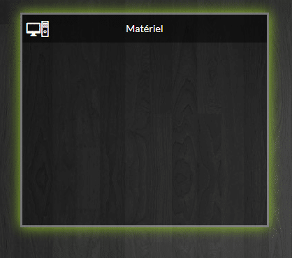
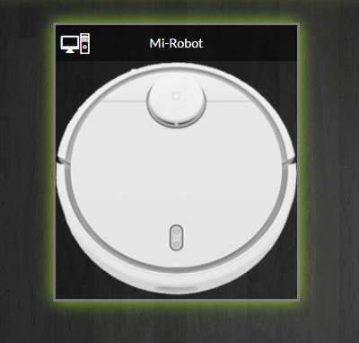

# Design Jeedom niveau intermédiaire

> Je ne sais pas si c’est l’hiver qui veut ça, mais j’ai reçu pleins de demandes au sujet des Designs dans Jeedom. Je ne dois pas être le seul à avoir été sollicité car les articles sur ce sujet fleurissent un peu partout et c’est tant mieux.
> Comme j’en ai l’habitude je vais essayer de vous proposer une approche différente et bien sûr, avec des explications détaillées pas à pas.
>
> Dans ce tutoriel nous allons voir comment créer un design. Nous avions déjà abordé ce thème dans l’article « [Tutoriel mode Design pour débutant](/articles/tutoriel-mode-design-pour-debutant) ». Nous allons cette fois aller plus loin en créant un menu pouvant utiliser du texte et ou les icônes Jeedom préinstallées. Des cadres redimensionnables permettront d’habiller les éléments de Jeedom, widget, virtuels, commandes…
>
> Le code HTML que nous allons mettre en place est assez minimaliste. Les modifications se font dans la feuille de style afin qu’elles soient répercutées sur tout le design.
>
> HTML, CSS, code ????!!!! Je vous ai déjà perdu ??? Ne vous inquiétez pas, je vais tout vous expliquer et vous verrez que tout le monde peut y arriver.

## Définitions et explications

Reprenons les bases. Les designs permettent d’afficher et d’organiser les différents composants que vous utilisez dans Jeedom. Vous pouvez les classer comme vous le souhaitez.
Par exemple, une page par pièce, une pour le salon, une pour les chambres, une pour les extérieurs et sur chacune des pages, les capteurs de températures, de mouvements, de portes et fenêtres, les lumières les caméras, etc…

Vous pouvez aussi faire une page par types de composants, les caméras, les lumières, capteurs…

A vous de voir ce que vous préférez.

**CSS** : *Cascading Style Sheets* (feuilles de _styles en cascade), servent à mettre en forme des documents web, type page HTML ou XML. Par l’intermédiaire de propriétés d’apparence (couleurs, bordures, polices, etc.) et de placement (largeur, hauteur, côte à côte, dessus-dessous, etc.), le rendu d’une page web peut être intégralement modifié sans aucun code supplémentaire dans la page web. Les feuilles de styles ont d’ailleurs pour objectif principal de dissocier le contenu de la page de son apparence visuelle._

L’intérêt des CSS peut être démontrée en modifiant radicalement l’apparence d’une page, sans changer son code HTML d’un iota… Source : [wikibooks.org](https://fr.wikibooks.org/wiki/Le_langage_CSS)

**Comment allons-nous mettre cela en place ?**

Dans un premier temps, il va falloir télécharger des fichiers qu’il faudra copier dans Jeedom en SSH pour ceux qui savent faire, ou plus simplement, à l’aide d’un plugin. Ensuite, il faudra créer un design dans lequel on fera un copier-coller de quelques lignes de code pour créer le menu, puis les cadres. Pour finir, il faudra insérer les commandes des éléments que vous voudrez afficher.

## Copie des fichiers sur Jeedom

Pour commencer, téléchargez le fichier qui contient tout le nécessaire à la mise en place du design. C’est une archive qu’il faudra ensuite décompresser sur votre ordinateur.

[Télécharger le fichier](../../../../public/partages/Design_Jeedom_Tests_Avis_&_Compagnie.rar)

A présent, il faut copier le dossier **design_TAC** à la racine de Jeedom, c’est-à-dire sur le carte SD ou le disque dur de Jeedom.

Vous pouvez le faire en SSH ou en SFTP comme nous l’avions vu dans de **[précédents articles](/articles/widget-personnalise#sftp)** mais dans le but de toujours simplifier les manipulations et d’apprendre à utiliser de nouveaux outils, nous allons utiliser le plugin « **Outils de développement »**.

Pour commencer il faut installer le plugin « **Outils de développement** » (gratuit) et copier les fichiers au bon endroit sans avoir besoin de faire des manipulations en SSH. Connectez vous à Jeedom et suivez les étapes suivantes :

- Aller dans **« Plugins / Gestion des Plugins »**.
- Cliquer sur **Market**.
- Taper « **Développeur** » dans la barre de recherche.
- Cliquer sur « **Outils de développeurs** ».
- Cliquer sur « **Installer stable** ».
- Attendre la fin de l’installation.
- **Activer** le plugin.
- Aller dans **« Plugins / Programmation ».**
- Cliquer sur « **Outil de développements** ».
- Assurez-vous d’être à la racine de Jeedom et pas dans un dossier.
- Copier le dossier **design_TAC**.

## Mise en place du code HTML

Nous allons maintenant créer un **design** dans lequel nous copierons le code nécessaire pour afficher le **menu** et les **cadres**. Le code nécessaire est détaillé dans l’article et se trouve aussi dans le fichier **index.html** du dossier que vous avez téléchargé : **Design_Jeedom_Tests_Avis\_&_Compagnie.**

### Le design

La première étape consiste à créer un Design vierge dans Jeedom. Il va falloir lui donner un nom et définir une taille pour correspondre à l’écran sur le quelle vous voulez l’afficher. Vous pouvez aussi mettre en fond le plan de votre logement ou simplement une image de fond.

Vous trouverez dans le dossier précédemment téléchargé un image, **« dark.jpg »** que vous pouvez utiliser.

- Depuis Jeedom cliquer sur **Accueil** / **Design**.
- Faire un clic droit puis **Edition**.
- Cliquer sur **Créer un design**.
- Faire un clic droit **Configurer le design**.
- Régler la **taille de votre écran**.
- Modifier le **nom** si besoin.
- **Sauvegarder**.

### Le menu

Après avoir créer le design nous devons ajouté le menu qui nous permettra de naviguer de page en page. Ce code est indispensable car c’est le lien vers la feuille de style également utilisé pour les cadres.

- Faire un **clic droit** sur le **design**.
- Cliquer sur **Ajouter texte/html**.
- Faire un clic droit sur l’élément « **Texte à insérer ici** ».
- Cliquer sur **Paramètres d’affichage**.
- **Copier-Coller** le code suivant dans le champ texte.

```
<link rel="stylesheet" href="design_TAC/styles.css">
<div id="menu">
	<ul>
		<li class="active"><a onClick="planHeader_id=1; displayPlan();"><i class="icon maison-home63"> Home</i></a></li>
		<li><a onClick="planHeader_id=2; displayPlan();"><i class="jeedom2-lightbulb58"></i> Lumières</a></li>
		<li><a onClick="planHeader_id=3; displayPlan();"><i class="icon techno-desktop2"></i> Matériel</a></li>
		<li><a onClick="planHeader_id=4; displayPlan();"><i class="fa fa-info-circle"></i> Informations</a></li>
		<li><a onClick="planHeader_id=5; displayPlan();"><i class="fa fa-cogs"></i> Réglages</a></li>
		<li class="last"><a onClick="planHeader_id=6; displayPlan();"><i class="maison-cinema1"></i> Music</a></li>
	</ul>
</div>
```

- **Sauvegarder**.

Si vous avez bien suivi les étapes vous devriez avoir un menu. Il faut cependant le redimensionner en faisant glisser l’angle inférieur droit du rectangle en surbrillance puis le déplacer pour le mettre en haut à gauche du design.

A ce stade le menu n’est pas très joli mais nous verrons plus bas comment le modifier (icône, texte….).

### Les cadres

Les cadres permettent d’habiller les éléments que vous allez ajouter au design. Vous pouvez faire autant de cadre que vous le souhaité.

- Faire un **clic droit** sur le design.
- Cliquer sur **Ajouter texte/html**.
- Faire un clic droit sur l’élément « **Texte à insérer ici** ».
- Cliquer sur **Paramètres d’affichage**.
- **Copier-Coller** le code suivant dans le champ texte.

```
<div id="cadre">
	<div id="picture"><i class="icon techno-desktop2"></i></div>
	<div id="titre">Matériel</div>
	<div id="contenu"></div>
</div>
```

- **Sauvegarder**.

Si vous avez bien suivi les étapes, **vous devriez avoir un cadre** que vous pouvez redimensionner en faisant glisser l’angle inférieur droit du rectangle en surbrillance puis le déplacer pour le placer ou vous le souhaitez sur votre design.



Exemple de cadre

### Les cadres avec image

Il est possible de mettre une image de fond dans le cadre, dont voici un exemple pour le mi robot. L’image doit se trouver dans le dossier design_TAC/ images/.

- Faire un **clic droit** sur le design.
- Cliquer sur **Ajouter texte/html**.
- Faire un clic droit sur l’élément « **Texte à insérer ici** ».
- Cliquer sur **Paramètres d’affichage**.
- **Copier-Coller** le code suivant dans le champ texte.

```
<div id="cadre">
	<div id="picture"><i class="icon techno-desktop2"></i></div>
	<div id="titre">Mi-Robot</div>
	<div id="contenu" style="background: url(design_TAC/images/mi-robot.png); background-size: 100% auto; background-repeat: no-repeat;"></div>
</div>
```

- **Sauvegarder**.

Si vous avez bien suivi les étapes **vous devriez avoir un cadre avec la photo du Mi-Robot**. Vous pouvez redimensionner le cadre en faisant glisser l’angle inférieur droit du rectangle en surbrillance.



Exemple de cadre avec image

## Modification du code HTML

Afin d’adapter le menu et les cadres à vos besoins et à vos goûts comme choisir d’afficher le menu sous forme de texte ou d’icône, ou les 2, vous devrez modifier le code.

**Menu :**

```
<link rel="stylesheet" href="design_TAC/styles.css">
<div id="menu">
<ul>
   <li class="active"><a onClick="planHeader_id=1; displayPlan();"><i class="icon maison-home63"> Home</i></a></li>
   <li><a onClick="planHeader_id=2; displayPlan();"><i class="jeedom2-lightbulb58"></i> Lumières</a></li>
   <li><a onClick="planHeader_id=3; displayPlan();"><i class="icon techno-desktop2"></i> Matériel</a></li>
   <li><a onClick="planHeader_id=4; displayPlan();"><i class="fa fa-info-circle"></i> Informations</a></li>
   <li><a onClick="planHeader_id=5; displayPlan();"><i class="fa fa-cogs"></i> Réglages</a></li>
   <li class="last"><a onClick="planHeader_id=6; displayPlan();"><i class="maison-cinema1"></i> Music</a></li>
</ul>
</div>
```

**Cadres :**

```
<div id="cadre">
  	<div id="picture"><i class="icon techno-desktop2"></i></div>
	<div id="titre">Matériel</div>
	<div id="contenu"></div>
</div>
```

**Cadres avec photo :**

```
<div id="cadre">
  	<div id="picture"><i class="icon techno-desktop2"></i></div>
	<div id="titre">Mi-Robot</div>
	<div id="contenu" style="background: url(design_TAC/images/mi-robot.png); background-size: 100% auto; background-repeat: no-repeat;"></div>
</div>
```

### Le menu

La première ligne fait le lien vers la feuille de style qu’on a copié à la racine de Jeedom.

```js
<link rel="stylesheet" href="design_TAC/styles.css">
```

Chaque lignes commençant par **< li >** correspond aux **numéros de page**, aux **icônes** et aux **noms** des pages que vous voulez afficher.

```js
<li class="active">
  <a onClick="planHeader_id=1; displayPlan();">
    <i class="icon maison-home63"> Home</i>
  </a>
</li>
```

- `class="active"`: Permet de mettre l’élément de menu actif en surbrillance. C’est le seul élément de menu qu’il faut changer sur chacune des pages, il permet d’identifier la page active.
-  `planHeader_id=1` : C’est le numéro de la page à afficher que vous devrez modifier.

- `<i class="icon maison-home63"></i>` : C’est le nom de l’icône, elle est facultative. Si vous n’en voulez pas, supprimez ce code.

- `Home`: C’est le texte qui s’affichera à côté de l’icône, il est facultative. Si vous n’en voulez pas, supprimez ce code.

**Pour retrouver le numéro de page :**

- Aller dans **Accueil / Design**.
- **Passer la souris** sur le nom d’un design.
- Le **lien** s’affiche dans la barre d’état **en bas du navigateur**.
- Noter le numéro **plan_id**.

**Pour modifier l’icône :**

- Cliquer sur « **Choisir une icône** ».
- Rechercher l’icône voulue.
- **Sélectionner** et **copier** le nom de l’icône.
- Cliquer sur **Annuler**.
- Remplacer le nom de l’icône.

### Les cadres

Le code des cadres est assez simple à adapter, il suffit de changer l’icône et le titre.

- `<div id="picture"><i class="icon techno-desktop2"></i></div>`: C’est le nom de l’icône, elle est facultative. Si vous n’en voulez pas, supprimez ce code.
- ```js
  <div id="titre">Matériel</div>
  ```

**Pour modifier l’icône :**

- Cliquer sur « **Choisir une icône** ».
- Rechercher l’icône voulue.
- **Sélectionner** et **copier** le nom de l’icône.
- Cliquer sur **Annuler**.
- Remplacer le nom de l’icône.

### Les cadres avec image

```js
<div id="contenu"></div>
```

```js
<div
  id="contenu"
  style="background: url(design_TAC/images/mi-robot.png); background-size: 100% auto; background-repeat: no-repeat; "
></div>
```

- `background: url(design_TAC/images/mi-robot.png)` : C’est le lien vers l’image. Remplacez « mi-robot.png » par le nom de l’image que vous voulez afficher, après l’avoir copiée dans le répertoire « images » du dossier design_TAC.
- `background-size: 100% auto` : C’est la taille de l’image pour qu’elle remplisse le cadre. Ne pas modifier.
- `background-repeat: no-repeat`: Permet de ne pas répéter l’image plusieurs fois. Ne pas modifier.

Vous pouvez aussi utiliser des images déjà présentes dans Jeedom en pointant vers le chemin de l’image.

- Exemple avec l’image du Roborock S50 fournie par le plugin Xiaomi Home :

`<div id="contenu" style="background: url(/plugins/xiaomihome/core/config/devices/vacuum2/vacuum2.png); background-size: 100% auto; background-repeat: no-repeat;"></div>`

## La feuille de style CSS

Pour changer l’apparence du menu et des cadres, couleur, taille… il faudra modifier la feuille de style. **Attention** il faut avoir un minimum de connaissances en CSS. L’avantage, c’est que les modifications de la feuille de style modifieront tous les menus et tous les cadres du design.

En créant plusieurs feuilles de style, vous pouvez créer plusieurs thèmes en changeant simplement le nom de la feuille.

**Exemple** : Remplacez `<link rel="stylesheet" href="design_TAC/`**`styles.css`**`">` par `<link rel="stylesheet" href="design_TAC/`**`styles2.css`**`">` pour changer le thème du design.

**Pensez à faire une sauvegarde de la feuille de style avant les modifications au cas où vous cassiez le code.**

Je vous proposerai plusieurs feuilles de styles, n’hésitez pas ensuite à partager les vôtres.

Les lignes suivantes sont facilement modifiables pour les personnes qui n’ont pas trop de connaissances en CSS et sont commentées sur la feuille « style.css ».

```
/*///////////////////////////Menu///////////////////////////*/
  font-family: 'Lato', sans-serif;	/*Police d'écriture*/
  text-align: center;				/*Alignement du texte*/
  color: #ffffff;					/*Couleur de la police d'écriture*/
  font-size: 48px;					/*Taille de la police d'écriture*/
  background-color: #00000075;		/*Couleur de fond*/
  min-width: 100px;					/*Largeur minimum des cases*/
  height: 60px;						/*Hauteur des cases*/
  background-color:#ffffff33;		/*Couleur de fond des cases au survol ou actives*/

/*///////////////////////////Cadres///////////////////////////*/
  background-color: #00000052;      /*Couleur de fond des cadres*/
  color: #ffffff;					/*Couleur des icônes*/
  font-family: 'Lato', sans-serif;	/*Police d'écriture*/
  color: #ffffff;					/*Couleur de la police d'écriture*/
  text-align: center;				/*Alignement du texte*/
  background-color: #00000075;		/*Couleur de fond des cases de titre*/
  padding: 10px;					/*Hauteur des cases de titre*/
  min-height: 40px;					/*Hauteur minimum des cases de titre*/
```

### Le menu

```js
/*///////// Menu//////////*/
```

- Ligne 13 : `font-family: 'Lato', sans-serif;`
  - Lato, police d’écriture fournie par Google. Liste des polices Google [ici](https://fonts.google.com/) et autres polices [ici](https://www.w3.org/Style/Examples/007/fonts.fr.html).
- Ligne 15 : `text-align: center;`
  - Permet l’alignement du texte : center, left, right, justify.
- Ligne 16 : `color: #ffffff;`
  - Couleur de la police au format HEX. Les icônes Jeedom seront aussi modifiées. Trouvez d’autres couleurs [ici](https://htmlcolorcodes.com/fr/).
- Ligne 17 :  `font-size: 48px;`
  - Taille de la police au format HEX. Les icônes Jeedom seront aussi modifiées. Trouvez d’autres couleurs [ici](https://htmlcolorcodes.com/fr/).
- Ligne 23 : `background-color: #00000075;`
  - Couleur de fond au format HEX. Trouvez d’autres couleurs [ici](https://htmlcolorcodes.com/fr/).
- Ligne 35 : `min-width: 100px;`
  - C’est la largeur minimum des cases. Ne pas trop la réduire pour la taille des doigts sur une tablette.
- Ligne 39 : `height: 60px;`
  - Permet de régler la hauteur des cases.
- Ligne 43 : `background-color:#ffffff33 ;`
  - Couleur de fond au format HEX des cases lors du survol avec la souris, ou du menu actif. Trouvez d’autres couleurs [ici](https://htmlcolorcodes.com/fr/).

### Les cadres

```js
/*/////////Cadres//////////*/.
```

- Ligne 57 : `background-color: #00000052;`
  - Couleur de fond des cadres au format HEX. Trouvez d’autres couleurs [ici](https://htmlcolorcodes.com/fr/).
- Ligne 64 : `color: #ffffff;`
  - Couleur des icônes. Trouvez d’autres couleurs [ici](https://htmlcolorcodes.com/fr/).
- Ligne 68 : `font-family: 'Lato', sans-serif;`
  - Lato, police d’écriture fournie par Google. Liste des polices Google [ici](https://fonts.google.com/) et autres polices [ici](https://www.w3.org/Style/Examples/007/fonts.fr.html).
- Ligne 69 : `color: #ffffff;`
  - Couleur de la police des titres au format HEX. Trouvez d’autres couleurs [ici](https://htmlcolorcodes.com/fr/).
- Ligne 70 : `text-align: center;`
  - Permet l’alignement des titres : center, left, right, justify.
- Ligne 71 : `background-color:#00000075;`
  - Couleur de fond des titres au format HEX. Trouvez d’autres couleurs [ici](https://htmlcolorcodes.com/fr/).
- Ligne 73 : `padding: 10px;`
  - Permet de centrer les titres. En fait c’est l’espace autour du texte. [Explications](https://www.w3schools.com/css/css_padding.asp).
- Ligne 74 : `min-height: 40px;`
  - C’est la hauteur minimum des titres. Permet de garder la même hauteur de cadre s’il n’y a pas de texte ou d’icône.

## Modification en direct

Il est possible de modifier le style de votre design en direct, sans modifier la feuille de style afin de se rendre compte du rendu possible.

Depuis votre design :

- Appuyer sur les touches **Ctrl + Shift + I** pour ouvrir la fenêtre du mode développeur de votre navigateur.
- Cliquer sur l’icône en haut à gauche de la fenêtre développeurs.
- Sélectionner le menu ou un cadre du design.
- Modifier les valeurs dans la partie Style.

Voilà pour ce tutoriel sur les designs dans lequel j’espère avoir été assez clair. Dans un premier temps, vous pouvez mettre en place le design en ne modifiant que la partie HTML, puis quand vous aurez appréhendé le fonctionnement, vous pourrez modifier la feuille de style. Je vais proposer des feuilles de style pour vous permettre de modifier le thème facilement.

Vous avez certainement remarqué que le principe est le même que le tuto de [F$B33 disponible sur le forum de Jeedom](https://www.jeedom.com/forum/viewtopic.php?f=50&t=14863), code HTML à copier dans un widget « texte/html » et feuille de style CSS. Cela a effectivement été la base que j’ai utilisée pour ce tuto et je l’en remercie, mais attention, il y a trop de modifications pour pouvoir faire un copier-coller du code et de la feuille de style de F$B33.

## Quelques exemples :
