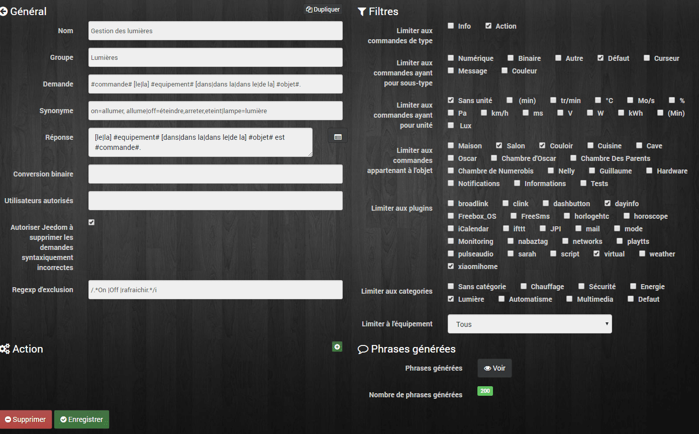

# Gestion des lumières

> Le système d’interaction dans Jeedom permet de réaliser des actions à partir de commande texte ou vocale. Pour faire simple vous pouvez parler à Jeedom comme Tony Stark dans Iron Man parle à Jarvis. Les interactions sont envoyées à Jeedom via des applications tiers telles que [Sarah](http://jpencausse.github.io/SARAH-Documentation/), [Domo Widget](https://domowidget.wordpress.com/), [VocalDom](http://www.maison-et-domotique.com/70646-vocaldom-pilotez-jeedom-facilement-a-voix/) ou simplement les SMS, comme on l’a vu avec [JPI](/articles/jeedom-envoi-de-sms-via-jeedom-paw-interface).
>
> Pour ce premier exemple, nous allons voir comment allumer ou éteindre les lumières dans la maison. Pour cela, on va configurer des commandes dans Jeedom, pour qu’il génère des phrases types afin qu’il comprenne ce que l’on veut lui dire.
>
> Exemple, pour éteindre une lumière je peux être amené à dire :
>
> - Éteint la lumière dans le couloir.
> - Éteindre la lampe du couloir.
> - Arrêter la lumière dans le couloir.
> - Éteindre la lampe dans le couloir.
> - Etc…
>
> Heureusement Jeedom va créer les phrases grâce à une phrase modèle et une liste de synonymes.

Il est important que vous soyez un peu rigoureux dans l’organisation de vos objets, commandes et équipements dans Jeedom. En règle générale, les objets correspondent aux pièces de la maison, les équipements (Lumière, porte, température…) et commandes (On, Off…) doivent être cohérents. On est pas encore sur de l’intelligence artificielle. 🙂

## Créations des phrases types.

- **Nom :** Ce que vous voulez, par exemple : Gestion des lumières.
- **Groupe** : Ce que vous voulez, par exemple : Lumières.
- **Demande** : La phrase type de la demande par exemple « Allumer la lumière du salon. » que l’on va modifier pour correspondre aux différentes demandes possible.
  - **#commande# \[le|la\] #equipement# \[dans|dans la|dans le|de la\] #objet#**.
    - **#commande#** = Variable pour les commandes. On, Off…
    - **\[le|la\]** = permet de modifier l’article de l’équipement.
    - **#equipement# =** Variable pour les équipements. Lumière, Thermomètre…
    - **\[dans|dans la|dans le|de la\]** = permet de modifier l’article de l’objet.
    - **#objet# =** Variable pour les objets. Salon, Cuisine, Jardin…
- **Synonyme** : Liste des synonymes pour remplacer les différentes commandes.
  - **on=allumer, allume|off=éteindre,arrêter,éteint|lampe=lumière**
- **Réponse** : La phrase type de la réponse à la question par exemple « La lumière du salon est allumée » que l’on va modifier pour correspondre aux différentes réponses possible.
  - **\[le|la\] #equipement# \[dans|dans la|dans le|de la\] #objet# est #commande#**.
- **Conversion binaire** : Pas utile dans notre cas.
- **Utilisateurs autorisés** : Pas indispensable dans notre cas.
- **Regexp d’exclusion** : Permet de supprimer des phrases qui n’ont pas de sens par exemple « Off la lumière ».  Attention il faut savoir comment fonctionnent les Regexp pour créer la bonne syntaxe.
  - **/.\*On |Off |rafraichir.\*/i**

Voir la [doc de Jeedom](https://jeedom.com/doc_old/documentation/core/fr_FR/doc-core-interact.html) pour plus de détails.

## Sélection des Filtres.

Les filtres permettent de limiter l’interaction aux élément sélectionnés. Voila ma sélection mais elle sera surement différente chez vous, en fonction de vos réglages.

- **Limiter aux commandes de type** : Action.
- **Limiter aux plugins** : virtual et xiaomihome.
- **Limiter aux catégories** : Lumière.

## Phrases générées.

Lorsque vous allez enregistrer, Jeedom va générer les différentes phrases que vous pouvez voir en cliquant sur le bouton « **Voir**« . Ajustez vos filtres et synonymes en fonction des phrases, pour quelles correspondent au mieux à vos besoins. Ne vous embêtez pas avec les phrases inutiles, concentrez vous surtout sur les différentes phrases dont vous pourriez avoir besoin.

## Conclusion.

J’espère que cette nouvelles rubrique vous sera utile pour la création de vos interactions. Les possibilités d’interactions sont nombreuses. On peut imaginer vouloir contrôler la TV ou le Multiroom, demander des informations sur la température, ou la présence dans une pièce et bien plus encore.
