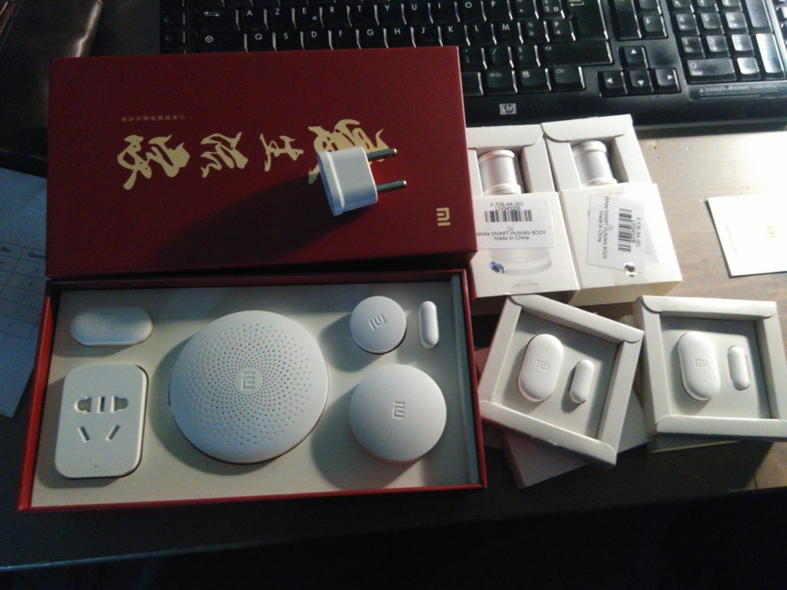
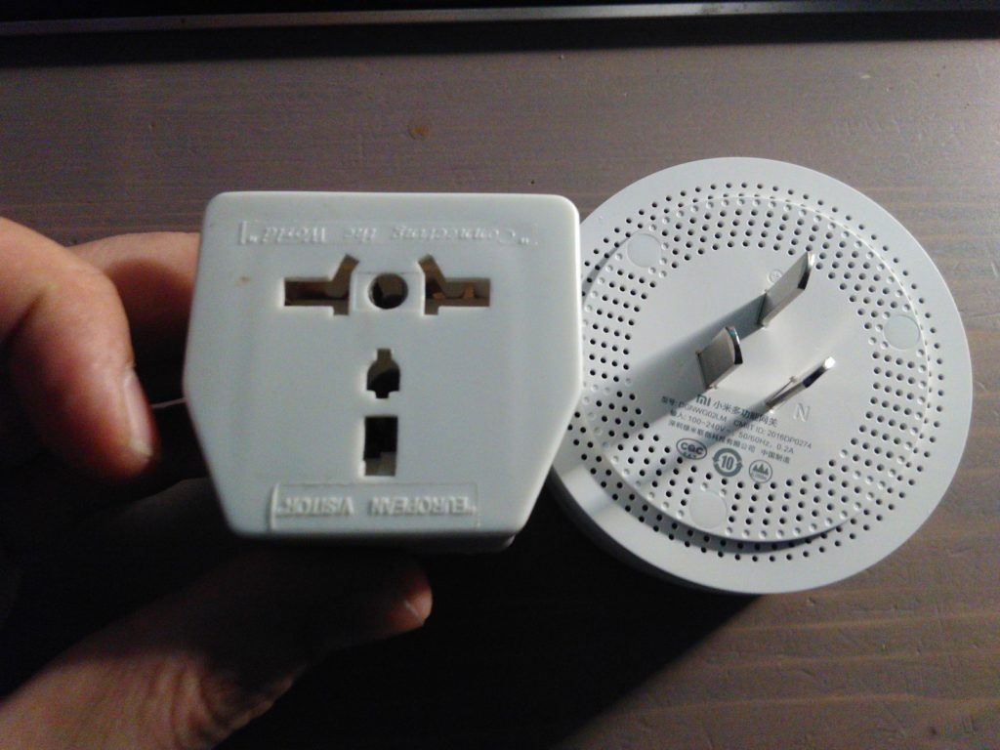
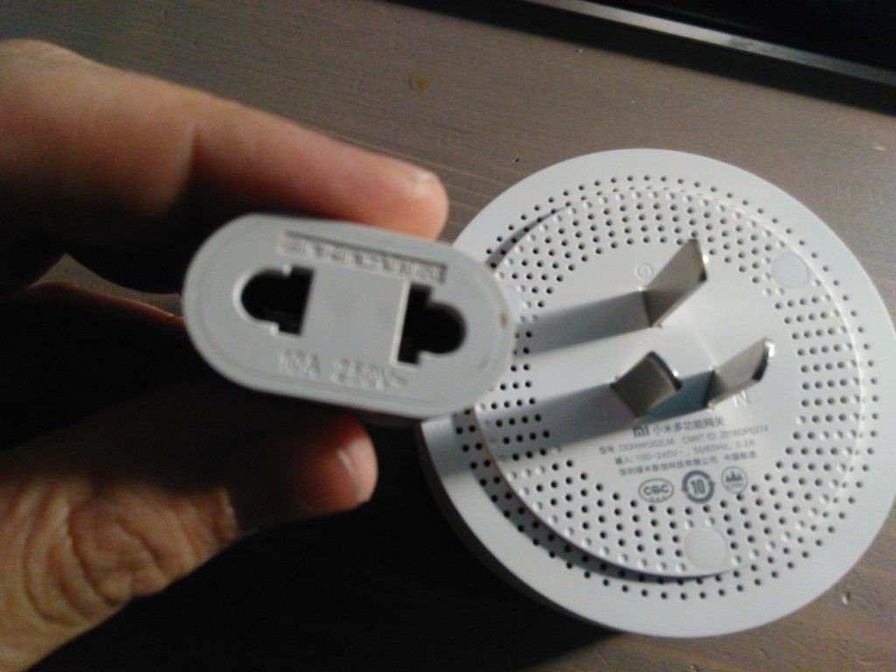
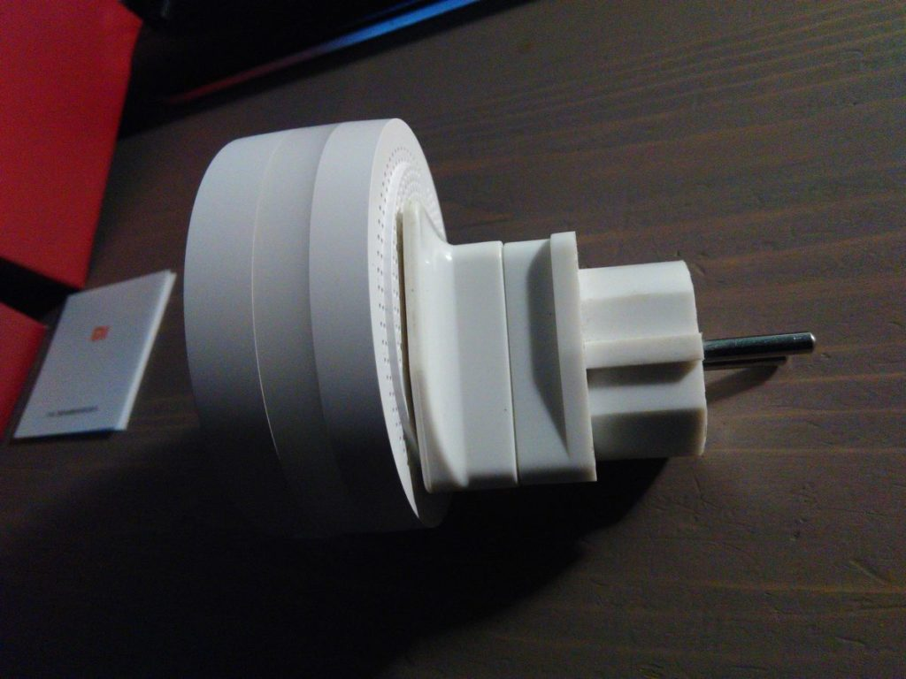
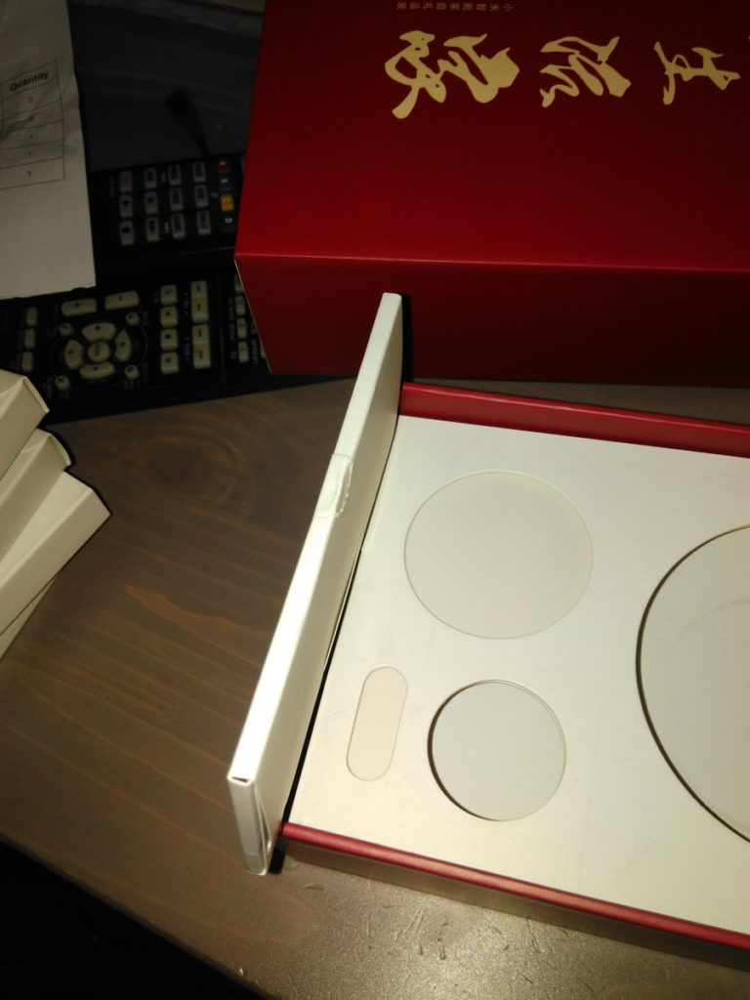
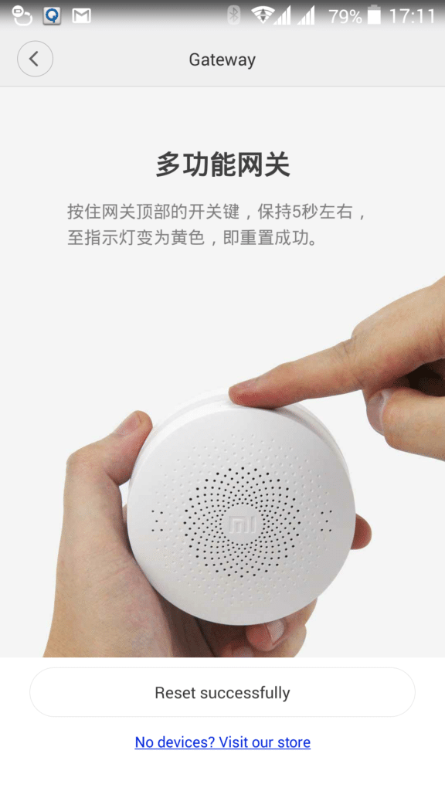
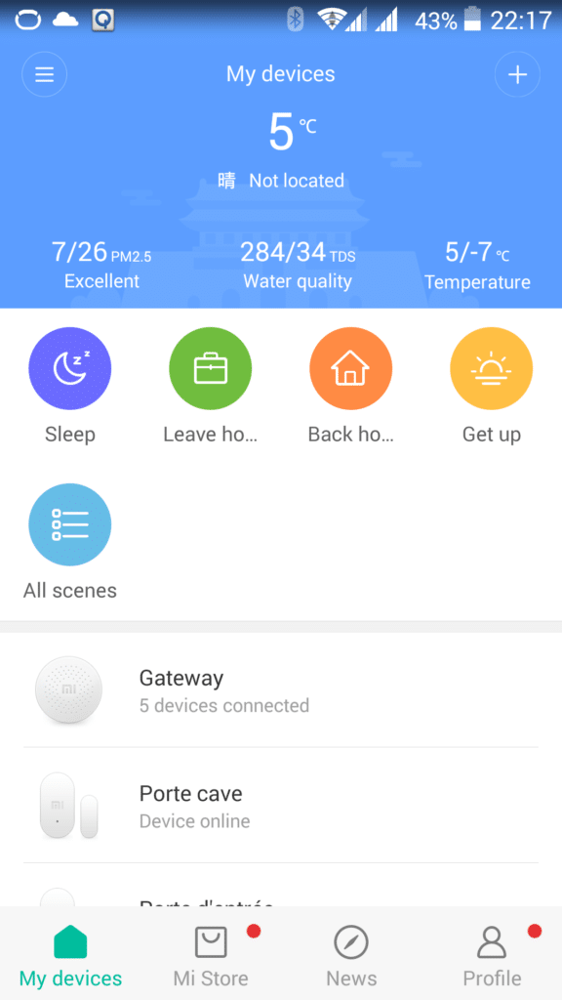
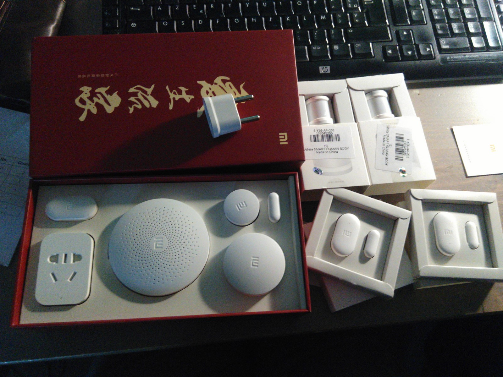

# Installation et configuration de la Gateway Xiaomi

> Suite à mon article « [J’ai passé commande sur un site chinois Gearbest](/jai-passe-commande-sur-un-site-chinois-gearbest) » je vais maintenant détailler le déballage et l’installation de ma solution domotique Xiaomi Smart Home avec l’installation et la configuration de la **Gateway Xiaomi.**
>
> Pour ceux qui ne voudraient pas passer commande sur un site chinois mais qui seraient intéressé par la solution Xiaomi Smart Home sachez qu’elle est disponible sur [Amazon.](https://amzn.to/2kZlRsv)

*Attention le kit disponible sur [Amazon](https://amzn.to/2kZlRsv) n’est pas le même que celui que je vais vous présenter. Il y a un capteur de température / humidité à la place de la prise Smart Plug.* 

## Installation de l’application Mi-Home.

Pour utiliser la box Xiaomi il faut installer l’application Mi-Home disponible sur le [PlayStore](https://play.google.com/store/apps/details?id=com.xiaomi.smarthome&hl=fr), mais les produits Xiaomi n’étant pas vraiment destiné au marché européen et encore moins français, l’application n’est pas traduite officiellement en français et la version anglaise garde quelques mots ou phrases en chinois.

J’ai vu sur plusieurs sites communautaires qu’une version officieuse traduite en français était disponible. Le problème c’est que la version plébiscitée par tous est introuvable, car le site **https://mi4ever.fr/** ne fonctionne pas. Si quelqu’un à une solution je suis preneur.

Fort de ce constat je ne me suis pas laissé abattre. Le site [https://miui-france.org](https://miui-france.org) propose l’application traduite. Il faut s’inscrire, ce que j’ai fais, et j’ai pu [téléchargé l’application en APK](https://miui-france.org/threads/mise-%C3%A0-jour-mi-home-4-0-8.40377/). Le téléchargement depuis mon smartphone ne fonctionnant pas, j’ai dû le faire depuis un PC puis transférer l’APK afin de l’installer.

Au lancement, j’ai eu un message d’erreur, car j’avais toujours la version officielle d’installé. Je l’ai donc désinstallé puis ré-installé l’APK récupérée précédemment, mais à ce moment là, j’ai eu un autre message d’erreur, « Mi-Home s’est arrêté » et puis plus rien… Après plusieurs réinstallations et différents tests, j’ai décidé d’envoyer un message sur le forum dédié à l’application, mais je n’ai jamais reçu de réponse, pire, mon message à été supprimé sans raison ni autre explication…

J’ai donc désinstallé l’application et réinstallé la version officielle depuis le [Play Store](https://play.google.com/store/apps/details?id=com.xiaomi.smarthome&hl=fr).

Une fois installée et fonctionnelle, l’application demande la zone géographique, j’ai choisi « Mainland China » et la langue « English », j’ai créé un compte Xiaomi, rien de bien sorcier.

## Installation de la box domotique appelé Gateway Xiaomi.

Xiaomi Smart Home Box Domotique et les composants.

### Branchements.

Dans un premier temps, il faut savoir que les produits Xiaomi ne fonctionnent pas avec des prises Européennes, mais Chinoises, il faut donc un adaptateur.

Prise Asie => EU

Lorsque j’ai passé commande sur le site Gearbest, j’ai demandé qu’ils me fournissent un adaptateur ASIE => EU, mais ils m’ont envoyé un adaptateur US => EU.

Prise US => EU

Heureusement, j’ai vu que les prises chinoises étaient les mêmes qu’en [Australie](/voyages/road-trip-en-australie-2005-2006) et j’ai un adaptateur qui me reste de mon [Road-Trip en Australie en 2005 – 2006](/voyages/road-trip-en-australie-2005-2006), sinon j’aurais dû laisser la box dans son carton…

Smart Box Xiaomi sur l’adaptateur pour prise Française.

Avant de brancher, j’ai cherché le mode d’emploi qui était un peu caché. Il est le long de la boîte dans un petit étuis. Une fois trouvé, je me suis rendu compte qu’il était tout en chinois, donc inutile.

Le mode d’emploi de la Smart Box Xiaomi est bien caché.

J’ai donc branché la box dans la prise murale et là une « voix chinoise » m’a parlé et le bandeau de couleur à clignoté. Au bout de quelques secondes, l’application a détecté la  Gateway Xiaomi (Box) en bluetooth. Il y a quelques informations à remplir et boutons à cliquer, rien de bien compliqué, même si il y a un mélange d’anglais et de chinois.

Les codes du wifi sont demandés pour connecter la box, après quelques minutes une message de confirmation s’affiche, suivi d’une demande de mise à jour du firmware. Je l’accepte, elle s’installe. Une seconde mise à jour est alors demandée, je l’accepte aussi, elle s’installe. Tout va bien.

Une fois les mises à jour terminées, je me rend compte que les composants fournis avec le kit sont déjà associé avec la Gateway Xiaomi, contrairement à ceux que j’ai commandé en supplément. Est ce que cela veut dire qu’ils ont été associés en usine et donc qu’ils fonctionnaient déjà dans la boite lors du transport … ???

### Reset de la Gateway Xiaomi.

Suite aux mises à jour du firmware, la zone géographique _« United States »(recommended)_ est apparue. Dans l’espoir d’avoir une application traduite à 100% en anglais j’ai fait le changement.

Une fois reconnecté, surprise !!! Tous mes composants ont disparus, Gateway compris et surtout, impossible de les rajouter, même en manuel ils ne sont pas dans la liste. Je pense donc qu’ils ne sont pas disponible pour le marché US.

Je me suis remis en « Mainland China » mais deuxième effet Kiss Cool, mes composants n’ont pas réapparus. Cette fois je les vois bien dans la liste des produits compatibles, mais je ne peux toujours pas les ajouter, la Gateway n’est pas reconnu. Il m’est donc proposé de faire un RESET de la Gateway .

Je clique sur le lien « **Comment faire un Reset de la Gateway Xiaomi ?** » mais là, « télétransportation en chine », je ne comprends rien, heureusement il y a un image.

Je testes plusieurs trucs et finit par appuyer environ 5 secondes sur le bouton et là, le reset se lance. Ça parle chinois, ça clignote et ensuite, un scan se lance mais ne trouve rien. Je fini par faire retour et la ma Gateway Xiaomi à réapparaît avec tous ses composants. Back to Normal !

## Réglage de la Gateway Xiaomi.

Lorsque l’on ouvre l’application Mi-Home on arrive sur « **My devices**« , composé de boutons d’accès rapides (activer / désactiver l’alarme,…), de la liste des appareils connectés, d’un bouton « **+** » pour ajouter des composants et différentes options de l’appli, pas très utile pour le moment.

Cliquez sur « **Gateway** » pour arriver aux réglages.

Menu principal My Device

Les réglages de la Gateway Xiaomi sont répartis en 3 sous-menus « **Home**« , « **Scene** » et « **Device**« , ainsi que 2 options « **Partage** » et « **More**« . La premiere, à priori aucun intérêt, la seconde, on peut y accéder ailleurs.

- **Home** : Permet de régler la couleur et l’intensité du bandeau lumineux de la Gateway , de sélectionner une radio (chinoise) et d’activer l’alarme. Il y a aussi, en bas, le statut des composants reliés a la Gateway .
- **Scene** : Récapitulatif des scénarios répartis en 2 catégories :
  - « **System** » pour les scénarios enregistrés dans l’application, comme par exemple l’alarme, le réveil, la sonnette.
  - « **User define**« pour les scénarios créés par l’utilisateur. On peut aussi créer de nouveaux scénarios et vérifier les log. _On verra la configuration des différents scénarios dans un prochain article._
- **Device** : Liste des différents composants avec un accès à leurs réglages. _Chaque type de composant aura droit à un article dédié._

Pour commencer on va cliquer sur « **Gateway**« . Si vous le souhaitez, cliquez sur « **…** » pour ouvrir les réglages de base de la Gateway Xiaomi, afin de renommer, mettre à jour le firmware, ajouter un raccourci sur l’écran d’accueil du téléphone, passer en mode développeur… Il y a aussi d’autres options que je vous laisse découvrir. Faites retour pour retourner sur les réglages de la Gateway.

### Changer les sonneries de la Gateway Xiaomi.

Je ne vais pas vous détailler toutes les options, car il n’y a rien de bien sorcier, Je vais juste vous montrer où changer les sonneries d’alarme, réveil et sonnettes puis comment les personnaliser.

Pour ce faire on va cliquer sur « **Ringtone settings** » et sur le type de sonnerie que l’on souhaite modifier.

Un certain nombre de sonnerie sont disponible de base dans la Gateway. Il suffit, comme pour un smartphone, de cliquer dessus. Vous devez alors l’entendre se jouer sur la Gateway.

Il est possible en cliquant sur « **Add ringtone**« de personnaliser les sonneries de 2 façons différentes.

- Soit vous téléchargez un MP3 présent sur votre smartphone, le temps de transfert est assez long mais rien de bien méchant. Une fois le téléchargement terminé le son est joué sur la Gateway.
- Vous pouvez aussi vous enregistrez via le micro de votre smartphone. Le son sera alors transféré dans la Gateway puis joué.

Les sons enregistrés peuvent être utilisés dans tous les scénarios. Par exemple, ma sonnette c’est mon fils qui dit « Bienvenue dans notre maison ». 🙂 N’hésitez pas à lire l’article [Installation et configuration du détecteur d’ouverture de porte – Xiaomi Smart Home –](#) pour plus de détails sur cette option.

### Les scenarios « System ».

> _Avant de commencer, sachez qu’il y a un décalage horaire de +7h en hiver et +6 en été avec la Gateway, il est toujours à l’heure chinoise !! Ce décalage horaire n’interviens pas pour les log qui eux sont à l’heure du smartphone._

Pour vous aidez à bien paramétrer vos scénarios, voila un tableau de correspondance des heures françaises (Je veux) et chinoises (Je sélectionne).

Correspond-horaire-chine-France

**Arm** : C’est le système d’alarme proposé dans la Gateway Xiaomi.

- **Add arm timer** : Permet d’ajouter des créneaux horaires d’activation / désactivation automatique. **Attention** ! Si vous voulez que l’alarme s’arme à 9:00 du matin et s’arrête à 18:00, il faut faire 9 + 7 =16:00 et 18+7 =1:00. (Décalage de 6h en été).
- **Alarm trigger** : Permet de choisir quel composant va faire déclencher l’alarme. Ouverture de porte, mouvement, interrupteur…
- **Arm interval** : C’est le délai avant que l’alarme ne soit active après l’avoir armée. Cela permet d’avoir le temps de sortir de la maison avant le déclenchement de l’alarme.
- **Alarm ringtone** : Permet de choisir et de configurer la sirène de l’alarme.

**Automatic gateway light** : Permet d’allumer automatiquement la lumière de la Gateway Xiaomi, lorsque la pièce est sombre. Vous pouvez ajouter un créneau horaire et/ou associer un détecteur de mouvement.

**Gateway light timer** : Lumière d’ambiance, permet de choisir à quelle heure et de quelle couleur s’allume la gateway. Plusieurs créneaux et ambiances possible.

**Wake & act clock** : C’est simplement un réveil, on peut l’arrêter en choisissant un composant : Ouverture de porte, mouvement, interrupteur…

**Doorbell** : C’est pour régler la sonnette. Volume, composants associé, sonnerie, etc…

## Conclusion.

_**Les plus gros inconvénients sont :**_

- Le format de prise électrique qui nécessite un adaptateur supplémentaire.
- Pas d’application officielle en français et une version anglaise parsemée de mots et phrases encore en chinois.
- Un décalage horaire de 7 heures avec la Gateway Xiaomi. (6h en été).
- Le manque d’options de contrôle, notamment dans les scénarios.
- L’impossibilité d’associer des composants zigbee non Xiaomi.
- La non distribution officielle sur le marché français / Européen.

_**Les plus gros avantages sont :**_

- La qualité et la taille de la box.
- La qualité et la taille des composants.
- La simplicité d’installation malgré les textes en chinois omniprésents.
- Le prix de la Gateway Xiaomi et des composants.
- Le potentiel d’une box équipée d’un haut parleur, wifi, bluetooth, Led RGB, zigbee.
- L’integration possible dans Jeedom via le plugin Xiaomi Home disponible sur le [Jeedom Store](https://www.jeedom.com/market/index.php?v=d&p=market&type=plugin&&name=xiaomi%20home). (Sujet d’un futur article).

Je trouve que pour 25 € la box domotique et 55 € la box plus des composants Xiaomi propose un produit d’un rapport qualité / prix exceptionnel et permet de mettre un premier pied dans le monde de la domotique. Cette solution à un gros potentiel, surtout avec le nouveau plugin Jeedom qui permet d’utiliser les composants Xiaomi.

Xiaomi Smart Home Box Domotique et les composants.

_**Mise à jour** : Pour ceux que ça intéresse voila le mode d’emploi en anglais pour le kit 5 in 1 Mi Smart Home. [Mi Home smart kit EN.pdf](http://files.xiaomi-mi.com/files/Mi_Smart_Home_Kit/Mi%20Home%20smart%20kit%20EN.pdf)_
