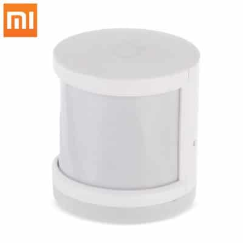
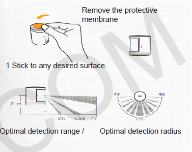
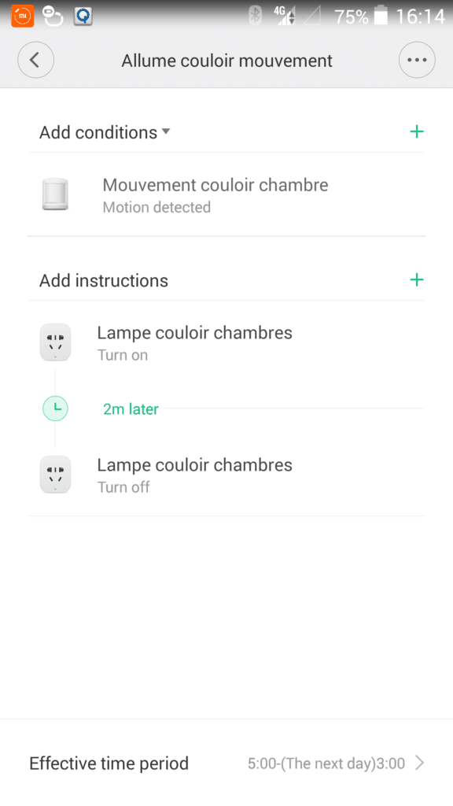
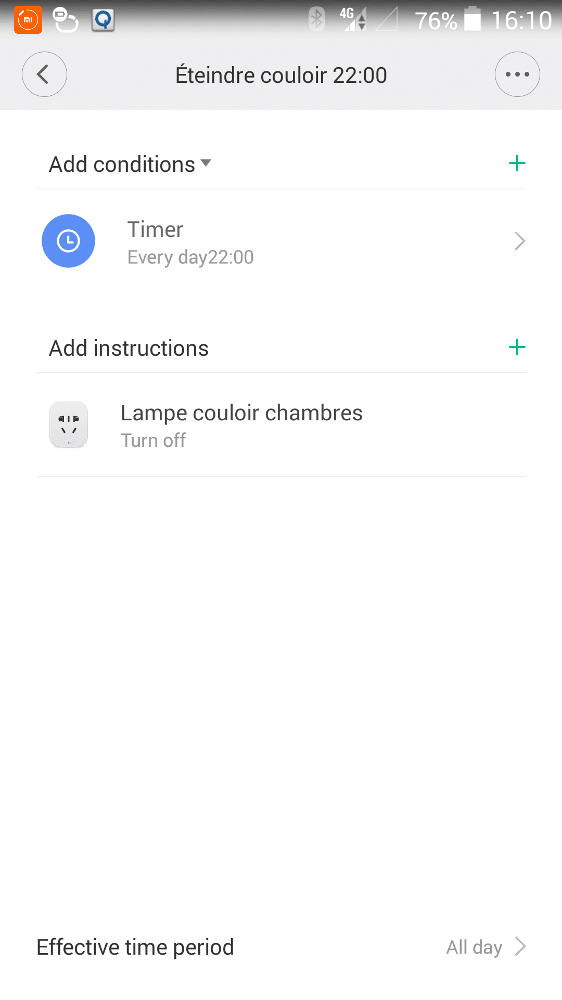
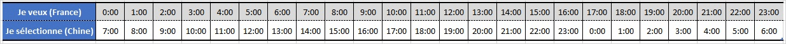

# Installation et configuration du détecteur de mouvement Xiaomi

Suite de mes articles :

[J’ai passé commande sur un site chinois ! – Gearbest –](/jai-passe-commande-sur-un-site-chinois-gearbest)

[Installation et configuration du Gateway – Xiaomi Smart Home –](/articles/installation-et-configuration-de-la-gateway-xiaomi)

[Installation et configuration du détecteur d’ouverture de porte -Xiaomi Smart Home –](/articles/installation-et-configuration-du-detecteur-douverture-de-porte-xiaomi)

## Installation du détecteur de mouvement.

Le détecteur de mouvements ainsi que tous les autres composants qui sont vendu dans le kit 5 in 1 Xiaomi sont déjà associés, mais il faut associer les composants supplémentaires.

### Comment associer un composant au Gateway ?

[(Voir l’article sur le capteur d’ouverture de porte)](/articles/installation-et-configuration-du-detecteur-douverture-de-porte-xiaomi#associer) 

### Placement du capteur de mouvements.

J’ai installé le détecteur de mouvements dans le couloir des chambres. Il commande une lampe qui s’allume lorsque l’on se lève la nuit par exemple.
Au dos de l’élément, il y a un adhésif et il suffit de le coller. Un lot d’adhésif supplémentaire est fourni.

Par contre, j’ai remarqué que si le capteur a la tête en bas, il détecte beaucoup moins bien les mouvements, ce qui est très gênant, car j’aurais aimé le coller au plafond, n’ayant pas d’étagère dans le couloir pour le poser.

Mais cette restriction reste à confirmer, car j’ai vu plusieurs personnes les placer au plafond. C’est peut être lié au problème de délai que j’aborde plus bas.

On voit sur l’image « *Optimal detection range* » que la détection se fait vers l’avant, le bas et les côtés ce qui confirmerait ma restriction sur le positionnement au plafond.

Autant le capteur d’ouverture de porte est très réactif, autant je trouve que le détecteur de mouvement est beaucoup plus lent.
Il y a un délai entre deux détections qui n’est pas de quelques secondes, mais plutôt d’une minute.

Si par exemple vous mettez en place un allumage de 15 secondes sur détection de mouvement, vous allez vous retrouvez dans le noir pendant 45 secondes. La minute est comptée à partir de l’allumage et non après les 15 secondes.

Voila une petite vidéo pour vous montrer la réactivité et le délai du détecteur de mouvements. Les 2 lampes s’allument en même temps. Celle du haut reste allumée 2 secondes et celle du bas 12 secondes. Pourtant, elles se rallument en même temps au bout d’une minute…

[/wp-content/uploads/2017/02/xiaomi-motion-sensor-test.movie\_.mp4](./xiaomi-motion-sensor-test.movie_.mp4)

### Configuration dans l’application Mi-Home

[(Voir l’article sur le capteur d’ouverture de porte)](/articles/installation-et-configuration-du-detecteur-douverture-de-porte-xiaomi#application) 

### Création d’un scénario sur détection de mouvements.

Comme je vous l’ai dit plus haut, j’ai mis un détecteur de mouvements dans le couloir des chambres et je veux que dès qu’il y a un mouvement, la lumière s’allume 2 minutes par mouvement détecté entre 22:00 et 20:30 et reste allumée en fixe entre 20:30 et 22:00, dès qu’un mouvement est détecté, le temps que mon fils s’endorme.

Pour le scénario d’allumage sur mouvement entre 22:00 et 20:30 on a donc :

- Si :
  - **Capteur couloir** => Mouvement détecté.
- Alors :
  - **Lampe couloir** = ON.
  - **Time-lapse** = 2 minutes. _Pause avant la prochaine action._
  - **Lampe couloir** = OFF.
- Période :
  - **Début** = 22:00.
  - **Fin** = 20:30. _Malheureusement la graduation étant d’une heure, je ne peux pas choisir 20:30, mais 20:00 ou 21:00. Ce sera donc 20:00._

_Pour le [problème de décalage horaire](#decalage-horaire) ne pas oublier qu’il faut sélectionner les heures françaises, par contre, il y aura un décalage de 7:00 sur l’affichage._

Pour le scénario d’allumage fixe de ~20:30~ 20:00 à 22:00, on a donc 2 autres scénarios :

**Scénario** **d’allumage :**

- Si :
  - **Capteur couloir** => Mouvement détecté.
- Alors :
  - **Lampe couloir** = ON.
- Période :
  - **Début** = 20:00.
  - **Fin** = 22:00.

**Scénario** **d’extinction :**

- Si :
  - **Heure =** 22:00.
- Alors :
  - **Lampe couloir** = OFF.

Éteindre le couloir à 22:00

Je trouve dommage que les choix et options soient assez limités dans la création de scénarios, choix par heure et non par minutes entre autres. J’aimerais aussi pouvoir mettre en condition l’état des composants; par exemple _Si lampe ON, alors… Le SINON, le QUAND ou le SUPÉRIEUR A et INFÉRIEUR A par exemple, seraient bien pratiques aussi._

### Décalage horaire.

> _Sachez qu’il y a un décalage horaire de +7h avec le Gateway, il est toujours à l’heure chinoise !! Ce décalage horaire n’interviens pas pour les log qui eux sont à l’heure du smartphone._

Pour vous aidez à bien paramétrer vos scénarios, voila un tableau de correspondance des heures françaises (Je veux) et chinoises (Je sélectionne).

Correspond-horaire-chine-France

Pour chaque scénario vous pouvez choisir une période d’activation en fonction des jours mais aussi de l’heure.

C’est là qu’il y a un problème de décalage horaire, mais pour que ce soit vraiment drôle, parfois il faut saisir la bonne heure et parfois il faut appliquer le décalage de + 7h.

Exemple : je règle l’activation du scénario de 8h à 18h et l’heure enregistré est 15:00 à 01:00, mais l’action aura bien lieu de 8h à 18h.

## Conclusion.

_**Les plus gros inconvénients sont :**_

- Le manque de choix et d’options dans les scénarios. Voir [Création d’un scénario](#creation-dun-scenario-sur-detection-de-mouvements).
- Le délai d’une minute entre chaque détection.
- Pas d’application officielle en français et une version anglaise parsemée de mots et phrases encore en chinois.
- Un décalage horaire de 7 heures avec le gateway.
- La non distribution officielle sur le marché français / Européen.

_**Les plus gros avantages sont :**_

- La qualité et la taille du capteur d’ouverture de porte.
- La simplicité d’installation malgré les textes en chinois omniprésents.
- Le prix du capteur d’ouverture de porte.
- L’integration possible dans Jeedom via le plugin Xiaomi Home disponible sur le [Jeedom Store](https://www.jeedom.com/market/index.php?v=d&p=market&type=plugin&&name=xiaomi%20home). (Sujet d’un futur article).

Je trouve que pour 10 € le détecteur de mouvements Xiaomi propose encore un produit d’un bon rapport qualité / prix, même si je suis un peu plus mitigé que pour le capteur d’ouverture de porte, ou le Gateway.

La partie matériel est vraiment de qualité, hormis [ce petit problème de tête à l’envers](#placement-du-capteur-de-mouvements), mais on aimerait que l’application, elle, soit plus complète pour faire des scénarios un peu plus complexe.

Cette faiblesse peut sûrement être contournée grâce au nouveau [plugin Jeedom](https://www.jeedom.com/market/index.php?v=d&p=market&type=plugin&&name=xiaomi%20home) qui permet d’utiliser les composants Xiaomi.

Box Xiaomi Home avec les capteurs supplémentaire.

_**Mise à jour** : Pour ceux que ça intéresse voila le mode d’emploi en anglais pour le kit 5 in 1 Mi Smart Home. [Mi Home smart kit EN.pdf](http://files.xiaomi-mi.com/files/Mi_Smart_Home_Kit/Mi%20Home%20smart%20kit%20EN.pdf)_
