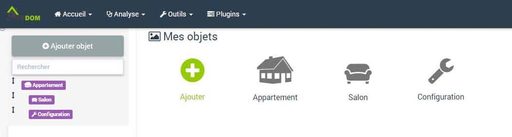
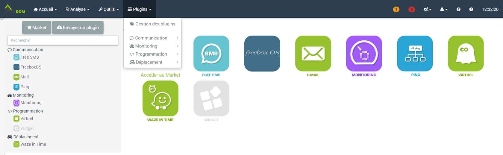
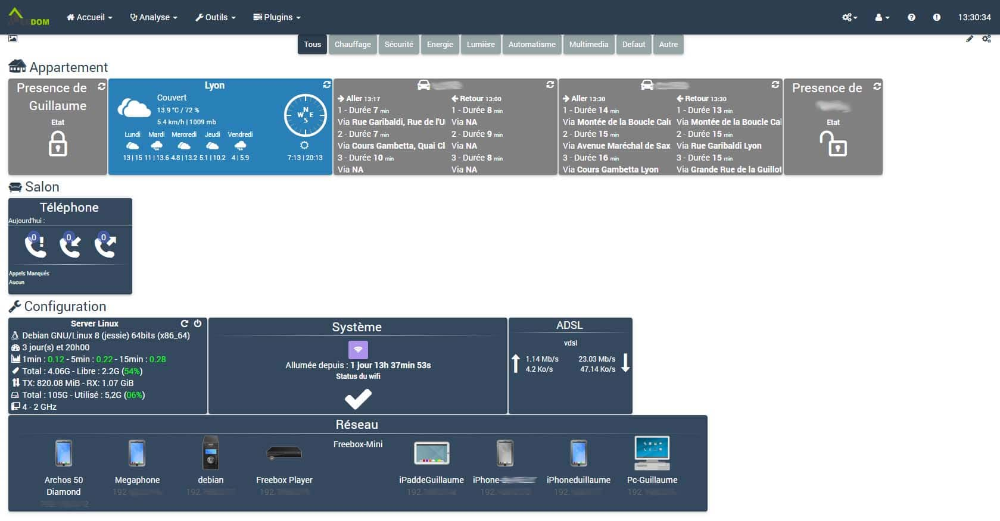

# Installation sur PC et test de Jeedom

Dans ma démarche de recherche d’un systeme domotique pour ma future maison j’ai décidé d’installer [Jeedom](http://amzn.to/2hKyeJM) sur un vieux PC avec [Debian 8](http://amzn.to/2hIcjOw).

## Pourquoi Jeedom ?

Parce-que c’est gratuit en installation DIY, c’est compatible avec plusieurs plateformes d’installations comme des Raspberry, Synology, Linux, Odroid C2…, c’est très évolutif, c’est multi-protocole et en plus c’est Lyonnais !!! 🙂
[[**Voir le produit sur Amazon**](https://www.amazon.fr/dp/B01DRTSR2I?tag=guilbraimespa-21)
Comme je n’ai jamais eu de solution de domotique je n’ai pas d’interface [RFX433](http://amzn.to/2hKCsRv), [Z-wave](http://amzn.to/2hKHw8y) ou [ENOCEAN](http://amzn.to/2iIm0xV) mais cela ne m’a pas empêché de tester l’application, voila la  méthode que j’ai utilisé.
[**Voir le produit sur Amazon**](https://www.amazon.fr/dp/B017P4EJGE?tag=guilbraimespa-21))

[[**Voir le produit sur Amazon**](https://www.amazon.fr/dp/B00QJEY6OC?tag=guilbraimespa-21)[[**Voir le produit sur Amazon**](https://www.amazon.fr/dp/B01DRO7AAI?tag=guilbraimespa-21)
Dans un premier temps, sachez que nous avons tous des appareils utilisables avec les solutions domotique; smartphone, Box ADSL (freebox, Livebox..), webcam, et que nous pouvons utiliser des informations tel que la météo, les temps de trajets, etc…

## Le hardware.

Comme je vous le disais précédemment, j’ai installé [Jeedom](http://amzn.to/2hKyeJM) sur un vieux PC avec Linux [Debian 8](http://amzn.to/2hIcjOw).

> Processeur Intel Core 2, Quad Q8200 à 2,33 Ghz, 4 Go mémoire vive – 120 Go de disque dur.

C’est plus puissant qu’un [Raspberry PI](http://amzn.to/2hL2CC8), ou qu’une [Jeedom](http://amzn.to/2hKyeJM) mini+. Je ne pourrais donc pas vraiment juger de la rapidité d’exécution de [Jeedom](http://amzn.to/2hKyeJM),  mais ce n’est pas indispensable pour le moment.
[**Voir le produit sur Amazon**](https://www.amazon.fr/dp/B01CD5VC92?tag=guilbraimespa-21))

[[**Voir le produit sur Amazon**](https://www.amazon.fr/dp/B01DRTSR2I?tag=guilbraimespa-21)

## Le Logiciel.

L’installation de [Jeedom](http://amzn.to/2hKyeJM) sous Linux est vraiment facile, même pour moi qui n’avais jamais utilisé un autre OS que Windows.
Il suffit de suive la doc sur le site de [Jeedom](http://amzn.to/2hKyeJM) : [ICI](https://www.jeedom.com/doc/documentation/installation/fr_FR/doc-installation.html#_autre).
Lors du choix de l’installation du serveur, j’avais choisi NGINX, car j’ai lu que [Jeedom](http://amzn.to/2hKyeJM) était basé dessus, mais je n’ai pas aimé. J’ai donc, par la suite, migré vers un serveur APACHE. Je connaissais déjà, car j’ai administré des sites hébergés sur APACHE, mais sous windows.

> Si vous voulez migrer de NGINX vers APACHE, il y a un tuto sur le site de [Jeedom](http://amzn.to/2hKyeJM) [ICI](https://www.jeedom.com/doc/documentation/howto/fr_FR/doc-howto-doc.passer_de_nginx_a_apache.html). (Jeedom 2.0 ou sup).

## La configuration.

Une fois l’installation de [Jeedom](http://amzn.to/2hKyeJM) terminée, vous devez aller depuis votre navigateur web sur  *http://votreIP* par exemple pour moi : _http://192.168.0.11/_
Pour la configuration de base suivez la doc du site [ICI](https://www.jeedom.com/doc/documentation/premiers-pas/fr_FR/doc-premiers-pas.html).

### Les Objets.

Pour commencer, j’ai créé des objets. C’est à dire les pieces de mon appartement (Salon, Chambre, SdeB, Cuisine…). Rien de plus simple il faut aller dans _**Outils / Objets/ Ajouter**_, saisir un nom, pour moi se sera ***Appartement*** et cliquer sur _**Sauvegarder**_.
Recommencez la manipulation pour chacune des pieces de votre logement, avec juste une petite manipulation supplémentaire avant de cliquer sur ***Sauvegarder,***  il faut choisir un « ***Parent »*** . Un parent c’est pour savoir où se trouve la piece dans le logement.
Pour moi le parent est toujours ***Appartement,*** mais pour une maison, on peut imaginer que la **_Maison_** est le parent du **_Rez-de-chaussée_** et du ***1er Etages***, que le **_RdC_** est le parents du **_Salon_** et que **_1er Etage_** est le parent de **_Chambre enfants, etc_**… vous avez compris le principe.

### Les plugins.

Alors la on rentre dans le cœur de [Jeedom](http://amzn.to/2hKyeJM), les plugins, c’est un peu les applis sur un smartphone, la base.
Pour aller sur l’app store, appelé Market, il faut cliquer sur _**Plugins**_ / _**Gestion des plugins**_ / ***Accéder au Market.***
Vous pouvez voir le Market, même si vous n’avez pas [Jeedom](http://amzn.to/2hKyeJM) sur le Market en ligne [ICI](https://market.jeedom.fr). C’est pratique pour se faire un idée de ce qui est disponible.
Comme je vous le disais, les plugins c’est comme les applications sur les smartphones.  Par conséquent, comme sur les smartphones, les meilleurs plugins sont souvent payants, mais ce n’est pas toujours justifié à mon avis.
[Jeedom](http://amzn.to/2hKyeJM) est Open source, donc toute personne avec des connaissances en programmation peu faire des plugins, ce qui est bien.
Donc, à vous de voir si vous préférez payer une box domotique, clé en main, quelques centaines d’euros et l’utiliser à 100% sans frais supplémentaires, ou installer un logiciel gratuit sur un PC, ou une [Raspberry PI](http://amzn.to/2hL2CC8) et payer lorsque vous voulez ajouter des fonctions.

> Je n’utilise pas de plugins payant car je suis toujours dans une phase de test comparatif des différentes solutions domotiques.

#### Liste des plugins Gratuits :

Ce sont les plugins que j’ai installé pour tester [Jeedom](http://amzn.to/2hKyeJM).

- [E-mail](https://market.jeedom.fr/index.php?v=d&p=market&type=plugin&&name=E-mail) : permet d’envoyer des mails depuis [Jeedom](http://amzn.to/2hKyeJM).
- [Free Mobile SMS](https://market.jeedom.fr/index.php?v=d&p=market&type=plugin&&name=Free%20Mobile%20SMS) : permet d’envoyer des SMS sur son portable via l’option notification SMS de l’opérateur Free Mobile.
- [Ping](https://market.jeedom.fr/index.php?v=d&p=market&type=plugin&compatibility=DIY&status=stable&cost=free&timeState=popular&&name=Ping) : permet de vérifier la presence d’un équipement sur le réseau.
- [Weather](https://market.jeedom.fr/index.php?v=d&p=market&type=plugin&compatibility=DIY&status=stable&cost=free&timeState=popular&&name=Weather) : permet de récolter les informations météos.
- [Monitoring](https://market.jeedom.fr/index.php?v=d&p=market&type=plugin&compatibility=DIY&status=stable&cost=free&timeState=popular&&name=Monitoring) : permet de surveiller l’état de votre machine : température, disques…
- [Waze in Time](https://market.jeedom.fr/index.php?v=d&p=market&type=plugin&compatibility=DIY&status=stable&cost=free&timeState=popular&&name=Waze%20in%20Time) : permet d’avoir la durée de trajet entre deux points.
- [Virtuel](https://market.jeedom.fr/index.php?v=d&p=market&type=plugin&compatibility=DIY&status=stable&cost=free&timeState=popular&name=Virtuel&certification=Officiel) : permet la création de périphériques virtuels. Interrupteurs…
- [FreeboxOS](https://market.jeedom.fr/index.php?v=d&p=market&type=plugin&compatibility=DIY&status=stable&cost=free&timeState=popular&name=FreeboxOS&) : Permet de récupérer les informations disponibles sur votre Freebox Serveur.
- [ImperiHome Standard System API](https://market.jeedom.fr/index.php?v=d&p=market&type=plugin&compatibility=DIY&status=stable&cost=free&timeState=popular&name=imperihome&) : Permet à Imperihome de piloter [Jeedom](http://amzn.to/2hKyeJM). Imperihome est une application gratuite disponible pour IOS et Android qui permet de contrôler vos systèmes domotiques et objets connectés. ~**4.00 € TTC.**~  **Gratuit.**

#### 

#### Liste des plugins Payants :

Je n’ai pas installé ces plugins, car ils sont payants, mais par contre, je n’ai pas pu faire tout ce que je voulais.

- [Kodi](https://market.jeedom.fr/index.php?v=d&p=market&type=plugin&compatibility=DIY&status=stable&name=kodi&cost=paying&) : permet d’envoyer et recevoir des commandes à/depuis Kodi (Media Center Open Source). **4.00 € TTC.**
- [Camera](https://market.jeedom.fr/index.php?v=d&p=market&type=plugin&compatibility=DIY&status=stable&cost=paying&name=camera&certification=Officiel&timeState=popular) : permet d’afficher les caméras IP. **4.00 € TTC.**
- [Application mobile](https://www.jeedom.com/market/index.php?v=d&p=market&type=plugin&compatibility=DIY&status=stable&cost=paying&certification=Officiel&timeState=popular&&name=app%20mobile) « gratuite » pour contrôler [Jeedom](http://amzn.to/2hKyeJM) disponible sur le [Play Store](https://play.google.com/store/apps/details?id=fr.jeedom.jeedom&hl=fr) ou l’[Apple Store](https://itunes.apple.com/fr/app/jeedom/id1010855094?mt=8). Toute fois l’application est gratuite mais il faut un plugin payant pour l’utiliser. **4.00 € TTC.**
- [Agenda](https://market.jeedom.fr/index.php?v=d&p=market&type=plugin&compatibility=DIY&status=stable&cost=paying&timeState=popular&name=agenda&certification=Officiel) : permet de créer un calendrier. **4.00 € TTC.**

Je vous laisse regarder sur le Market les autres plugins payants pour contrôler votre Livebox / Bbox, TV Samsung / LG, ampli Yamaha… ça peut vite chiffrer à 2, 4, 6 ,8 € le plugin, sans compter les plugins pour interface [RFX433](http://amzn.to/2hKCsRv), Edisio, ou [ENOCEAN](http://amzn.to/2iIm0xV) entre 4€ et 9€.

> A noter quand même que le plugin pour [Z-wave](http://amzn.to/2hKHw8y) est gratuit et disponible [ICI](https://market.jeedom.fr/index.php?v=d&p=market&type=plugin&&name=zwave).

## Comparatif des solutions à base de Jeedom.

Sans compter le prix du vieux PC sur lequel j’ai installé [Jeedom](http://amzn.to/2hKyeJM) et les appareils connectés (smartphone, Freebox…) pour le moment, ça ne m’a pas coûté un €uro.
Sur le tableau suivant, j’ai comparé la configuration que j’ai utilisée pour faire le test, avec 3 configurations qui correspondent à des box domotique complètes. En plus de la partie matériel, j’ai ajouté les plugins que je pense indispensables, même s’ils sont payants.

<table style="height: 500px;" border="0" width="1084" cellspacing="0" cellpadding="0"><tbody><tr bgcolor="#CDCDCD"><td bgcolor="#CDCDCD" width="150"><strong>Config Test</strong></td><td bgcolor="#CDCDCD" width="50"><strong>&nbsp;Prix</strong></td><td bgcolor="#FFFFFF" width="2"></td><td bgcolor="#CDCDCD" width="150"><strong>Config Debian</strong></td><td bgcolor="#CDCDCD" width="50"><strong>&nbsp;Prix</strong></td><td bgcolor="#FFFFFF" width="2"></td><td bgcolor="#CDCDCD" width="150"><strong>Config RaspberryPi3</strong></td><td bgcolor="#CDCDCD" width="50"><strong>&nbsp;Prix</strong></td><td bgcolor="#FFFFFF" width="2"></td><td bgcolor="#CDCDCD" width="150"><strong>Config Jeedom mini+</strong></td><td bgcolor="#CDCDCD" width="50"><strong>&nbsp;Prix</strong></td></tr><tr bgcolor="#E2E2E2"><td bgcolor="#E2E2E2"><strong>Matériel et logiciels</strong></td><td bgcolor="#E2E2E2"></td><td bgcolor="#FFFFFF" width="2"></td><td bgcolor="#E2E2E2"><strong>Matériel et logiciels</strong></td><td bgcolor="#E2E2E2"><strong>150 €</strong></td><td bgcolor="#FFFFFF"></td><td bgcolor="#E2E2E2"><strong>Matériel et logiciels</strong></td><td bgcolor="#E2E2E2"><strong>238 €</strong></td><td bgcolor="#FFFFFF"></td><td bgcolor="#E2E2E2"><strong>Matériel et logiciels</strong></td><td bgcolor="#E2E2E2"><strong>269 €</strong></td></tr><tr><td width="150">Vieux PC Debian</td><td width="50">0 €</td><td bgcolor="#FFFFFF" width="2"></td><td width="150">Vieux PC Debian</td><td width="50">0 €</td><td bgcolor="#FFFFFF"></td><td width="150"><u><a href="http://www.domadoo.fr/fr/informatique/3430-raspberry-ordinateur-monocarte-raspberry-pi-3-modele-b-wifi-et-bluetooth-640522710850.html" target="_blank" rel="noopener noreferrer">RaspberryPi3</a></u></td><td width="50">46 €</td><td bgcolor="#FFFFFF"></td><td width="150"><u><a href="http://www.domadoo.fr/fr/box-domotique/2749-jeedom-pack-de-demarrage-jeedom-mini-compatible-z-wave-et-interface-rfxcom.html" target="_blank" rel="noopener noreferrer">Jeedommini+</a></u></td><td width="50">269 €</td></tr><tr><td bgcolor="#E2E2E2"><strong>Plugins</strong></td><td bgcolor="#E2E2E2"></td><td bgcolor="#FFFFFF" width="2"></td><td width="150"><u><a href="http://www.domadoo.fr/fr/interface-domotique/3171-sigma-designs-controleur-z-wave-plus-usb.html" target="_blank" rel="noopener noreferrer">Z-Wave Plus USB</a></u></td><td width="50">40 €</td><td bgcolor="#FFFFFF"></td><td width="150"><u><a href="http://www.domadoo.fr/fr/informatique/2579-raspberry-boitier-pour-raspberry-pi-type-b-transparent.html" target="_blank" rel="noopener noreferrer">Boitier pour Raspberry</a></u></td><td width="50">8 €</td><td bgcolor="#FFFFFF"></td><td width="150">Z-WavePlus</td><td width="50">0 €</td></tr><tr><td width="150">E-mail</td><td width="50">0 €</td><td bgcolor="#FFFFFF" width="2"></td><td width="150"><u><a href="http://www.domadoo.fr/fr/interface-domotique/2561-rfxcom-interface-rfxtrx433e-usb-avec-recepteur-et-emetteur-43392mhz-compatible-somfy-rts.html" target="_blank" rel="noopener noreferrer">Interface RFXUSB</a></u></td><td width="50">110 €</td><td bgcolor="#FFFFFF"></td><td width="150"><u><a href="http://amzn.to/2kv2FUw" target="_blank" rel="noopener noreferrer">Cartemémoire SD 16Go</a></u></td><td width="50">7 €</td><td bgcolor="#FFFFFF"></td><td width="150">Interface RFX USB</td><td width="50">0 €</td></tr><tr><td width="150">FreeMobileSMS</td><td width="50">0 €</td><td bgcolor="#FFFFFF" width="2"></td><td bgcolor="#E2E2E2"><strong>Plugins</strong></td><td bgcolor="#E2E2E2"><strong>26 €</strong></td><td bgcolor="#FFFFFF"></td><td width="150"><u><a href="http://www.domadoo.fr/fr/informatique/1806-raspberry-alimentation-5v-12a-pour-raspberry-pi.html" target="_blank" rel="noopener noreferrer">Alimentation</a></u></td><td width="50">8 €</td><td bgcolor="#FFFFFF"></td><td bgcolor="#E2E2E2"><strong>Plugins</strong></td><td bgcolor="#E2E2E2"><strong>16 €</strong></td></tr><tr><td width="150">FreeboxOS</td><td width="50">0 €</td><td bgcolor="#FFFFFF" width="2"></td><td width="150">E-mail</td><td width="50">0 €</td><td bgcolor="#FFFFFF"></td><td width="150"><u><a href="http://www.domadoo.fr/fr/interface-domotique/2312-z-waveme-carte-d-extension-razberry-z-wave-pour-raspberry-pi-696859123290.html" target="_blank" rel="noopener noreferrer">RaZberry Z-Wave+</a></u></td><td width="50">59 €</td><td bgcolor="#FFFFFF"></td><td width="150">E-mail</td><td width="50">0 €</td></tr><tr><td width="150">Monitoring</td><td width="50">0 €</td><td bgcolor="#FFFFFF" width="2"></td><td width="150">Agenda</td><td width="50">4 €</td><td bgcolor="#FFFFFF"></td><td width="150"><u><a href="http://www.domadoo.fr/fr/interface-domotique/2561-rfxcom-interface-rfxtrx433e-usb-avec-recepteur-et-emetteur-43392mhz-compatible-somfy-rts.html" target="_blank" rel="noopener noreferrer">Interface RFXUSB</a></u></td><td width="50">110 €</td><td bgcolor="#FFFFFF"></td><td width="150">Agenda</td><td width="50">4 €</td></tr><tr><td width="150">Ping</td><td width="50">0 €</td><td bgcolor="#FFFFFF" width="2"></td><td width="150">Alarme</td><td width="50">6 €</td><td bgcolor="#FFFFFF"></td><td bgcolor="#E2E2E2"><strong>Plugins</strong></td><td bgcolor="#E2E2E2"><strong>26 €</strong></td><td bgcolor="#FFFFFF"></td><td width="150">Alarme</td><td width="50">0 €</td></tr><tr><td width="150">Virtuel</td><td width="50">0 €</td><td bgcolor="#FFFFFF" width="2"></td><td width="150">Camera</td><td width="50">4 €</td><td bgcolor="#FFFFFF"></td><td width="150">E-mail</td><td width="50">0 €</td><td bgcolor="#FFFFFF"></td><td width="150">Camera</td><td width="50">4 €</td></tr><tr><td width="150">WazeinTime</td><td width="50">0 €</td><td bgcolor="#FFFFFF" width="2"></td><td width="150">FreeMobileSMS</td><td width="50">0 €</td><td bgcolor="#FFFFFF"></td><td width="150">Agenda</td><td width="50">4 €</td><td bgcolor="#FFFFFF"></td><td width="150">FreeMobileSMS</td><td width="50">0 €</td></tr><tr><td width="150">Weather</td><td width="50">0 €</td><td bgcolor="#FFFFFF" width="2"></td><td width="150">FreeboxOS</td><td width="50">0 €</td><td bgcolor="#FFFFFF"></td><td width="150">Alarme</td><td width="50">6 €</td><td bgcolor="#FFFFFF"></td><td width="150">FreeboxOS</td><td width="50">0 €</td></tr><tr><td bgcolor="#E2E2E2" width="150"><strong>Total</strong></td><td bgcolor="#E2E2E2" width="50"><strong>0 €</strong></td><td bgcolor="#FFFFFF" width="2"></td><td width="150">ImperiHome</td><td width="50">4 €</td><td bgcolor="#FFFFFF"></td><td width="150">Camera</td><td width="50">4 €</td><td bgcolor="#FFFFFF"></td><td width="150">ImperiHome</td><td width="50">4 €</td></tr><tr><td bgcolor="#FFFFFF" width="150"></td><td bgcolor="#FFFFFF" width="50"></td><td bgcolor="#FFFFFF" width="2"></td><td width="150">Kodi</td><td width="50">4 €</td><td bgcolor="#FFFFFF"></td><td width="150">FreeMobileSMS</td><td width="50">0 €</td><td bgcolor="#FFFFFF"></td><td width="150">Kodi</td><td width="50">4 €</td></tr><tr><td bgcolor="#FFFFFF" width="150"></td><td bgcolor="#FFFFFF" width="50"></td><td bgcolor="#FFFFFF" width="2"></td><td width="150">Monitoring</td><td width="50">0 €</td><td bgcolor="#FFFFFF"></td><td width="150">FreeboxOS</td><td width="50">0 €</td><td bgcolor="#FFFFFF"></td><td width="150">Monitoring</td><td width="50">0 €</td></tr><tr><td bgcolor="#FFFFFF" width="150"></td><td bgcolor="#FFFFFF" width="50"></td><td bgcolor="#FFFFFF" width="2"></td><td width="150">Ping</td><td width="50">0 €</td><td bgcolor="#FFFFFF"></td><td width="150">ImperiHome</td><td width="50">4 €</td><td bgcolor="#FFFFFF"></td><td width="150">Ping</td><td width="50">0 €</td></tr><tr><td bgcolor="#FFFFFF" width="150"></td><td bgcolor="#FFFFFF" width="50"></td><td bgcolor="#FFFFFF" width="2"></td><td width="150">RFXcom</td><td width="50">4 €</td><td bgcolor="#FFFFFF"></td><td width="150">Kodi</td><td width="50">4 €</td><td bgcolor="#FFFFFF"></td><td width="150">RFXcom</td><td width="50">0 €</td></tr><tr><td bgcolor="#FFFFFF" width="150"></td><td bgcolor="#FFFFFF" width="50"></td><td bgcolor="#FFFFFF" width="2"></td><td width="150">Virtuel</td><td width="50">0 €</td><td bgcolor="#FFFFFF"></td><td width="150">Monitoring</td><td width="50">0 €</td><td bgcolor="#FFFFFF"></td><td width="150">Virtuel</td><td width="50">0 €</td></tr><tr><td bgcolor="#FFFFFF" width="150"></td><td bgcolor="#FFFFFF" width="50"></td><td bgcolor="#FFFFFF" width="2"></td><td width="150">WazeinTime</td><td width="50">0 €</td><td bgcolor="#FFFFFF"></td><td width="150">Ping</td><td width="50">0 €</td><td bgcolor="#FFFFFF"></td><td width="150">WazeinTime</td><td width="50">0 €</td></tr><tr><td bgcolor="#FFFFFF" width="150"></td><td bgcolor="#FFFFFF" width="50"></td><td bgcolor="#FFFFFF" width="2"></td><td width="150">Weather</td><td width="50">0 €</td><td bgcolor="#FFFFFF"></td><td width="150">RFXcom</td><td width="50">4 €</td><td bgcolor="#FFFFFF"></td><td width="150">Weather</td><td width="50">0 €</td></tr><tr><td bgcolor="#FFFFFF" width="150"></td><td bgcolor="#FFFFFF" width="50"></td><td bgcolor="#FFFFFF" width="2"></td><td bgcolor="#E2E2E2" width="150"><strong>Total</strong></td><td bgcolor="#E2E2E2" width="50"><strong>&nbsp;&nbsp;176 €</strong></td><td bgcolor="#FFFFFF"></td><td width="150">Virtuel</td><td width="50">0 €</td><td bgcolor="#FFFFFF"></td><td bgcolor="#E2E2E2" width="150"><strong>Total</strong></td><td bgcolor="#E2E2E2" width="50"><strong>&nbsp;&nbsp;285 €</strong></td></tr><tr><td bgcolor="#FFFFFF" width="150"></td><td bgcolor="#FFFFFF" width="50"></td><td bgcolor="#FFFFFF" width="2"></td><td bgcolor="#FFFFFF" width="150"></td><td bgcolor="#FFFFFF" width="50"></td><td bgcolor="#FFFFFF"></td><td width="150">WazeinTime</td><td width="50">0 €</td><td bgcolor="#FFFFFF"></td><td bgcolor="#FFFFFF" width="150"></td><td bgcolor="#FFFFFF" width="50"></td></tr><tr><td bgcolor="#FFFFFF" width="150"></td><td bgcolor="#FFFFFF" width="50"></td><td bgcolor="#FFFFFF" width="2"></td><td bgcolor="#FFFFFF" width="150"></td><td bgcolor="#FFFFFF" width="50"></td><td bgcolor="#FFFFFF"></td><td width="150">Weather</td><td width="50">0 €</td><td bgcolor="#FFFFFF"></td><td bgcolor="#FFFFFF" width="150"></td><td bgcolor="#FFFFFF" width="50"></td></tr><tr><td bgcolor="#FFFFFF" width="150"></td><td bgcolor="#FFFFFF" width="50"></td><td bgcolor="#FFFFFF" width="2"></td><td bgcolor="#FFFFFF" width="150"></td><td bgcolor="#FFFFFF" width="50"></td><td bgcolor="#FFFFFF"></td><td bgcolor="#E2E2E2" width="150"><strong>Total</strong></td><td bgcolor="#E2E2E2" width="50"><strong>&nbsp;&nbsp;264 €</strong></td><td bgcolor="#FFFFFF"></td><td bgcolor="#FFFFFF" width="150"></td><td bgcolor="#FFFFFF" width="50"></td></tr></tbody></table>

> Sachez que si vous achetez la [Jeedom](http://amzn.to/2hKyeJM) mini+ vous bénéficiez gratuitement des plugins [RFX433](http://amzn.to/2hKCsRv) et Alarme, soit une économie de 10 € ainsi que quelques avantages appelés [Service Pack Power](https://www.jeedom.com/blog/?p=1215) . Vous trouverez également sur le site [domadoo.fr](http://www.domadoo.fr) un pack de démarrage [Z-wave](http://amzn.to/2hKHw8y)\+ et [RFX433](http://amzn.to/2hKCsRv)E vous faisant économiser 10 € par rapport à l’achat des éléments séparés.

[[**Voir le produit sur Amazon**](https://www.amazon.fr/dp/B01DRTSR2I?tag=guilbraimespa-21)
On voit bien que quelque soit la solution choisie, on à une box domotique pour un prix très correct (<285 €), on peut comparer à la box Eedomus+ que l’on trouve à 299€ plus un abonnement « optionnel » à  5,90 € / mois. Je reviendrais sur cette box lors d’un prochain article.
Comprenez bien que là, on ne parle que de la partie box domotique, il faudra par la suite ajouter les modules pour contrôler les différents appareils de la maison. (Détecteurs de mouvement, d’ouverture de porte, de prises électrique, de lumières…).
La config sous Debian est presque à 90 € moins chère que la [Raspberry PI](http://amzn.to/2hL2CC8). Cette solution est viable si vous savez bidouiller un peu et si vous avez déjà un serveur linux qui tourne H24, car la consommation électrique est supérieure. On peut tabler sur 150W pour le serveur Linux et 5W pour le [Raspberry PI](http://amzn.to/2hL2CC8).
Entre la version [Raspberry PI](http://amzn.to/2hL2CC8) et la [Jeedom](http://amzn.to/2hKyeJM) mini+ je dirais que l’écart de prix de 20 € est justifié par le coté « clé en main » et le [Service Pack Power](https://www.jeedom.com/blog/?p=1215) inclus. Quid des performances, là, il faudrait faire un test matériel, mais sur le papier la [Raspberry PI](http://amzn.to/2hL2CC8) wins (gagne) .
**Jeedom mini+ :**

- Processeur : ARM Cortex A9 à 1Ghz
- Mémoire : 512 Mo de RAM

**[Raspberry PI](http://amzn.to/2hL2CC8)3 :**

- Processeur : Quad-core ARM Cortex-A53 1.2 GHz 64-bit
- Mémoire : 1024 Mo de RAM
- Wifi 802.11n
- Bluetooth 4.1

---

_Voilà pour l’installation, à ce stade_ *[Jeedom](http://amzn.to/2hKyeJM)* *est installé et fonctionnel sur mon serveur Linux / Debian, il ne reste plus qu’à paramétrer les plugins, mettre en place des scénarios et configurer le Dashboard.*
**_Mise à jour du 20/01/2017._**
J’ai eu la bonne idée de transformer mon PC en serveur Xpenology (Synology gratuit) à la place du Debian. Ça marche très bien.
J’ai ensuite installer *[Jeedom](http://amzn.to/2hKyeJM)* sous Docker sans problème et importer ma sauvegarde. Tout fonctionnait correctement malgré quelques limitations par rapport aux autres plateformes.
Un jour j’ai voulu réinstaller *[Jeedom](http://amzn.to/2hKyeJM)* et la des messages d’erreurs dans tous les sens, impossibles de télécharger l’image sur le docker Jeedom.
Je suis donc passé sur RaspberryPi3. [Jeedom – Installation de Jeedom Netinstall sur Raspberry 3](/articles/installation-de-jeedom-netinstall-sur-raspberry-3)
*[Jeedom](http://amzn.to/2hKyeJM)* à réduit un peu les versions et surtout fait le ménage dans les différentes plateformes, surement  grâce à l’arrivé fin février début mars/Avril 2017 de la nouvelle box la *[Jeedom](http://amzn.to/2hKyeJM)* Smart.

Jeedom Smart, la nouvelle box de Jeedom disponible fin février debut mars 2017.

Cette nouvelle box fonctionne sur une base de [Odroid C2](http://amzn.to/2iU7UbJ) et non plus sur une base de [Raspberry](http://amzn.to/2iKY14X) comme l’était la Jeedom Mini+ et coûtera 235 €.
Pour plus d’informations je vous invite à visiter le site de [Jeedom](https://www.jeedom.com/site/fr/).
Concernant les images de Jeedom pour les installer en DIY elles sont disponibles sur l’[Amazon Drive ICI](https://www.amazon.fr/clouddrive/share/OwYXPEKiIMdsGhkFeI3eUQ0VcvTEBq0qxQevlXPvPIy/folder/IT3WZ3N0RqGzaLBnBo0qog), voilà ce que vous pouvez installer :

| Images | Hardware | Etat |
| ------ | -------- | ---- |

|
Jeedomboard netinstall

|

jeedomboard et hummingboard

|

Beta

|
|

Odroid c2 netinstall

|

Odroid C2

|

Release candidat

|
|

RPI

|

RPI1, RPI2 et RPI3

|

Non officiel/Stable

|
|

RPI Netinstall

|

RPI1, RPI2 et RPI3

|

Officiel/Alpha

|
|

Virtual Box

|

Virtual box

|

Non officiel/Stable

|
|

Jeedomboard

|

jeedomboard et hummingboard

|

Stable

|
|

Docker

| |

Beta

|
