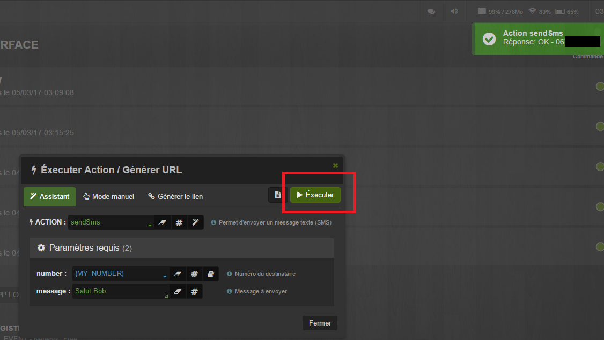
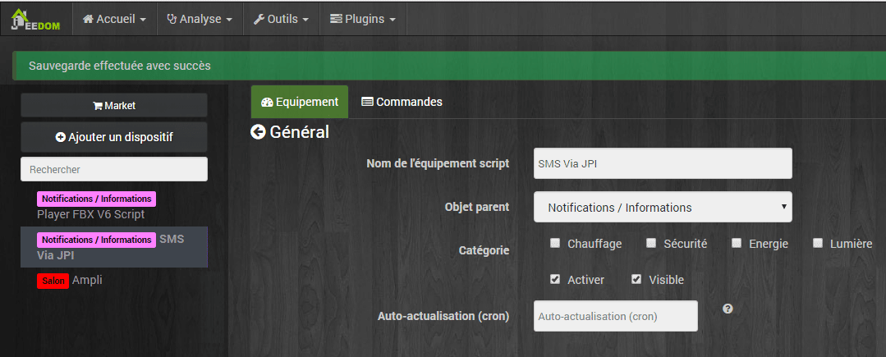
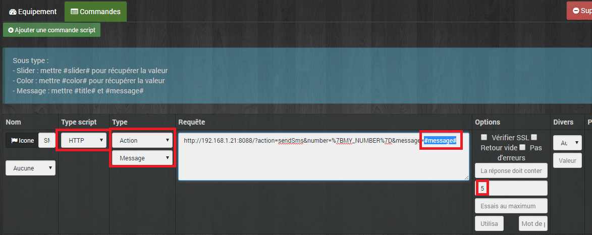
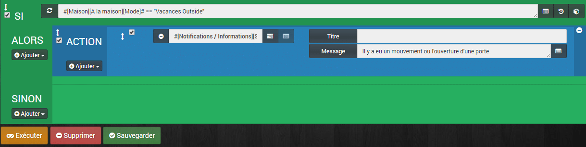

# Envoi de SMS avec JPI

Cet article fait suite à [Jeedom – Installation et configuration de Jeedom Paw Interface](/articles/jeedom-installation-et-configuration-de-jeedom-paw-interface).
Maintenant que tout est bien configuré, nous allons mettre en place l’envoi de SMS via JPI.

**\[datedermaj\]**
**Info : Maintenant j’utilise le [Plugin Jeedom Paw Interface](https://jeedom.github.io/documentation/third_plugin/JPI/fr_FR/index.html) qui est beaucoup plus simple pour les actions simple comme l’envoi de SMS.**

## Tester l’envoi de SMS

Dans un premier temps il faut s’assurer que l’envoi de SMS fonctionne bien.

- Aller dans « **Outils**« , « **Exécuter action / Générer URL**« .
- Cliquer sur « **Action** » puis aller dans « **Téléphonie**« , « **SendSms**« .
- Cliquer sur « **Mots clefs** » puis aller dans « **Personnalisés**« , « **{MY_NUMBER}**« .
- Dans la partie « **message** » saisissez ce que vous voulez.
- Cliquer sur « **Exécuter**« .

Si tout fonctionne bien, vous devriez recevoir un SMS avec le message que vous avez saisi et une notification apparaît sur JPI, en haut à droite.

## Utilisation dans un Scenario Jeedom

Maintenant que l’envoi fonctionne, il faut pouvoir envoyer des SMS depuis Jeedom à l’aide d’un scenario.
Dans mon exemple je veux recevoir un SMS dès qu’il y a un mouvement, ou une porte ouverte chez moi, si je suis en mode Vacances.

### Récupérer l’URL pour la commande SendSMS

- Cliquer sur « **Générer le lien**« .
- Dans la partie « **URL** » cliquer sur « **Tout sélectionner** » et copier le lien.

### Création du script dans Jeedom

- Aller dans Jeedom, puis dans le plugin **Script,** créer un **nouvel équipement**.
- Dans commandes « **Ajouter une commande script**« .
  - Type Script : **HTTP**.
  - Type : **Action** & **Message**.
  - Requête : **Coller l’URL** de JPI.
  - Timeout : **5 voir 10 pour être sur**. Si je ne fais pas cela je reçois 3 fois le SMS. Apparemment, c’est le temps que la requête reçoive la réponse.
- Dans « **Requête**« , il faut modifier la fin de l’URL et remplacer le message de test que vous aviez saisi par la variable **#message#.** Celle-ci recevra le texte du champ « **message** » du scenario. [Voir plus bas ci besoin](#creation-du-scenario).
- Pensez à sauvegarder.

### Création du scenario

Maintenant, il ne reste plus qu’à créer un scenario avec une action, puis sélectionner le script créer. Comme il est de type message, il faut saisir un message, ou même une variable, qui sera récupéré dans le script par **#message#** et envoyer par SMS.

## Conclusion
