# JPI APK et Plugin

> **Au début** de l’aventure JPI, j’avais **déjà fait deux articles**, [Jeedom  Installation et configuration de Jeedom Paw Interface](/articles/jeedom-installation-et-configuration-de-jeedom-paw-interface), suivie de [Jeedom – Envoi de SMS Via Jeedom Paw Interface](/articles/jeedom-envoi-de-sms-via-jeedom-paw-interface). Mais depuis, beaucoup de choses se sont passées et le **projet** qui se limitait à **remplacer** une **clé 3G** et devenu un environnement complet, totalement **intégrable** à **Jeedom** grâce aux nombreuses fonctions ajoutées par **[dJuL](https://www.jeedom.com/forum/memberlist.php?mode=viewprofile&u=4552)** le développeur de l’application **JPI pour Android** (APK) et [**Jerome84**](https://www.jeedom.com/forum/memberlist.php?mode=viewprofile&u=2199), développeur du **plugin JPI pour Jeedom**.
> **JPI** est aussi **compatible** avec d’autres **box domotiques**, telles que [Eedomus](http://www.eedomus.com/fr/) et [Fibaro Home Center](https://www.fibaro.com/fr/), mais n’ayant pas ces box, je me contenterai de parler de Jeedom, à bon entendeur… 🙂
> Pour plus de **détails**, je vous invite à **lire** les posts [\[JPI-APK android\] Tel Android dedié domotique](https://www.jeedom.com/forum/viewtopic.php?f=27&t=18283&hilit=jpi), ainsi que [\[Plugin Tiers\]\[Sujet Principal\] JPI Plugin](https://www.jeedom.com/forum/viewtopic.php?f=141&t=25330&hilit=jpi) sur le **forum** **Jeedom**.
> Je vais reprendre la procédure **d’installation** et la **configuration** de l’APK que nous avions vue dans les **articles** **précédents**, puis nous verrons des **exemples d’utilisation** avec le **plugin JPI** qui à été développé par [**Jerome84**](https://www.jeedom.com/forum/memberlist.php?mode=viewprofile&u=2199) et le plugin **Script,** sorte de couteau suisse pour Jeedom.
> **Lien pour l’installation :[http://rulistaff.free.fr/JPI/fr.djul.JPI-0.958-minAPI19.apk](http://rulistaff.free.fr/JPI/fr.djul.JPI-0.958-minAPI19.apk).** Je vous invite à vérifier sur le [post Jeedom](https://www.jeedom.com/forum/viewtopic.php?f=27&t=18283&p=469610#p469388) si une nouvelle version est disponible. **\[datedermaj\]**

## Installation des applications Android

Pour utiliser JPI nous allons installer l’application **JPI** (APK) disponible sur le site de dJul, puis **PAW** Server, disponible sur le Google Store.
_Lors de l’installation de JPI, si vous n’avez pas préalablement installé PAW, son installation vous sera demandée._

### Installation de l’application PAW Server (Facultatif)

- **Télécharger** et **installer** l’application [« Paw Server for Android » depuis le Google play store](https://play.google.com/store/apps/details?id=de.fun2code.android.pawserver&hl=fr&rdid=de.fun2code.android.pawserver).

- **Lancer** l’application en cliquant sur le **bouton Play**.

#### Changer le port de PAW

**PAW** utilise le **port 8080**, mais si ce port est déjà utilisé, il est possible de le **changer**. Par exemple, sur le téléphone que j’utilise pour JPI, j’ai déjà l’application [Ip Webcam](https://play.google.com/store/apps/details?id=com.pas.webcam&hl=fr) d’installée. Cette application permet de transformer un téléphone Android en camera IP, elle utilise aussi le port 8080.

- Aller dans les **3 petits points** en haut à droite.
- Puis  **Settings.**
- Puis **Server Settings.**
- **Server Port.**
- Changer le port **8080** par un autre port. (Exemple **8082**).

### Installation de l’application JPI (APK)

**L’installation** ne se fait pas depuis le Google Store, mais depuis le **site** de **dJul** en téléchargeant un fichier APK. Pour pouvoir installer ce genre de fichier, il faut autoriser les « **Sources inconnues** » sur votre smartphone :

- Aller dans « **Paramètres**« .
- Puis « **Sécurité**« .
- Cocher « **Sources inconnues**« .

Le **téléchargement** de l’APK peut se faire depuis votre **ordinateur**, mais il faudra ensuite **transférer** le fichier sur votre **smartphone**, le plus simple étant de le faire **directement** depuis votre **téléphone** via le **lien** ou le **QR Code**.

- **Cliquer** sur le lien : [http://rulistaff.free.fr/JPI/fr.djul.JPI-0.93-minAPI15.apk](http://rulistaff.free.fr/JPI/fr.djul.JPI-0.93-minAPI15.apk) ou **scanner** le QRCode : 
- Une fois le téléchargement **terminé**, cliquer sur le fichier pour **lancer** **l’installation**.
- Si vous n’avez **pas installé Paw**, vous serez redirigé vers le **Google Store** pour le faire.
- **Suivre** les **instructions** à l’écran, jusqu’à la fin de **l’installation**.
- Si votre téléphone n’est **pas rooté**, il vous sera demandé de le **redémarrer** manuellement.
- **JPI** redémarrera **automatiquement** après le reboot.

Si **l’installation** de PAW et JPI s’est bien déroulée, vous devriez avoir **l’écran** suivant sur votre **smartphone**.
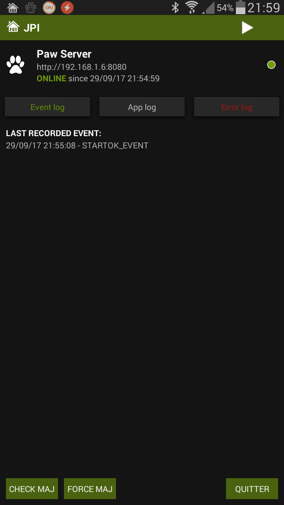
_**Attention**: l’APK n’est pas compatible avec les téléphones Android sous Gingerbread. Il est possible d’installer des Custom ROM, mais cette technique demande quelques connaissances techniques que je ne détaillerai pas ici._

## Configuration de l’application JPI

Maintenant, nous allons pouvoir **configurer** **JPI** depuis un ordinateur, connecté sur le **même réseau** que le smartphone.

- Aller sur **http://\[IP de l’appareil mobile\]:\[Port\]** (Normalement le port est 8080 sauf si vous l’avez changé lors de l’installation de PSA.)
- Saisir les identifiant et mot de passe : « **admin** » et « **JPI**« .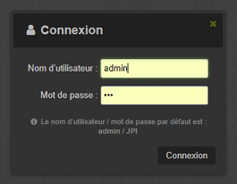

### Association avec Jeedom

- Aller dans **Configuration, Réglages de base, Contrôleurs actifs** et **cocher Jeedom**.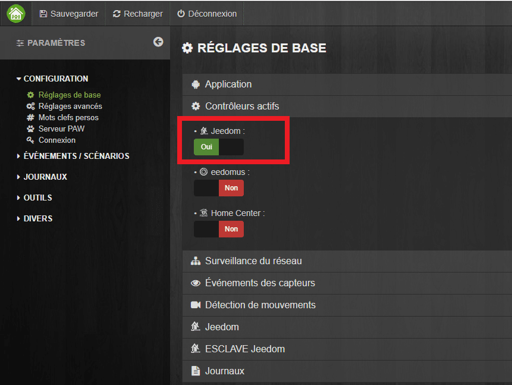
- Aller dans **Configuration, Réglages de base,** entrer dans le nouveau menu **Jeedom.**
- Saisir l’**IP, le Port et le répertoire de votre Jeedom**.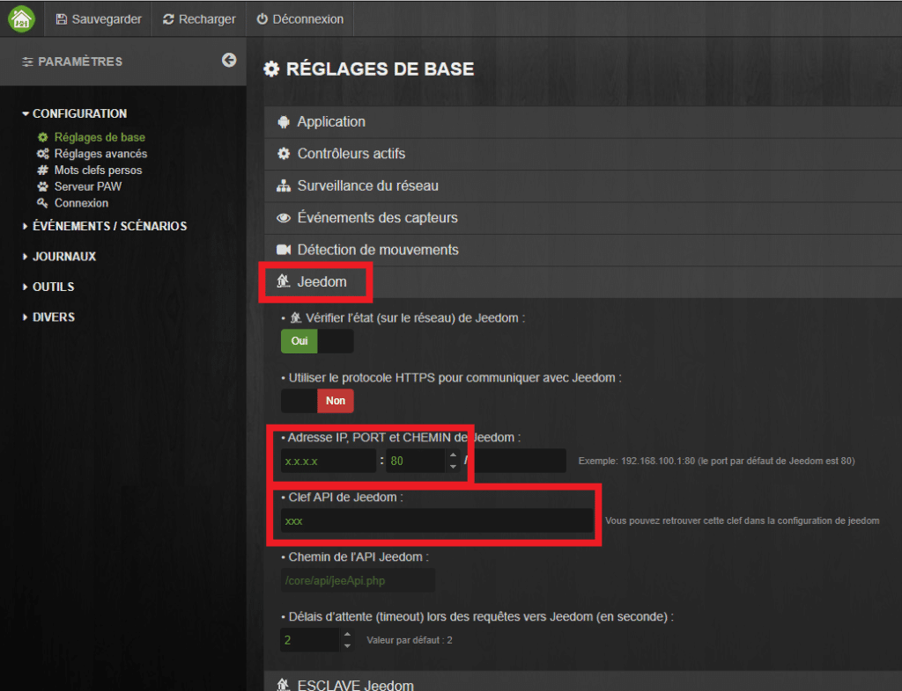
- Saisir la **Clé API de Jeedom** que l’on retrouve sur Jeedom dans **Roue dentée, Configuration, API, Clef API**.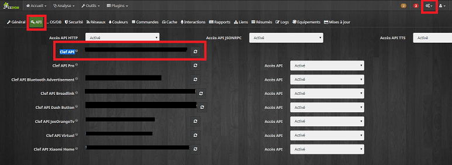
- Pour finir faire **Sauvegarder**.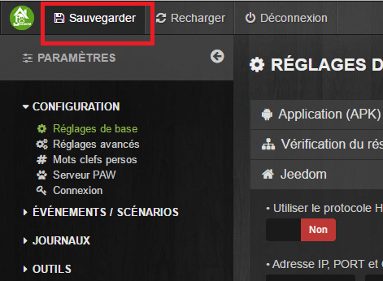

Si la **configuration** de Jeedom à **réussi**, vous devriez avoir ça :
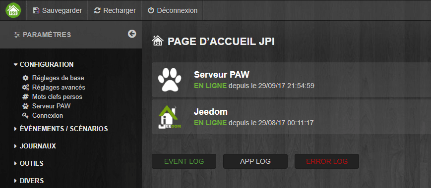

### Configuration Réseau

Maintenant que JPI est **associé à Jeedom**, on va configurer la surveillance du **réseau** qui consiste à vérifier que JPI est bien connecté a votre Routeur, à Internet, au réseau 3G, etc…
Il se peut que des **menus** soient **différents** entre mes copies d’écran et votre smartphone, pour 2 raisons :

- Il y a beaucoup de **mises à jour** et les menus peuvent changer.
- JPI vérifie les compétences technique de votre smartphone et n’affiche que les menus correspondants aux **fonctions** **supportées**.

- Aller dans **Configuration, Réglages de base, Surveillance Réseau.**
- Cocher les éléments souhaités :
  - **Vérifier l’état du réseau GSM** : JPI vérifie que le smartphone est connecté au réseau 3G / 4G.
  - **Vérifier l’état de la passerelle** : JPI vérifie que le smartphone est bien connecté a votre box / Routeur.
  - **Vérifier l’état d’internet** : JPI vérifie que le smartphone est effectivement connecté a internet.
  - **Vérifier l’état d’appareils personnalisés** : JPI vérifie si le smartphone est bien connecté à un autre appareil. Dans mon cas une Mi-Box TV sous Android avec JPI.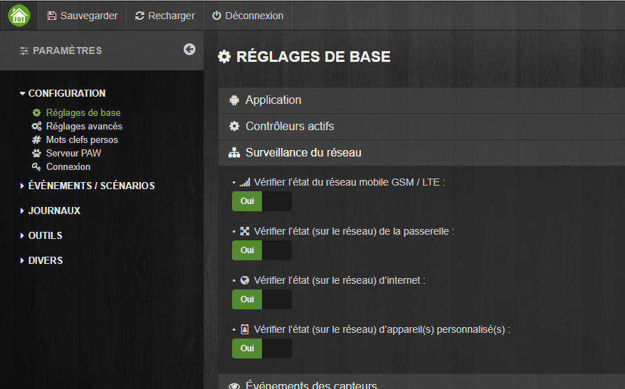
- Pour configurer un appareil personnalisé, il faut aller dans le menu « **Appareil(s) personnalisé(s)** » puis entrer les informations nécessaires.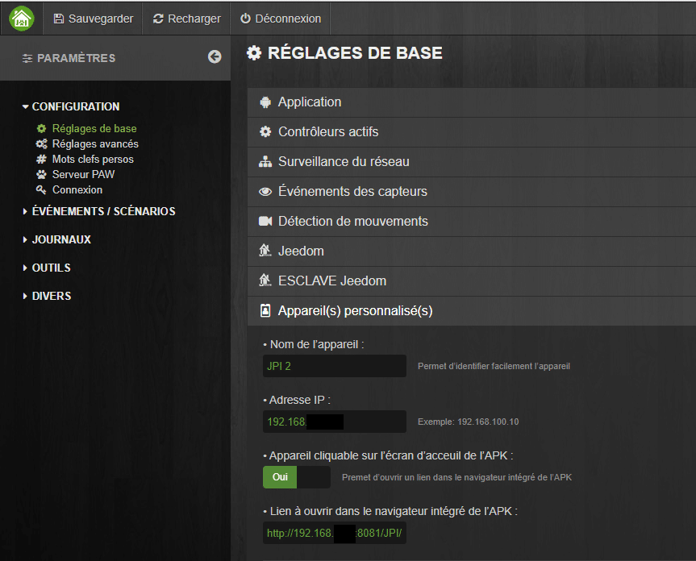
- Pour finir faire **Sauvegarder**.

Si la **configuration** de surveillance du réseau à **réussi**, vous devriez avoir ça : 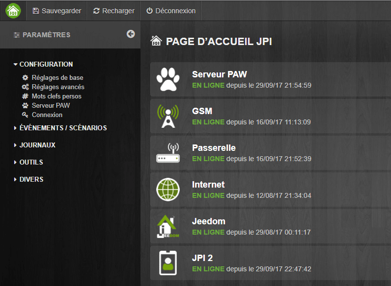

### Les autres réglages de base

Voila pour les réglages **indispensables** au bon fonctionnement de JPI. Toutefois, il y a d’autres réglages comme :

- **Application** : Permet de gérer le comportement de l’application. Reste en 1er plan, garde l’écran allumé…
- **Événement des capteurs** : Permet d’utiliser la camera pour surveiller la proximité et la luminosité autour du smartphone.
- **Détection des mouvements** : Permet d’utiliser la camera comme détecteur de mouvements.
- **Esclave Jeedom** : Vérifie l’état d’un Jeedom esclave (Fonctionne avec Jeelink).
- **Journaux** : Gestion du niveau de log dans les journaux.

### Configuration du numéro de téléphone

Malgré les **nombreuses** fonctions que propose à présent JPI, sa fonction première reste la **communication** via le réseau **GSM**. Pour cela, il va falloir lui donner notre **numéro de téléphone.** Plus précisément, lui dire quels sont les numéros **autorisés** à envoyer des messages et donc, lancer des actions.

- Aller dans **Configuration.**
- Puis dans **Mots clefs perso.**
- Saisir son numéro de téléphone, en cliquant sur l’icone stylo au bout de la ligne **{MY_NUMBER}**.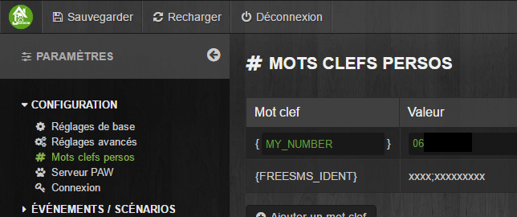
- Vous pouvez ainsi saisir d’autres numéros, si besoin. (Pro, conjoint, enfants…)

## Interactions Jeedom par SMS via JPI

Pour **vérifier** que tout fonctionne, nous allons envoyer une **interaction** à Jeedom par **SMS**.
Depuis **Jeedom V3** et l’ajout d’interactions **automatiques**, Jeedom essaye de **comprendre** la demande et **d’exécuter** une **action** même si vous n’avez pas configuré d’interactions au préalable.
Envoyez un **SMS** au smartphone dédié à **JPI** contenant un **commande** simple comme par exemple :  « Allume la lumière du salon », « Démarre l’aspirateur Robot », « Ferme les rideaux de la chambre des parents »…. et il devrait **l’exécuter** et vous **répondre**.
Vous pouvez **envoyer** simplement le mot « **test** » et vous devriez avoir un **message** en retour tel que : « **Jeedom: Désolé je ne comprends pas la demande**« .
Le fait d’avoir une **réponse** montre bien que **l’échange** entre **JPI** et **Jeedom** fonctionne.

 

Si vous avez un message du style « **Jeedom ERREUR ! Jeedom ne répond pas…** » il peut alors être nécessaire **d’augmenter** le délai d’attente lors des requêtes vers Jeedom. (**Timeout**).

- Aller dans **Configuration, Réglages de base.**
- Aller dans **Jeedom.**
- En bas, changer le **délai d’attente** qui est à 2 par défaut. Ne l’augmentez **que** d’**1** à **2 secondes** à la fois et faire un **test** entre chaque.

## Utilisation de l’application JPI

Si vous voulez utiliser JPI seulement pour **envoyer** et **recevoir** des **SMS** sur votre smartphone, c’est dommage :), mais vous avez fini la **configuration** coté **APK**.
Vous pouvez aller directement au **chapitre** de **configuration** des actions au niveau de Jeedom avec le [Plugin JPI](#utilisation-du-plugin-jpi), ou le [Plugin Script](#utilisation-du-plugin-script).
Cependant, si vous êtes intéressé par le « **Comment ça marche ?** » et le « **Est ce qu’on peut customiser JPI ?** » alors vous allez adorer le menu « **Événements & Scénarios**« , car c’est là que se trouve toute la **puissance** de JPI.
Le développeur de JPI, **dJuL**, à déjà **pré-configuré** un certain nombre de fonctions, comme par exemple :

- Les **interactions** qui vous permettent d’envoyer une commande par SMS et avoir une réponse et / ou  une action en retour.
- Permettre à Jeedom d’**envoyer un SMS** sur un ou plusieurs portables.
- Pouvoir diffuser un **texte vocal** envoyé par SMS.
- Recevoir un **SMS** si Jeedom n’est **plus joignable**.
- Recevoir un **SMS** si la connexion **internet est coupée**.
- **Décrocher** automatiquement le **smartphone**.
- Prendre un **photo** et **l’envoyer** par **mail** lors d’une détection de mouvement.
- …

Vous pouvez à votre tour **créer** des **scenarios** comme bon vous semble. N’hésitez pas à lire le post dédié sur le **forum** de Jeedom pour trouver de **l’aide** au près des utilisateurs et de **dJuL** le développeur qui est très à **l’écoute** des utilisateurs et **passionné** par ce qu’il fait. Il ajoute d’ailleurs de **nouvelles fonctions** et **optimise** l’application très **régulièrement**.
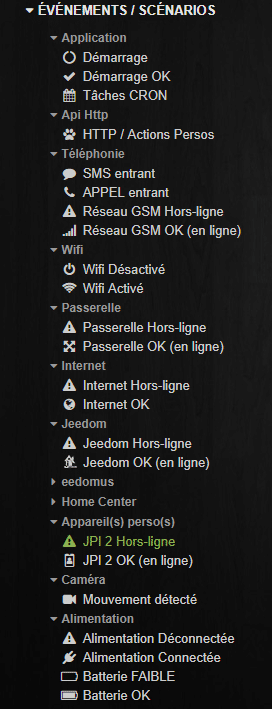

### Exemple de scénario

L’utilisation poussée de JPI sera vue dans des **articles dédiés** comme, par exemple, pour la **fonction ASK** qui permet à Jeedom de vous poser une question et de lancer une action en fonction de votre réponse.

- **Question** : Il n’y a personne à la maison dois-je lancer l’aspirateur robot ?
- **Réponse** : Oui ! (Nettoyage lancé) ou Non ! (Ok, je ne fais rien).

Pour commencer, je vais vous montrer, à l’aide d’un **exemple extrêmement simple**, le principe de fonctionnement des scenarios dans JPI.
Le but de ce **scénario** est de faire une **action** (ouvrir l’application Kodi) lors du **démarrage** du **smartphone** et de **JPI**. Dans mon cas, j’utilise Kodi comme client UPNP et AIRPLAY pour faire du multi-Room, mais a vous **d’adapter** cet exemple à **votre** propre utilisation.

- Depuis le menu « **Événements / Scénarios** » aller dans : « **Application** » et « **Démarrage OK**« .

Donc là, on souhaite créer un événement, ou un scénario, dès que le démarrage de JPI est fini (OK).
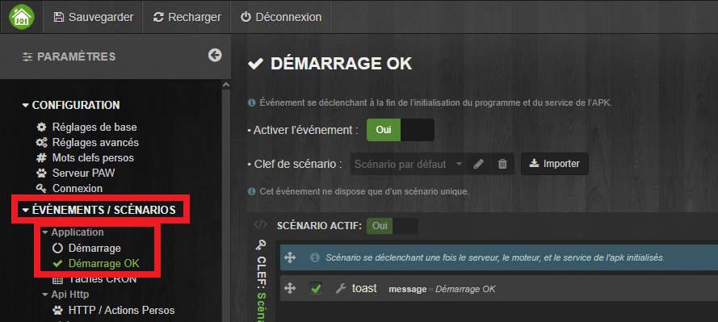
On voit qu’il y a déjà une action « **Toast**« , pré-configurée. Alors nous allons ajouter une autre action.

- Cliquer sur le **« + »** en bas à gauche puis choisir « **Une action**« .

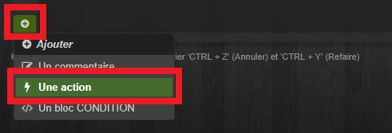

- Dans la fenêtre, cliquer sur **l’icone baguette magique**, puis « **Système** » et choisir « **launchApp**« .

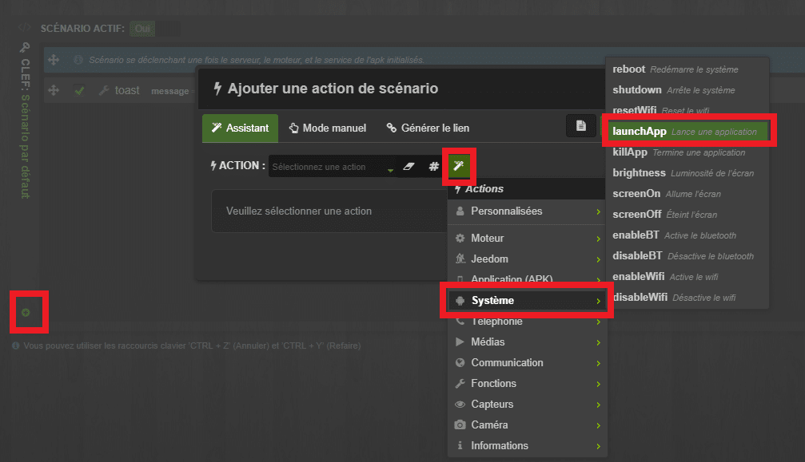
C’est là que vous pouvez maintenant **choisir** parmi les nombreuses **actions** disponibles.

- Un champ « **paramètre** » apparaît alors, en dessous de l’action choisie.
- Cliquer sur l’**icône baguette magique**, puis sélectionner l’application (Kodi).

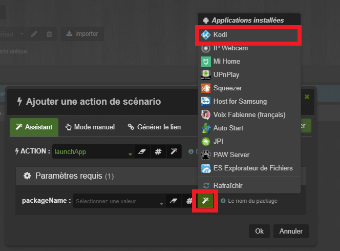

- Vous pouvez **tester** l’action en cliquant sur le bouton « **Exécuter**« .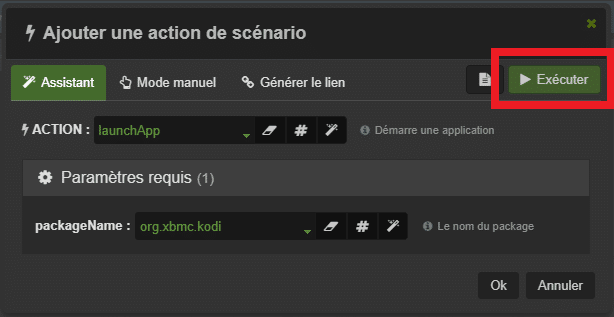
- Cliquer sur **Ok** pour ajouter l’action au scénario.

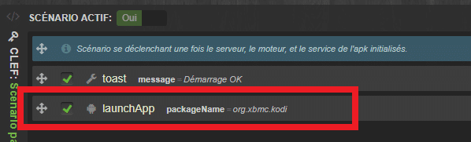
Voila pour cet **exemple** très **simple**, mais qui a pour seul but de vous montrer le **principe** de fonctionnement des **scénarios** dans **JPI**. Je vous invite comme toujours à vous balader dans les menus, pour **découvrir** les nombreuses fonctions que propose JPI.

## Utilisation du Plugin JPI

**_INFO : Pour ce tuto j’ai utilisé la nouvelle version du plugin qui devrait sortir fin octobre 2017._**

La doc officiel se trouve ici : [jeedom.github.io/documentation](https://jeedom.github.io/documentation/third_plugin/JPI/fr_FR/index.html) elle sera mise à jour avec le plugin.
Le **plugin** s’installe normalement depuis le **market**, il est **gratuit**. Une fois installé il suffit de l’activer, il n’y a **pas de dépendance** à installer.
Le plugin se trouve dans **Plugin / Objets connectés / JPI Plugin.**
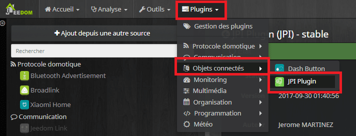

### Ajouter un téléphone

1.  Cliquer sur **Ajouter**.
2.  Saisir un **nom**.
3.  Cocher les cases « **Activer** » et « **Visible**« .
4.  Choisir un **objet parent**.
5.  L’adresse **IP** du téléphone.
6.  Le port **8080**, si vous ne l’avez pas changé lors de l’installation de PAW.
7.  **Sauvegarder**.

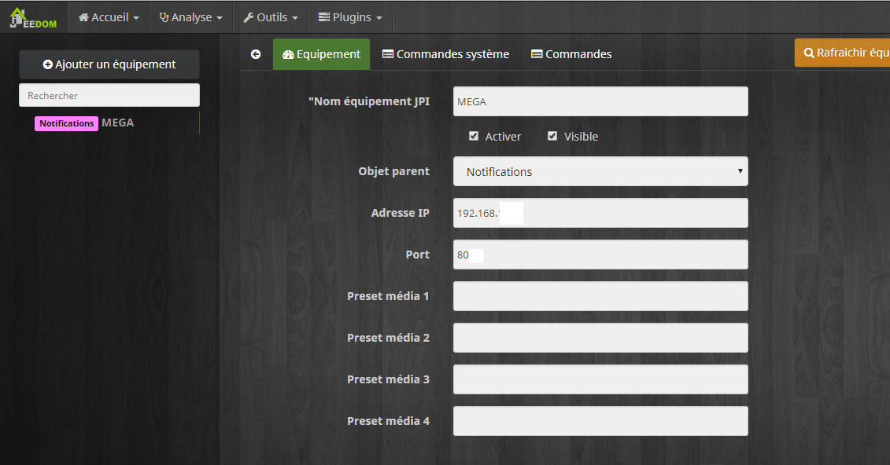

### Commandes système

Les commandes système sont créés **automatiquement** et se trouvent dans l’onglet du même nom.
La plupart sont des commandes **infos** comme par exemple :

- Nombre de SMS envoyés
- Info volume media
- Niveau de la batterie
- Puissance du signal
- …

Il y a aussi des commandes **actions** de base qui n’ont **pas** besoin de **paramètre** particulier :

- Play
- Mute
- Reconnaissance vocale
- Stop
- …

### Commandes

Des commandes plus **complexes** se trouvent dans l’onglet du même nom et il faudra les configurer **manuellement** en fonction de vos besoins, il y a un **assistant** pour vous y aider.
Pour **créer** facilement une **commande**, cliquer sur :

1.  **Assistant de commande JPI**
2.  Donner un **nom** à la commande, exemple SMS pour une commande d’envoi de SMS.
3.  Dans le champ Action chercher **sendSMS**.
4.  Dans le champ **number**, saisir le **numéro** du destinataire.
5.  Ne **rien** mettre dans les **Paramètres** **optionnels**.
6.  **Sauvegarder**.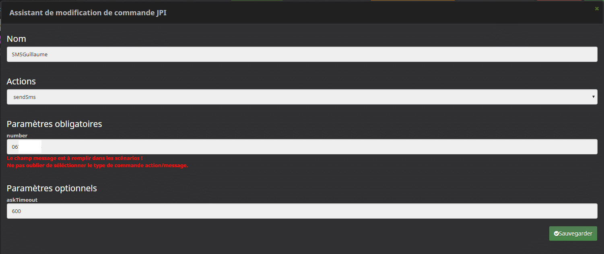
7.  Une fois la commande créée, il faut mettre le type de commande sur **Message**.
8.  **Sauvegarder**.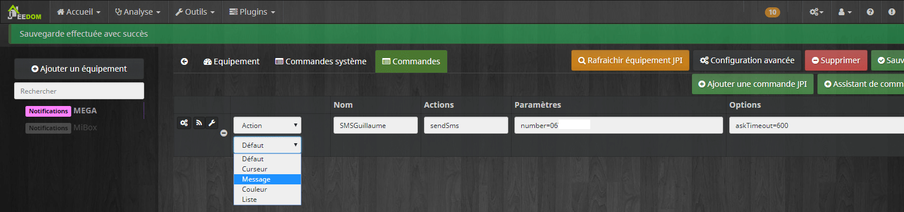

## Utilisation du Plugin Script

Le **plugin** s’installe normalement depuis le **Market**, il est **gratuit**. Une fois installé il suffit de **l’activer**, il n’y a **pas de dépendance** à installer.
L’avantage de ce plugin, c’est qu’il est possible d’aller **plus loin** dans la **configuration** des commandes, mais il n’y a **pas d’assistant**. Il faut **générer** la commande **depuis** l’APK et la **copier** dans une commande **script** du plugin.
Le plugin se trouve dans **Plugin / Programmation/ Script**.

### Ajouter une commande

1.  Cliquer sur **Ajouter**.
2.  Saisir un **nom**.
3.  Cocher les cases « **Activer** » et « **Visible**« .
4.  Choisir un **objet parent**.
5.  Aller dans l’onglet **Commande**.
6.  Cliquer sur **Ajouter une commande script**.
7.  Donner un **nom** à la commande, exemple SMS pour une commande d’envoi de SMS.
8.  Dans type Script, choisir : **HTTP**.
9.  Dans Type, choisir : « **Action** & **Message »**.
10. Aller sur **l’APK** et se **connecter**.
11. Aller dans « **Outils**« , « **Exécuter action / Générer URL**« .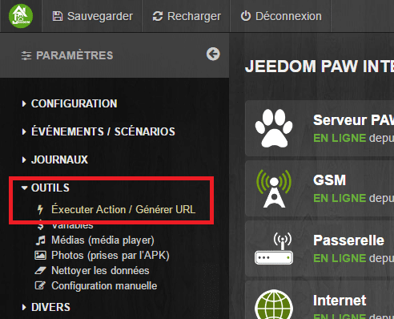
12. Cliquer sur « **Action** » puis aller dans « **Téléphonie**« , « **SendSms**« .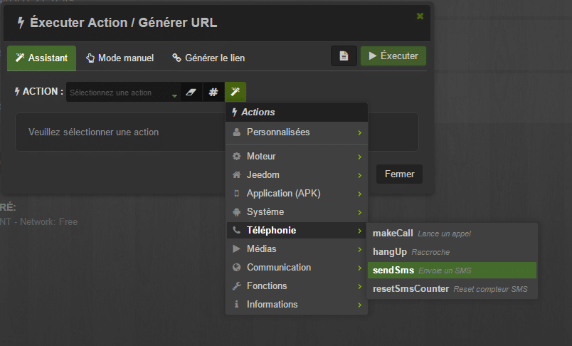
13. Cliquer sur « **Mots clefs**« , puis aller dans « **Personnalisés**« , « **{MY_NUMBER}**« .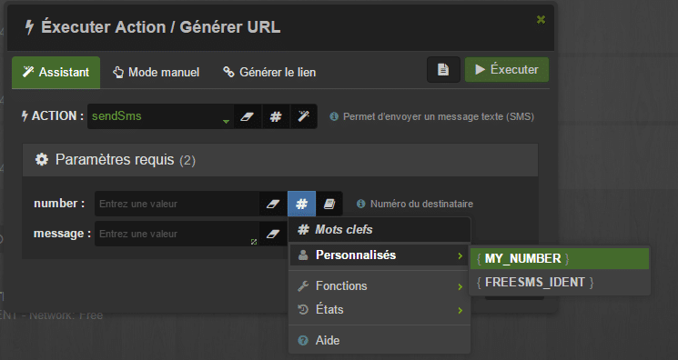
14. Dans la partie « **message** » saisissez ce que vous voulez. (Salut Bob)
15. Cliquer sur « **Générer le lien**« .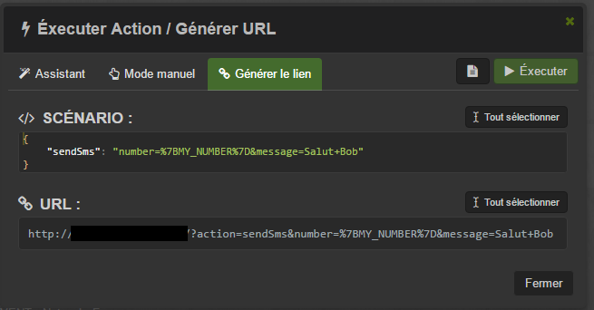
16. Dans la partie « **URL**« , cliquer sur « **Tout sélectionner** » et copier le lien.
17. Retourner dans Jeedom.
18. Dans Requête : **Coller l’URL** générée dans JPI.
19. Remplacer le **message de test** que vous aviez saisi par la variable **#message#.**
20. Dans le champ **TimeOut**, il faut entrer **5** pour ne pas recevoir **plusieurs fois le SMS** et ne pas avoir de message d’erreur.
21. Pensez à **sauvegarder**.

## Conclusion

Voilà donc pour le **principe d’utilisation** de JPI via les **plugins JPI** et **Script** qui ont chacun leurs avantages et inconvénients. Il est possible d’aller encore **plus loin** dans son utilisation avec le **Framework** proposé par dJuL le développeur de l’APK, mais là, il faut vraiment des **connaissances** en programmation. Si cela vous intéresse, je vous laisse consulter le tuto sur le site de dJuL : [http://rulistaff.free.fr/sc/doc/](http://rulistaff.free.fr/sc/doc/).
**L’installation** et la **configuration** de JPI sur un smartphone se fait assez **facilement** si vous suivez bien le tuto.
Le **lien** avec Jeedom **via** le plugin **JPI** ne pose pas trop de problème non plus et si vous voulez **pousser** un peu plus loin **l’utilisation** de JPI, le plugin **Script**, ou encore le **Framework**, sont faits pour vous, mais à condition d’avoir déjà bien **compris** le fonctionnement de **l’application** JPI.
Sachez que **dJuL** pour **l’APK** (l’application installé sur le smartphone) et **Jerome84** pour le **pluginJPI**, sont très à **l’écoute** et **répondent** dès qu’ils le peuvent sur les **forum** dédié [\[JPI-APK android\] Tel Android dedié domotique](https://www.jeedom.com/forum/viewtopic.php?f=27&t=18283&hilit=jpi) et [\[Plugin Tiers\]\[Sujet Principal\] JPI Plugin](https://www.jeedom.com/forum/viewtopic.php?f=141&t=25330&hilit=jpi).
Pour finir, je me permets de vous **rappeler** que les développeurs **travaillent** sur leur **temps libre** pour nous proposer ce genre **d’applications** et **plugins** et que cela représente un travail **énorme** qui n’est **pas rémunéré** de la part de Jeedom. En tant que passionnés ils ont fait le choix de proposer **gratuitement** le fruit de leur travail dans un esprit de **communauté** et de **partage**.
Si vous voulez les **remercier,** les **soutenir,** leur payer un café**,** un Carambar, ou autre, vous pouvez cliquer sur leurs **liens donations Paypal**.

- Pour **Djul** il se trouve dans **JPI** dans le menu « **DIVERS / A propos** » ou vous pouvez aussi cliquer sur ce lien  : 
- Pour **Jérome84** vous pouvez **cliquer** sur ce lien : 

_Sachez que je ne touche évidement rien sur ces dons et qu’il n’y a pas de lien commerciaux sur cet article, mon but étant simplement de **mettre à l’honneur leur travail, merci à eux.**_
