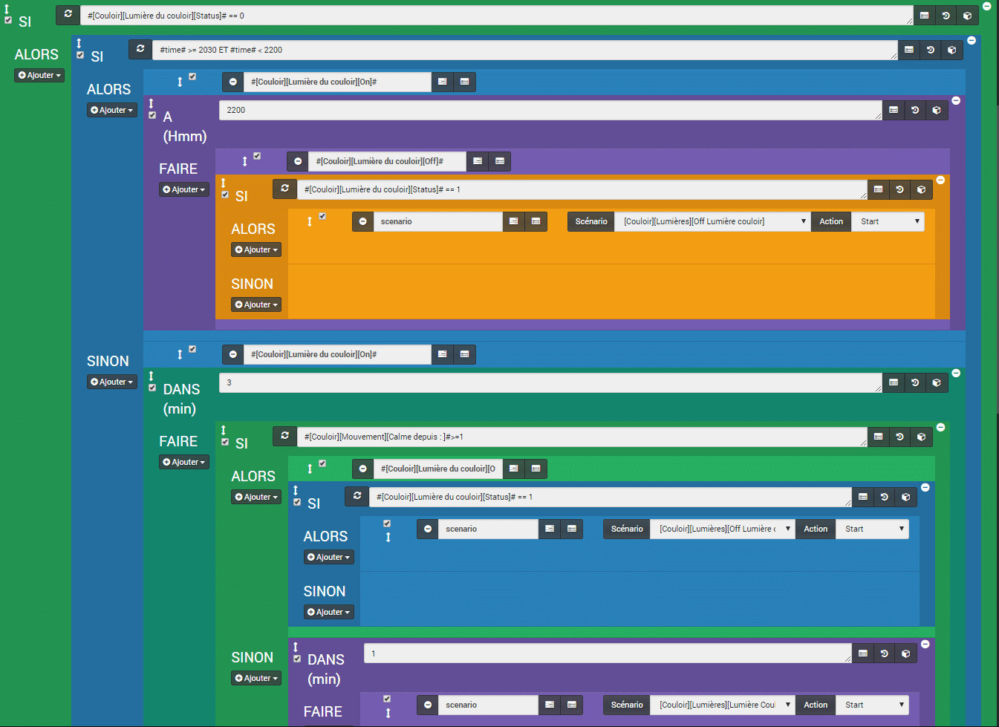
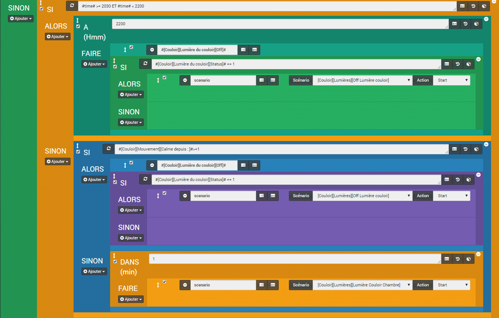
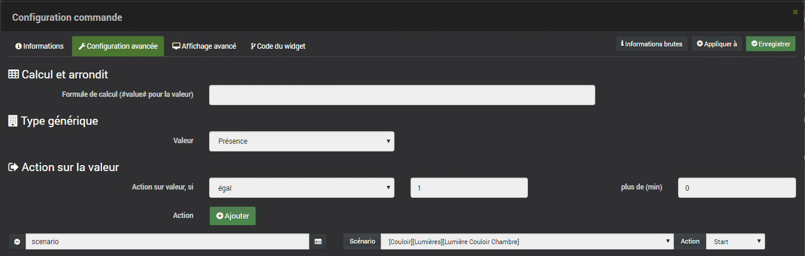

# Lumière automatique sur présence (Corrigé, optimisé)

> Vous avez été **nombreux à lire** les articles concernant l’**allumage de la lumière sur présence** et c’est pour cela que j’ai voulu apporter un **correctif** aux précédentes versions, car elles ne sont **pas optimisées** et peuvent **ralentir votre box Jeedom**.
>
> Pour faire simple, les fonctions **« Sleep » et « Wait »** que j’utilisais, bloquent les scénarios le temps indiqué dans le champ durée, ou  le temps que la condition soit valide. Pendant ce temps le **scénario n’est pas en veille,** mais bien actif et **augmente la charge** du processeur et la mémoire.
>
> Il faut donc, dans la mesure du possible, **utiliser** les fonctions **« Sleep » et « Wait »,** uniquement pour quelques secondes (10sec Max).
>
> Autre défaut, vous ne pouvez **pas voir les logs** si vous arrêtez le scénario pendant le **« Sleep »** **ou le** **« Wait »,** ce qui peut être gênant pour **debugger** votre scénario.

Le scénario utilise le Gateway Xiaomi, un détecteur de mouvement Xiaomi et une prise Xiaomi Plug.

**Le principe :**

- La **lumière** s’allume en **continu** de **20:30 à 22:00,** dès qu’un **mouvement** est détecté.
- En dehors de cette plage horaire, la **lumière** s’allume dès qu’un **mouvement** est détecté et **s’éteint** lorsqu’il n’y a **plus de mouvement,** avec un minimum de **3 minutes** pour éviter que la lumière ne clignote trop.
- Lors des **extinctions,** j’ai ajouté une **double vérification,** car il m’est arrivé que l’**action** « **Off** » ne soit pas reçue correctement par la prise et donc la **lumière** restait **allumée**.



## Mode du scénario = Provoqué.

Le scénario se déclenche sur la détection de mouvement.

Pour cela, on à le « **Old way** » qui consiste à sélectionner la commande dans le scénario :

### Événement : #\[Couloir chambre\]\[Mouvement\]\[status\]

Et on a le « **Good way** » qui consiste à lancer le scénario directement depuis la commande. Cette technique sera à privilégier dans la V3 de Jeedom.

- Aller dans l’**équipement**, cliquer sur la **roue crantée**, aller dans « **Configuration avancée**« .
- Dans « **Action sur la valeur** » choisir « **égal**« , mettre « **1** » en valeur et « **0** » dans « **plus de (min)**« .
- Cliquer sur « **\+ Ajouter**« .
- Saisir « **scenario** » (sans accent) dans le champ.
- Sélectionner le scénario d’**allumage des lumières**.
- Choisir « **Start** » dans action.
- **Sauvegarder**.

Nous avions déjà utilisé cette technique dans l’article [Alertes Monitoring](/articles/jeedom-scenario-alertes-monitoring).

## Création du scénario

## SI #\[Couloir\]\[Lumière du couloir\]\[Status\]# == 0 ALORS

Pour commencer, on vérifie le statu de la lumière est si elle est éteinte, alors :

### SI #time# >= 2030 ET #time# < 2200 ALORS

### #\[Couloir\]\[Lumière du couloir\]\[On\]#

```js
Si on est entre 20:30 et 22:00, alors on allume la lumière.
```

#### A 2200 FAIRE

#### #\[Couloir\]\[Lumière du couloir\]\[Off\]#

On programme l’extinction de la lampe pour 22:00.

#### SI #\[Couloir\]\[Lumière du couloir\]\[Status\]# == 1 ALORS

C’est là que je fais une double vérification. Ceci est facultatif si vous n’avez pas de raté dans l’envoi des actions.

#### Start scénario :\[Couloir\]\[Lumières\]\[Off Lumière couloir\]

Si malgré l’action « **Off** » la lumière est toujours allumée, alors je lance un scénario appelé « **Off Lumière couloir**« 

##### Détail du scénario de verification :

```
SI #[Couloir][Lumière du couloir][Status]# == 1 et #[Couloir][Mouvement][Calme depuis : ]# >= 1 ALORS
   #[Couloir][Lumière du couloir][Off]#
   (sleep) Pause de : 1 seconde
          Start scénario : [Couloir][Lumières][Off Lumière couloir]
SINON
    message : Extinction réussi à formatTime(#time#)
```

```js
Si la lumière est allumée et qu’il n’y a plus de mouvement, alors j’éteins la lumière et je relance le scénario jusqu’à ce que la lumière soit vraiment éteinte.
```

Pour être informé des erreurs, on peut ajouter un message du genre : « **Extinction raté à formatTime(#time#)** » avant l’**action** « **Off** » et « **Extinction réussi à formatTime(#time#)** » après le « **Sinon**« .

### SINON

### #\[Couloir\]\[Lumière du couloir\]\[On\]#

```js
Si on n’est PAS entre 20:30 et 22:00, alors on allume la lumière.
```

#### DANS 3 FAIRE

#### SI #\[Couloir\]\[Mouvement\]\[Calme depuis : \]#>=1 ALORS

#### #\[Couloir\]\[Lumière du couloir\]\[Off\]#

On programme l’extinction de la lampe dans 3 minutes, s’il n’y a pas de mouvement.

##### SI #\[Couloir\]\[Lumière du couloir\]\[Status\]# == 1 ALORS

##### (scenario) start de \[Couloir\]\[Lumières\]\[Off Lumière couloir\]

On relance la verification de l’extinction.(facultatif).

#### SINON

S’il y a un mouvement de détecté :

##### DANS 1 FAIRE

##### (scenario) start de \[Couloir\]\[Lumières\]\[Lumière Couloir Chambre\]

On relance le scénario dans 1 minute, pour refaire les tests.

## SINON

Pour finir, si la **lumière** est **allumée** lorsque le scénario est provoqué par un mouvement avant l’extinction, ou par la fonction start scénario, alors on **refait** les **tests,** mais seulement pour **l’extinction**.

Je ne vous fais pas le détail, car c’est la **même chose** que la première partie, mais **en plus simple** .

### SI #time# >= 2030 ET #time# < 2200 ALORS

#### A 2200 FAIRE

#### #\[Couloir\]\[Lumière du couloir\]\[Off\]#

##### SI #\[Couloir\]\[Lumière du couloir\]\[Status\]# == 1 ALORS

##### (scenario) start de \[Couloir\]\[Lumières\]\[Off Lumière couloir\]

### SINON

#### SI #\[Couloir\]\[Mouvement\]\[Calme depuis : \]#>=1 ALORS

#### #\[Couloir\]\[Lumière du couloir\]\[Off\]#

##### SI #\[Couloir\]\[Lumière du couloir\]\[Status\]# == 1 ALORS

##### (scenario) start de \[Couloir\]\[Lumières\]\[Off Lumière couloir\]

#### SINON

##### DANS 1 FAIRE

##### (scenario) start de \[Couloir\]\[Lumières\]\[Lumière Couloir Chambre\]

## Variations

1.  Pour réduire le nombre de commandes, on peut supprimer les 2 **#\[Couloir\]\[Lumière du couloir\]\[On\]#** et en mettre un seul avant le **SI #time# >= 2030 ET #time# < 2200 ALORS**.
2.  Si vous ne voulez **pas** faire la **verification de l’extinction** via un scénario, si cela suffit, vous pouvez essayer de **rajouter ce code**  :

```
#[Couloir][Lumière du couloir][Off]#
sleep 2
#[Couloir][Lumière du couloir][Off]#
```

## Conclusion

Ce scénario est plus optimisé que les anciens, si vous ne voulez pas refaire tous vos scénarios à cause du « **Sleep** » et du « **Wait** » essayez de les remplacer par les blocs « **Dans** » ou « **A**« .
