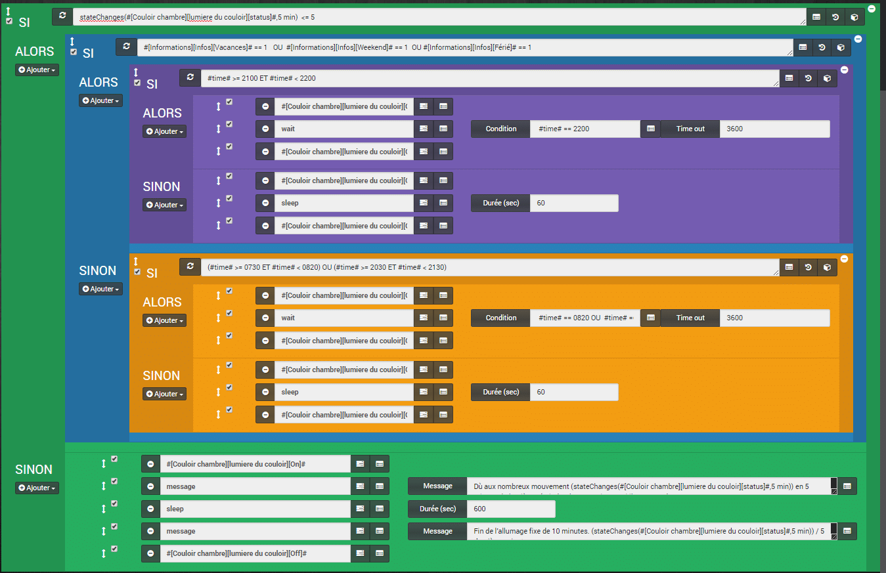
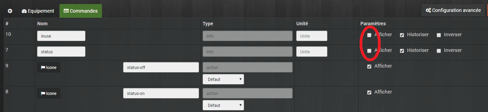
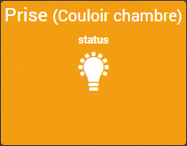

# Lumière automatique sur présence version évoluée

> _**Mise à jour du 08/06/2017 : L’utilisation du Sleep et du Wait dans ce scénario n’est pas optimisé j’ai donc publié une nouvelle version : [Jeedom Scénario – Lumière sur présence (Corrigé, optimisé)](/articles/jeedom-scenario-lumiere-sur-presence-corrige-optimise)**_
>
> Aujourd’hui je vous présente une évolution du scénario « [Jeedom Scénario – Lumière sur présence](/articles/jeedom-scenario-lumiere-sur-presence)« . En plus de s’allumer lorsqu’un mouvement est détecté, dans le couloir des chambres pour ma part, il y a des tests et des actions en plus.

Pour rappel le scénario allume la lumière branchée sur une prise Xiaomi Plug pendant 1 minute, sur la détection d’un mouvement capté par un détecteur de mouvement Xiaomi. Le tout contrôlé par le Gateway géré par Jeedom.

Dans l’ancienne version, la lumière restait allumée de 20:30 à 22:00 dès qu’un mouvement était détecté.

Dans cette évolution du scénario, de nouvelles conditions sont prises en compte :

- S’il y a au-moins 5 changements d’état de la lampe en 5 minutes, quel que soit l’heure de la journée, alors la lumière reste allumée pendant 10 minutes. Le but est d’éviter que la lumière s’allume et s’éteigne sans arrêt, afin d’économiser l’ampoule et éviter de surcharger Jeedom avec des lancements de scénarios en boucle.
- J’ai aussi ajouté un test pour savoir si je suis en période de vacances scolaires, weekend ou jour férié et en fonction de ça, j’adapte les horaires d’allumage fixe. J’utilise pour cela les informations fournies par le plugin « [Informations du jour](https://market.jeedom.fr/index.php?v=d&p=market&type=plugin&plugin_id=dayinfo)« .



**Versions alternatives du scenario :**

- **[Jeedom Scénario – Lumière sur présence](/articles/jeedom-scenario-lumiere-sur-presence)**
- **[Jeedom Scénario – Lumière sur présence (Simplifié)](/articles/jeedom-scenario-lumiere-sur-presence-simplifie)**

## Mode du scénario = Provoqué.

On aura seulement besoin d’un déclenchement sur la détection de mouvement.

_**Evolution** : La programmation à 22:00 a été supprimée, c’est maintenant intégré dans le scénario avec la fonction « **Wait ».**_

### Evènement : #\[Couloir chambre\]\[Mouvement\]\[status\]#

Le scénario se lance dès que le capteur détecte une présence.

## SI stateChanges(#\[Couloir chambre\]\[lumiere du couloir\]\[status\]#,5 min)  <= 5

En premier, on vérifie combien il y a eu de changements d’état de la prise pendant les 5 dernières minutes et s’il n’y en a eu pas plus que 5, alors on rentre dans la boucle.

**_Info_** : La fonction **stateChanges**(commande,\[valeur\], période) renvoie le nombre de changements d’état sur une période donnée qu’il faut saisir sous la forme d’[expression PHP](http://php.net/manual/fr/datetime.formats.relative.php).

### ALORS SI #\[Informations\]\[Infos\]\[Vacances\]# == 1   OU  #\[Informations\]\[Infos\]\[Weekend\]# == 1  OU #\[Informations\]\[Infos\]\[Férié\]# == 1

Ce test récupère les informations fournies par le plugin « [Informations du jour](https://market.jeedom.fr/index.php?v=d&p=market&type=plugin&plugin_id=dayinfo) » afin de savoir si c’est un jour travaillé ou pas. Je pourrais être plus précis à l’aide du plugin [Icalendar,](https://market.jeedom.fr/index.php?v=d&p=market&type=plugin&plugin_id=iCalendar) mais là, c’est surtout pour identifier les jours d’école.

### ALORS SI #time# >= 2100 ET #time# < 2200

Donc, s’il n’y a pas école, on rentre dans la boucle et on vérifie si on est entre 21:00 et 22:00.

### ALORS

```js
Si c’est le cas, alors on lance 3 actions.
```

#### Action 1 : #\[Couloir chambre\]\[lumiere du couloir\]\[On\]#

On allume la lumière.

#### Action 2 : Wait

- **Condition** :  #time# == 2200
- **Time Out** : 3600

L’action « **wait** » permet d’attendre que la condition soit vraie, en l’occurrence que l’heure soit égale à 22:00, avec une attente maximum de 3600 secondes, soit une heure.

_**Evolution** : Cette action remplace la programmation à 22:00 qui était appelée dans le mode du scénario de la version précédente._

#### Action 3 : #\[Couloir chambre\]\[lumière du couloir\]\[Off\]#

On éteint la lumière.

### SINON

#### Action 1 : #\[Couloir chambre\]\[lumière du couloir\]\[On\]#

#### Action 2 : sleep Durée : 60

#### Action 3 : #\[Couloir chambre\]\[lumière du couloir\]\[Off\]#

**\*Evolution** : Dans cette boucle, j’ai remplacé l’action « **dans**« , par une action « **sleep**« , car elle est bloquante et donc le scénario ne peut pas être relancé pendant ce temps-là (60 sec).\* 

### SINON (Voir Code)

```
 SI (#time# >= 0730 ET #time# < 0820) OU (#time# >= 2030 ET #time# < 2130)
  ALORS #[Couloir chambre][lumière du couloir][On]#
 wait #time# == 0820 OU #time# == 2130 [timeout] => 3600
 #[Couloir chambre][lumière du couloir][Off]#
 SINON
  #[Couloir chambre][lumière du couloir][On]#
  (sleep) Pause de : 60
  #[Couloir chambre][lumière du couloir][Off]#
```

Je ne détaille pas, car c’est la même chose que précédemment, sauf que l’on fait un test sur deux plages horaires et donc l’action « **wait** » attend la fin des deux plages horaires.

## SINON

#### Action 1 : #\[Couloir chambre\]\[lumiere du couloir\]\[On\]#

On allume la lumière.

#### Action 2 : message : « Dù aux nombreux mouvement, (stateChanges(#\[Couloir chambre\]\[lumière du couloir\]\[status\]#,5 min)) en 5 minutes la lumière s’éteindra dans 10 minutes si il n’y a pas de nouveaux mouvements. »

On ajoute un message au centre de message de Jeedom pour être prévenu.

#### Action 3 : sleep : 600

On fait une pause de 10 minutes (600 secondes).

#### Action 4 : message : « Fin de l’allumage fixe de 10 minutes. (stateChanges(#\[Couloir chambre\]\[lumière du couloir\]\[status\]#,5 min)) mouv sur les 5 dernières minutes. »

On ajoute un message au centre de message de Jeedom, pour être prévenu que la pause est finie.

#### Action 4 : #\[Couloir chambre\]\[lumière du couloir\]\[Off\]#

On éteint la lumière.

## Affichage dans Jeedom

Pour que l’affichage des tuiles soit correct, il faut faire quelques modifications au niveau des commandes. _(Identique à l’ancienne version)._

### Détecteur de mouvement

Aller dans les réglages du détecteur de mouvement, en cliquant sur la tuile depuis le dashboard, ou dans « **Plugins / Protocole Domotique / Xiaomi Home**« , puis cliquer sur le composant. Sélectionner l’onglet « **Commandes**« .

- Il faut inverser l’icone car lorsqu’il n’y a pas de mouvement, l’icone représente un personnage en mouvement et lorsqu’il y a un mouvement, on a un signe « valider ».


Pas de mouvement


Mouvement détecté

Pour cela, dans le réglage de la commande « **Status**« , il faut cocher « **Inverser**« .


- Maintenant, lorsqu’il n’y a pas de mouvement depuis un certain temps, la commande « **no_motion** » renvoie un temps en secondes, ce qui n’est pas très parlant.

Nous allons ajouter une formule pour convertir les secondes en minutes. Pour cela il faut aller dans les « **Roues crantées** » à coté du bouton « **Test** » de la commande « **no_motion**« , puis dans « **Configuration avancée**« .

Là ajouter « **#value#/60** » dans le champ « **Formule de calcul**« . **Tips** : Vous pouvez appliquer cette formule aux autres capteurs de mouvement, en cliquant sur « **Appliquer à**« .

- Maintenant on a un 3 au lieu de 180.

Pour que se soit un peu plus sympa, on va changer l’unité de mesure, soit les minutes **« (min)** » et on va changer le « **no_motion** » en  par exemple « **Calme depuis :**  » dans les réglages des commandes.


Et voilà : 

\[alert-warning\]Le statu no_motion est incrémenté à 120, 180, 300, 600, 1200 et 1800 secondes, soit un maximum de 30 minutes.\[/alert-warning\]

### La prise ou la lumière

Pour la tuile de la lumière, on peut aussi l’améliorer, pour l’instant elle ressemble à ça :


Pour avoir simplement une tuile, avec le nom de la prise ou de la lampe et un bouton ampoule qui permet de savoir si la lampe est allumée ou pas et le cas échéant, changer le statut en cliquant dessus, il faut :

Aller dans les réglages « **Commandes** » de l’équipement. Décocher les 2 premières cases à cocher « **Afficher**« .



Et voilà :



## Conclusion

Voilà une seconde version du [scénario d’allumage sur présence](/articles/jeedom-scenario-lumiere-sur-presence) qui permet de rendre la gestion plus fine et plus proche des différents besoins. Il est, comme toujours, possible d’ajouter encore des conditions ou de modifier les horaires ou durées d’allumage, mais attention, rappelez vous que les capteurs de mouvements Xiaomi ne renvoient pas d’information de déclenchement avant 1 minute, donc si vous mettez un temps d’attente de 45 secondes, vous allez vous retrouver 15 secondes dans le noir avant que la lumière se déclenche à nouveau.

Retrouvez la liste des plugins, les scénarios, les images et le matériel compatible Jeedom sur la page: [Matériel, Plugin et plus.](/articles)
