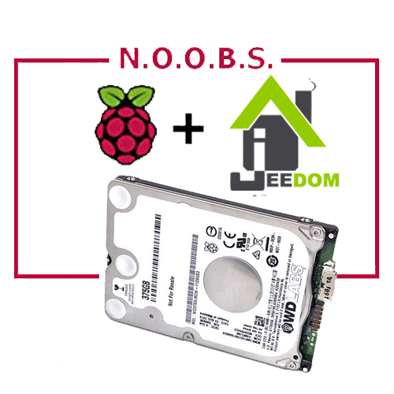
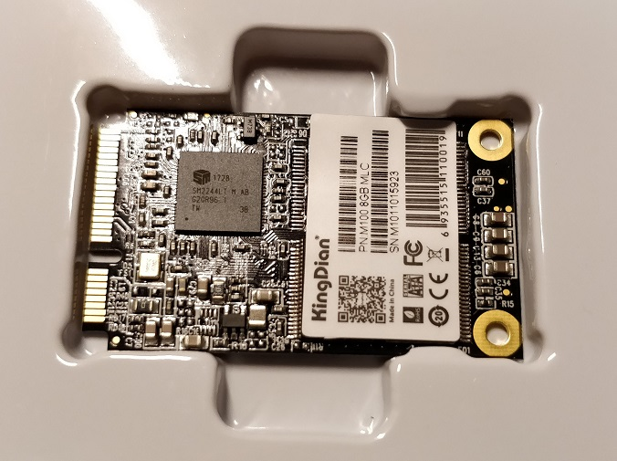
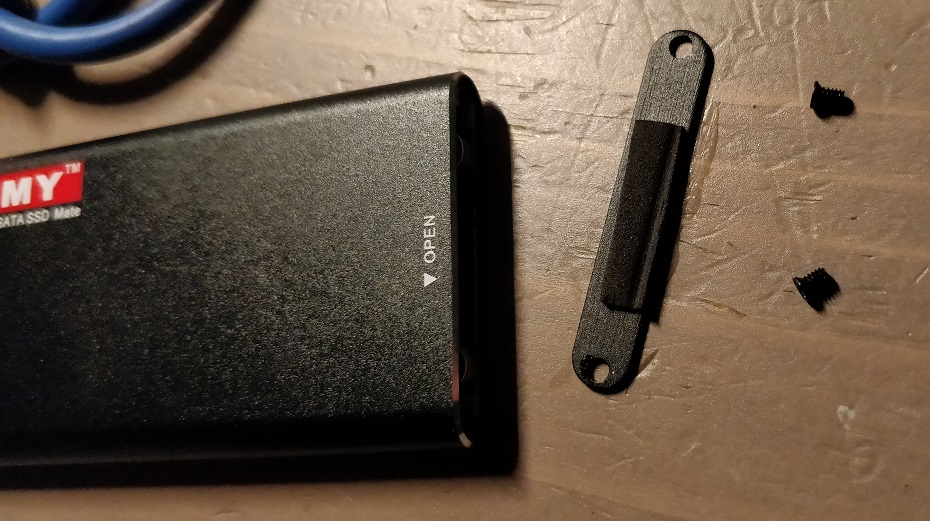
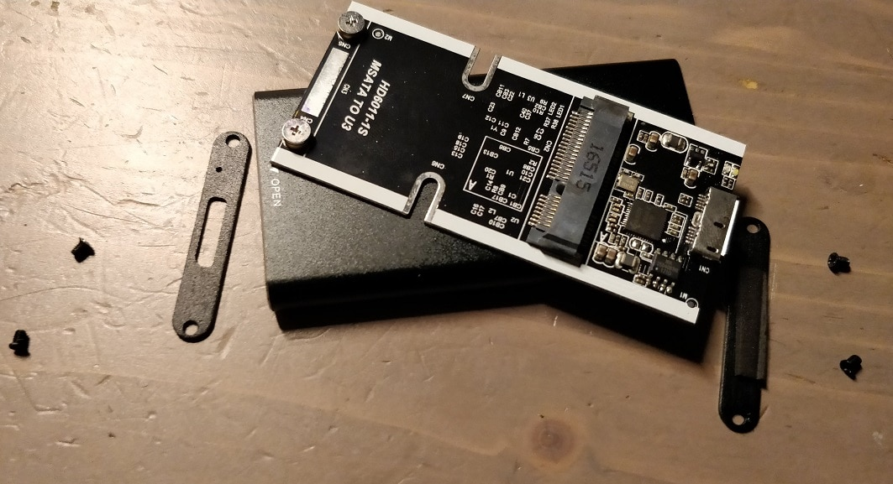
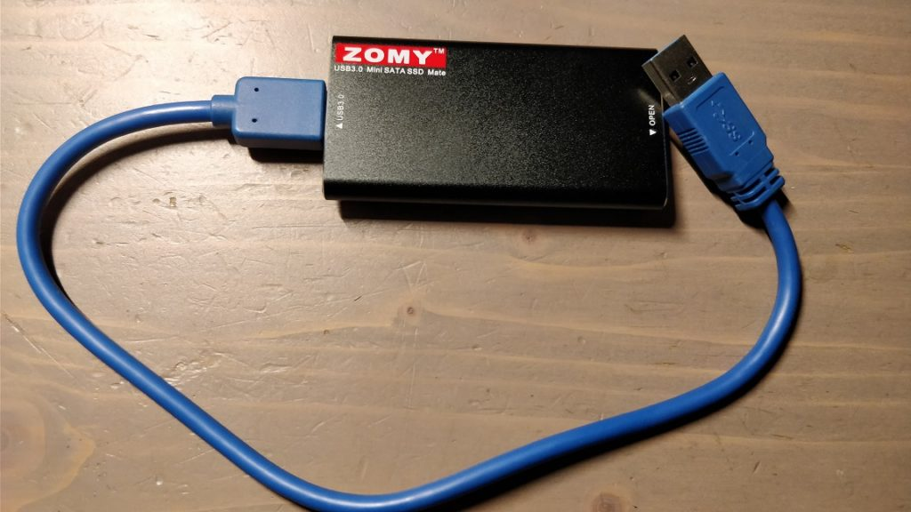
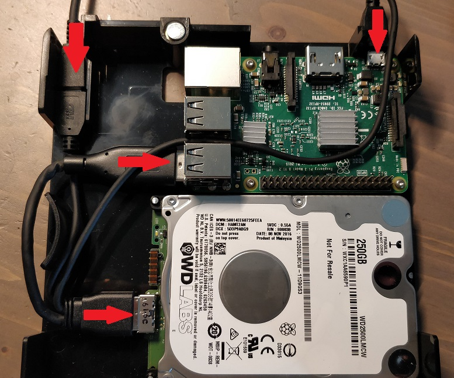
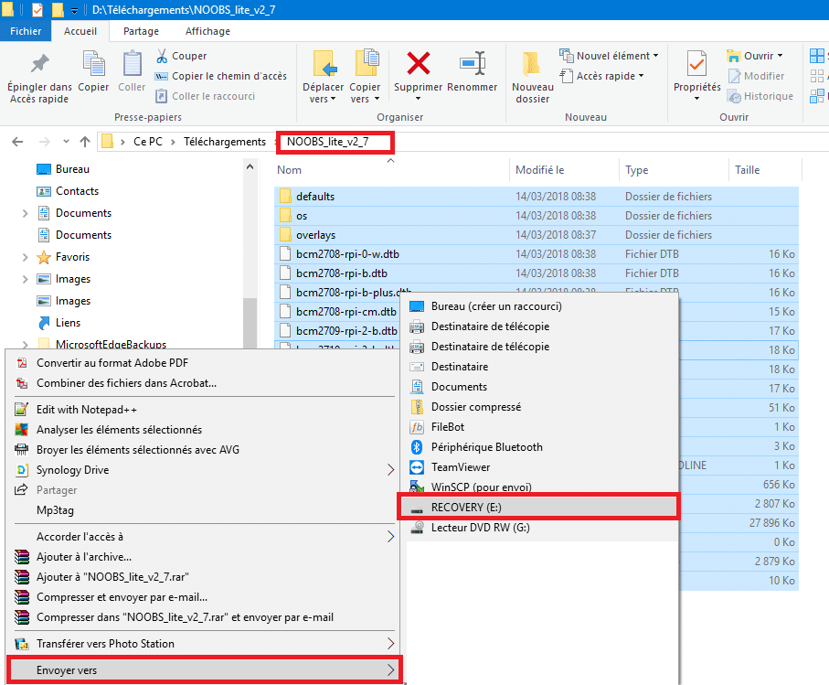
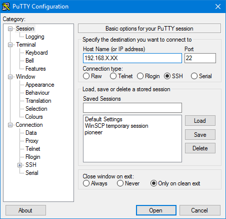
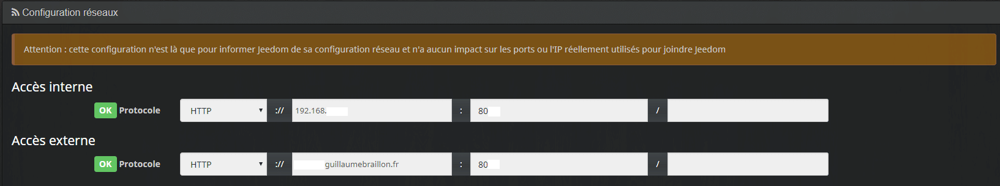

# Jeedom sur Raspberry et disque dur

> Continuons avec les **différentes** façons d’installer **Jeedom.** Aujourd’hui, nous allons voir comment installer simplement **Jeedom sur Raspberry et disque dur,** en utilisant **Noobs**.
> Les **raspberry** ont vraiment beaucoup **d’avantage**, mais aussi un gros **point faible**, les **cartes SD** !!!
> Pour remédier à ce problème, l’utilisation de **disques durs** type **SSD** ou **mécaniques** comme le Pi-drive sont la solution **idéale**.
> Le but est d’installer **Raspbian** et **Jeedom** sur le **disque dur** et non sur la carte SD. Pour faire cela il existe **plusieurs** solutions, pas toujours faciles à mettre en place, mais grâce à **Noobs** tout devient plus simple.
> Les seules **contraintes** supplémentaires, sont de **brancher** le Raspberry à un **écran** (HDMI) avec **clavier** et **souris** (USB) pour l’installation.
> Niveau **matériel**, il faudra bien penser à avoir un **adaptateur secteur** **puissant.** Je vous conseille d’investir dans une alimentation d’au **minimum 3A 5V**.

## Installation du disque dur

Le raspberry supporte les **disques dur SSD** et les **disques dur mécaniques.** Le principe **d’installation** des **logiciels** est le même, mais pour la partie matériel il y a quelques **différences** que nous allons voir.

### **Jeedom sur Raspberry et disque dur** SSD Msata USB

Pour ce premier exemple j’ai utilisé un **disque dur SSD** au format **mSata** de seulement **8Go**, ce qui est suffisant pour installer **Jeedom.** Avec un disque de 16 Go, vous serez large. Le format **Msata** (mini-SATA) est plus petit que le SATA, mais offre les **mêmes** performances. Il est destiné aux ordinateur **portables** et **moins** gourmand en **énergie**.

- _**Le disque dur KingDian M100 SSD 8GB est à 11,06 € chez Gearbest.**_

_**KingDian M100 SSD 8GB**_

Le disque dur arrive « nu » il faudra donc lui ajouter un adaptateur Msata pour le relier au Raspberry.

Le raspberry n’ayant **pas de port Msata**, il va falloir ajouter un **adaptateur** qui peut se présenter sous la forme d’une **carte d’extension**, ou d’un **boitier externe USB.**
C’est cette dernière solution que j’ai retenu pour sa **facilité** d’utilisation.

- **Boitier externe ZOMY SSD mSATA vers USB 3.0 à 6,**_**66 €.**_

 
Pour **installer** le **disque dur** dans son **boitier** **externe**, il n’y a rien de compliqué :

- **Enlever les vis** se trouvant sur le coté du boitier indiqué par la mention « **Open**« .
- **Glisser le disque dur** jusqu’au clic indiquant qu’il est connecté.
- **Refermer** le boitier à l’aide des vis.
- **Brancher** le câble USB fournis.

Le boitier ouvert grâce aux vis sur le coté « Open ».

A titre d’info, à l’intérieur il y a une carte d’extension sur laquelle le disque se fixe. (Il n’est pas utile de la sortir pour l’installation.)

Une fois refermé, il suffit de brancher le câble USB.

_**Info : Concernant le câble USB, il faut savoir que le Raspberry est en USB 2 et il arrive que certains câbles USB 3 posent problème pour la liaison. N’hésitez pas à changer le câble en cas de soucis.**_
Voila comment ont a un **disque dur SSD externe en USB** pour seulement **17.72 €** avec **Gearbest.** Mais si vous êtes dans **l’urgence**, ou que vous avec des **réticences** à acheter sur des sites chinois, vous trouverez des **équivalents** sur **Amazon**, mais pas au même prix.

- [SSD mSATA vers USB](https://www.amazon.fr/gp/aw/d/B01FU1H6L4?&tag=guilbraimespa-21)
- [Disque SSD externe](https://www.amazon.fr/gp/aw/d/B06XCND4YT?&tag=guilbraimespa-21)
- [Boitier USB 3.0](https://www.amazon.fr/gp/aw/d/B01K7KY7U6?&tag=guilbraimespa-21)
  Pour ceux qui préféreraient avoir une **carte d’extension Msata** en remplacement du boitier externe USB, voila quelques exemples :
- [Carte d’extension mSATA](https://www.amazon.fr/gp/aw/d/B072JYT6T3?&tag=guilbraimespa-21)
- [Adaptateur SATA vers USB](https://www.amazon.fr/gp/aw/d/B074277VYJ?&tag=guilbraimespa-21)
- [Boitier disque dur externe](https://www.amazon.fr/gp/aw/d/B073W7SVC2?&tag=guilbraimespa-21)
  Pensez aussi à acheter un **adaptateur secteur** suffisamment **puissant** pour pouvoir alimenter le **raspberry** et le **disque dur** externe.
- [Alimentation Raspberry Pi](https://www.amazon.fr/gp/aw/d/B01566WOAG?&tag=guilbraimespa-21)
- [Adaptateur secteur USB-C](https://www.amazon.fr/gp/aw/d/B0768XFP9X?&tag=guilbraimespa-21)
- [Câble alimentation](https://www.amazon.fr/gp/aw/d/B01M58O9M9?&tag=guilbraimespa-21)

### **Jeedom sur Raspberry et** disque dur mécanique (PiDrive)

Après le SSD, rien ne vous empêche d’installer Jeedom sur un disque dur dit « mécanique ».
_Personnellement j’ai profité des [dernières offres sur les Pi-Drive](https://www.wdc.com/fr-fr/products/wdlabs.html) avant que WDLabs de Western Digital ait décidé d’arrêter la production._

**_Info : Il reste encore quelques [produits en stocks limités](https://www.wdc.com/fr-fr/products/wdlabs.html), donc, n’hésitez pas à en profiter aussi bien pour les disques Pi drive que pour les boitier, les alimentations et les câbles Pi Drive dédiés._**

- **Disque dur PiDrive Foundation Edition avec Boîtier PiDrive 6×6 et Cable PiDrive.**

Pour une **trentaine d’euros**, on se retrouve avec un ensemble sympa et bien pensé. Il est possible de **brancher** un disque dur **SSD** à la place du Pidrive en utilisant le **câble fournis** qui est très pratique.

L’alimentation se branche en haut à gauche sur le câble Pi Drive qui alimente électriquement le disque dur et le Raspberry, puis une prise USB permet de connecter le disque dur au Raspberry.

 
Il est possible de trouver des **disques durs** et des **boîtiers** se rapprochant de ceux proposés par WDLabs, sur **Amazon**.

- [Disque dur externe SSD](https://www.amazon.fr/gp/aw/d/B077S5G7ZT?&tag=guilbraimespa-21)
- [Boîtier disque dur USB](https://www.amazon.fr/gp/aw/d/B011M8YACM?&tag=guilbraimespa-21)
- [Adaptateur USB 3.0](https://www.amazon.fr/gp/aw/d/B019WAWYH0?&tag=guilbraimespa-21)
  Il faut que le **disque dur SSD** soit prévu pour être **alimenté via USB**, car il faut pouvoir alimenter le **disque dur** et le **raspberry** avec le **même** adaptateur secteur.
  Sinon, il est possible d’avoir **un adaptateur secteur** pour le **disque dur** et **un** pour le **raspberry,** mais c’est moins pratique.
  [[**Voir le produit sur Amazon**](https://www.amazon.fr/dp/B01CD5VC92?tag=guilbraimespa-21)

## Installation de noobs

Pour installer **Raspbian** sur le disque dur et non sur la carte **MicroSD**, nous allons utiliser Noobs.
**Noobs** :  **N**ew **O**ut **O**f **B**ox **S**oftware est un gestionnaire **d’installation** de **système d’exploitation** pour le **Raspberry** Pi.
Il permet entre autre d’installer facilement :

- [Raspbian](http://raspbian.org/)
- [LibreELEC](https://libreelec.tv/)
- [OSMC](https://osmc.tv/)
- [Recalbox](https://www.recalbox.com/)
- [Lakka](http://www.lakka.tv/)
- [RISC OS](https://www.riscosopen.org/wiki/documentation/show/Welcome%20to%20RISC%20OS%20Pi)
- [Screenly OSE](https://www.screenly.io/ose/)
- [Windows 10 IoT Core](https://developer.microsoft.com/en-us/windows/iot)
- [TLXOS](https://thinlinx.com/)

Pour plus d’information je vous invite à **visiter la page officielle** sur le site : [https://www.raspberrypi.org/](https://www.raspberrypi.org/documentation/installation/noobs.md)
_Info : Vous pouvez acheter un **carte SD avec Noobs déjà installé**, mais je trouve que ce n’est pas très rentable. Dans ce cas assurez vous que vous avez bien **Raspbian en version STRETCH**._

### Récupérer Noobs avec Raspbian

Avant de commencer, il faut **récupérer** Noobs sur [Raspberrypi.org](https://www.raspberrypi.org/downloads/noobs/).
Deux versions sont disponibles :

- Noobs
- **NOOBS LITE**

C’est cette dernière qui nous intéresse, car elle est plus **légère**, mais **nécessite** de connecter votre Raspberry à **internet** via Ethernet ou Wifi. Si ce n’est pas possible télécharger la version complète.
Le **téléchargement** de la version lite est rapide car elle ne pèse que **33 Mo**. Une fois le téléchargement terminé, **dé-zipper le fichier** sur votre disque dur.

### Installer Noobs sur carte SD

Pour installer **Noobs,** il va falloir un **logiciel** qui permet de formater la carte SD en FAT32. Pour cela on va utiliser **[SDFormat](https://www.sdcard.org/downloads/formatter_4/index.html)**, son **utilisation** est des plus **simples**.
**ATTENTION !** *Il faut que la **carte SD soit formatée en FAT32**. Il faut donc une **carte de moins de 64 Gb**.*
_Pour info : Noobs n’est pas lourd du tout c’est l’occasion de **recycler une vielle carte** de 4 Go si vous en avez une qui traîne. Regardez dans vos vieux smartphones._

1.  Cliquer sur ce lien : **[SDFormat](https://www.sdcard.org/downloads/formatter_4/index.html)**.
2.  Aller en **bas de la page** et **télécharger** la version pour **PC ou MAC.**
3.  Une fois **téléchargé**, double-cliquer sur le fichier pour **l’installer** et **l’ouvrir**.
4.  Dans « **Drive**« , sélectionner le lecteur de **carte SD** sur lequel vous voulez installer Noobs.
    **ATTENTION !** ***Ne vous trompez par de lecteur car toutes les données vont être effacées.***
5.  Cliquer sur « **Format**« .
6.  A la fin du formatage, un **message** vous prévient que c’est **fini**.
7.  Pour terminer, il suffit de **copier les fichiers de Noobs,** précédemment **dé-zippés,** directement sur la carte SD.

Vous pouvez sélectionner les fichiers et faire « Envoyer vers > » la carte SD « RECOVERY (E:) » sur l’image.

## Installation de Raspbian

Vous pouvez maintenant **insérer la carte SD** dans votre [**Raspberry**](http://amzn.to/2eEGYAO) Pi et connecter :

- Le **disque dur**.
- Un **écran.**
- Un **clavier.**
- Une **souris**.
- L’**adaptateur secteur**.

Une fois tout ce petit monde connecté, **allumez** votre Raspberry en **branchant** l’adaptateur secteur.

- Si vous n’avez **pas branché de câble ethernet**, vous allez avoir un message **« no network access »**.
- **Sélectionner** votre **wifi**. (Attention le clavier numérique est désactivé)
- Une fois connecté au wifi, **sélectionner Raspbian Lite**.
- Dans **« Destination drive »** en bas, choisir **« SDA elements »**.
- Dans **« langue »** choisir **« français »**.
- **Cliquer** en haut à gauche sur **« Installer »**.
- **Cliquer** sur **« oui »** à l’avertissement d’effacement des données.
- **Attendre** la fin de l’installation. Environ 5 minutes.
- **Cliquer** sur **« OK »**.
- Le Raspberry **redémarre** sur Raspbian.

### Configuration de Raspbian

- Se **connecter** avec l’utilisateur **« pi »** et le mot de passe **« raspberry »**.
- **Saisir** : « `sudo raspi-config"`.
  - Pour se déplacer, utiliser les **flèches** et la touche **tabulation** (↹) du clavier.
- **Choix 1 :** « Change User Password »
  - Saisir **2 fois** le mot de passe. _(Il ne s’affiche pas)._
- **Choix 4 :** « Localisation Options »
  - Change locale :
    - Choisir : **fr_FR.UTF-8 UTF-8**.
    - Choisir : **fr_FR.UTF-8**
  - Change Timezone :
    - **Europe**.
    - **Paris**.
  - Change wifi Country :
    - **FR France**.
- **Choix 5 :** « Interfacing Options ».
  - P2 SSH.
    - Répondre **« oui »** à la question :Would you like the SSH server to be enabled? » _(« Voulez-vous activer le serveur SSH ? »)_.

Le **SSH** permet de se **connecter** à votre **Raspberry Pi** depuis un autre **ordinateur** et ainsi de s’affranchir de l’écran, du clavier et de la souris.

- **Retournez** sur la **première page** en sélectionnant <Back>.
- **Sélectionner** <Finish>.
- **Taper** `sudo halt`.
- **Attendre** quelques secondes que le raspberry soit arrêté.

Maintenant que le **SSH est activé** on peut se **connecter sur le raspberry** depuis un **autre** ordinateur, vous pouvez donc **débrancher** l’écran, le clavier, la souris et **placer** votre **Raspberry** à son **emplacement** définitif si ce n’est pas déjà le cas**.**

### Connexion en SSH

_(A partir de là, l’installation est presque identique à l’article [Installation de Raspbian et Jeedom sur Raspberry](/articles/installation-de-raspbian-et-jeedom-sur-raspberry))._
Pour se **connecter** en **SSH**, il faut **installer** un **client** sur votre **ordinateur**, comme par exemple **Putty** ou **WinSCP.**
On va utiliser **Putty** qui est téléchargeable gratuitement ici : [Putty](https://www.chiark.greenend.org.uk/~sgtatham/putty/latest.html).

- Installer et ouvrir **Putty**.
- Saisir l’adresse **IP** du **Raspberry Pi**. _Pour trouver l’adresse IP de votre Raspberry Pi sur **Freebox Revolution** (V6) c’est par [la](/articles/installation-de-jeedom-netinstall-sur-raspberry-3#Trouver_Ladresse_IP_de_votre_Raspberry_Pi_sur_Freebox_Revolution) et sur **Livebox** c’est par [la](/articles/installation-de-raspbian-et-jeedom-sur-raspberry)._
- Sélectionner **SSH** et port **22**.
- Cliquer sur « **Open**« .

- Une fenêtre **noire** va s’ouvrir avec écrit « **login as:**« , vous êtes **connecté** en **SSH**, il ne reste plus qu’a **s’authentifier**.
- On se **logue** avec l’utilisateur : **pi**.
- Le **mot de passe** : par défaut **raspberry** mais normalement vous l’avez **changé** à l’étape [précédente](#configuration-de-raspbian).

### Désactiver le wifi du Raspberry

Dans la **majeur partie** des cas vous allez utiliser **Jeedom** en **ethernet** et c’est largement **conseillé** pour des question de **performances.** Du coup il peut être utile de **désactiver** le **wifi** si vous l’avez **activé** lors de l’installation de **Noobs**.

- Taper : `sudo iwconfig wlan0 txpower off`

### Donner les droits Root en SSH

Sous **Linux** l’utilisateur **Root** c’est l’équivalent de **l’administrateur** sous Windows.

- **Taper** : `sudo nano /etc/ssh/sshd_config`
- **Chercher**, à l’aide des **flèches**, la ligne : `PermitRootLogin without-password`
- **Changer** la **ligne** en : `PermitRootLogin yes` *en supprimant le # au debut de la ligne.*
- **Fermer** (ctrl + X).
- **Sauvegarder** (Y) et **Valider**
- **Taper** : `sudo /etc/init.d/ssh restart`

Pour info : Là, on s’est **connecté** avec **l’utilisateur** de base (pi), on a **ouvert** le **fichier** de configuration **« sshd_config »**, on a **autorisé** la connexion **root** en **SSH** et on a **enregistré** notre **fichier** avant de **relancer** le **SSH**, pour que la nouvelle configuration soit prise en compte.

### Changer le mot de passe root

Niveau passoire et sécurité, on est pas mal !!! Du coup, on va **créer** (changer) le **mot de passe Root**.

- **Taper** : `sudo passwd root`
- **Saisir** le **mot de passe** de votre choix, **2 fois**.
- **Taper** : `Exit`
- **Taper** : `logout`
- Relancer Putty.
- On se **logue** maintenant avec l’utilisateur : **Root**.
- Le **mot de passe** : Celui que vous venez de taper 2 fois 🙂

### Mise à jour du firmware **du RaspberryPi.**

- **Taper :** `apt-get install rpi-update`
- **Taper :** `rpi-update`
- **Taper :** `reboot`

_Plus d’info sur la mise à jour du firmware : [https://github.com/Hexxeh/rpi-update](https://github.com/Hexxeh/rpi-update)_

### Mise à jour de Raspbian

Cette **étape** est **facultative**, car **Jeedom** va le faire lors de **l’installation**. Mais si vous voulez faire les **mises à jour manuellement**, il faut :

- **Taper** : `apt-get update && apt-get -y dist-upgrade && apt-get -y upgrade`
- **Patienter**…
- C’est prêt !

## Installation de Jeedom.

Pour rappel, on est **toujours** dans **Putty**, connecté avec l’utilisateur **Root**.

- **Taper** : `wget https://raw.githubusercontent.com/jeedom/core/stable/install/install.sh`
- **Valider**. (Entrer)
- **Taper** : `chmod +x install.sh`
- **Valider**. (Entrer)
- **Taper** : `./install.sh`
- L’installation est **finie** lorsque vous avez le **message** suivant :
  - `step_11_jeedom_check success``/!\ IMPORTANT /!\ Root MySql password is abcdef0123456``Installation completed, a system reboot should be performed`
- Pour **rebooter** taper : **`Reboot`**.
- Vous pouvez **fermer** **Putty**.

[Doc officielle](https://jeedom.github.io/documentation/installation/fr_FR/#_autre_diy) de Jeedom si besoin.
**L’installation** peut **prendre** du **temps** en fonction de votre connexion internet.
Pour vous **connecter** à **Jeedom,** il suffit de saisir l’adresse **IP** du Raspberry Pi dans un **navigateur** Web et de vous **connecter** avec l’utilisateur « **Admin** » et le mot de passe « **Admin**« .
_Info : Depuis la version 3.2 de Jeedom **« On ne peut plus se connecter avec les identifiants par défaut (admin/admin) à distance, seul le réseau local est autorisé. »**_

### Désactiver l’administrateur de Jeedom

Je vous conseille de **changer** le **mot de passe Admin et même de le désactiver**.

- Cliquer sur les **roues dentés** et aller dans « **Utilisateurs**« .
- Dans la zone « **Action**« , cliquer sur « **Mot de passe**« .
- **Attention !!!** il n’y a **pas** de **confirmation** lors de la saisie, par contre le **mot de passe** est **visible**.
- Créer un **nouvel** **utilisateur** et **désactiver** l’utilisateur « **Admin**« . (Fortement conseillé.)

### Configuration Réseau

Certains plugins ont besoin que la **configuration** **réseau** soit bien **paramétrée**

- **Aller dans** : Roue crantée / Configuration / Configuration réseaux.
- **Saisir** l’adresse **IP** ou l’Url **locale** de votre Raspberry Pi dans : « **Accès interne**« . Exemple : 192.168.1.1
- **Saisir** le **port** HTTP qui est par défaut **80**.
- **Saisir** l’adresse **IP** ou l’Url **extérieure** de votre Raspberry Pi dans : « **Accès externe**« . Exemple : 84.125.126.24
- **Saisir** le **port** HTTP qui est par défaut **80**.

## Conclusion
