# Lampe de Bureau Xiaomi Mijia Desk Lamp

> Après la [**lampe de chevet** (Bedside Lamp)](/articles/lampe-de-chevet-xiaomi-yeelight), puis les **[ampoules connectées](/articles/ampoules-connectees-couleur-et-blanc-xiaomi-yeelight)**, voilà maintenant la **lampe de bureau (Desk Lamp)** de chez **Xiaomi** bien sûr !
>
> Cette lampe Wifi peut être **contrôlée** via l’application **Mi-home** que nous connaissons bien, avec les produits Xiaomi smart home, ou avec l’application dédié Yeelight, mais surtout en **local**, avec le **bouton** sur le pied de la lampe.
>
> Grâce au **plugin** Xiaomi disponible sur le market, elle est intégrable à **Jeedom.**
>
> **A noter** : Elle doit être **connectée** au réseau **wifi** de votre logement pour **fonctionner,** par contre, elle n’a **pas** besoin de la **gateway** Xiaomi.

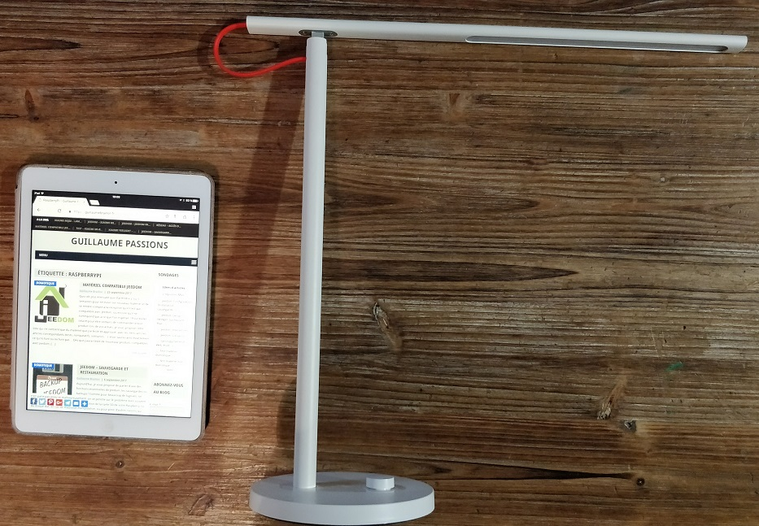

## Présentation

La lampe de bureau est très **fine** et de **bonne qualité**. Je trouve que le câble rouge qui relie les 2 parties de la lampe n’est **pas** des plus **élégant** et elle est plus **grande** que ce que je pensais.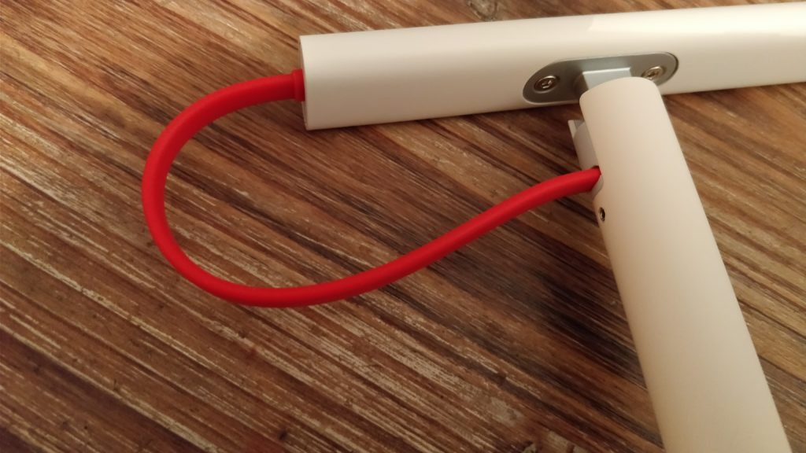

La prise n’est pas au **format européen**. Il faudra donc un **adaptateur** secteur de ce type : [Adaptateurs secteur prise électrique US Chine vers Europe France](http://amzn.to/2zSAovY)

[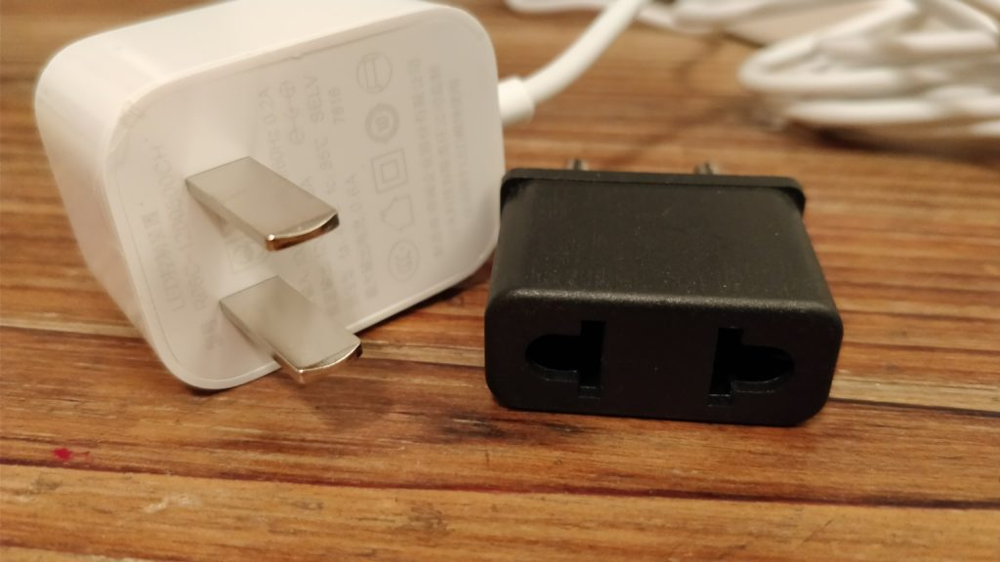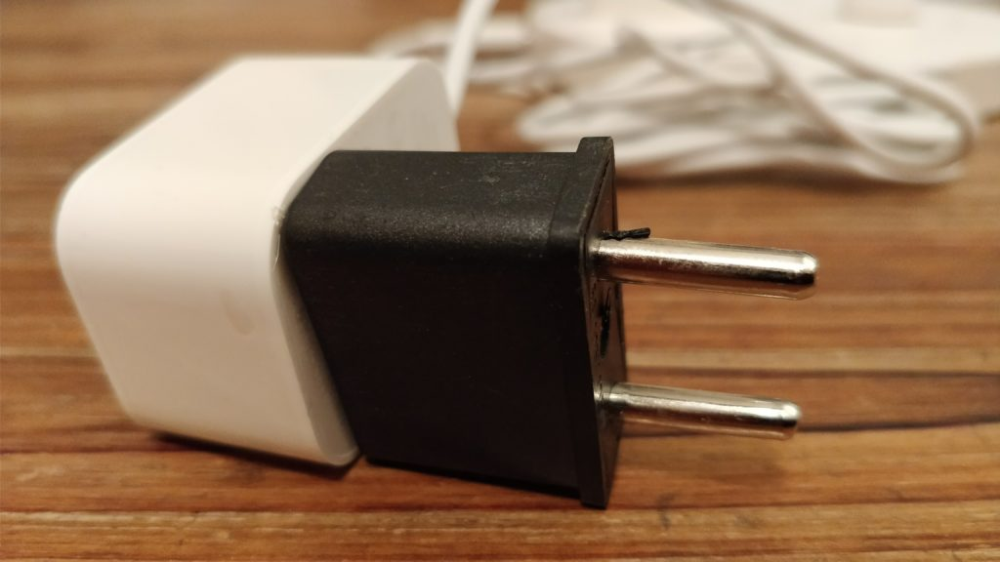](http://amzn.to/2zSAovY)

Le bouton sur le **socle** est très pratique. Il permet **d’allumer** la lampe avec un clique, de **régler la luminosité** en tournant le bouton, de **régler la température des blancs** en appuyant et en tournant le bouton. Pour finir, le double clique sur le bouton, permet de **lancer une scène** qui aura été prédéfinie via l’application.

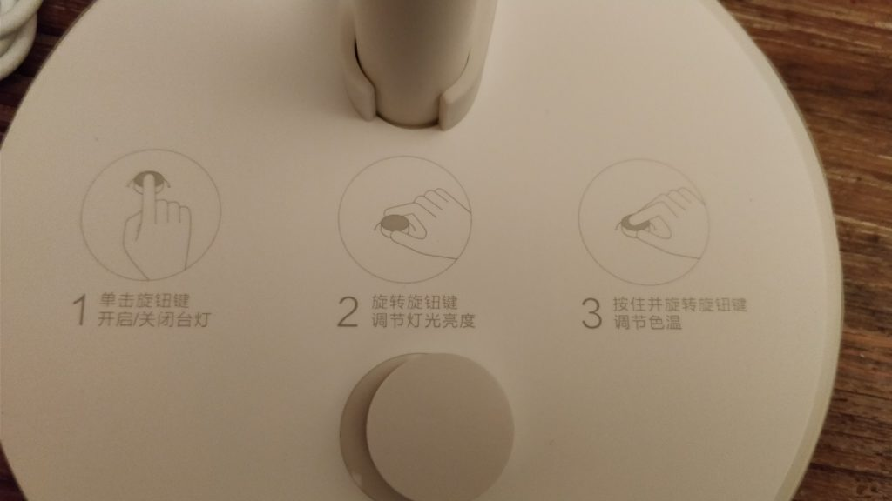

Dessins explicatif à retirer sur le socle.

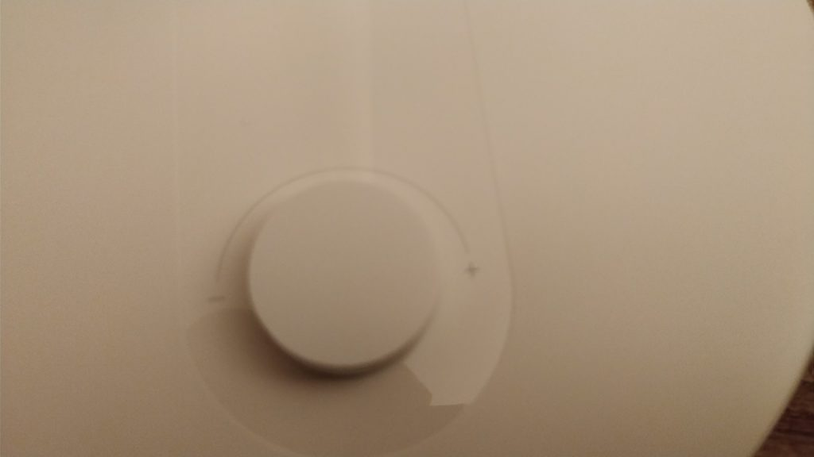

**L’application** permet de **choisir** parmi des **scènes** pré-enregistrées :

- **Mode Focus** : Il est possible de définir un « **temps de travail** » et une « **période de repos**« , la lampe clignotera au moment de se reposer afin d’améliorer l’efficacité du travail et de réduire la fatigue oculaire.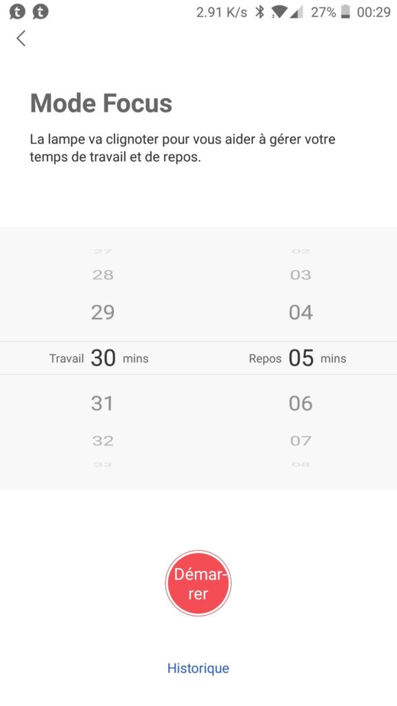
- **Mode lecture** : La lampe se règle sur une température de blanc plus neutre (4000K) et une luminosité à 100%, ce qui permet d’**améliorer l’attention des lecteurs**, ainsi que de prolonger le temps de lecture sans se fatiguer.
- **Mode PC** : La lumière bleue des ordinateurs peut être dommageable pour les yeux. Avec une temperature à 2700K  la proportion de **lumière bleue** des écrans d’ordinateur est réduite.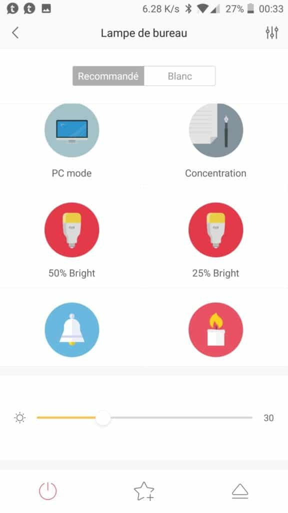
- **Mode enfant** : Puisque les yeux des enfants ne se sont pas encore complètement développés, ils peuvent facilement être blessés. La lampe de bureau a passé la certification de sécurité biologique pour répondre aux dernières normes de sécurité, **protéger les enfants**.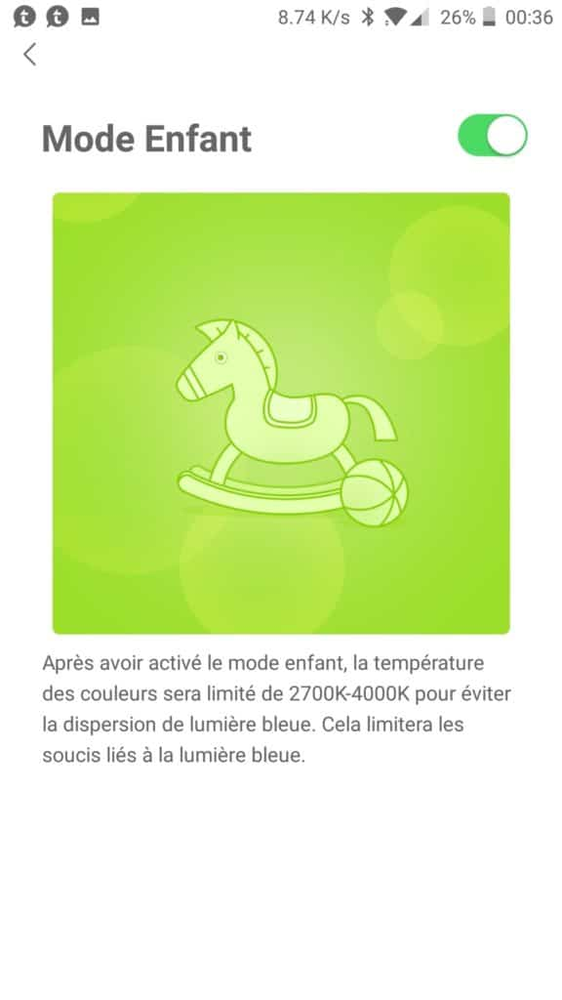

_**Quelques informations techniques pour les puristes :**_

- **Entrée** : AC 100 – 240V, 50 / 60Hz, 0.2A
- **Plage de température de couleur** : 2700 – 6500K
- **Gamme de luminosité** : 1 -100pct
- **Indice de rendu des couleurs** : 83
- **Durée de vie** : 25000h
- **Connexion sans fil** : Wi-Fi IEEE 802.11 b / g / n 2,4 GHz
- **Système d’application** : iOS 7.0 ou supérieur, Android 4.0 ou supérieur

## Où acheter la lampe de bureau Xiaomi Desk Lamp ?

Vous pouvez trouver la lampe de bureau Xiaomi Desk Lamp sur [**Amazon** à 80 €](http://amzn.to/2zanFb9) et **Gearbest** à 33€.

## Jeedom

La lampe de bureau n’a **pas** besoin de la **Gateway** pour fonctionner, car elle est en Wifi et c’est via le plugin **Xiaomi Home** (6€) créé par [Lunarok](https://lunarok-domotique.com/) et [Sarakha63](http://sarakha63-domotique.fr/) que vous pourrez la contrôler depuis Jeedom.

Il faut, dans un premier temps, **activer** le **mode** **développeur** dans l’application **Yeelight.** Ce n’est **pas possible avec l’application Mi-Home**.

- **Cliquer sur :** Flèche en bas à droite.
- **Sélectionner** : « Contrôle sur réseau local » et activer l’option.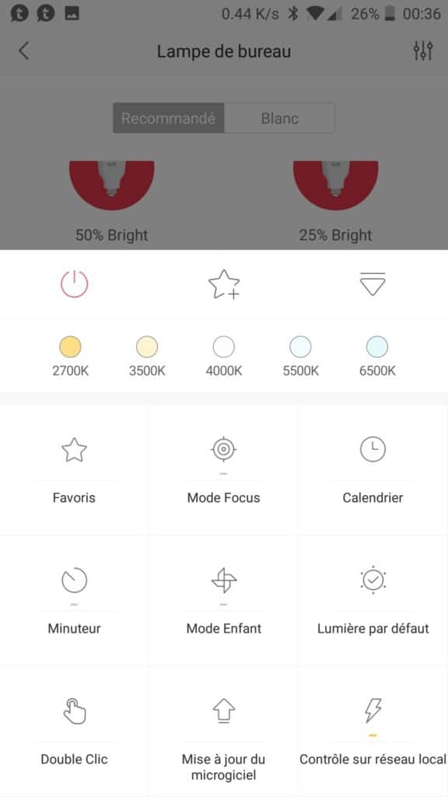
- **Aller dans** : Plugin Xiaomi Home, cliquer sur « **Scan Yeelight**« .

- **Aller dans** : Mes Yeelight et votre ampoule devrait apparaître, cliquer dessus pour plus de réglages.

N’hésitez pas à **éteindre** et **allumer** **l’ampoule** via **l’application,** pour **forcer** un peu la main à **Jeedom**.

_Personnellement la lampe **n’a pas été détectée !** Du coup, je l’ai créée manuellement en saisissant son IP._

### Contrôle de la lampe

Il est possible de **contrôler** les ampoules via les **dashboard** et via les **scénarios**.

Les commandes sur le **dashboard** sont **paramétrables** via l’onglet **commande** de l’ampoule. Il y a **2 boutons ON et OFF**, puis un **curseur** pour la **température** des **blancs** (2700 à 6500) et de **luminosité** (0 à 100).

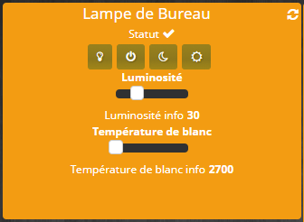

_Personnellement, je règle la **luminosité** minimum **à 1** pour ne **pas** que l’ampoule **s’éteigne** complètement lorsqu’elle est au **minimum**._

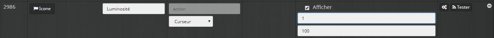

Il n’est pas **possible** **d’allumer** la **lumière** en changeant la **luminosité,** mais par contre, le changement de la **température** des blancs allume bien la lampe.

### Retour d’état

Il a **un retour d’état** si **j’allume** l’ampoule depuis **l’application** mobile, ou depuis **l’interrupteur** de la lampe. **Jeedom** reçois l’information via la commande **statut**. Par contre il y a un petit **délai** avant qu’il soit **mis à jour.** On peut utiliser la commande « **rafraîchir** » pour provoquer la mise à jour.

Il y a aussi un état « **OnLine** » qui permet de savoir si **la lampe** est **alimentée** électriquement, ou **connecté** au wifi (1) ou **pas** (0).

### Virtuel et widget pour Lampe de bureau Xiaomi Desk Lamp

Voila un **exemple** si vous voulez faire un **virtuel** et un **widget** pour votre lampe de bureau**.**

#### Virtuel

Pour le **virtuel** rien de bien sorcier, il suffit de faire un **bouton On / Off** et d’ajouter les commandes **Luminosité** et **Température** des blancs.

Au niveau des **valeurs** de la **luminosité**, je mets un **minimum** de **« 1 »** pour ne **pas** pouvoir **éteindre** l’ampoule complètement via la commande Luminosité.

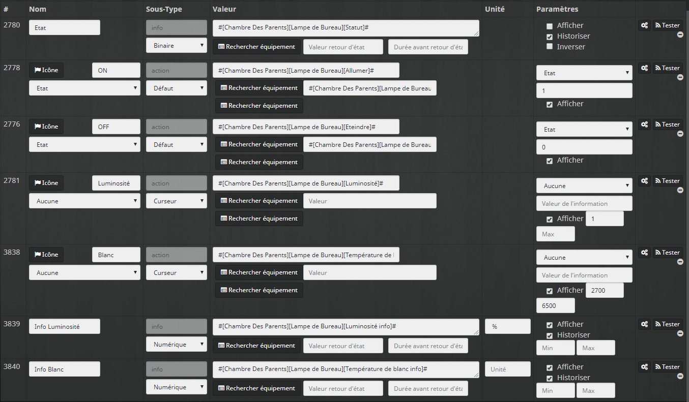

#### Widget

Pour le **widget**, je crée un **widget On /Off** avec les images suivantes.

Et pour le même prix, je vous **partage** le fichier **PSD** pour **Photoshop** : [Widget Yeelight Bureau.](./Widget-Yeelight-Bureau.psd)

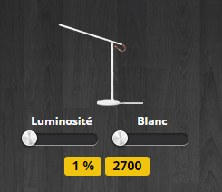 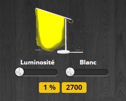

Si vous n’êtes **pas à l’aise** avec les **virtuels** et **Widgets**, je vous invite à (re)**lire** l’article **[Lumières & Bouton Switch Xiaomi](/articles/jeedom-scenario-lumieres-bouton-switch-xiaomi),** dans lequel je détaille la marche à suivre.

### Fondu sur extinction de la lampe de bureau

J’ajoute un petit **réglage** au niveau de la commande **éteindre**, pour que la lampe repasse en **fondu** à une luminosité de **1%** et une température des blancs de **2700** à chaque extinction, histoire de ne pas me prendre un **flash** lorsque je la rallume.

Après, j’ai juste à régler selon mes **besoins** avec le **bouton** de la lampe.

- Aller dans **Plugins** / **Xiaomi Home**
- Chercher la **lampe de bureau.**
- Aller dans l’onglet « **Commandes**« .
- Cliquer sur la « **Roue crantée** » en face de la commande « **éteindre**« .
- Aller dans l’onglet « **Configuration**« .
- Dans « **Action avant exécution de la commande** » cliquer sur « **Ajouter**« .
- Ajouter la commande luminosité du virtuel, chez moi : « **#\[Chambre Des Parents\]\[Virtuel Lampe Bureau\]\[Luminosité\]#**« 
- Dans valeur saisir **1**.
- Cliquer à nouveau sur « **Ajouter**« .
- Ajouter la commande Température de blanc du virtuel, chez moi : « **#\[Chambre Des Parents\]\[Virtuel Lampe Bureau\]\[Blanc\]#**« 
- Dans valeur saisir **2700**.

Maintenant lorsque que vous allez **éteindre** votre lampe de bureau si les valeurs sont **différentes** de 1% et 2700 vous allez avoir un joli **fondu** de la lumière **avant** l’extinction.

Le fait d’avoir choisi les commandes du **virtuel** et non directement les **commandes** Xiaomi de la lampe de bureau, permet d’avoir les **curseurs** aux bonnes valeurs sur le **dashboard**.

## Conclusion

Cette lampe de bureau Xiaomi Desk Lamp  est super **pratique** et pour une fois, c’est le côté **esthétique** qui me satisfait un peu moins, cela reste très subjectif. La lampe est comme toujours chez **Xiaomi** de très bonne **qualité**. Une peu **grosse** à mon goût, surtout sur un bureau déjà bien encombré, la tête **pliable** permet de s’adapter à l’espace disponible.

N’hésitez pas à regarder les **photos** de la **description** de la lampe de bureau.

La possibilité de **contrôler** la lampe en **local** est un vrai plus qui fait gagner des points **WAF** et qui rend l’utilisation de cette lampe très facile.

Si vous souhaitez vous procurer cette lampe, vous pouvez la trouver sur [Amazon](https://www.amazon.fr/gp/aw/d/B01JIGCG4O?&tag=guilbraimespa-21).
