# Interrupteurs muraux Xiaomi Aqara Wall Switch

> Dans ce nouvel article je vais vous présenter **les interrupteurs muraux Xiaomi Aqara Wall Switch** , à ne pas confondre avec l’interrupteur bouton Xiaomi, utilisé dans l’article [Jeedom Scénario – Bouton Switch Xiaomi](/articles/jeedom-scenario-bouton-switch-xiaomi).
>
> La gamme d’interrupteurs **Aqara** que propose **Xiaomi,** est un peu plus cossue que sa petite sœur et propose une **variété de modèles** permettant de répondre à de **nombreuses situations**.
>
> _**Les interrupteurs muraux Xiaomi Aqara Wall Switch , sont compatible avec la box domotique Jeedom, le tutoriel d’installation est disponible ici : [Xiaomi Aqara Wall Switch dans Jeedom](/articles/xiaomi-aqara-wall-switch-dans-jeedom).**_

## La gamme Xiaomi

Il existe **2 types** d’interrupteurs :

- Les **modèles sans fil** qui fonctionnent sur batterie et se collent.
- Les **modèles encastrables** et donc filaires qui doivent être encastrés dans le mur, comme les interrupteurs standard. Ils sont disponible avec ou sans neutre.

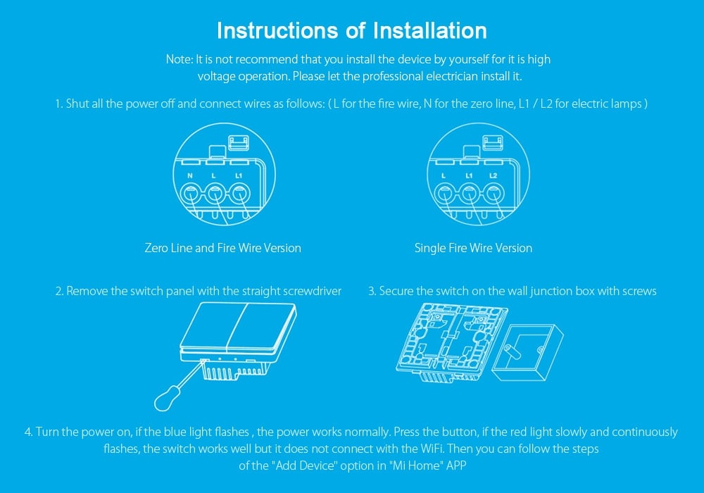

Les 2 types sont disponibles en version **simple ou double boutons**.

J’ai testé seulement les versions **sans fil** et **encastrable** à **double boutons sans neutre**. La compatibilité des modèles avec neutre n’est pas confirmée. Le test vaut pour les modèles simple bouton, mais certaines actions ne seront pas disponibles.

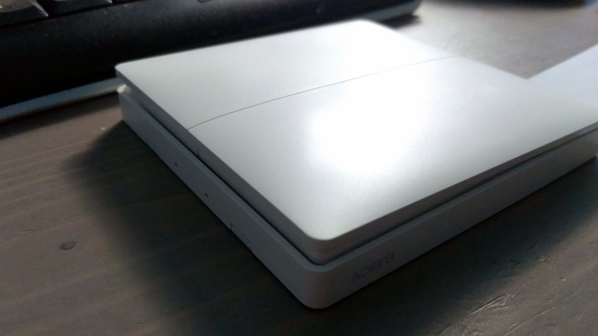

Les **interrupteurs sont assez fin.** Pour les modèles sans fil, la partie haute, celle sur laquelle on appuie, mesure 1 cm et la partie basse 1.4 cm. On retrouve au dos **2 patins antidérapants** permettant de poser l’interrupteur sur une table par exemple, mais un **large adhésif** est fourni pour le coller au mur.

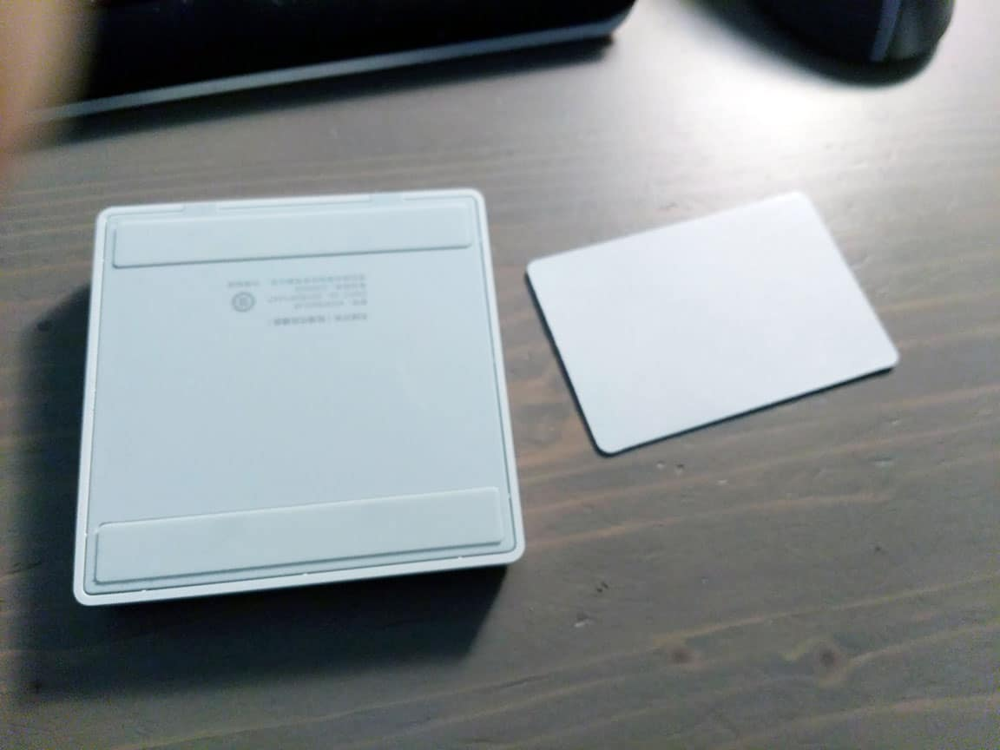

Les **modèles encastrables** ont les mêmes mensurations extérieures que les modèles sans fil, mais il y a, en supplément, la partie permettant de **connecter les fils électriques** qui sera à l’intérieur du mur dans une boite d’encastrement. Ils sont fournis avec des vis de fixation.

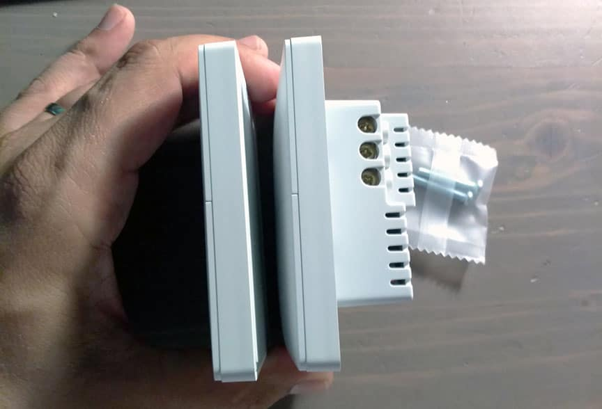

**Attention les normes chinoises n’étant pas les mêmes, il faut des boites d’encastrement carrées de 60 mm et non rondes comme en Europe.** 

Par contre, les axes des vis sont les mêmes que chez nous.

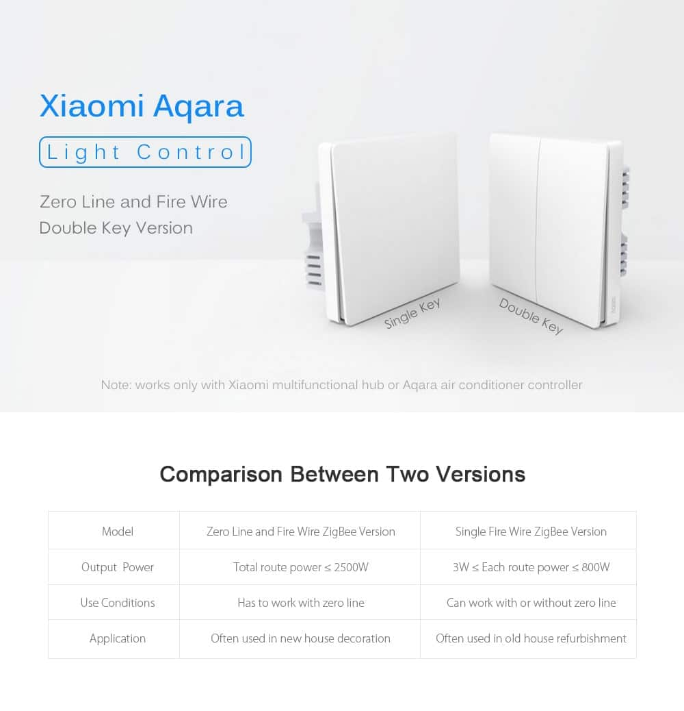

## L’interrupteur sans fil double bouton

### Mi-home

L’association est très simple, il suffit d’aller dans **« Gateway / Device / Add subdevice »** et sélectionner l’interrupteur correspondant, dans mon cas « **Wireless Switch (Two Buttons)**« .

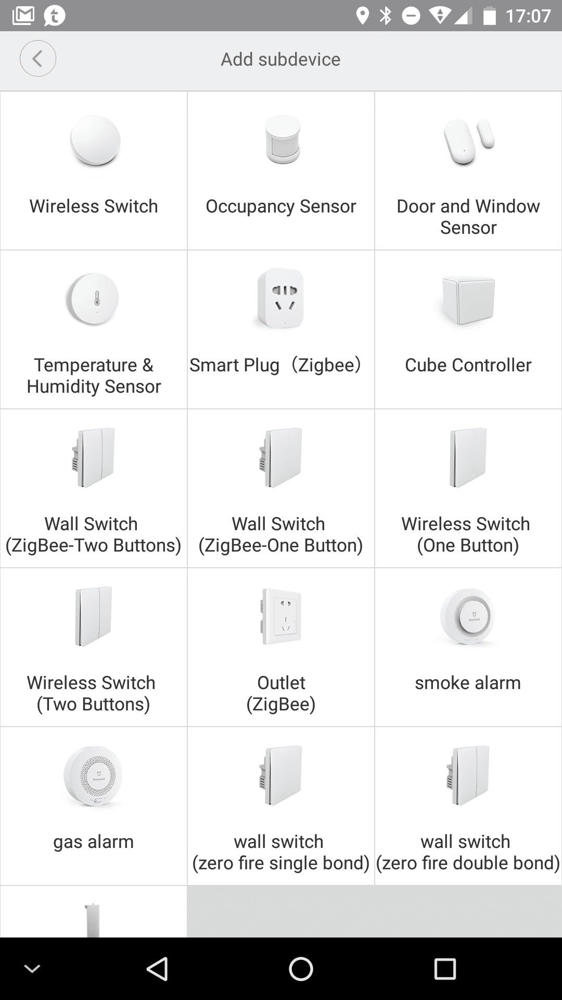

Il suffit ensuite d’appuyer **5 secondes sur l’interrupteur,** jusqu’à ce que la **LED bleue clignote** et attendre que l’application ait associé l’interrupteur.

Vous pouvez maintenant **renommer votre interrupteur** et **créer des scènes** depuis l’application **Mi-home**. **3 actions sont disponibles**, le simple clic à droite, ou à gauche et les deux boutons en même temps.

Le fonctionnement est assez **similaire au bouton switch** sauf que les « **simple, double et long clic** » sont remplacés par « **gauche, droite et gauche-droite**« .

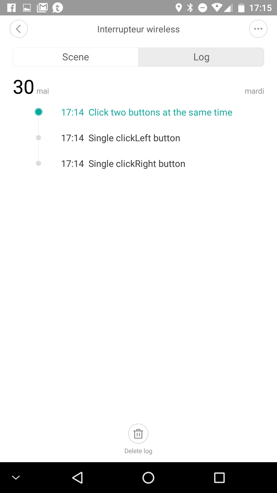

## L’interrupteur Encastrable double bouton

Le **modèle** que je vous présente maintenant, c’est le modèle **sans neutre.** Celui avec neutre n’était pas disponible lorsque j’ai passé commande.

---

_**ATTENTION, ne jouez pas avec le 220V !!**_

_**N’essayez pas de brancher vous même les interrupteurs si vous n’avez pas un minimum de connaissances et d’expérience en électricité. Une mauvaise utilisation peut entraîner des dégâts dans votre logement et plus dangereux encore, porter gravement atteinte à votre intégrité physique.**_

_**Je décline toute responsabilité en cas de problème avec l’utilisation des interrupteurs encastrables, ou autres produits à risques décrits dans mes articles.**_

### Branchements

Comme je vous l’ai dit plus tôt, les **interrupteurs encastrables** sont **carrés,** ce qui nécessite un peu de bricolage pour les adapter à nos **boites rondes**.

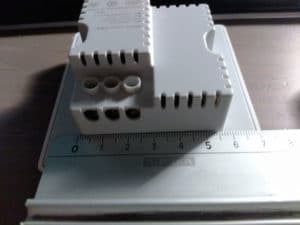

Sur les modèles à 2 boutons, il est **possible** de **brancher** seulement **une borne** pour l’utiliser comme un simple bouton .

Pour le **branchement,** il suffit de connecter l’interrupteur entre l**‘arrivée d’électricité** et le, ou les, **appareils à contrôler**.

- **L** = Fil d’Arrivée.
- **L1** = Fil vers le 1er appareil à contrôler. (bouton de gauche).
- **L2 =** Fil vers le 2nd appareil à contrôler. (bouton de droite).

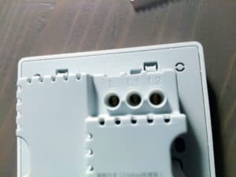

### Mi-home

L’association est la même que pour les modèles sans fil. Aller dans **« Gateway / Device / Add subdevice »** et sélectionner l’interrupteur correspondant, dans mon cas « **Wall Switch (ZigBee-Two Buttons)**« .

Il suffit ensuite d’appuyer **5 secondes** sur l’interrupteur, jusqu’à ce que la **LED bleue clignote**.

Nous avions vu que le **fonctionnement** du bouton sans fil était proche de celui du bouton switch, et bien là, c’est **un peu différent**.

Sur l’application, on découvre **un interrupteur virtuel** que l’on peut agrémenter d’**icone** représentant l’appareil contrôlé, un peu comme pour les prises murales Xiaomi. Il faut aussi **nommer** chacun des **boutons**.

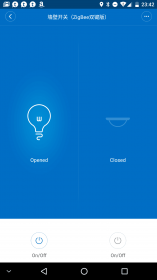

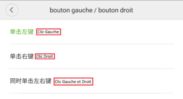

Il y a **3 actions disponibles**, le simple clic à droite, ou à gauche, et les deux boutons en même temps que l’on peut **utiliser** dans des **scènes** depuis l’application Mi-home.

**INFO : dans l’application une partie importante est en chinois, c’est lorsque l’on veut choisir le bouton à prendre en compte dans la scène.**

On est toujours sur un **produit Xiaomi** et donc, de **bonne qualité.** Le **design** est plus sympa que les boutons rond Switch Xiaomi que [je vous avais présenté](/articles/jeedom-scenario-bouton-switch-xiaomi) il y a quelque temps. Si je devais apporter une **critique**, à ce niveau, ce serait éventuellement pour le **bruit** des **boutons** qui est assez **claquant** et qui pourrait déranger certains.

On ne peut pas non plus éviter de mettre un **petit bémol** sur les **versions encastrables carrées** qui sont assez difficiles à faire rentrer dans nos boites d’encastrement rondes. Mais n’oublions pas que ce sont des **produits** prévus à l’origine pour le **marché chinois**.

**L’utilisation** est complète et **facile** d’accès **via** l’application **Mi-home,** malgré les quelques mots en chinois qui seront certainement traduits très rapidement.
