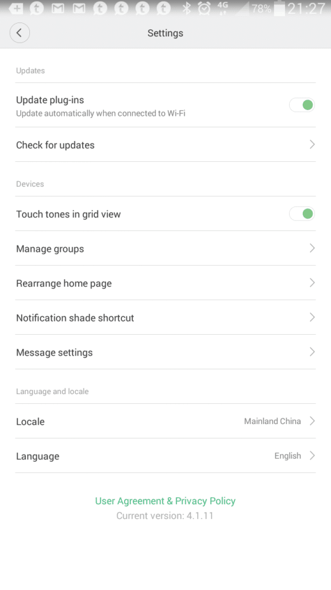
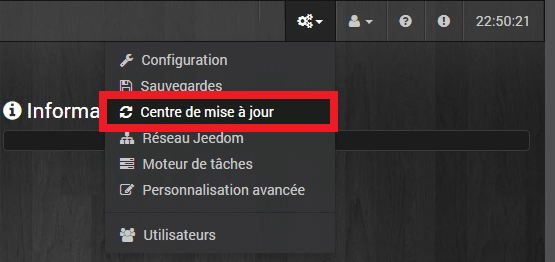
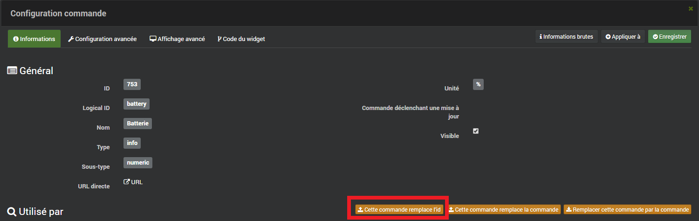
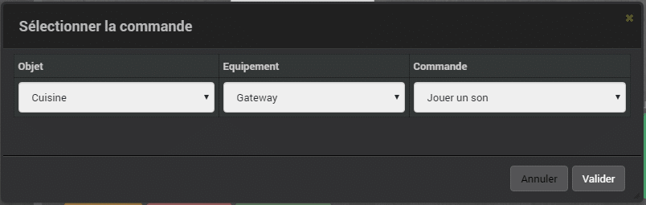
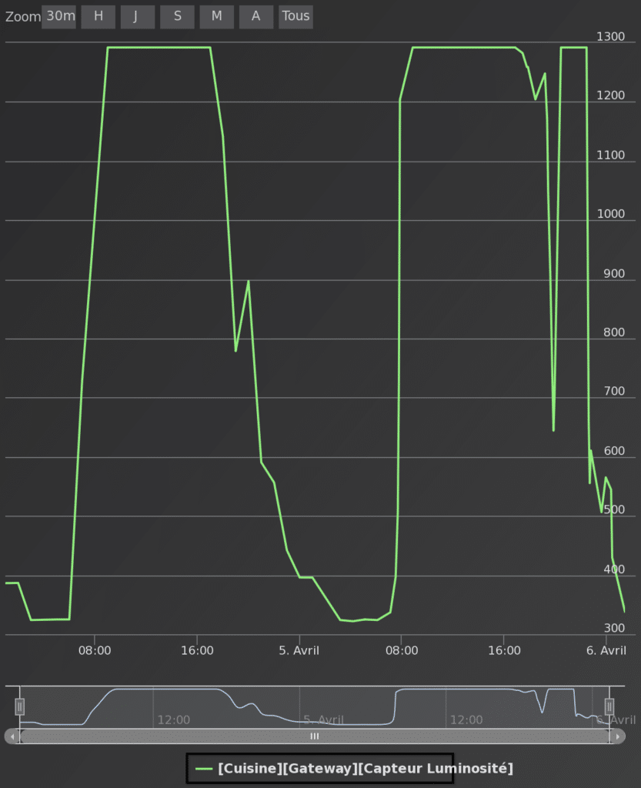
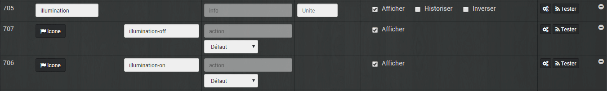
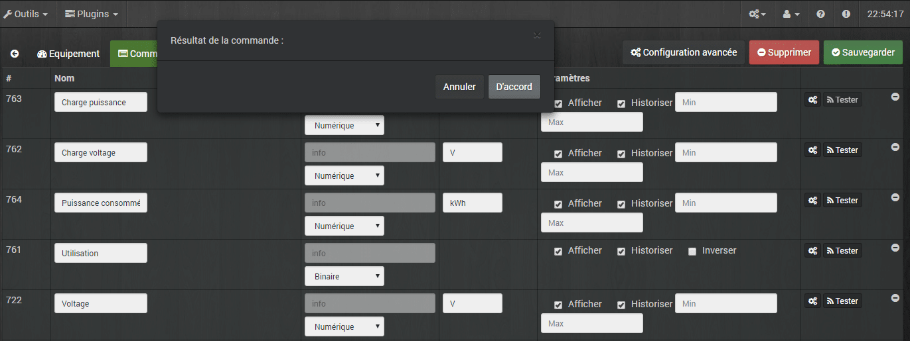
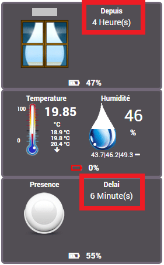

# Mises à jour du Firmware et du plugin Jeedom Xiaomi Home

> ***Edit du 06/08/2017 : Une nouvelle mise à jour majeur a été déployé depuis. Un article est en cours de rédaction.*** 
>
> La mise à jour du firmware du Gateway est enfin disponible et par la même occasion, la mise à jour du plugin Jeedom. Plein de nouveautés en vue !
>
> J’ai décidé de regrouper les réponses aux questions et bugs que **j’ai** rencontrés lors des mises à jour du firmware et du plugin. Vous n’aurez peu être pas les mêmes problèmes que moi donc si vous ne trouvez pas votre bonheur sur cette page allez faire le tri dans les plus de 115 pages du forum Jeedom, dédié au plugin Xiaomi. [Forum](https://www.jeedom.com/forum/viewtopic.php?f=28&t=23382#p412419)
>
> _PS : Certaines réponses viennent des membres du Forum._

**\[datedermaj\]**

## Mise à jour du firmware.

_Mise à jour distribué par Xiaomi et indépendante du plugin Jeedom._

_**Info** : Une seconde mise à jour a été poussé le 06/04/2017, a priori pas de changements visibles._

La mise à jour se fait depuis l’application « Mi-home » installée sur votre portable depuis **Profil / Settings / Check for Updates.**



Pour moi, la mise à jour du firmware n’a pas été de tout repos, car elle ne voulait pas démarrer.

### Installation reste bloquée à 0%

- **Symptôme** : Lorsque j’ai lancé la mise à jour, elle n’avançait pas et restait sur 0%. Puis, au bout d’un moment, je me retrouvais sur le menu principal.
- **Solution** : Faire la mise à jour de l’application Mi-Home pour être en V4.1.11. Je me suis déconnecté et reconnecté à Mi-home et là, j’ai eu la mise à jour de Mi-home et du Firmware.

### Installation reste bloquée à 90%

- **Symptôme** : Lorsque j’ai lancé la mise à jour elle avançait puis restait sur 90%.
- **Solution** : N’ayant pas beaucoup de débit internet j’ai utilisé le partage 4G pour faire la mise à jour.

1.  J’ai partagé la connexion de mon téléphone (4g) avec le **même nom que mon wifi local**.
2.  J’ai **désactivé le wifi** local. (Freebox)
3.  Le **Gateway s’est connecté** au téléphone.
4.  J’ai connecté un autre téléphone sur le wifi(4G) qui contient l’appli Mi-Home et j’ai **fais la mise à jour**.
5.  **Désactivation** du partage 4G.
6.  **Réactivation** du wifi local.

## Mise à jour du plugin Jeedom Xiaomi

_Mise à jour du plugin Jeedom de [Lunarok](https://market.jeedom.fr/index.php?v=d&p=market&type=plugin&plugin_id=xiaomihome), non distribuée par Xiaomi._

Rien de spécial, sous Jeedom faites la mise à jour comme toujours, depuis « **Roues crantées** » et « **Centre de mise à jour**« .



Les commandes des composants peuvent mettre quelques minutes à remonter dans le plugin Xiaomi. N’hésitez pas à supprimer vos anciennes commandes si elles présentent des anomalies par contre vous risquez de mettre le bazar dans vos scénarios utilisant ces commandes si vous ne réattribuez pas les commandes à l’ancienne ID.

### Réattribution des commandes

Avant de supprimer une commande il faut noter son ID qui se trouve dans la première colonne.


Apres avoir supprimer la commande il faut cliquer sur les roues crantées puis sur « **Cette commande remplace l’ID** » puis saisir l’ID de l’ancienne commande.



### Gateway

#### Gestion des sons

_**Nouveauté** : il est maintenant possible de jouer les sons présents dans la Gateway. Les sons par défaut, mais aussi l[es sons personnels que vous pouvez ajouter](/articles/installation-et-configuration-de-la-gateway-xiaomi#Changer_les_sonneries_du_Gateway) depuis l’application Mi-home._

Depuis un scénario, sélectionner une commande et choisir l’équipement « **Gateway** » et la commande « **Jouer un son**« .

Il faut ensuite sélectionner « **l’ID du son**« , ce n’est pas très pratique car il faut saisir un chiffre qui correspond à un son.

- **Les sons alarmes (de 0 à 8).**

0 : police car 1
1 : police car 2
2 : accident
3 : countdown
4 : ghost
5 : sniper rifle
6 : battle
7 : air raid
8 : bark

- **Les sons sonneries (10 à 13).**

10 : doorbell
11 : knock at a door
12 : amuse
13 : alarm clock

- **Les sons réveils (20 à 29).**

20 : mimix
21 : enthusuastic
22 : guitar classic
23 : ice world piano
24 : leisure time
25 : child hood
26 : morning stream liet
27 : music box
28 : orange
29 : thinker

- **Les sons personnalisés ( 10001 et plus).**

Il s’agit des sons envoyés dans le Gateway [depuis l’application Mi-Home](/installation-e/t-configuration-du-gateway-xiaomi-smart-home#Changer_les_sonneries_du_Gateway).

_Merci à [romainhc](https://www.jeedom.com/forum/memberlist.php?mode=viewprofile&u=7304) pour la liste._

 **\*Info** : Dans la Version 3 de Jeedom, une liste déroulante avec le nom des fichiers devrait être disponible.\*

_**Commande non opérationnelle :** Chez moi et d’autres utilisateurs, la commande « **Jouer le son avec volume** » ne fonctionne pas. Le volume souhaité n’est pas pris en compte._

#### Commande LED via bouton ON/OFF

_**Nouveauté :** Une commande permet d’allumer et éteindre la LED via un bouton ON et OFF._

Son fonctionnement est pour le moins étrange ; si je clique dessus la luminosité passe à 50, même si au préalable, je l’ai réglée à 100.
Je n’ai pas trouvé comment lui mettre une valeur par défaut, de 100 au lieu de 50…
Du coup, son utilité en devient très réduite, car si on doit ajouter un champ luminosité après le ON, ça ne fait que rajouter une commande pour faire la même chose qu’avant.

### Capteur de luminosité

_**Nouveauté**: Il est possible d’avoir le niveau de luminosité de la pièce ou se trouve le Gateway._

L’unité de mesure qui est normalement en Lux, est pour le moment inconnue, chez moi en pleine journée j’arrive à un maximum de **1292** et la nuit à **322**.



#### Commandes illuminations erroné (Résolu)

- **Symptômes** : Présence de commandes « **Illumination, illumination on et off**« . Sur le widget, on a une ampoule et des boutons On Off.
- **Solutions** : _Supprimer les commandes et attendre qu’elles remontent._ Il est aussi possible de changer le type en numérique, au lieu de binaire et pour le widget, enlever le type light. Si vous ne pouvez pas faire la modification, il faut décocher « **Afficher** » sur la commande et « **Sauvegarder**« .


### Prise connectée (En partie Résolu)

\_**Nouveauté :** Informations sur la consommation électrique des prises X_iaomi, ~chez moi et d’autres utilisateurs, elles ne remontent pas.~

- **Charge puissance** (Watts) : Fonctionnel mais reste souvent à 0 même lorsque la prise est utilisé.
- **Charge voltage** (Volts) : Pas d’information.
- **Puissance consommée** (kWh) : Fonctionnel.
- **Utilisation** : L’information remontée 0 ou 1 est assez aléatoire, en même temps je ne vois pas la différence avec le statu.



**Info** : J’ai supprimé les commandes, mais lorsqu’elles sont remontées, il n’y avait toujours pas d’information.

**Info** : Suite à la mise à jour du 09/04/2017 il n’est plus possible d’utiliser les prises avec un interrupteur virtuel. Pour régler le problème il faut modifier des valeurs dans le fichier Plug.json mais attention vous touchez au plugin directement, **je décline toute responsabilités en cas de problème.**

1.  Se connecter à [Jeedom en SSH](/articles/installation-de-jeedom-netinstall-sur-raspberry-3#Connexion_en_SSH_sous_Jeedom).
2.  Aller dans /var/www/html/plugins/xiaomihome/core/config/devices/plug/plug.json
3.  Modifier les majuscules des valeurs : *« value »: « **s**tatus »* par *« value »: « **S**tatus »*.
4.  Enregistrer et c’est bon.

Info fourni par  [Shyrka973](https://www.jeedom.com/forum/memberlist.php?mode=viewprofile&u=345) sur le forum dédié.

**Info** : D’après des tests effectués par [Pax24](https://www.jeedom.com/forum/memberlist.php?mode=viewprofile&u=2775) sur le forum dédié, les informations de consommations remontent toutes les 5 à 7 minutes. J’espère que nous aurons un retour sur ce défaut rapidement.

### Capteur de température (Résolu)

_**Nouveauté :** Informations sur le niveau des piles des capteurs de températures et d’humidité Xiaomi. Chez moi et d’autres utilisateurs, elles ne remontent pas._

- **Batterie** (%) : Pas d’information.
- **Pile Voltage** (Voltes) : Pas d’information.

**Info** : J’ai supprimé les commandes, mais lorsqu’elles sont remontées, il n’y avait toujours pas d’information. Sur le forum j’ai vu qu’il fallait supprimer le capteur et débrancher puis rebrancher la Gateway et pour finir faire un redémarrage de Jeedom. J’ai essayé mais ça n’a rien changé puis au bout de quelques jours j’ai un des capteurs qui à remonté les valeurs (j+3) puis l’autre 2 jours plus tard.

### Capteurs d’ouvertures de porte

_**Nouveauté :** Informations sur le niveau des piles des capteurs d’ouverture de portes. Informations remontaient sans problèmes et sans interventions particulières._

La commande « **No_close** » informant de l’ouverture continue de la porte s’arrête toujours à **300 secondes soit 5 minutes**.

**Log** :

```
[2017-04-04 15:12:09][SCENARIO] [Cave][Porte][Ouvert depuis : ] = 60
[2017-04-04 15:16:08][SCENARIO] [Cave][Porte][Ouvert depuis : ] = 300
[2017-04-04 15:48:38][SCENARIO] [Cave][Porte][Status] = 1548
```

On voit bien que la porte était ouverte depuis 300 secondes à **15:16:08** puis plus de remontée d’information jusqu’a la fermeture à **15:48:38** soit 32 minutes plus tard.

Pour palier à ce fonctionnement qui ne me convient pas j’ai fait un virtuel qui calcul le temps écoulé depuis le dernier changement d’état. Du coup j’ai aussi un **no_open**. J’utilise aussi cette fonction pour le **no_motion** des capteurs de mouvements qui ont à peu prés le même fonctionnement.



## Conclusion

Depuis le temps qu’on attendait cette mise à jour du firmware, elle est belle et bien là, avec son lot de nouveautés. Grace aux contacts entre les développeurs de Xiaomi et du plugin Jeedom (Lunarok) nous avons eu la joie de recevoir une mise à jour du plugin le jour même. Certes, il reste quelques interrogations sur l’utilisation des nouvelles fonctions, mais les utilisateurs de Jeedom sont persévérants et je suis sur que dans quelques temps, tout sera opérationnel.
