# Planification d’événements dans Jeedom [Scénarios]

> Pour rappel, le tutoriel est en 2 parties :
>
> - Dans la première partie, nous avons vu la marche à suivre pour créer les virtuels de saisie d’horaires et les widgets permettant de mettre tout ça en forme.
>   - [Planification d’événements dans Jeedom \[virtuel et widget\]](/articles/planification-devenements-jeedom-virtuel-widgets)
> - **Dans cette seconde partie, nous allons voir la mise en place des scénarios de planification d’événements quotidiens.**
>
> _Je vous le redis, bien que cet article soit complet, ne vous inquiétez pas, les scénarios sont à la portée de tous, si vous suivez bien le tutoriel pas à pas._
>
> Pour commencer, nous allons **créer un scénario modèle**, permettant le **traitement** et la **planification** d’événements **d’une journée** (Lundi).
> Il suffira ensuite de le **dupliquer** pour les **jours suivant**s.
>
> _Info : Je vous conseille de dupliquer le scénario jour après jour, afin de pouvoir l’ajuster en fonction de vos besoins, jusqu’à ce qu’il soit satisfaisant._
>
> **_Pour la bonne compréhension de la suite, il est vivement conseillé de lire la première partie : [Planification d’événements dans Jeedom \[virtuel et widget\]](/articles/planification-devenements-jeedom-virtuel-widgets)._**
>
> Pour le tutoriel, nous allons partir sur trois exemples :
>
> - **Mode matin** : *Ce scénario à la structure la plus simple.* Le changement du mode nuit au mode matin est effectué automatiquement en fonction de l’heure configurée.
>   - Cela me permet par exemple de régler la luminosité des lumières ou le volume des TTS en fonction des moments de la journée. J’ai un mode nuit, soir, matin, journée, invités…
> - **L’événement Réveil** : *Ce scénario ajoute la fonction minuteur au scénario précédent.* C’est un réveil matin qui lance un scénario d’allumage progressif des lumières dans la chambre définie par la commande minuterie du virtuel et enfin qui lance la musique à l’heure choisie.
>   - Le fait de lancer le scénario d’allumage progressif me permet de limiter le nombre de modifications, car j’ai seulement le scénario d’allumage progressif à modifier pour tous les jours et non un par jour.
> - **L’événement École** : *Ce scénario est plus complexe, car il ajoute des rappels au scénario précédent.* C’est un rappel pour aller chercher mon fils à l’école, avec un premier rappel défini par la commande minuterie du virtuel, puis un second rappel 5 minutes avant l’heure choisie.
>   - Les 5 minutes sont égales au temps de trajet entre mon logement et l’école. On pourrait utiliser un temps dynamique avec la géolocalisation, mais cela ajouterait de la complexité au scénario, ce n’est pas le sujet aujourd’hui.
>
> _Info : Je ne vous propose que des exemples pour vous donner une base, afin de mieux comprendre le principe à mettre en place pour vos propres planifications d’événements. À vous de les adapter._

Après la théorie, la pratique :

- Allez dans **Outils**.
- Puis **Scénarios**.
- Cliquer sur **Ajouter**.
- Donnez un **nom à votre scénario**, exemple : **« Programmation Lundi »** si on est lundi. 🙂
- Cocher **Actif**  **Visible** .
- Sauvegarder.

## Les déclencheurs du scénario

Le scénario utilise les 2 types de déclencheurs, **programmation** et **événements.** Donc, pour commencer, sélectionner **« Les deux »** dans la liste **« Mode du scénario »** en haut à droite.

### Déclencheurs programmation

Les déclencheurs programmation vont nous permettre de **programmer** les événements de la **journée** et de **réinitialiser** les événements **chaque matin,** afin de ne pas avoir d’erreur de traitements. _Le réveil qui se lance le dimanche matin non merci._

- Cliquer **2 fois** sur le bouton **\+ Programmation**.
- Cliquer sur le **?** en face de la **première** commande de **programmation**.
- Pour **A exécuter** choisir **récurant**.
- Pour **Every** choisir **Week**. week 
- Sélectionner le **jour**, dans notre exemple **lundi** . Monday
- Choisir une **heure d’exécution** par exemple **00:30** 00:30.
- **Valider**

Cette première commande va **exécuter** le **scénario** tous les **lundis matin à 0:30**, c’est à ce moment-là que les **événements** de la journée du lundi seront **programmés**. _Vous pouvez changer l’horaire si besoin, il faut juste que ce soit avant le premier événement._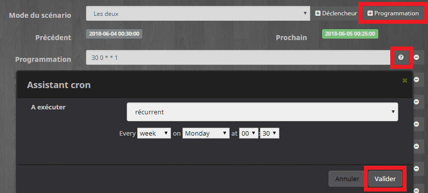

Nous allons maintenant **ajouter** une seconde **commande Programmation,** pour **réinitialiser** les événements.

- Cliquer sur le **?** en face de la **seconde** commande de **programmation**.
- Pour **A exécuter** choisir **récurant**.
- Pour **Every** choisir **Week**. week 
- Sélectionner le **jour suivant**, dans notre exemple **Mardi**. Tuesday 
- Choisir une **heure d’exécution** par exemple **00:25** 00:25.
- **Valider**

Cette seconde commande va **exécuter** le **scénario** tous les **lendemains matins à 0:25** . Cela permet de **supprimer** les **événements** de la journée du lundi qui auraient pu être **programmés** par **erreur**, consécutivement au fonctionnement du système de programmation de Jeedom.

_Rappel : Lorsqu’on programme dans un scénario un événement, on choisit l’heure, mais pas le jour et donc, si on exécute le scénario du lundi pour un événement à 15:00 et qu’il est 15:01 la programmation aura lieu pour le mardi à 15:00, d’où la commande qui supprime les événements programmés par erreur pour le lendemain._

Vous pouvez là aussi **changer l’horaire de 00:25** si besoin. Il faut juste que ce soit **avant le premier événement** et avant le **premier déclencheur**.

- Les commandes programmation devraient ressembler à : 
  - 30 0 = 0:30.
  - \*\* = jour et mois.
  - 1 = Lundi.

_Info : Dans Jeedom, les jours de la semaine commencent à 0 avec le dimanche et se finissent à 6 avec le samedi._

### Déclencheurs événements

Les déclencheurs événements vont **exécuter** le scénario à **chaque fois** qu’on va **activer** ou **désactiver** un **événement**, ou **modifier** son **horaire,** ou encore, le cas échéant, changer le réglage de la **minuterie** afin de prendre en compte les nouveaux paramètres.

Il va donc falloir créer 2 commandes par événement et même **3 s’il y a une minuterie**. Dans l’exemple du **réveil** que nous avons vu dans [l’article précédent](/articles/planification-devenements-jeedom-virtuel-widgets), il y a une **minuterie**. Nous allons donc faire **3 commandes**.

- Cliquer **3 fois** sur le bouton **\+ Déclencheur**.
- Cliquer sur l’icône **Choisir une commande** de la première commande.
- Rechercher votre **Virtuel Réveil**.
- Sélectionner la commande **Etat**.
- **Valider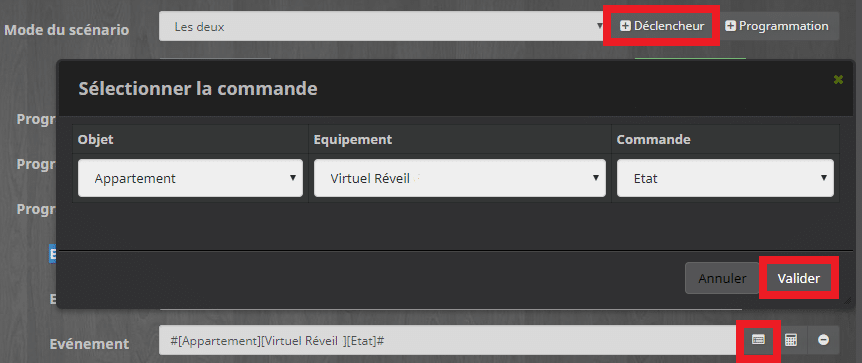**
- Cliquer sur l’icône **Choisir une commande** de la seconde commande.
- Rechercher votre **Virtuel Réveil**.
- Sélectionner la commande **Lundi**.
- Cliquer sur l’icône **Choisir une commande** de la troisième commande.
- Rechercher votre **Virtuel Réveil**.
- Sélectionner la commande **Minuteur**.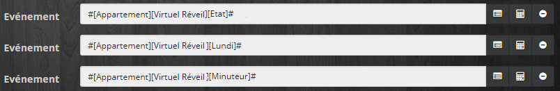

_Info : J’utilise le système de déclencheur de scénario pour pouvoir, par la suite, facilement dupliquer le scénario pour chaque jour. On pourrait exécuter le scénario depuis les commandes actions du virtuel, mais il faudrait le faire pour chaque événement, pour chaque jour et pour chaque commande. Trop long et trop de risques d’erreurs._

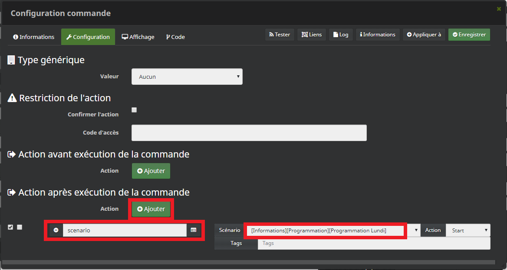

Exemple pour une commande Action du Virtuel trop long et trop risqué.

## Le scénario planification d’événements

Voilà, nous avons préparé notre scénario pour qu’il se déclenche au bon moment. Maintenant, rentrons dans le vif du sujet, avec la partie scénario qui permet d’exécuter les événements.

- Cliquer sur **l’onglet** **Scénario**.
- **Sauvegarder**.

_Info : J’ai supprimé les commandes Log des explications par souci de clarté, mais je vous conseille d’en ajouter pour vous aider à déboguer et faire évoluer vos scénarios._

Pour ajouter des blocs :

- Cliquer sur **+Ajouter bloc** en haut à droite.
  - Ajouter **un** bloc **Action**.
  - Ajouter **un** bloc **Si/Alors/Sinon**.

Pour ajouter des commandes :

-  Cliquer sur **+Ajouter** à gauche.
  - Ajouter **une** commande **Action**.

Pour déplier le Sinon :

- Cliquer sur la **flèche bas** pour afficher le **Sinon**.

### Initialisation et variables

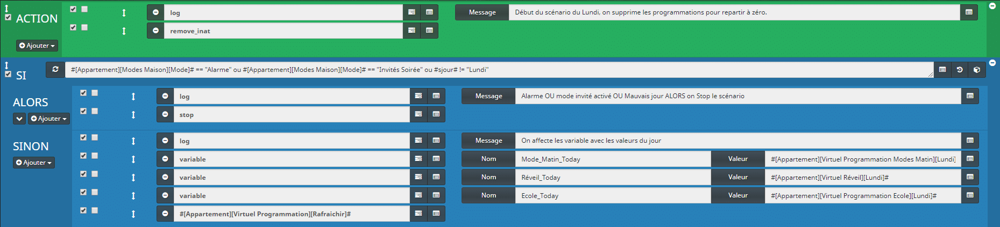

**ACTION remove_inat**

Cette action permet de supprimer les éventuels événements programmés, histoire de repartir à zéro lorsque cela s’avère nécessaire.

**SI #\[Appartement\]\[Modes Maison\]\[Mode\]# == « Alarme » ou #\[Appartement\]\[Modes Maison\]\[Mode\]# == « Invités Soirée » ou #sjour# != « Lundi » ALORS**

**ACTION stop**

Je vérifie les modes, car je ne veux pas de programmation lorsque l’alarme est activée, ou encore, si j’ai des invités à la maison.

Le test important ici c’est ***#sjour# != « Lundi »*** qui **vérifie** le jour et si on n’est **pas lundi**, alors on **arrête** le scénario, car il n’y a **rien à programmer** et grâce au ***remove_inat*** précédent, plus rien n’est programmé.

**SINON**

**variable Nom Mode_Matin_Today Valeur #\[Appartement\]\[Virtuel Programmation Modes Matin\]\[Lundi\]#**

**variable Nom Réveil_Today Valeur #\[Appartement\]\[Virtuel Réveil\]\[Lundi\]#**

**variable Nom Ecole_Today Valeur #\[Appartement\]\[Virtuel Programmation Ecole\]\[Lundi\]#**

**ACTION #\[Appartement\]\[Virtuel Programmation\]\[Rafraichir\]#**

Par contre, si on est bien Lundi, alors on affecte les valeurs à des variables, pour les afficher dans un virtuel récapitulatif que je rafraîchis ensuite. Si vous ne souhaitez pas ce type de virtuel, vous pouvez laisser le *SINON* vide.

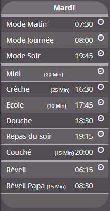

Virtuel récapitulatif journalier

### Événement Réveil

Pour continuer notre exemple sur le réveil, je vais vous détailler le scénario. Mais pour un événement du genre Mode matin par exemple, c’est la même structure.

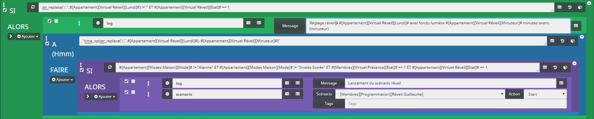

**SI str_replace(‘:’, »,#\[Appartement\]\[Virtuel Réveil\]\[Lundi\]#) != » » ET #\[Appartement\]\[Virtuel Réveil\]\[Etat\]# == 1  ALORS**

Pour commencer, on vérifie qu’un horaire est bien saisi pour l’événement réveil du lundi. Cela permet de ne pas exécuter l’événement s’il n’y a pas d’horaire. Il suffit de cliquer sur la croix dans le widget pour supprimer les horaires. On vérifie aussi que l’événement réveil soit activé, c’est le bouton On/Off du virtuel.

**À (Hmm) « time_op(str_replace(‘:’, »,#\[Appartement\]\[Virtuel Réveil\]\[Lundi\]#),-#\[Appartement\]\[Virtuel Réveil\]\[Minuteur\]#) » FAIRE**

Donc, si on a un horaire saisi et que l’événement est activé, alors on programme l’heure d’exécution à l’horaire saisi, en soustrayant le temps de la minuterie.

- **time_op(time,value)** : Permet de faire des opérations sur le temps, avec time=temps (ex : 1530) et value=valeur à ajouter, ou à soustraire, en minutes. [Voir doc Jeedom.](https://jeedom.github.io/core/fr_FR/scenario#tocAnchor-1-7-5)
- **str_replace** : Permets de remplacer toutes les occurrences dans une chaîne. Ici on remplace les ‘:’ par rien, car les heures saisies sont au format H:mm alors que Jeedom les veut au format Hmm.

**SI #\[Appartement\]\[Modes Maison\]\[Mode\]# != « Alarme » ET #\[Appartement\]\[Modes Maison\]\[Mode\]# != « Invités Soirée » ET #\[Membres\]\[Virtuel Présence\]\[Etat\]# == 1 ET #\[Appartement\]\[Virtuel Réveil\]\[Etat\]# == 1 ALORS**

Lors de l’exécution de l’événement, on vérifie à nouveau que :

- L’alarme et le mode invité ne sont pas activés.
- Que le membre pour qui le réveil est programmé soit bien présent.
- Que l’événement Réveil soit toujours activé.

**Scénario #\[Membres\]\[Programmation\]\[Réveil\]# Action Start**

Il ne reste plus qu’à exécuter la commande. Ici on lance le scénario Réveil qui permet d’allumer les lumières progressivement, puis de démarrer la musique. Vous pouvez utiliser l’article [Fondu paramétrable des ampoules Yeelight](/articles/jeedom-scenarios-fondu-parametrable-yeelight) et utiliser la commande minuteur pour le délai d’exécution. `dureetotal=#[Appartement][Virtuel Réveil Guillaume][Minuteur]#`.

Ici, vous pouvez à la place du scénario, exécuter tout type de commande en fonction de l’événement programmé comme :

- Commande Mode Matin, soir, journée, nuit…
- Commande Heure du coucher, du repas…

_**Info : Si vous n’utilisez par de minuteur pour votre événement, il faudra le supprimer des conditions.**_

Par exemple pour la programmation du Mode Matin, vous pouvez modifier le premier **À Hmm** en supprimant le time_op **:**

- `"str_replace(':','',#[Appartement][Virtuel Programmation Modes Matin][Lundi]#)"`

### Événement École

Maintenant que nous avons une base pour les événements, on peut ajouter quelques conditions pour rendre la programmation plus complexe. Je vais pour cela reprendre l’exemple du rappel pour aller chercher mon fils à l’école le soir.

Il me faut donc :

- Un horaire saisi dans le virtuel correspondant à l’heure de sortie de mon fils.
- Un minuteur me permettant de préciser combien de temps avant de partir je commencerai à avoir des rappels.
- Il me faut 5 minutes pour aller de mon domicile à l’école. Il est possible d’utiliser un plugin comme Waze in Time pour rendre ce temps dynamique en fonction de votre distance avec l’école, mais nous n’en parlerons pas dans cet article pour ne pas trop le complexifier.

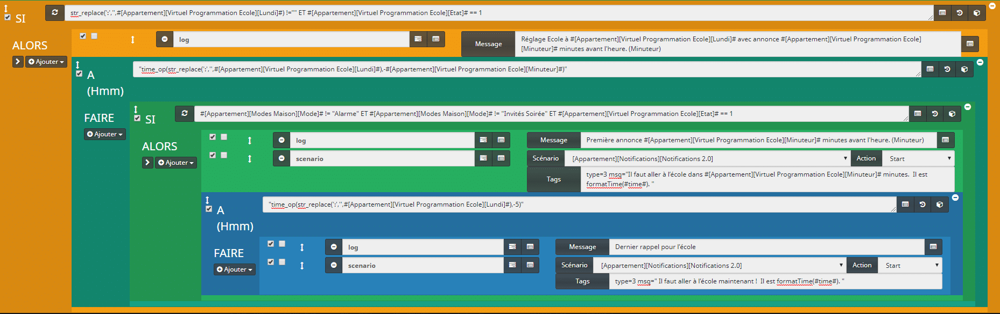

**SI str_replace(‘:’, »,#\[Appartement\]\[Virtuel Programmation Ecole\]\[Lundi\]#) != » » ET #\[Appartement\]\[Virtuel Programmation Ecole\]\[Etat\]# == 1 ALORS**

**À (Hmm) « time_op(str_replace(‘:’, »,#\[Appartement\]\[Virtuel Programmation Ecole\]\[Lundi\]#),-#\[Appartement\]\[Virtuel Programmation Ecole\]\[Minuteur\]#) » FAIRE**

Comme pour tous les événements :

- On vérifie qu’il y ait bien un horaire de saisi pour l’événement, ici École du lundi.
- On vérifie aussi que l’événement École soit activé, c’est le bouton On/Off du virtuel.
- On programme l’heure d’exécution à l’horaire saisi, en soustrayant le temps de la minuterie.

**SI #\[Appartement\]\[Modes Maison\]\[Mode\]# != « Alarme » ET #\[Appartement\]\[Modes Maison\]\[Mode\]# != « Invités Soirée » ET #\[Appartement\]\[Virtuel Programmation Ecole\]\[Etat\]# == 1 ALORS**

Lors de l’exécution de l’événement, on vérifie à nouveau que :

- L’alarme et le mode invité ne sont pas activés.
- Que l’événement Réveil soit toujours activé.

**Scénario #\[Appartement\]\[Notifications\]\[Notifications 2.0\]# Action Start**
**Tags type=3 msg= »Il faut aller à l’école dans #\[Appartement\]\[Virtuel Programmation Ecole\]\[Minuteur\]# minutes. Il est formatTime(#time#). «** 

Si toutes les conditions sont validées, alors on exécute la commande TTS, pour le premier rappel à l’heure saisie, moins la durée du minuteur. _Exemple 16:30 – 15 = 16:15._

- Ici, j’utilise mon système de notifications avancé présenté dans cet article : [Gestion des Notifications avancées](/articles/jeedom-scenario-notifications-avancees) dans une nouvelle version utilisant les Tags de scénarios.

**À (Hmm) « time_op(str_replace(‘:’, »,#\[Appartement\]\[Virtuel Programmation Ecole\]\[Lundi\]#),-5) » FAIRE**

Dans la foulée, on programme le second rappel qui sera à l’heure saisie, moins 5 minutes. _Exemple 16:30 – 5 = 16:25._

**Scénario #\[Appartement\]\[Notifications\]\[Notifications 2.0\]# Action Start**
**Tags type=3 msg= » Il faut aller à l’école maintenant ! Il est formatTime(#time#). «** 

Même principe pour exécuter le second rappel, j’utilise les notifications avancées, mais on pourrait utiliser une simple commande TTS ou SMS ou Mail…

**_Info : Attention ! Le premier rappel est programmé à l’heure d’arrivé à l’école moins le minuteur, pas à l’heure de départ de la maison moins le minuteur._**

Si c’est ce que vous voulez, il faudra ajouter un time_op dans le premier **À Hmm :**

- `time_op(time_op(str_replace(':','',#[Appartement][Virtuel Programmation Ecole][Lundi]#),-#[Appartement][Virtuel Programmation Ecole][Minuteur]#),-5)`

## Dupliquer le scénario modèle dans Jeedom

Maintenant que vous avez des exemples de planification d’événements, vous pouvez remplir votre journée en ajoutant des boucles pour chaque événement. Si seulement on pouvait faire **Copier/Coller** une boucle dans un même scénario, ce serait tellement plus simple. Malheureusement ce n’est pas possible. Mais par contre, on a la possibilité de dupliquer un scénario.
Comme je vous l’ai dit plus tôt dans cet article, on va faire un scénario par jour.

Dans notre exemple, on est lundi. Donc, il faut bien peaufiner le scénario pour pouvoir le dupliquer pour le mardi. Je vous conseille de ne pas dupliquer tous les jours de la semaine d’un seul coup, car il y a des chances que vous fassiez des modifications les premiers jours de tests. Donc, pensez juste à faire les modifications dans le scénario du jour et de le dupliquer le soir et ainsi de suite pour chacun des jours suivants.

La technique pour dupliquer le scénario est très simple et très rapide, sous réserve que vous ayez suivi mon conseil lors de la création du virtuel :

- _**Je vous conseille de bien garder la même structure pour le nom des commandes (Lundi_action et Lundi) pour vous faciliter le travail lors de la duplication du scénario.**_

C’est parti, vous avez vu la fonction **Dupliquer** en haut à droite des scénarios ? Et bien ce n’est **pas** là  ! la fonction **Exporter** ? Ce n’est **pas** là non plus !
Nous allons plutôt utiliser la fonction Template.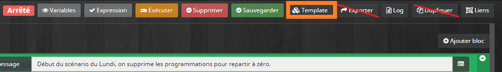

La fonction exportée permet d’avoir le code du scénario. Ça pourrait être utile de faire la modification dans un éditeur de texte, mais il n’y a pas de fonction Importer, donc pas très utile, et la fonction dupliquer fait une copie identique du scénario et après il faut le parcourir et modifier chaque commande avec « Lundi » par « Mardi » et ça peut être très long si vous avez beaucoup d’événements.

Avec la fonction Template, il suffit de faire la modification sur une commande de chaque et après, c’est Jeedom qui va se charger de faire la correspondance et en plus, toutes les commandes sont regroupées. Ce qui évite de parcourir tout le scénario et d’en oublier une au passage.

Depuis votre scénario avec vos différents événements du jour, Lundi dans notre exemple :

- Cliquer sur Template en haut à droite.
- Saisir le nom de votre scénario, exemple Lundi.
- Cliquer sur le bouton +.
- Le message : « Création du template réussie » devrait s’afficher.
- Fermer la fenêtre « Template de scénario ».
- Fermer le scénario Lundi.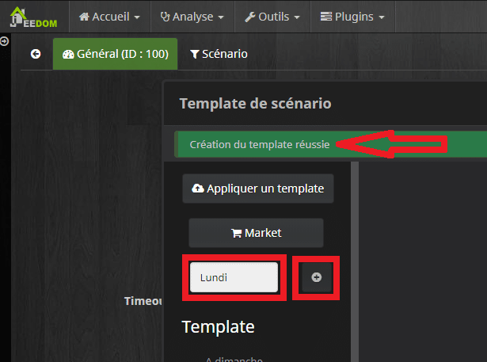

À ce stade nous avons une copie de notre scénario du Lundi. Nous allons maintenant créer un nouveau scénario pour le Mardi.

- Depuis la page des scénarios, cliquez sur **Ajouter**.
- Donnez un **nom à votre scénario**, exemple : **« Programmation Mardi »**.
- Cocher **Actif**  **Visible** .
- Sauvegarder.
- Cliquer sur Template.
- Sélectionner Lundi dans la liste des Template à gauche.
- Remplacer le lundi de la première commande par Mardi.
- Copier le mot Mardi. (double clique sur Mardi et CTRL+C)
- Remplacer les autres Lundi par Mardi. Il y en a 2 autres dans notre exemple, car il y a 3 événements (double clique sur Lundi et CTRL+V).
- Cliquer sur Appliquer.
- Cliquer sur D’accord lorsque vous aurez le message « Êtes-vous sûr de vouloir appliquer le template ? Cela écrasera votre scénario ».
- Fermer la fenêtre « Template de scénario ».

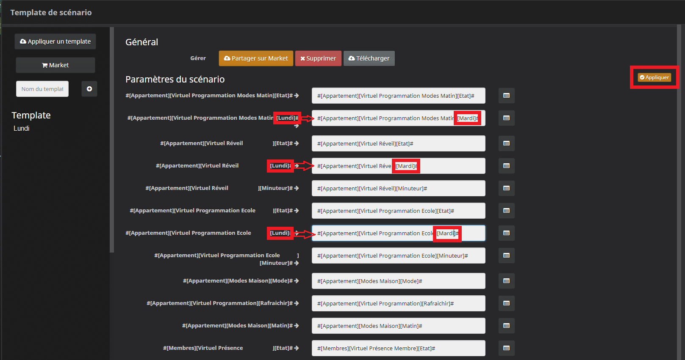

On a presque fini, il reste quelques modifications à faire sur le scénario.

- Dans l’onglet Général :
  - Modifier le « Nom à afficher » qui a pris le nom du scénario du Lundi.
  - Modifier les programmations qui sont pour le Lundi (1) et le Mardi (2) par Mardi (2) et Mercredi(3).
  - Au passage on voit que Jeedom à bien remplacé les commandes Lundi par Mardi.
  - Sauvegarder.

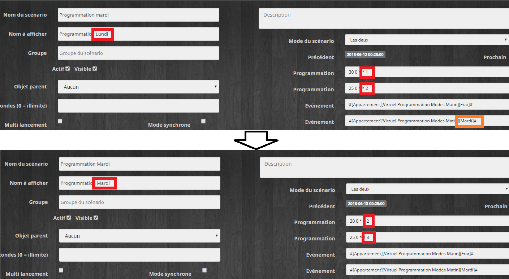

- Dans l’onglet Scénario :
  - Modifier le Lundi par Mardi dans la première condition. `#sjour# != "Lundi"` en `#sjour# != "Mardi"`.
  - Sauvegarder.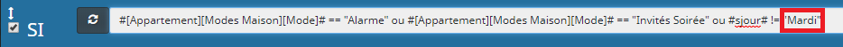

Ça peut vous paraître un peu être long, car vous découvrez la technique, mais honnêtement, il faut moins de 30 secondes pour dupliquer un scénario même avec plus de 10 événements.

_**Info : Si vous travaillez tard sur votre scénario et qu’il est plus que l’heure d’exécution programmée, 00:25 et 00:30 dans l’exemple, pensez à exécuter le scénario manuellement en cliquant sur le bouton « Exécuter » pour programmer les événements de la journée.**_

## Conclusion

Voilà pour cette deuxième et dernière partie qui nous a permis de mettre en place les scénarios de planification d’événements. Bien sûr, ce n’est qu’une trame que vous pouvez adapter à vos propres besoins.

À l’écriture de l’article, je me suis dit qu’il serait bien de faire évoluer le scénario pour qu’il gère tous les jours et ne plus avoir à le dupliquer pour chaque jour de la semaine.
J’ai déjà commencé à faire une nouvelle version avec un seul scénario pour tous les jours de la semaine, mais il faut pour cela utiliser les blocs code. Ce sera dans un prochain article.

Si cet article vous a intéressé, **notez-le,** il sera ainsi mieux référencé et pourra alors être lu par plus de personnes. 🙂
