# Réglage automatique des lumières et des volumes

Dans ce tutoriel Jeedom nous allons voir comment automatiser les réglages, en fonction des pièces et du moment de la journée, le réglage des lumières et du volume des appareils audio connectés à Jeedom.

-  **Coté Software** j’utilise les plugins :
  - [Xiaomi Home](https://www.jeedom.com/market/index.php?v=d&p=market&type=plugin&&name=xiaomi%20home) (6 €).
  - [Google Cast](https://www.jeedom.com/market/index.php?v=d&p=market&type=plugin&&name=google%20cast) (Gratuit).
  - [Virtuel](https://www.jeedom.com/market/index.php?v=d&p=market&type=plugin&name=Virtuel&certification=Officiel&&categorie=programming) (Gratuit).
  - [Widget](https://www.jeedom.com/market/index.php?v=d&p=market&type=plugin&name=widget&&categorie=programming) (Gratuit).
  - [Mode](https://www.jeedom.com/market/index.php?v=d&p=market&type=plugin&name=Mode&certification=Officiel&&categorie=organization) (Gratuit).

- **Coté hardware** j’utilise :
  - Ampoules Xiaomi Yeelight.
  - Box TV Xiaomi Mi-Box.
  - Google Home.
  - Tablettes et smartphone avec JPI.

Evidemment le principe est le même avec d’autres appareils permettant des réglages similaires.

L’utilisation du plugin Mode n’est pas indispensable, libre à vous d’utiliser par exemple un calendrier, un bouton ou simplement le déclenchement programmé des scénarios. Toutefois, dans ce tutoriel, j’utilise les modes pour identifier les différents moments de la journée, Matin, Journée, Soir et Nuit. Au cours de la journée, ces modes s’enchaînent en fonction d’horaires que j’ai préalablement programmé.

**Pour plus d’info, je vous invite à (re) lire les articles « [Planification d’événements dans Jeedom \[virtuel et widget\]](/articles/planification-devenements-jeedom-virtuel-widgets) » et « [Planification d’événements dans Jeedom \[Scénarios\]](/articles/planification-devenements-dans-jeedom-scenarios) ». D’ailleurs, je vais bientôt vous proposer un article qui simplifie grandement sa mise en place.**

Je vais maintenant vous expliquer rapidement le fonctionnement de ce tutoriel **« Réglage automatique des lumières et des volumes »,** avant de passer à la mise en pratique qui consiste à créer deux virtuels sous forme de tableaux et 2 scénarios.

**Le premier virtuel** permet **d’afficher** les valeurs du **mode en cours** afin de pouvoir les affecter aux lumières et aux appareils audio.

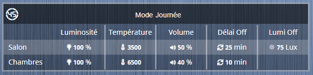

Virtuel Infos Valeurs

On l’appellera **« Virtuel Infos Valeurs »** et on y trouvera :

- **L’entête avec le mode en cours.**
- **Une première colonne avec les différentes zones de la maison :**
  - Salon.
  - Chambres.
- **Cinq colonnes avec les réglages en fonction du mode en cours.**
  - Niveau de luminosité des lumières (%).
  - Température des blancs (1700 -6500).
  - Volume sonore des appareils audio (%).
  - Délais Off (Min) avant extinction automatique des lumières.
  - Seuil de luminosité (N/A) avant extinction automatique des lumières.

**Le second virtuel** permet de **saisir** les valeurs en fonction des **moments de la journée** (modes) et des **zones de la maison** (Salon, Chambres).

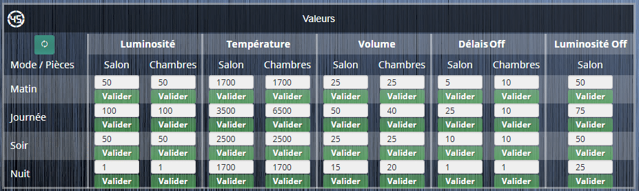

Virtuel Saisie Valeurs

On l’appellera **« Virtuel Saisie Valeurs »** et on y trouvera :

- **Une première colonne avec les différents modes :**
  - Matin.
  - Journée.
  - Soir.
  - Nuit.
- **Cinq colonnes avec les différents réglages :**
  - Niveau de luminosité des lumières (%).
  - Température des blancs (1700 -6500).
  - Volume sonore des appareils audio (%).
  - Délais Off (Min) avant extinction automatique des lumières. (A utiliser dans vos scénarios de gestion de la lumière).
  - Seuil de luminosité (N/A) avant extinction automatique des lumières. (A utiliser dans vos scénarios de gestion de la lumière).

**Les quatre premières colonnes sont doubles afin de pouvoir saisir des valeurs différentes en fonction des Zones.**

Voilà pour les virtuels, passons maintenant aux scénarios.

**Le premier** **scénario** a pour fonction de récupérer à chaque changement de mode, les valeurs saisies dans le virtuel **« Virtuel Saisie Valeurs »,** pour les copier dans le virtuel **« Virtuel Infos Valeurs ».** Une fois les valeurs récupérées, il règle les volumes sonores des appareils en cours de fonctionnement, comme les Google Home ou les appareils pour le TTS. Pour finir, il lance le second scénario.

**Le second** **scénario** va rechercher toutes les lumières actuellement allumées et va modifier les réglages avec les nouvelles valeurs en fonction du mode en cours.

**Info : Nous verrons plus en détail les scénarios dans la suite de ce tutoriel.**

## Création des virtuels dans Jeedom

Le premier virtuel permet d’afficher les valeurs du mode en cours afin de pouvoir les affecter aux lumières et aux appareils audio. On l’appellera **« Virtuel Infos Valeurs »**.

Le second virtuel permet de saisir les valeurs en fonction des moments de la journée (modes) et des zones de la maison (Salon, Chambres). On l’appellera **« Virtuel Saisie Valeurs »**.

_Je pars du principe que vous avez déjà installé les plugins Mode & Virtuel._

### **Virtuel Infos Valeurs**

Ce virtuel est des plus simple car il ne contient que des commandes infos et pas de widgets personnalisés. Cependant, pour la mise en forme, nous utiliserons la disposition **« Tableau »** avec quelques commandes CSS.


- Aller dans Plugins / Programmation / Virtuel.
- Cliquer sur Ajouter.
- Nommer le virtuel **« Virtuel Infos Valeurs ».**
- Sélectionner un Objet parent, une Catégorie et cocher Activer & Visible.
- Sauvegarder.
- Aller dans l’onglet Commandes.
- Cliquer sur **« Ajouter une info virtuelle »** autant de fois que le nombre de commandes par mode + 1, soit dans mon cas 9 + 1 = 10.
- Nommer la première commande **« Mode »**.
  - Sélectionner le Sous-Type : **« Autre ».**
  - Dans **« Valeur »** cliquer sur **« Rechercher l’équipement »** et sélectionner la commande Mode. Exemple : #\[Appartement\]\[Modes Maison\]\[Mode\]#.
- Nommer les autres commandes sous forme **« Zone_Commande ».**
  - Sélectionner les Sous-Type : **« Numérique ».**
  - Sélectionner les Unités.
- Sauvegarder.

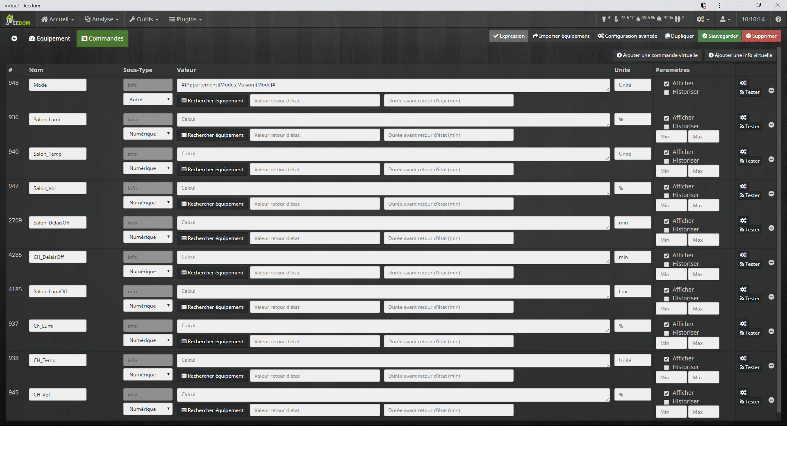

Vous pouvez améliorer l’apparence des commandes en cliquant sur les triples roues crantées à côté des boutons « Tester » pour :

- **Affecter une icône.**
  - Dans l’onglet **« Informations »** cliquer sur le bouton **« Icône ».**
  - Sélectionner l’icône.
  - Valider.

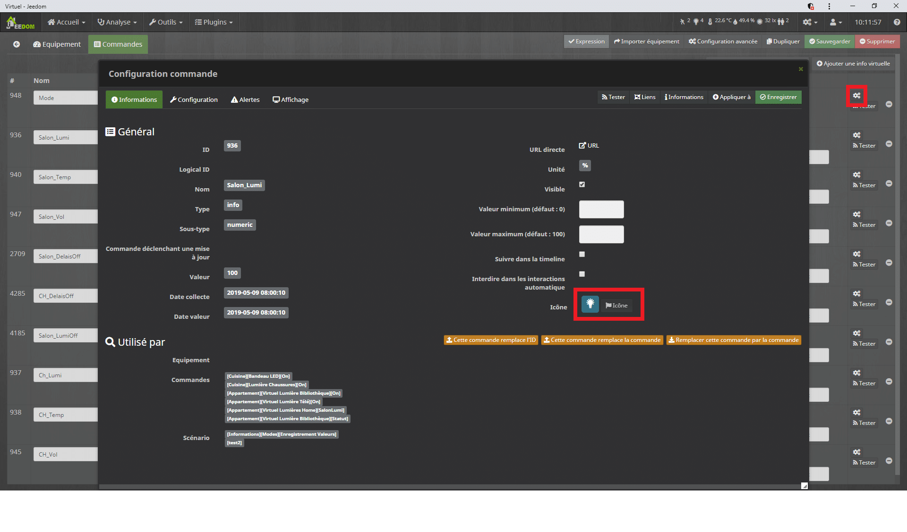

Affecter une icône

- **Changer l’apparence des commandes.**
  - Dans l’onglet **« Affichage »**.
  - Sélectionner un Widget. **« line (core) »** dans l’exemple.
  - Enregistrer.

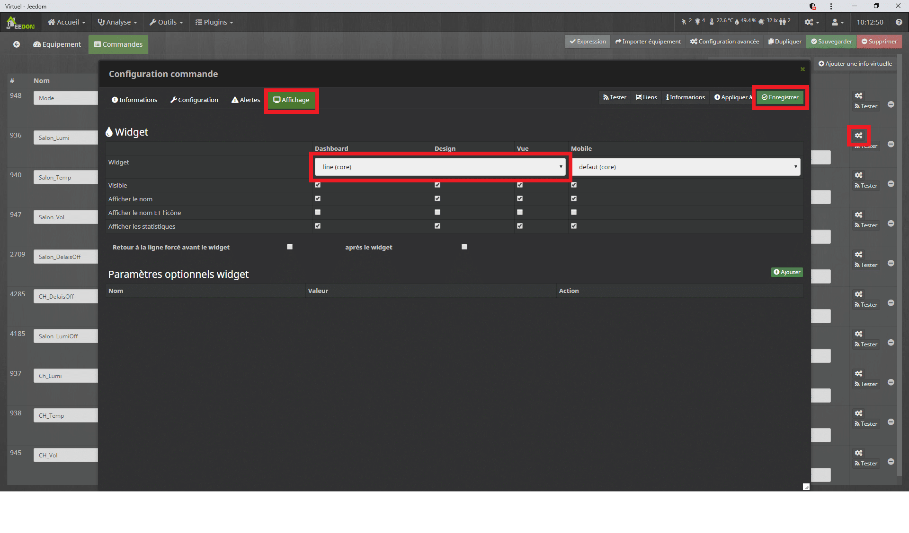

Changer l'apparence des commandes

Maintenant que le virtuel ressemble à une liste de commandes, nous allons le mettre en forme pour qu’il ressemble à un tableau. Je vous détaille ici toutes les étapes pour que le virtuel ressemble au mien. Vous n’êtes pas obligé de suivre les dernières étapes.

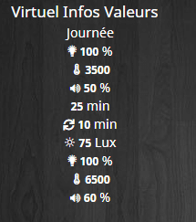

- Cliquer sur **« Configuration avancée ».**
- Aller dans l’onglet **« Affichage ».**
- Décocher **« Afficher le nom ».**
- Aller dans l’onglet **« Disposition ».**
- Sélectionner **« Tableau ».**
- Nombre de lignes : 4.
- Nombre de colonnes : 6.
- Décocher **« Centrer dans les cases ».**
- Laisser vide **« Style général des cases (CSS) ».**
- Sans **« Style du tableau (CSS) »** saisir: **width: 100%; text-align: center;**
  - width: 100%; Permet le redimensionnement de la largeur du tableau à 100%.
  - text-align: center; Permet d’aligner les informations au centre des cases du tableau.
- Enregistrer.
- Fermer la fenêtre.
- Cliquer à nouveau sur **« Configuration avancée ».**
- Aller dans l’onglet **« Disposition ».**

A partir d’ici vous pouvez, soit déplacer les commandes pour ordonner votre tableau comme vous le voulez, soit suivre les étapes numérotées pour avoir le même virtuel que moi.

1.  Saisir **« Mode »** dans la troisième case de la première ligne. (Texte de la case).
2.  Copier **« min-width: 100px; text-align: right; padding: 10px 5px 10px 10px; »** en dessous. (Style de la case (CSS))
3.  Déplacer la commande **« Mode »** sur la quatrième case de la première ligne.
4.  Copier **« min-width: 100px; text-align: left;»** en dessous. (Style de la case (CSS))
5.  Copier **«min-width: 100px; »** dans toutes les autres cases **« Style de la case (CSS) »** de la première ligne.
6.  Saisir le nom des commandes dans les cases de la deuxième ligne. (Texte de la case).
7.  Copier **« border-right: 3px solid #ffffff66; »** dans les cases Style de la case (CSS) des colonnes 2 à 4.
8.  Déplacer les commandes à la troisième et quatrième ligne sous les noms des commandes.
9.  Vous pouvez ajouter **« background: rgba(255,255,255,0.2); »** dans les cases Style de la case (CSS) pour ajouter un fond.
10. Saisir les zones **« Salon et Chambre »** dans les premières cases des dernières lignes. (Texte de la case).
11. Copier **« padding-left: 10px; text-align: left;»** en dessous des zones. (Style de la case (CSS)).
12. Enregistrer.

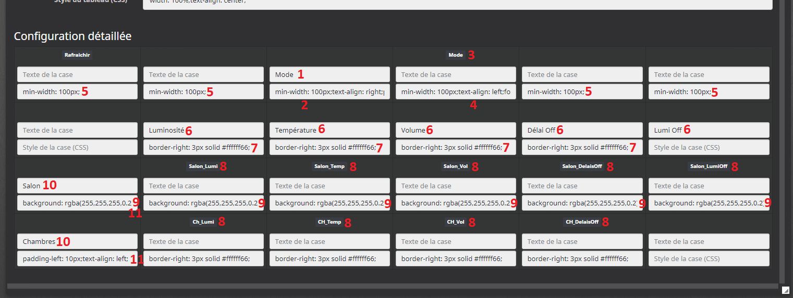

Ordonner le tableau

### **Virtuel Saisie Valeurs**

Ce tableau va nous permettre de saisir les valeurs. Il ne s’agit pas vraiment d’un virtuel mais en fait de plusieurs virtuels. Le but est de simplifier l’utilisation et l’évolution en utilisant la duplication au lieu d’avoir un virtuel à rallonge. Pour la mise en forme, nous utiliserons un widget personnalisé disponible sur le Market et la disposition « Tableau » avec quelques commandes CSS et 2 ou 3 astuces pour les colonnes doubles.

#### L’entête du tableau

Nous allons dans un premier temps créer un virtuel pour l’entête du tableau que nous appellerons **« Virtuel Saisie Valeurs ».** Il ne contient qu’une seule commande permettant de forcer manuellement la mise à jour de données.

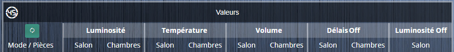

L’entête du Virtuel Saisie Valeurs

- Aller dans Plugins / Programmation / Virtuel.
- Cliquer sur Ajouter.
- Nommer le virtuel **« Virtuel Saisie Valeurs ».**
- Sélectionner un Objet parent, une Catégorie et cocher Activer & Visible.
- Sauvegarder.

Création de la commande pour forcer la mise à jour des données.

1.  Aller dans l’onglet Commandes.
2.  Cliquer sur **« Ajouter une commande virtuelle »**.
3.  Nommer la commande **« Forcer »**.
    1.  Dans **« Nom information »** saisir **« cmd_Forcer »**.
4.  Sauvegarder.
5.  Lier la nouvelle commande info à la commande Action.
6.  Mettre le sous type de la commande info sur Autre.

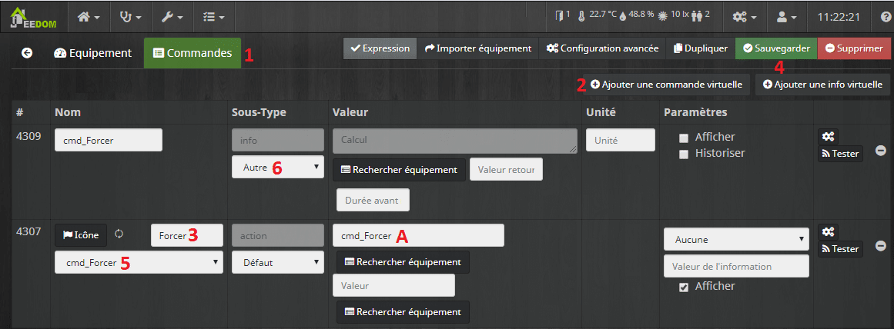

Commande pour forcer la mise à jour

Mise en forme de l’entête du tableau.

- Cliquer sur **« Configuration avancée ».**
- Aller dans l’onglet **« Affichage ».**
- Décocher **« Afficher le nom ».**
- Aller dans l’onglet **« Disposition ».**
- Sélectionner **« Tableau ».**
- Nombre de lignes : 2.
- Nombre de colonnes : 10.
- Décocher **« Centrer dans les cases ».**
- Laisser vide **« Style général des cases (CSS) ».**
- Saisir dans **« Style du tableau (CSS) »**: width: 100%; text-align: center;
  - width: 100%; Permet le redimensionnement de la largeur du tableau à 100%.
  - text-align: center; Permet d’aligner les informations au centre des cases du tableau.
- Enregistrer.
- Fermer la fenêtre.
- Cliquer à nouveau sur **« Configuration avancée ».**
- Aller dans l’onglet **« Disposition ».**

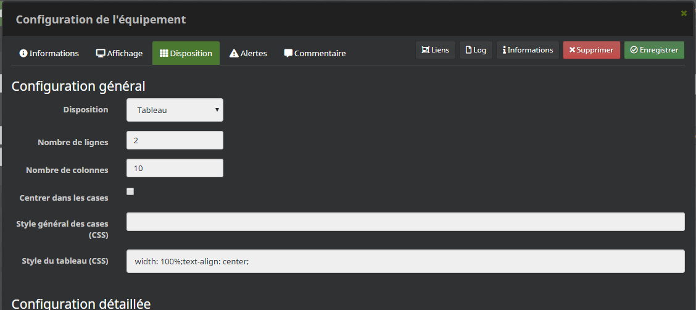

Disposition Tableau

A partir d’ici, il y a une astuce pour pouvoir faire des **colonnes doubles** avec en haut **« Luminosité », « Température »** … et les zone en dessous **« Salon », « Chambre »**. L’astuce consiste à découper le nom des commandes dans 2 cases comme ceci : **« Lumi » « nosité »** et d’aligner une case à droite et l’autre à gauche pour les regrouper.

1.  Remplir le tableau avec le nom des commandes coupé en deux sur la première ligne. (Texte de la case).
2.  Copier **« width: 122px; border-right: 3px solid #ffffff66; »** dans la première case. (Style de la case (CSS))
3.  Copier **« font-weight: bold; width: 83px; text-align: right; background: rgba(255,255,255,0.2); »** dans les cases 2, 4, 5, 8, 10. (Style de la case (CSS))
4.  Copier **« font-weight: bold; width: 83px; text-align: left; background: rgba(255,255,255,0.2); border-right: 3px solid #ffffff66; »** dans les cases 3, 5, 7, 9. (Style de la case (CSS))
5.  Saisir « Mode / Pièces » dans la première case de la deuxième ligne. (Texte de la case).
6.  Saisir alternativement **« Salon »** et **« Chambres »** dans les autres cases de la deuxième ligne. (Texte de la case).
7.  Copier **« padding-left: 10px; text-align: left; border-right: 3px solid #ffffff66; »** dans la première case. (Style de la case (CSS))
8.  Copier **« border-right: 3px solid #ffffff66; »** dans les cases 3, 5, 7, 9. (Style de la case (CSS))
9.  Enregistrer.

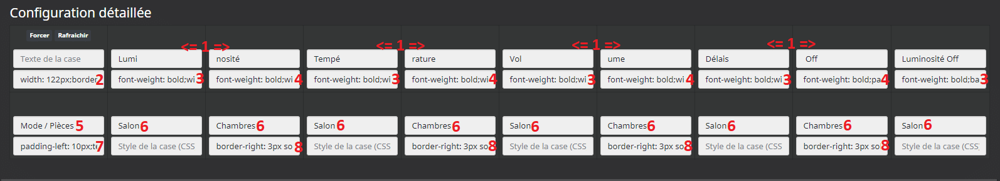

Astuce colonnes double

#### Le corps du tableau

Maintenant que nous avons l’entête du tableau, il ne nous reste plus qu’à créer les virtuels permettant de saisir les valeurs. Le principe c’est de faire un virtuel, puis de le dupliquer. Nous allons donc commencer par créer le virtuel **« Virtuel Saisie Valeurs Matin ».**

- Aller dans Plugins / Programmation / Virtuel.
- Cliquer sur Ajouter.
- Nommer le virtuel **« Virtuel Saisie Valeurs Matin ».**
- Sélectionner un Objet parent, une Catégorie et cocher Activer & Visible.
- Sauvegarder.
- Aller dans l’onglet Commandes.
- Cliquer sur **« Ajouter une commande virtuelle »** autant de fois que le nombre de commandes soit dans mon cas 9.
- Nommer les commandes sous forme **« Commande_Action »**. Exemple : **« Salon_Lumi_Action ».**
  - Sélectionner les Sous-Type : **« Message ».**
  - Dans **« Nom information »** saisir les noms des commandes. Exemple : **« Salon_Lumi »**.
- Sauvegarder.
- Lier les commandes Action aux commandes Info.
- Afficher seulement les commandes Action.

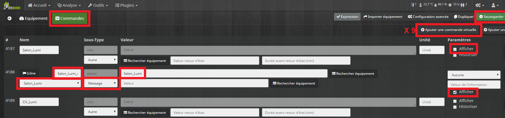

Virtuel Saisie Valeurs Matin

Afin de rendre le tableau plus esthétique il faut affecter un widget aux commandes.

- Aller dans Plugins / Programmation / **Widget**.
- Aller dans **« Market »**.
- Rechercher le widget **« Saisie Nombres ».**
- Cliquer sur **« Installer Stable ».**
- Fermer la fenêtre.
- Ouvrir le widget **« Saisie Nombres ».**
- Cliquer sur **« Appliquer sur des commandes ».**
- Rechercher les commandes **« Virtuel Saisie Valeurs »**.
- Cliquer sur **« Basculer »**.
- Cliquer sur **« Valider »**.

Pour fini nous allons mettre en forme la disposition tableau.

- Aller dans Plugins / Programmation / Virtuel.
- Ouvrir le virtuel **« Virtuel Saisie Valeurs Matin ».**
- Cliquer sur **« Configuration avancée ».**
- Aller dans l’onglet **« Affichage ».**
- Décocher **« Afficher le nom ».**
- Aller dans l’onglet **« Disposition ».**
- Sélectionner **« Tableau ».**
- Nombre de lignes : 1.
- Nombre de colonnes : 10.
- Décocher **« Centrer dans les cases ».**
- Laisser vide **« Style général des cases (CSS) ».**
- Saisir dans **« Style du tableau (CSS) »**: width: 100%; text-align: center;
  - width: 100%; Permet le redimensionnement de la largeur du tableau à 100%.
  - text-align: center; Permet d’aligner les informations au centre des cases du tableau.
- Enregistrer.
- Fermer la fenêtre.
- Cliquer à nouveau sur **« Configuration avancée ».**
- Aller dans l’onglet **« Disposition ».**
- Saisir **« Matin »** dans la première case. (Texte de la case).
- Copier **« width: 122px; background: rgba(255,255,255,0.2); padding-left: 10px; text-align: left; border-right: 3px solid #ffffff66;»** en dessous. (Style de la case (CSS))
- Déplacer les commandes sur la première ligne.
- Copier **« width: 83px; background: rgba(255,255,255,0.2); »** en dessous des colonnes 2, 4, 6, 8, 10. (Style de la case (CSS))
- Copier **« width: 83px; background: rgba(255,255,255,0.2); border-right: 3px solid #ffffff66; »** en dessous des colonnes 3, 5, 7, 9. (Style de la case (CSS))
- Enregistrer.

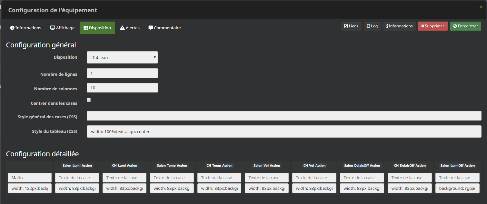

Mise en forme du Virtuel Saisie Valeurs Matin

La dernière étape pour la mise en place des virtuels consiste à dupliquer le virtuel **« Virtuel Saisie Valeurs Matin »** en cliquant sur le bouton **« Dupliquer »** et de donner un nom au nouveau virtuel, exemple : **« Virtuel Saisie Valeurs Journée »** et ainsi de suite pour chaque mode. Chez moi j’ai les modes Matin, journée, Soir et Nuit.

## Réglages des commandes Lumières et volumes

Maintenant, pour que les commandes utilisent les bonnes valeurs en fonction du Mode, il faut ajouter un élément sur les commandes de vos équipements lumières et audio.

Prenons comme exemple la lumière dans ma bibliothèque, sur laquelle je veux que la luminosité et la température des blancs soient réglées automatiquement.

Pour info, mon virtuel **#\[Appartement\]\[Virtuel Lumière Bibliothèque\]\[Luminosité\]#** contrôle une ampoule Yeelight, mais le fonctionnement est le même qu’avec une autre ampoule.

- Aller dans le plugin **« Virtuel »**.
- Ouvrir le virtuel de la lumière à modifier (Virtuel Lumière Bibliothèque).
- Cliquer sur la roue crantée de la commande **« On »**.
- Aller dans l’onglet **« Configuration ».**
- Dans **« Action avant exécution de la commande »** cliquer **2** fois sur **« +Ajouter »** pour ajouter 2 commandes.
- Rechercher la commande **« #\[Appartement\]\[Virtuel Lumière Bibliothèque\]\[Luminosité\]# ».**
- Dans **« valeur »**, rechercher la commande **« #\[Appartement\]\[Virtuel Infos Valeurs\]\[Salon_Lumi\]# ».**
- Rechercher la commande **« #\[Appartement\]\[Virtuel Lumière Bibliothèque\]\[Température de blanc\]#».**
- Dans **« valeur »**, rechercher la commande **« #\[Appartement\]\[Virtuel Infos Valeurs\]\[Salon_Temp\]#».**
- Enregistrer & Sauvegarder.

Cette manipulation aura pour effet de régler automatiquement la luminosité et la température des blancs, à chaque fois que la lumière bibliothèque s’allumera.

Pour les commandes de volume des appareils audio, c’est le même principe, il faut modifier la commande **« On »** de l’équipement pour que le volume se règle lorsque l’on allume l’appareil.

Prenons comme exemple la Mi-Box dans mon salon, sur laquelle je veux que le volume soit réglé automatiquement à chaque démarrage.

- Aller dans le Plugin Virtuel
- Ouvrir le virtuel de la Mi-Box (Virtuel TV chez moi)
- Cliquer sur la roue crantée de la commande **« On »**.
- Aller dans l’onglet configuration.
- Dans **« Action avant exécution de la commande »** cliquer sur **« +Ajouter »**.
- Rechercher la commande de réglage du volume, ici c’est le plugin Google Cast **« #\[Salon\]\[La télé\]\[Volume niveau\]#»**
- Dans **« valeur »**, rechercher la commande **« #\[Appartement\]\[Virtuel Infos Valeurs\]\[Salon_Vol\]#»**

Cette manipulation permet de régler les valeurs seulement lors de l’allumage des appareils. Pour les appareils toujours allumés comme une Google Home, ou pour mettre à jour les valeurs des appareils en cours de fonctionnement, nous utiliserons les scénarios.

## Création des scénarios dans Jeedom

Il va falloir créer **2 scénarios**. Un pour **l’enregistrement des valeurs** dans le tableau **« Virtuel Infos Valeurs »** et un pour **rafraîchir les commandes des lumières,** afin qu’elles prennent les bonnes valeurs lorsqu’elles sont allumées.

### Scénario Enregistrement Valeurs

Ce scénario contient une partie **bloc code** et des **commandes Actions**. La partie bloc code va récupérer le mode en cours à chaque changement de mode, puis les valeurs saisies dans les virtuels **« Virtuel Saisie Valeurs »** vont être copiées dans le virtuel **« Virtuel Infos Valeurs ».** Ensuite, les commandes Action permettent de régler les volumes sonores des appareils en cours de fonctionnement, comme les Google Home ou les appareils pour le TTS. Pour finir, le second scénario est lancé afin de gérer les luminaires.

- Aller dans Outils / Scénarios.
- Cliquer sur Ajouter.
- Nommer le scénario **« Enregistrement Valeurs ».**
- Sélectionner un Groupe, Objet parent, une Catégorie et cocher Activer & Visible.
- Cliquer 2 fois sur **« Déclencheur »**.
- Sélectionner la commande **« #\[Appartement\]\[Virtuel Saisie Valeurs\]\[cmd_Forcer\]# »** du premier virtuel que nous avons créé, afin de lancer le scénario manuellement via le bouton.
- Sélectionner la commande **« #\[Appartement\]\[Modes Maison\]\[Mode\]# »** pour que le scénario se lance à chaque changement de mode, afin de récupérer les valeurs définies pour le Mode en cours.
- Sauvegarde.
- Aller dans l’onglet Scénario.
- Cliquer sur **« Ajouter Bloc ».**
- Sélectionner **« Code ».**

#### Le code du scénario

Vous pouvez copier coller le code suivant mais il faudra l’adapter à vos commandes. Pour comprendre son utilisation reportez vous au chapitre suivant **« Détails du bloc code »**.

```
//On récupère le mode en cours
$Mode = cmd::byString("#[Appartement][Virtuel Infos Valeurs][Mode]#")->execCmd();
$scenario->setLog($Mode);

//On test le mode avant de lancer la mise à jour des valeurs
if ($Mode == "Soirée TV") { $Mode = "Nuit"; }
if ($Mode == "Alarme" OR $Mode == "Invités Soirée") { $Mode = "Journée"; }
$scenario->setLog($Mode);

//On Mets a jour les valeurs du virtuel Valeurs en fonction du mode en cours.
$info = cmd::byString("#[Appartement][Virtuel Infos Valeurs][Salon_Lumi]#");
$saisie = cmd::byString("#[Appartement][Virtuel Saisie Valeurs $Mode][Salon_Lumi]#")->execCmd();
$info->event(($saisie));
$scenario->setLog($saisie);

//On fait la même chose pour les autres commandes.
$info = cmd::byString("#[Appartement][Virtuel Infos Valeurs][Ch_Lumi]#");
$saisie = cmd::byString("#[Appartement][Virtuel Saisie Valeurs $Mode][Ch_Lumi]#")->execCmd();
$info->event(($saisie));
$scenario->setLog($saisie);
```

#### Détails du bloc code

```
$Mode = cmd::byString("#[Appartement][Virtuel Infos Valeurs][Mode]#")->execCmd();$scenario->setLog($Mode);
```

Cette commande permet de récupérer le mode en cours en interrogeant la commande Mode. Vous devez modifier le nom de la commande en fonction de votre configuration.

```
if ($Mode == "Soirée TV") { $Mode = "Nuit"; }
if ($Mode == "Alarme" OR $Mode == "Invités Soirée") { $Mode = "Journée"; }
$scenario->setLog($Mode);
```

On affecte les valeurs d’un mode à un autre. Dans mon exemple, le mode « Soirée TV » prend les valeurs du mode « Nuit » et les modes « Alarme » et « Invité Soirée » les valeurs du mode « Journée ».

```
$saisie = cmd::byString("#[Appartement][Virtuel Saisie Valeurs $Mode][Salon_Lumi]#")->execCmd();
```

On récupère la valeur de la commande « Salon_Lumi » depuis le virtuel « Virtuel Saisie Valeurs » correspondant au mode en cours, grâce à la variable « $Mode » précédemment récupérée.

```
$info = cmd::byString("#[Appartement][Virtuel Infos Valeurs][Salon_Lumi]#");
```

On récupère la commande **« Salon_Lumi »** du virtuel **« Virtuel Infos Valeurs »**.

```
$info->event(($saisie));
```

On met à jour avec la fonction « event », la commande **« Salon_Lumi »** du virtuel **« Virtuel Infos Valeurs »** avec la valeur de la commande **« Salon_Lumi »** du virtuel **« Virtuel Saisie Valeurs »** du mode en cours.

```
$scenario->setLog($saisie);
```

On log la valeur de la commande **« Salon_Lumi »** du virtuel **« Virtuel Saisie Valeurs »**.

Maintenant il suffit de copier-coller ce code en fonction du nombre de commandes que vous avez créé dans vos scénarios, dans mon cas 9 et de modifier le nom de la commande **« Salon_Lumi »** par les autres commandes, Salon_Vol, Ch_Lumi, CH_Vol…

#### Détails des commandes Action

**Les volumes**

Les commandes action vont permettre de mettre à jour le volume sonore de vos appareils audio. Il suffit de créer autant de commandes que d’appareils et d’affecter la commande correspondant à la zone.

Prenons l’exemple d’une Google Home située dans la cuisine et qui utilise le niveau de volume **« Salon_Vol »**.

- Cliquer sur **« Ajouter Bloc ».**
- Sélectionner **« Action ».**
- Cliquer sur **« + Ajouter »** depuis le bloc Action**.**
- Sélectionner **« Action ».**
- Rechercher la commande de réglage du volume.
- Rechercher la commande

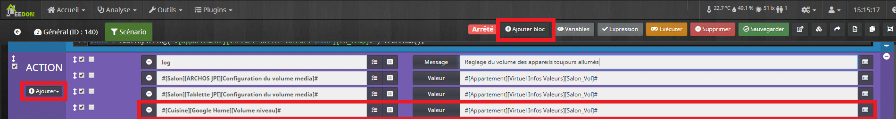

Google Home

Ceci n’est valable que pour les appareils audio qui sont toujours en fonctionnement, pour les appareils que l’on allume que lorsque l’on veut les utiliser, comme une box TV, il faut procéder différemment. Nous le verrons plus bas.

**Les lumières.**

Pour les lumières, il faut utiliser un scénario spécifique. Il faut le lancer avec une commande Action.

- Cliquer sur **« + Ajouter »** depuis le bloc Action**.**
- Sélectionner **« Action ».**
- Saisir «**scenario ».**
- Rechercher le scénario **« Rafraichir Lumières On »**. (Laisser vide pour le moment).

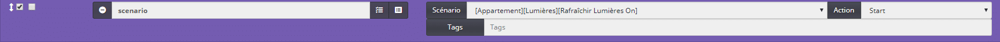

scénario « Rafraîchir Lumières On »

### Scénario **Rafraîchir Lumières On**

Ce scénario contient seulement une partie **bloc code** permettant de rechercher toutes les lumières allumées et de rafraîchir les valeurs en actionnant les commandes « On ».

- Aller dans Outils / Scénarios.
- Cliquer sur Ajouter.
- Nommer le scénario **« Rafraîchir Lumières On ».**
- Sélectionner un Groupe, Objet parent, une Catégorie et cocher Activer & Visible.
- Sauvegarder.
- Aller dans l’onglet Scénario.
- Cliquer sur **« Ajouter Bloc ».**
- Sélectionner **« Code ».**

#### Le code du scénario

Vous pouvez copier coller le code suivant mais il faudra l’adapter à vos commandes. Pour comprendre son utilisation reportez vous au chapitre suivant **« Détails du bloc code »**.

```
//Liste des états
$etat = array('Statut','Etat','Status');
//Recherche des équipements lumière ( basée sur catégorie = 'light' )
$cat = eqLogic::ByCategorie('light');
foreach($cat as $i)
{
$id = $i->getId();
$cmds = cmd::byEqLogicId($i->getId());
$objet = $i->getObject()->getName();
$equipement = $i->getName();
$human = $i->getHumanName();

//Cherche les commandes de la categorie Light
foreach($cmds as $cmd)
{

//Je garde seulement les commandes avec les etats de $etat
if(in_array($cmd->getName(), $etat) )
{
$cmd = cmd::byString('#' . $human . '[' . $cmd->getName() . ']#');

//Je recupe la valeur de la commande.
$statut = $cmd->execCmd();
$message = $equipement.',';
if (($statut > 0) OR ($statut !="off"))
{

//je refresh les lumieres ON
$cmd = cmd::byString('#' . $human . '[On]#');
$cmd->execCmd();

//Log pour les refreshed.
$scenario->setLog($message);
$scenario->setLog($statut);
}
}
}
}
```

#### Détails du bloc code

Le bloc code va rechercher les équipements de la catégorie « Lumière », puis va garder ceux avec une commande **« Etat »**. Il va vérifier si l’état est à **« 1 »** (On) ou **« 0 »** (Off). S’il est à **« 1 »** alors il va actionner la commande **« On »**, ce qui va avoir pour effet de modifier les valeurs de luminosité et de température des blancs.

```
$etat = array('Statut','Etat','Status');
```

Ici la variable « $etat » prend différentes valeurs à modifier, en fonction du nom des commandes état de vos équipements.

```
$cat = eqLogic::ByCategorie('light');
```

Ici la variable « $cat » correspond à la catégorie lumière des équipements.

```
foreach($cat as $i)
{
$id = $i->getId();
$cmds = cmd::byEqLogicId($i->getId());
$objet = $i->getObject()->getName();
$equipement = $i->getName();
$human = $i->getHumanName();
```

Là, on recherche les équipements de la catégorie lumière.

```
foreach($cmds as $cmd)
{
	if(in_array($cmd->getName(), $etat) )
	{
	$cmd = cmd::byString('#' . $human . '[' . $cmd->getName() . ']#');
	$statut = $cmd->execCmd();
        $message = $equipement.',';
```

Ici, on recherche la commande état pour les équipements de la catégorie lumière.

```
if (($statut > 0) OR ($statut !="off"))
{
```

Maintenant, on vérifie l’état pour ne garder que ceux qui sont allumés.

```
$cmd = cmd::byString('#' . $human . '[On]#');
$cmd->execCmd();
```

Pour finir, on actionne les commandes **« On »** des équipements allumés de la catégorie lumière.

```
$scenario->setLog($message);
$scenario->setLog($statut);
```

On log les équipements et leur état.

```
            }
        }
    }
}
```

Il faut bien penser à fermer les boucles à la fin du bloc code.

## Utilisation des virtuels de réglages automatique

Maintenant, il ne vous reste plus qu’à saisir les valeurs dans **« Virtuel Saisie Valeurs ».** Pensez bien à cliquer sur **« Valider »** à chaque fois. A la fin, cliquer sur le bouton pour forcer la mise à jour, afin de peupler **« Virtuel Infos Valeurs »** avec les valeurs du mode en cours.

A chaque changement de Mode, ou lorsque vous allumez une lumière ou un appareil audio, les valeurs utilisées sont celles que vous avez saisies dans **« Virtuel Saisie Valeurs »**.


Virtuel Infos Valeurs


Virtuel Saisie Valeurs

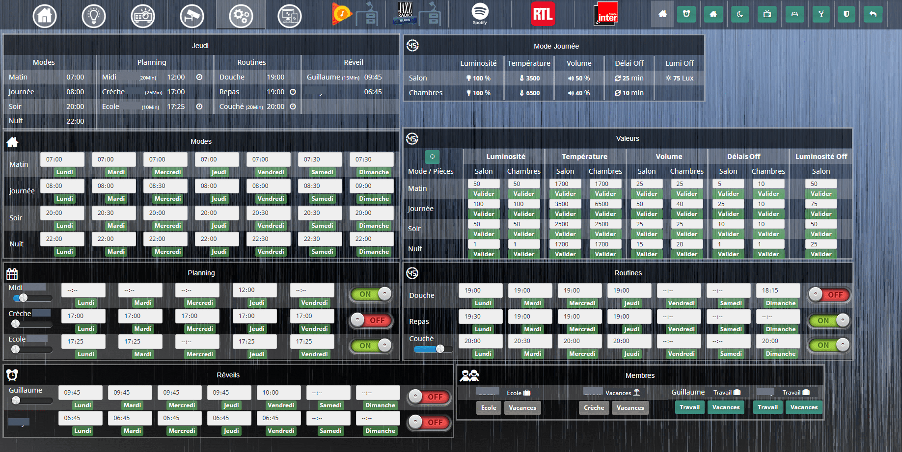

Design des Réglages Jeedom

Voilà, j’espère avoir été clair pour ce tutoriel sur le réglage automatique des lumières et des volumes dans Jeedom. Je suis conscient qu’il y a beaucoup d’étapes, mais si vous suivez bien le tuto, vous devriez y arriver sans trop de difficultés.

La rigueur sur le nom des commandes est primordiale pour bien se repérer et pour que tout fonctionne correctement.

Bien sûr, il faudra que vous adaptiez le nom des commandes en fonction de vos réglages.

Vous pouvez adapter les réglages en fonction de vos besoins comme la hauteur des volets, la couleur des lumières, la température des thermostats…

Ce concept permet vraiment d’automatiser la maison pour qu’elle s’adapte à votre mode de vie sans avoir à modifier plusieurs scénarios ou équipements, tout se fait depuis le Dashboard ou encore mieux via un [Design comme c’est le cas chez moi](./reglages-auto-Jeedom-28-1024x513.png).
