# Créer un Widget personnalisé

> Pour ce **tutoriel**, nous allons voir comment **créer un widget personnalisé pour Jeedom**, dans le but de créer des **boutons représentant l’appareil à contrôler**, en remplaçant l’icone par défaut proposé par Jeedom, par une **image personnalisée**.
>
> Le tutoriel se base sur un **bouton « On / Off »** que nous appliquerons à la nouvelle lampe Xiaomi Mijia bedside Lamp Wifi. La technique sera la même pour personnaliser d’autres types d’appareils.
>
> Un **débutant** devrait pouvoir réussir ce tuto **sans trop de difficultés,** en suivant bien les étapes les **unes après les autres**.
>
> Pour la réalisation du tutoriel, je vous **fournis** les images de la lampe Xiaomi Mijia bedside déjà **retouchées**, mais si vous voulez **créer vos propres images**, un logiciel de retouche type **Photoshop** sera nécessaire.
>
> _Ce tutoriel est basé sur le nouveau système de mise à jour des widgets et donc **compatible avec Jeedom 3.0 et +**._
>
> 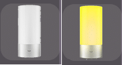
>
> Lampe éteinte et lampe allumée.

_La nouvelle lampe Xiaomi Mijia Bedside Lamp WiFi remplace le modèle bluetooth que je vous avais présenté dans l’article [Lampe de chevet Bluetooth Xiaomi Yeelight](/lampe-de-chevet-bluetooth-xiaomi-yeelight). Elle est 100% compatible Jeedom, grâce au plugin Xiaomi home._

Xiaomi Mijia Bedside Lamp WiFi – EU PLUG

## Préparation des images pour le Widget

Le principe de base est d’avoir **2 images**, l’une représentant **l’état allumé et l’autre l’état éteint**. Il est important qu’elles soient **superposables.** Donc, de **taille identique**, avec de préférence un **fond transparent**, pour avoir l’impression que c’est **l’image qui s’allume** et non une autre image qui la remplace.

_Pour simplifier le tutoriel, vous pouvez [télécharger les images](#modeles) pour la lampe Xiaomi Mijia Bedside._

### Récupération des images

*Si vous avez déjà des images remplissant les critères vus plus haut, vous pouvez aller directement à la partie [Création du Widget pour Jeedom](#creation-du-widget-pour-jeedom).* 

- **Rechercher une images**, exemple : [https://xiaomi-mi.com](https://xiaomi-mi.com/smart-lighting/xiaomi-yeelight-bedside-lamp/).
- **Sélectionner** une **première** image représentant la **lampe allumée**.
- Faire **clique droit** sur l’image puis **« Enregistrer l’image sous… »**.
- **Saisir un nom**, exemple : **« Widget_Bedside_ON.jpg »**.
- **Recommencer** l’opération pour une **seconde** image représentant la **lampe** **éteinte**.
- **Saisir un nom**, exemple : **« Widget_Bedside_OFF.jpg »**.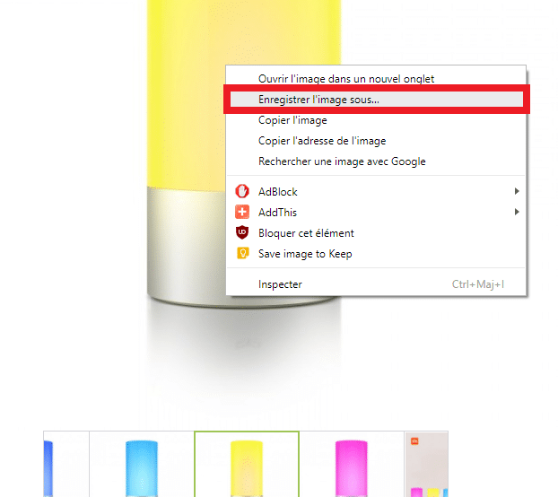

### Modifier l’image dans Photoshop

Afin d’avoir **2 images** parfaitement **superposables**, j’utilise des fonctions **très simples de Photoshop** qui peuvent être réalisées avec d’autres logiciels de retouche d’image. Chaque manipulation est **détaillé pas à pas** d’ou la longueur du paragraphe.

- **Ouvrir dans Photoshop les 2 images** précédemment téléchargées .
- **Ajuster la taille des images** pour qu’elles soient identiques.
  - Aller dans **« Image »**.
  - Puis dans **« Taille de l’image »**.
  - Saisir la **même taille** pour les 2 images.

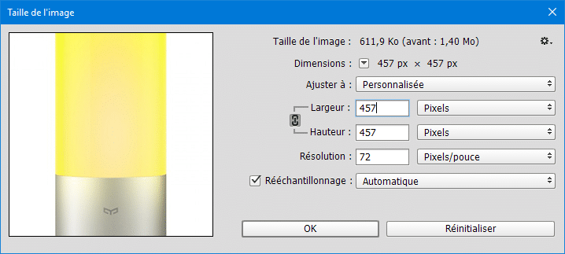

- **Rendre les images transparentes** pour pouvoir les superposer.
  - **Déverrouiller le calque** en cliquant sur le cadenas dans l’onglet **« Calques »**.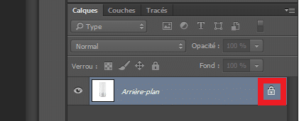
  - **Choisir « Produit »** dans la liste déroulante du mode de fusion.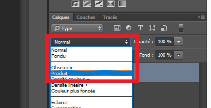
  - **Choisir** l’outil **« Baguette magique »**.
  - **Sélectionner** le **fond blanc** autour de la lampe. Si besoin ajuster la **« Tolérance »** et utiliser l’outil **« Gomme »**.
  - **Supprimer la sélection** avec la touche **« Suppr »** ou **« Edition / Effacer »**.
  - **Recommencez** l’opération pour **l’autre image**.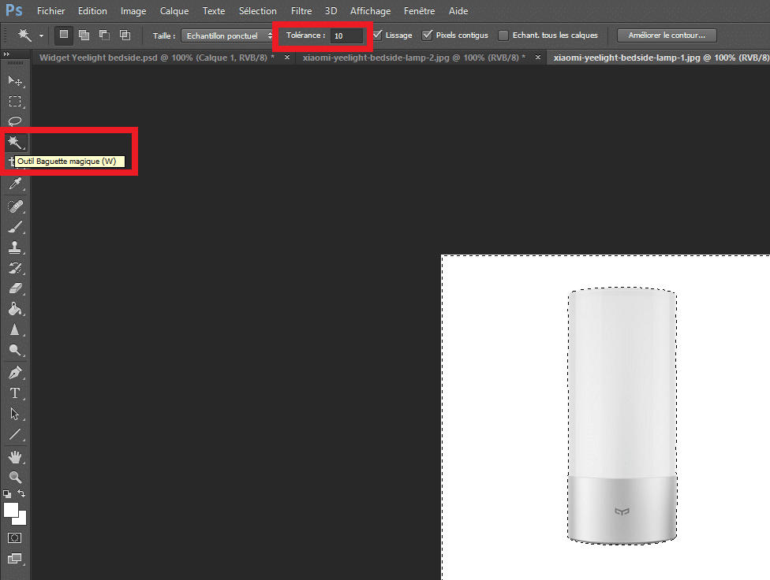

- **Superposer les images**
  - **Sélectionner** une des images. **« CTRL+A »** ou **« Sélection / Tout sélectionner »**.
  - **Copier** l’image. **« CTRL + C »** ou **« Edition / Copier »**.
  - **Aller** sur l’autre image.
  - **Coller** l’image.  **« CTRL + V »** ou **« Edition / Coller »**.
  - Un **second calque** est créé avec l’image collée.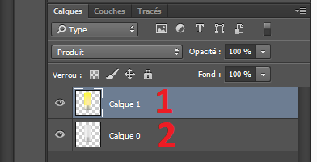
  - **Cliquer** sur un des calques.
  - Faire **« CTRL + T »** ou **« Edition / Transformation manuelle »**.
  - **Ajuster l’image** pour que les bords se **superposent** parfaitement à celle en transparence .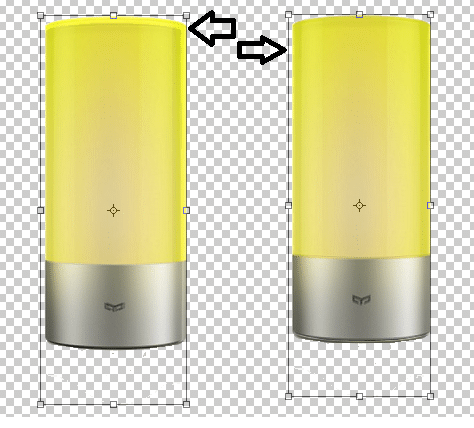
  - **Enregistrer le fichier** au format PSD.
  - **Saisir un nom**, exemple : **« Widget_Bedside.psd »**.
- **Enregistrer deux images distinctes,** une pour chaque état.
  - **Cacher un des calques** avec l’icone **« Oeil »**.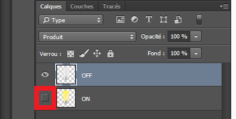
  - Faire **« Enregistrer sous »** au format PNG.
  - **Saisir un nom**, exemple : **« Widget_Bedside_OFF.png »**.
  - **Afficher l’autre calque** en inversant les icônes **« Oeil »**.
  - Faire **« Enregistrer sous »** au format PNG.
  - **Saisir un nom**, exemple : **« Widget_Bedside_ON.png »**.
- **Réduire la taille des images pour Jeedom.**
  - **Ouvrir** dans Photoshop les deux fichiers au format PNG.
  - **Aller** dans **« Image »**, **« Taille de l’image »**.
  - **Saisir** une **taille** appropriée pour Jeedom, exemple : **« 96 px \* 96 px »**.
  - **Enregistrer** les fichiers.

Vous pouvez télécharger les modèles en faisant un **« Clique droit »** sur les images et **« Enregistrer l’image sous… »**.

## Création du Widget pour Jeedom

Maintenant que nous avons nos **images** représentant chacune un **état (On / Off)** nous allons **créer le widget Jeedom**. Pour cela, il faut en premier lieu avoir **installé le plugin** gratuit **Widget**.

_Si ce n’est pas le cas, dans Jeedom allez dans : **« Plugins / Gestions des plugins / Market »** recherchez **« Widget »** cliquez sur **« Installer stable »** puis **« D’accord »** et sur **« Activer »**._

### Copier les images dans Jeedom

- Pour la

**copie des images**

- dans Jeedom

**deux possibilitée**

- s’offrent à vous :

  - - **La méthode officielle** : Consiste à **importer les images** qui seront stockés dans **un répertoire par widget**. Cette méthode est assez simple d’utilisation, mais je la trouve compliquée à gérer lorsqu’on a beaucoup de widgets.
      - Il suffit de **cliquer** sur le bouton « **Fichiers** » présent dans chaque widget.
    - **Ma méthode** : Elle consiste à **copier manuellement** et à **regrouper toutes les images** dans un **même répertoire,** ce qui est beaucoup plus simple à gérer lorsqu’on commence à avoir beaucoup de widgets et en plus, **les chemins** vers les images sont **toujours les mêmes**.
      - Pour cela j’utilise « **WinSCP** » qui permet d’avoir un **explorateur de fichiers** pour Jeedom, je trouve cette méthode simple et efficace et ça, j’aime bien. 🙂

_Si vous voulez utiliser la méthode officielle allez directement au paragraphe suivant, [Ajouter un Widget personnalisé à Jeedom](#ajouter-un-widget-personnalise-a-jeedom)._

- - - **Télécharger, installer, ouvrir WinSCP** :
      - [https://winscp.net/eng/download.php](https://winscp.net/eng/download.php)
    - **Protocole de fichier** : SFTP
    - **Nom** **d’hôte** : Ip de Jeedom
    - **Numéro de port** : 22
    - **Nom d’utilisateur** : Votre utilisateur SSH.
    - **Mot de passe** : Votre mot de passe SSH.
    - **Connexion** : Cliquez sur « **Connexion** ».

- - - **Aller** dans :
      -  **« /var/www/html/plugins/widget/core/ »**
    - **Faire** : clique droit **« Propriétés »**
      - **Ajouter** les droits en **lecture écriture**.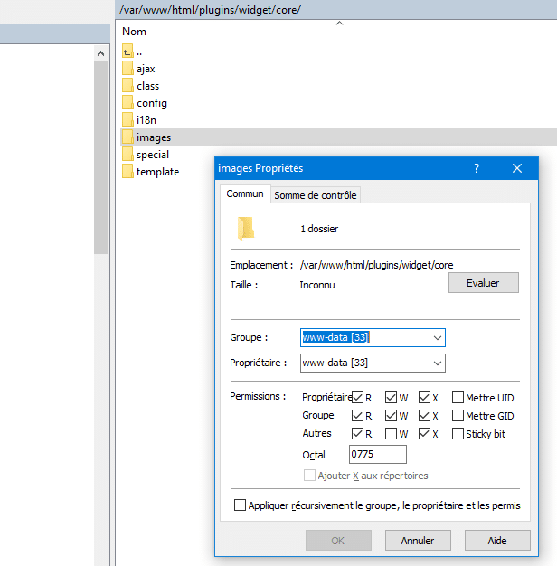
    - **Aller** dans :
      - **« /var/www/html/plugins/widget/core/images ».**

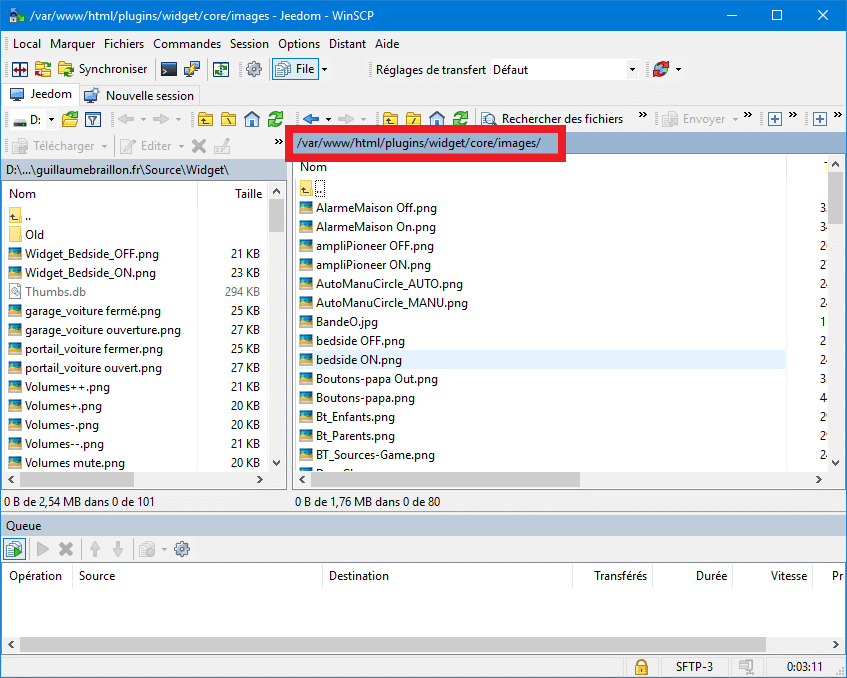

- - - **Copier les images** avec un simple glisser déposer.
    - **Cliquer sur OK** pour valider.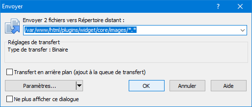

### Ajouter un Widget personnalisé à Jeedom

Il faut maintenant aller dans **Jeedom** et **ouvrir** le plugin **Widget** depuis **« Plugins / Programmation / Widget »** et nous allons créer un **nouveau widget** personnalisé pour Jeedom.

- - - **Cliquer** sur **« + Ajouter un widget »**.
    - **Saisir** les paramètres.
      - **Nom du widget** : Bedside_Lamp
      - **Version** : Dashboard
      - **Type** : Action
      - **Sous-type** : Défaut
    - **Cliquer** sur **« Ajouter »**.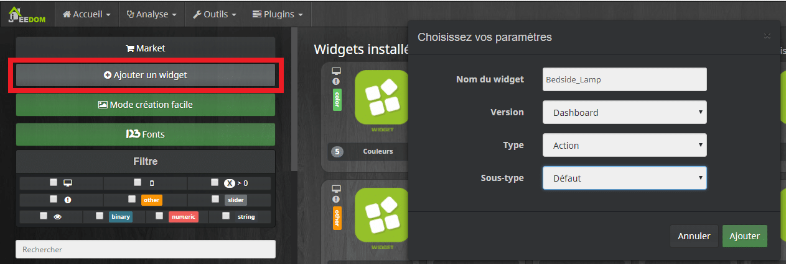

Votre **widget est créé**, mais il est **vierge.** Il va maintenant falloir lui **ajouter du code** pour qu’il fonctionne, c’est a dire, **afficher la bonne image** en fonction de l’état de la commande **« On/Off »**. Pour cela, on va **récupérer** un exemple de **code officiel** pour un widget destiné à la **gestion de la lumière** sur le Github de Jeedom.

- - - **Aller** sur : [https://github.com/jeedom/core/tree/stable/core/template/dashboard](https://github.com/jeedom/core/tree/stable/core/template/dashboard).
    - **Chercher** et **cliquer** sur [cmd.action.other.light.html](https://github.com/jeedom/core/blob/stable/core/template/dashboard/cmd.action.other.light.html "cmd.action.other.light.html").
    - **Sélectionner** le code qui ce trouve dans la fenêtre. _(Les lignes avec des numéros)._
    - Faire **« Clique droit »** et  **« Copier »**.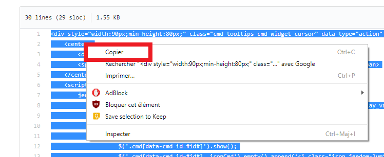
    - **Retourner** dans Jeedom et **coller le code** dans la fenêtre noire. 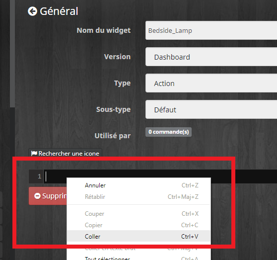
    - **Sauvegarder**.

A ce stade vous avez créé **un widget identique au widget light par défaut**, vous pouvez voir le résultat dans l’aperçu en haut à droite. 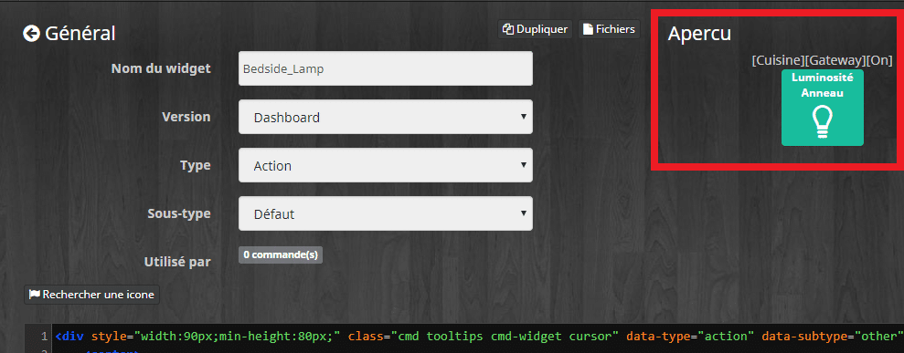

Nous allons le **modifier** pour qu’il affiche les **images** que nous avons **copié** précédemment dans le **répertoire images de Jeedom**. Il suffit de donner le **chemin des images** pour l’état **« On »** et pour l’état **« Off »**.

**_Attention : Si vous utilisez la méthode officielle en ajoutant les images en cliquant sur le bouton « Fichiers », il faudra saisir les chemins correspondants._**

- - - **Chercher** la ligne :
      - `` `$('.cmd[data-cmd_id=#id#] .iconCmd').empty().append(` ``**‘<i class= »icon jeedom-lumiere-on »></i>’**`);`
    - **Remplacer** :
      - **<i class= »icon jeedom-lumiere-on »></i>**
      - par le **chemin** de l’image correspondant à l’état **« On »**.
      - **``**
    - **Recommencer** l’opération en **remplacent** :
      - **`<i class="icon jeedom-lumiere-off"></i>`** 
      - par le **chemin** de l’image correspondant à l’état **« Off »**.
      - **``**
    - **Sauvegarder**.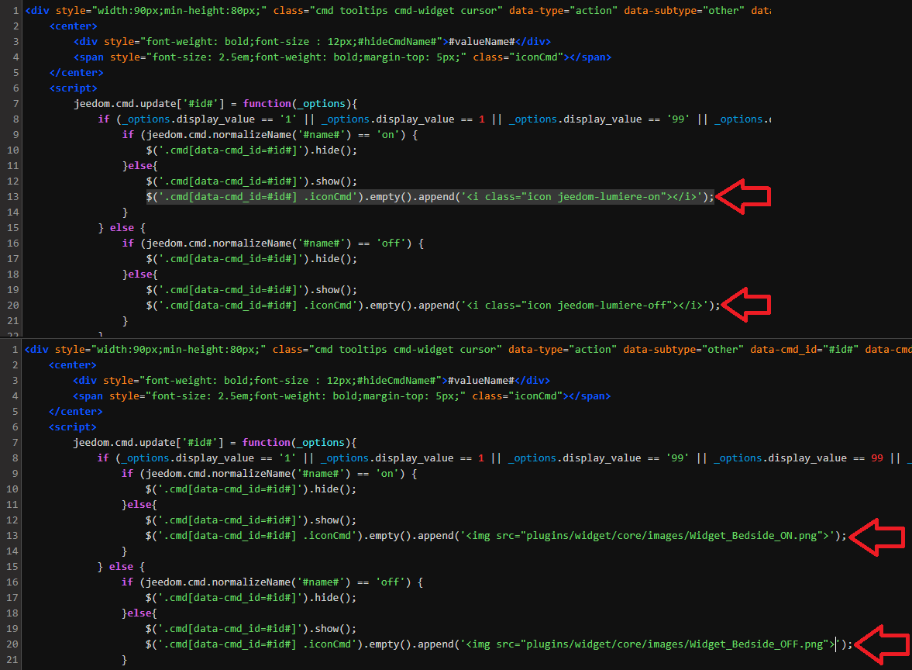

### Associer le Widget personnalisé à une commande Jeedom

Il ne reste plus qu’à **associer** le widget aux **commandes « On »** et **« Off »** de la lampe Xiaomi Mijia Bedside.

- - - **Cliquer** en haut à droite sur **« Appliquer sur des commandes »**.
    - **Rechercher** les commandes à l’aide des filtres si besoin.
    - **Cocher** les cases à gauche des commandes **« On »** et **« Off »**.
    - **Valider**.
    - **Sauvegarder**.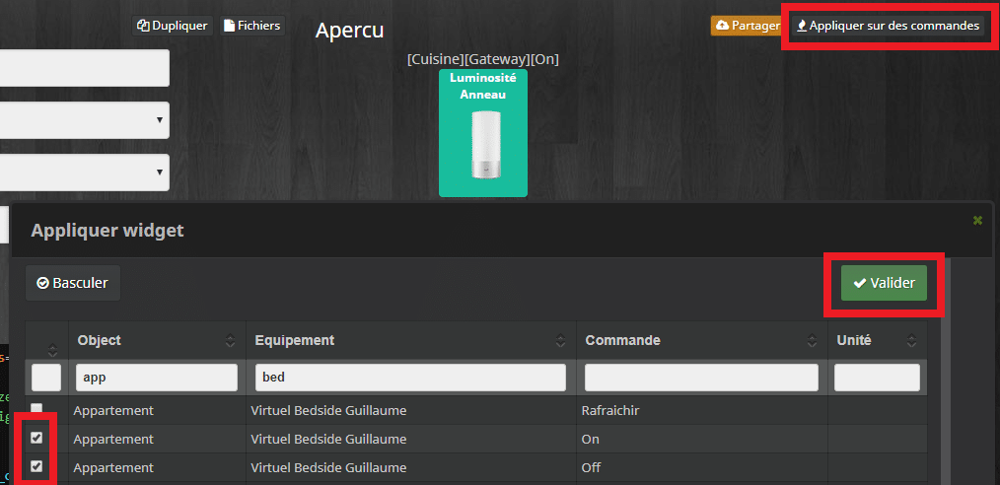

## Dupliquer un Widget personnalisé dans Jeedom

Maintenant que vous avez créé votre premier **Widget personnalisé** pour Jeedom, vous pouvez le **dupliquer** pour créer **facilement** d’autres widgets.

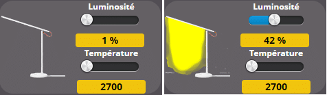

Exemple pour la lampe de bureau Xiaomi Mijia Desk Lamp.

- - - **Copier** les images du **nouveau** widget dans le répertoire images de Jeedom.
      - Pour **simplifier** les choses, donner un **nom proche** pour chacun des fichiers.
        - **« Widget_Bedside_ON.png »** devient **« Widget_MiDesk_ON.png ».**
    - **Dupliquer** le widget depuis le **plugin** Widget.
      - **Cliquer** sur le widget à dupliquer.
      - **Cliquer** sur le bouton **« Dupliquer »**.
      - **Saisir** les paramètres.
        - **Nom du widget** : MiDesk_Lamp
        - **Version** : Dashboard
        - **Type** : Action
        - **Sous-type** : Défaut
      - **Cliquer** sur **« Ajouter »**.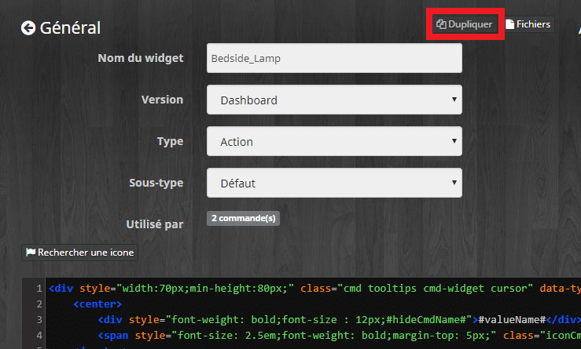
    - **Modifier** le nom des fichiers **« On »** et **« Off »**.
      - **Chercher** la ligne :
        - `` `$('.cmd[data-cmd_id=#id#] .iconCmd').empty().append(` ``**‘’**`);`
      - **Remplacer** simplement **« Bedside »** par **« MiDesk »**.
      - **Modifier** aussi le **chemin** pour l’image de l’état **« Off »**.
    - **Sauvegarder**.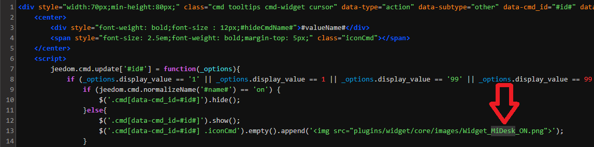

## Conclusion

J’espère que ce **tutoriel** vous aura permis de vous **familiariser** avec les **Widgets** pour que vous puissiez facilement **personnaliser** l’affichage de **Jeedom**.

Cet **article** n’est pas très **long** à lire, \[rt_reading_time\] minutes. Il y a beaucoup **d’étapes** détaillées **pas à pas**, mais au fond, c’est assez **simple** à réaliser.

J’utilise cette technique depuis le passage de **Jeedom en version 3.2**, car les **anciens widgets** ne fonctionnent plus, ils se **dédoublent** à chaque action.

N’hésitez pas à **chercher** des [**sources d’images**](/articles/banque-dimages-widgets-et-designs) sur les **sites des constructeurs**, par exemple les notices **Ikea** sont très **pratiques** pour **créer des images** comme la lampe [BAROMETER](https://www.ikea.com/fr/fr/assembly_instructions/barometer-lampadaire-liseuse__AA-233210-6_pub.pdf).

Un petit coup de **pinceau** et votre image **s’allume.** 😉

[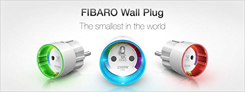](https://amzn.to/2r4Aa1w)

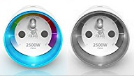 Prise allumée, prise éteinte.

Sinon en prenant une **image couleur** et en la **transformant** en **noir et blanc**, vous pouvez facilement avoir une image **superposable** avec les **2 états**.
