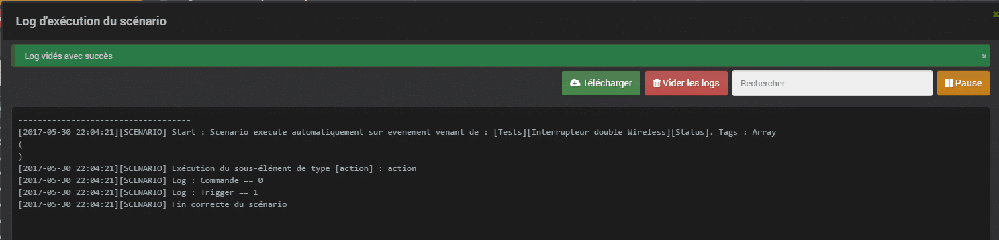
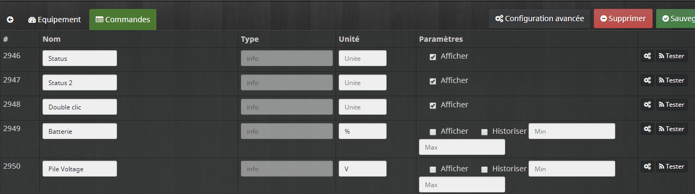
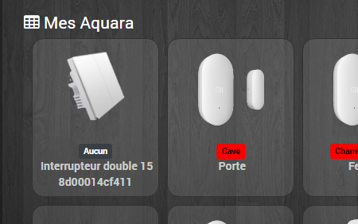
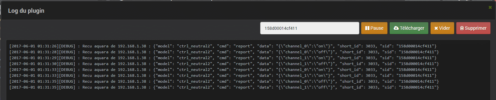
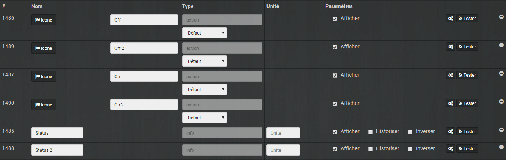

# Xiaomi Aqara Wall Switch

> **Les interrupteurs muraux Xiaomi Aqara Wall Switch** , sont **compatible** avec la box domotique **Jeedom**, voyons comment les intégrer.
>
> Les **Xiaomi Aqara Wall Switch** à ne pas confondre avec l’interrupteur bouton Xiaomi, utilisé dans l’article [Jeedom Scénario – Bouton Switch Xiaomi](/articles/jeedom-scenario-bouton-switch-xiaomi).
>
> La gamme d’interrupteurs **Aqara** que propose **Xiaomi,** est un peu plus cossue que sa petite sœur et propose une **variété de modèles** permettant de répondre à de **nombreuses situations**.
>
> _**Une présentation des interrupteurs muraux Xiaomi Aqara Wall Switch est disponible ici : [Les interrupteurs muraux Xiaomi Aqara Wall Switch](/articles/les-interrupteurs-muraux-xiaomi-aqara-wall-switch).**_

## L’interrupteur Wireless double bouton

Sous Jeedom, **les interrupteurs remontent automatiquement** avec comme commandes le niveau des piles, ainsi que **le statu de l’interrupteur,** ce qui est étrange, car il y a **2 boutons,** cela signifie que l’on a pas un **retour d’état** très intelligent. On aura seulement la **dernière action** effectuée sur l’un des deux boutons.

Il faut que vous sachiez que **les interrupteurs sans fil à double et simple boutons, ne sont pas encore totalement intégrés dans le plugin** dans sa version 2.4 du 2017-04-10 01:07:48.

Ils devraient l’être dans la **prochaine mise à jour du plugin** Xiaomi… Je ne manquerai pas de vous en informer, alors n’hésitez pas à vous **abonner au blog**  *(Voir en haut à droite) pour être prévenu*.

On voit bien dans les **Logs** du plugin que les différentes **commandes** sont **reconnues**.

Pour le moment, la **seule action possible,** c’est le **simple clic à gauche** et en plus, il n’y a pas de statut récupéré, la commande est toujours égale à 0.

Chose étrange, il est tout de même possible de lancer un **scenario** sur un événement **provoqué** par le **statut** de l’interrupteur.

La fonction trigger() fonctionne correctement.

Apparemment, c’est un **bug** dans le **plugin** qui devrait être solutionné dans la **prochaine mise à jour** du plugin ([Cf forum](https://www.jeedom.com/forum/viewtopic.php?f=182&t=23382&start=2540#p460225)), pour pouvoir gérer les 3 actions de la même façon que sur l’application Mi-Home, comme c’est indiqué dans la doc : « *commande statut pour chaque interrupteur (click, double_click) et si double une commande qui donne l’appui simultané, batterie et voltage*« .

### Édit du 21/09/2017

La mise à jour **1.4.1_150.0143** corrige le problème du **bouton gauche**.

Info : Pour que le **double clic** déclenche les scénarios il faut mettre « **Gestion de la répétition** » à « **Toujours répéter** » dans la configuration de la commande « **Double clic**« .

### Edit du 04/09/2017

Depuis l’écriture de mon article il y a eu beaucoup de mises à jours de la Gateway, de Mi-home et du plugin Xiaomi. Je vais donc faire un petit retour sur se que je disait état des lieux :

1.  « On aura seulement la **dernière action** effectuée sur l’un des deux boutons. »
    - Ce n’est plus le cas car maintenant il y a un statut par bouton et un statut pour le clic simultané.
2.  « La **seule action possible,** c’est le **simple clic à droite.**« 
    - **Lors d’un clic sur le bouton gauche** : Rien ne se passe sous Jeedom, les logs sont vides. C’est l’API qui n’envoie pas l’information à Jeedom donc impossible de récupérer l’action.
    - **Lors d’un clic sur le bouton droit** : Il y a bien des logs et le statut du bouton droit passe bien à « click ». Pour infor il reste toujours à « click », il faut donc bien utiliser la fonction trigger() dans les scénarios.
      - `[2017-09-04 19:14:21][DEBUG] : {u'model': u'86sw2', u'cmd': u'report', u'data': u'{"channel_1":"click"}...`
    - **Lors d’un clic simultané sur les 2 boutons** : Il y a bien des logs et le statut « Double clic » passe bien à « both_click ». Par contre cette action ne déclenche pas les scénarios. Il n’est pas non plus possible de l’utiliser via « Action sur la valeur » dans la configuration de la commande car l’état ne change pas il reste toujours à « both_click ».
      - `[2017-09-04 19:14:23][DEBUG] : {u'model': u'86sw2', u'cmd': u'report', u'data': u'{"dual_channel":"both_click"}...`

## L’interrupteur Encastrable double bouton

Sous Jeedom, les **interrupteurs** remontent **automatiquement**.

Ces modèles sont **mieux intégrés dans le plugin Xiaomi,** car les 2 boutons sont pris en compte. Par contre, **l’action** clic sur les **2 boutons en même temps** n’est **pas disponible** comme on peut le voir dans les **Logs** à « 01:31:33 et 01:31:35 ». Les clics simultanés sont interprétés comme des clics séparés.

Le **fonctionnement** aussi est **différent.** On n’est plus sur un statut indiquant la dernière action de l’interrupteur (gauche, droite, les deux), mais bien sur **un statut par bouton,** ce qui permet d’avoir un **retour d’état** plus **intelligent**.

### Edit du 04/09/2017

Depuis l’écriture de mon article il y a eu beaucoup de mises à jours de la Gateway, de Mi-home et de Jeedom. Je vais donc vous faire un petit état des lieux.

1.  **« Dans l’application une partie importante est en chinois, c’est lorsque l’on veut choisir le bouton à prendre en compte dans la scène. »**
    - C’est toujours le cas le texte n’est toujours pas traduit en anglais.
    - Il y a aussi 2 nouvelles options qui sont en chinois, elles permettent de désactiver les boutons physiquement et ne laisser que l’action via l’application mi home et Jeedom.
2.  **« L’action** clic sur les **2 boutons en même temps** n’est **pas disponible. »**
    - C’est toujours le cas dans Jeedom le double clic n’est pas pris en compte alors qu’il l’est sur Mi-home.
3.  Question de **maxime** : *« En cas de coupure réseau peut-on l’utiliser comme un interrupteur classique ? »*
    - Oui, j’ai débranché la gateway et l’interrupteur fonctionne comme un interrupteur classique.

On est toujours sur un **produit Xiaomi** et donc, de **bonne qualité.** Le **design** est plus sympa que les boutons rond Switch Xiaomi que [je vous avais présenté](/articles/jeedom-scenario-bouton-switch-xiaomi) il y a quelque temps. Si je devais apporter une **critique**, à ce niveau, ce serait éventuellement pour le **bruit** des **boutons** qui est assez **claquant** et qui pourrait déranger certains.

On ne peut pas non plus éviter de mettre un **petit bémol** sur les **versions encastrables carrées** qui sont assez difficiles à faire rentrer dans nos boites d’encastrement rondes. Mais n’oublions pas que ce sont des **produits** prévus à l’origine pour le **marché chinois**.
