# Xiaomi Roborock S50

> Comme l’aspirateur **Mi-Robot de Xiaomi** l’aspirateur Robot Xiaomi Roborock S50 est **compatible** avec la box domotique **Jeedom**, grâce au **plugin** Xiaomi de [Sarakha63](http://sarakha63-domotique.fr/) et [Lunarok](https://lunarok-domotique.com/), voyons comment l’intégrer.
>
> _**Une présentation de l’aspirateur Robot Xiaomi Roborock S50 est disponible ici : [Aspirateur Robot Xiaomi Roborock S50](/articles/aspirateur-robot-xiaomi-roborock-s50).**_

## Associer l’aspirateur Robot Xiaomi Roborock S50 à Jeedom

Pour **associer** le Roborock à **Jeedom** vous pouvez **lire la doc officiel** qui se trouve sur [github](https://lunarok.github.io/jeedom_docs/plugins/xiaomihome/wifi.html) mais en **complément**, je vais vous détailler la **méthode** qui utilise [l’outil Mi Toolkit](https://github.com/ultrara1n/MiToolkit/releases).

### Récupérer le token de l’aspirateur Robot Xiaomi Roborock S50

Contrairement à d’**autres** composants qui sont **automatiquement** détectés par le plugin Xiaomi, certains **appareils wifi**, comme les aspirateurs, nécessitent de **récupérer le token** enregistré dans l’application Mi-home.

_**Avant toute chose, sachez que Xiaomi ne permet plus de récupérer les tokens sur les dernières version de l’application Mi-home.**_

Il faudra donc installer une **ancienne version de Mi-home** sur un vieux smartphone par exemple. Chez moi je l’ai installé sur le smartphone qui me sert à envoyer des SMS via JPI.

- **Aller** sur [APK-Mirror](https://www.apkmirror.com/apk/xiaomi-inc/mihome/mihome-5-0-9-release/mihome-5-0-9-android-apk-download/).
- **Télécharger** une **ancienne version**. (J’utilise la [5.0.9 beta](https://www.apkmirror.com/apk/xiaomi-inc/mihome/mihome-5-0-9-release/mihome-5-0-9-android-apk-download/download/)).
- **Désinstaller Mi-home** si vous aviez une **version récente**.
- **Installer** en cliquant sur l’APK.
- **Connectez** vous avec vos **identifiants** Xiaomi.

Vous devriez voir vos **composants Xiaomi**, dont **l’aspirateur** si vous l’aviez déjà connecté à la Mi-Home.

**Cliquez** sur l’aspirateur pour **l’ouvrir** afin d’être certains qu’il est bien **actif** dans l’application Mi-home.

Maintenant pour **récupérer le token** il va falloir activer les **options développeur** et **l’ADB** (débogage USB) sur le smartphone.

- **Brancher** votre téléphone **Android** au PC via le port **USB**.
- Aller dans le menu **« Paramètres »** du téléphone.
- Aller dans **« A propos du téléphone »**. 
- **Cliquer** plusieurs fois sur **« Numéro de build »**, jusqu’au message d’information. 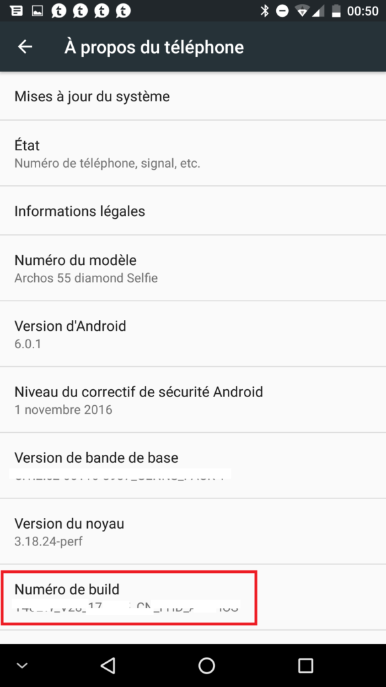
- Aller dans le **nouveau** menu : **« Options pour les développeurs »**.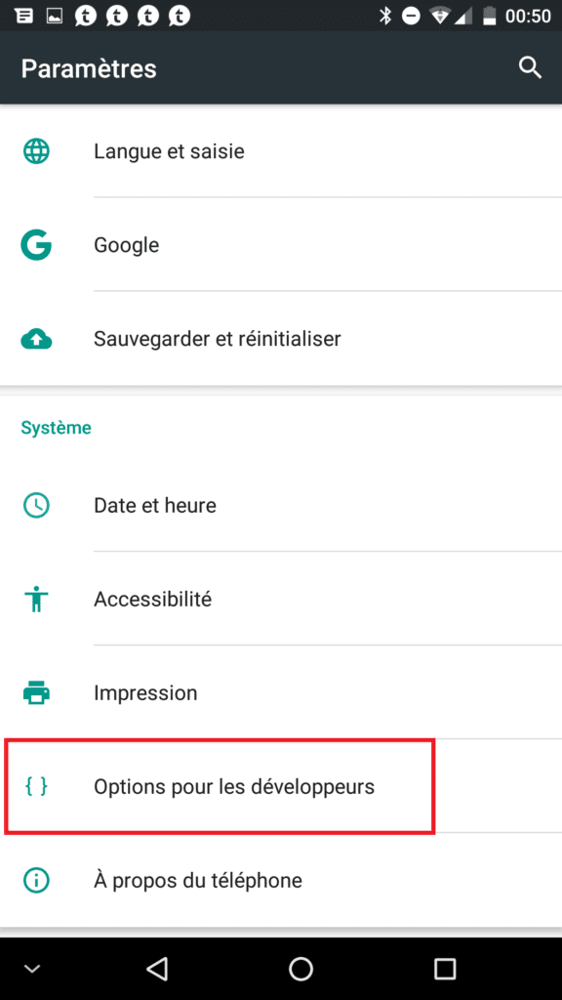
- **Cocher** « Débogage USB ».
- **Cliquer** sur « OK ».

Votre **Smartphone** est **prêt** pour la récupération du **token**. Nous allons maintenant utiliser un logiciel qui va **extraire** le **token** de l’application Mi-home.

- **Télécharger** l’application [MiToolkit](https://github.com/ultrara1n/MiToolkit/releases), version actuel **[MiToolkit.1.6.zip](https://github.com/ultrara1n/MiToolkit/releases/download/1.6b/MiToolkit.1.6.zip).**
- **Décompresser** le fichier sur votre **ordinateur**.
- Lancer l’application **MiToolKit** en mode **Administrateur**.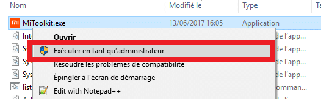
- **Cliquer** sur le drapeau **« Allemand »** et choisir **« English »**.
- **Attendre** que l’application **redémarre**.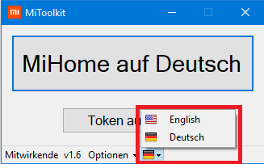
- Cliquer sur « **Extract Token** » sur la **première** fenêtre.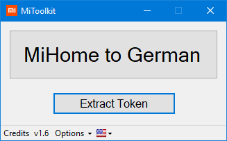
- Cliquer sur « **Extract Token** » sur la **seconde** fenêtre.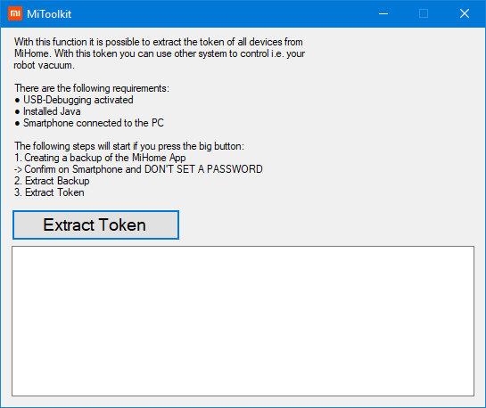
- **Cliquer** sur « OK ». _(Ne pas mettre de mot de passe pour la sauvegarde)._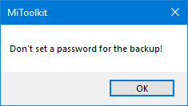
- Mi Home **s’ouvre** sur votre téléphone.
- **Cliquer** sur **« Sauvegarder mes données »**
- **Cliquer** sur « OK ». _(Sauvegarde réussie, démarrage de l’extraction)._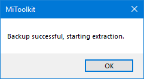
- **Récupérer** le token à la ligne « **roborock.vacuum.s5 – \[Nom de l’aspirateur\] – \[Token\] – \[Ip de l’aspirateur\]**« .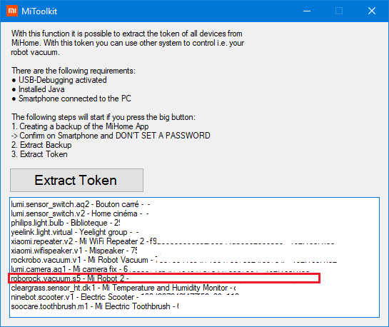
  - Si vous ne voyez pas la ligne du Roborock, il faut vous **déplacer avec les flèches haut et bas du clavier**.
  - Ne **pas copier l’adresse IP** qui se trouve après le token.
  - Ne **pas sélectionner d’espace** avant ou après le token.

### Installation du plugin Jeedom Xiaomi Home

Maintenant, il faudra **installer** dans Jeedom le **plugin Xiaomi.** Si vous ne l’avez pas encore fait, je vous invite à **lire l’article** dédié [Jeedom et Xiaomi Smart Home – Installation et configuration du plugin Xiaomi](/articles/installation-et-configuration-du-plugin-xiaomi) pour l’installation et la configuration.

### Ajouter l’aspirateur Robot Xiaomi Roborock S50 à Jeedom

Maintenant que nous avons notre token, il ne reste plus qu’à **ajouter l’aspirateur à Jeedom**.

- Allez dans **Jeedom** et depuis le **plugin** Xiaomi, cliquer sur **« Ajouter »**.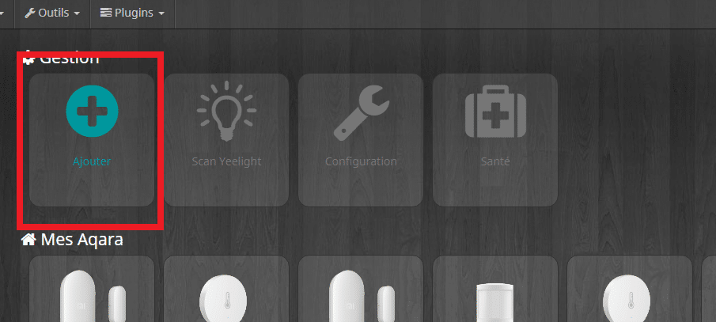
- **Donner** un nom au robot, exemple **« Mi-Robot 2 »**.
- **Sélectionner** « Robot Aspirateur V2 ».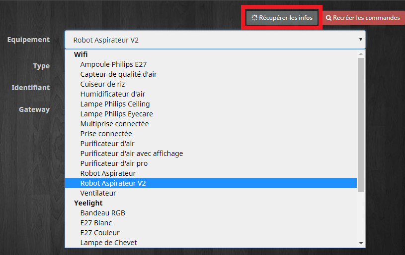
- **Saisir** l’IP et le Token.
- **Cliquer** sur « sauvegarder ».
- **Cliquer** sur « Récupérer les infos ».
- Le choix de **l’équipement** doit se **griser** une fois l’aspirateur reconnu.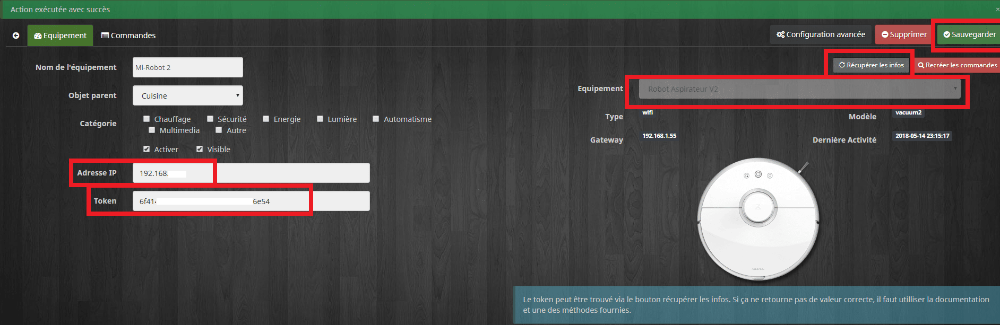

\
