# Zone Aspirateur Robot dans Jeedom

Dans ce tutoriel, nous allons voir comment **gérer les zones pour les aspirateurs robots Xiaomi** prise en charge par le plug-in Xiaomi Home de [Lunarok](https://lunarok-domotique.com/2017/01/xiaomi-home-presentation/) et [Sarakha63](http://sarakha63-domotique.fr/). Ce dernier a d’ailleurs proposé sur [son blog](http://sarakha63-domotique.fr/piloter-votre-aspirateur-xiaomi-zone-par-zone-meme-apres-une-rotation-de-la-carte/) un article de [Patrick Carl](https://www.carle.fr/) qui a depuis apporté des [modifications](https://www.carle.fr/domotique/13-pilotez-votre-aspirateur-roborock-zone-par-zone-et-gerez-les-rotations.html) que je vous invite vivement à regarder.

Si vous utilisez déjà les **aspirateurs [Mi-Robot](/articles/aspirateur-robot-xiaomi-mi-robot#pricing) ou [Roborock](/articles/aspirateur-robot-xiaomi-roborock-s50#pricing) de Xiaomi**, vous savez déjà ce qu’est le nettoyage par zone. Pour les autres, cela permet de **définir des zones de la maison**. Ces zones peuvent être des pièces comme la salle de bain ou le salon, mais aussi des zones a proprement parler comme sous la table de la cuisine ou sous la table basse du salon. Nous allons voir comment définir les zones de la maison pour pouvoir **démarrer** **l’aspirateur pour** **le nettoyage via Jeedom**.

Grâce à **une carte représentant votre logement**, mais aussi grâce à Google Assistant pour utiliser une **Google Home** ou simplement la commande vocale de votre smartphone.

-  **Côté Software**, j’utilise les plug-ins :
  - [Xiaomi Home](https://www.jeedom.com/market/index.php?v=d&p=market&type=plugin&categorie=&&name=xiaomi%20home) (6€).
  - [Virtuel](https://www.jeedom.com/market/index.php?v=d&p=market&type=plugin&name=Virtuel&certification=Officiel&&categorie=programming) (Gratuit).
  - [Ifttt](https://ifttt.com) (Gratuit) (Tiers).

- **Côté hardware**, j’utilise :
  - Aspirateur Roborock S50 (S5).
  - Google Home Mini.

## Création du Virtuel dans Jeedom

Le virtuel contient **les commandes** pour chacune **des zones** que vous aurez prédéfinies. Deux commandes, **« Base Horizontale »** et **« Base Verticale »** permettent de définir l’emplacement de la base de chargement. Deux commandes **« Test Horizontal »** et **« Test Vertical »** permettent de tester l’exactitude des valeurs lors de la création des zones. Une commande **«** **rotation_map »** qui permet d’ajuster l’orientation des zones en cas de recréation de la carte dans Mi-Home. 

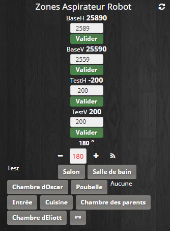

Virtuel Zone Aspirateur Robot (Avant mise en forme)

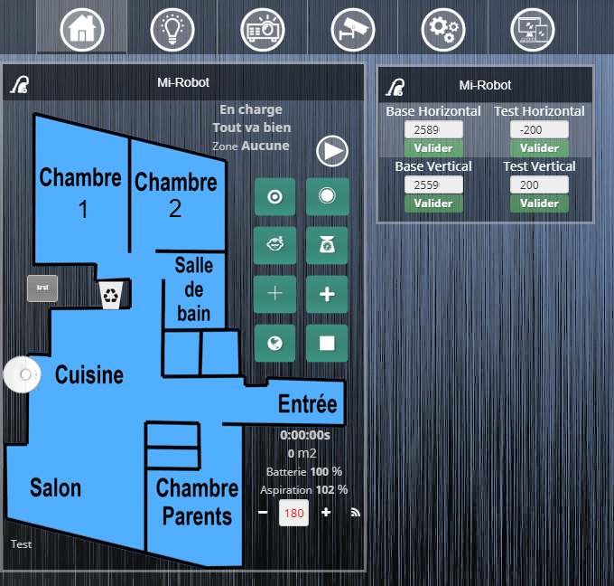

Virtuel Zone Aspirateur Robot (Après mise en forme)

- Aller dans Plugins/Programmation/Virtuel.
- Cliquer sur Ajouter.
- Nommer le virtuel.
  - Exemple : **« Zones Aspirateur Robot ».**
- Sélectionner un Objet parent, une Catégorie et cocher Activer & Visible.
- **Sauvegarder.**

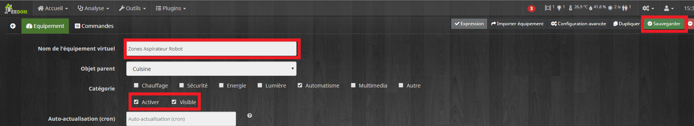

Virtuel Zone Aspirateur Robot dans Jeedom

### Création des commandes pour les zones.

- Aller dans l’onglet Commandes.
- Cliquer sur **« Ajouter une commande virtuelle »** autant de fois que de zones, plus une.
  - Dans mon cas 10 fois.
- Nommer les commandes avec le nom de zones **« Entrée », « Cuisine », « Salon »… et « Aucune »**.
  - Dans Nom information saisir **: « Zone »**.
  - Dans Sous-Type choisir **: « Défaut».**
  - Dans Valeur saisir **: « le nom de la zone »**. Exemple : Entrée.
- **Sauvegarder.**
- Lier la nouvelle commande info **« Zone »** aux commandes Action.
- Sélectionner le Sous-Type : **« Autre »** pour la commande info **« Zone ».**
- **Sauvegarder.**

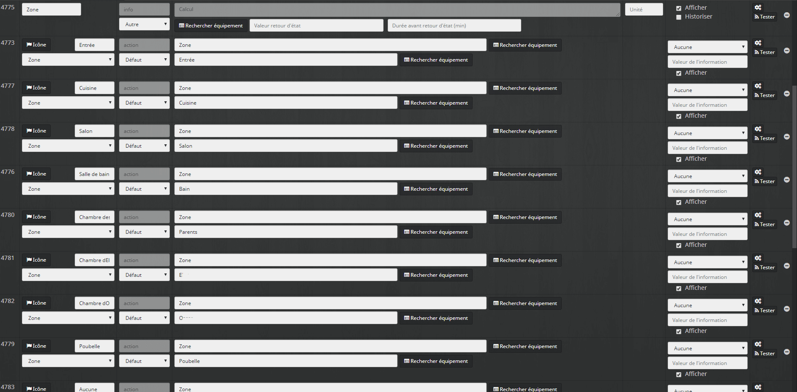

Création des Zones

La commande info **«Zone**», correspond à la **zone sélectionnée pour le nettoyage**, elle est mise à jour par les commandes actions et permet de déclencher le scénario.

### Création des commandes pour la rotation de la carte.

- Cliquer sur **« Ajouter une commande virtuelle »**.
- Nommer la commande **« Rotation Map »**.
  - Dans Sous-Type choisir **: « Curseur ».**
  - Dans Nom informationsaisir **« rotation_map »**.
- **Sauvegarder.**
- Lier la nouvelle commande info **« rotation_map »** à la commande Action.
  - Sélectionner le Sous-Type : **« Numérique ».**
  - Dans Unité saisir **« ° ».**
  - Dans Min Max, saisir **« 0 »** et **« 360 ».**
- **Sauvegarder.**

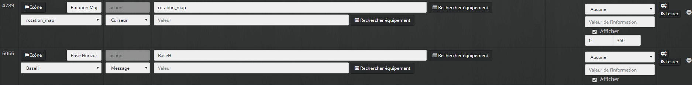

Rotation de la carte

La commande info **« rotation-map »** correspond à **l’angle de rotation de la carte** en cas de régénération sur Mi-Home à la suite d’un décalage de la station de recharge ou de la réinitialisation de la carte. La commande action **Rotation Map** permet de sélectionner l’angle de rotation.

### Création des commandes pour le testeur de coordonnées.

- Cliquer sur **« Ajouter une commande virtuelle »**.
- Nommer la commande **« Test »**.
  - Dans Sous-Type choisir **: « Défaut ».**
  - Dans Nom information saisir **: « Zone »**.
  - Dans Valeur saisir **: « Test »**.
- Lier la commande à la commande info **: « Zone »**.
- **Sauvegarder.**
- Cliquer 2 fois sur **« Ajouter une commande virtuelle »**.
- Nommer les commandes **« Test Horizontal »** et **« Test Vertical »**.
  - Dans Sous-Type choisir **: « Message ».**
  - Dans Nom information saisir **: « TestH»** pour Test Horizontal et **« TestV »** pour Test Vertical.
- **Sauvegarder.**
- Lier les nouvelles commandes infos **« TestH et TestV »** aux commandes correspondantes.
- Sélectionner les Sous-Types : **« Autre ».**
- **Sauvegarder.**

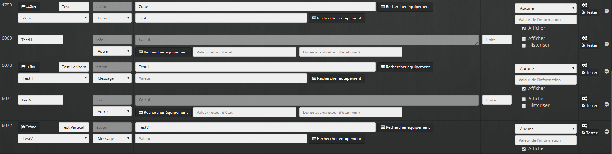

Testeur de coordonnées

La commande action **« Test »** permet de lancer le scénario pour vérifier les valeurs sur l’application Mi-Home sans que le nettoyage démarre chaque fois, utile pour le paramétrage des zones.

Les commandes action **« Test Horizontal »** et **« Test Vertical »** permettent de saisir les valeurs qui seront affichées sur l’application Mi-Home.

### Création des commandes pour la base de chargement.

- Cliquer 2 fois sur **« Ajouter une commande virtuelle »**.
- Nommer les commandes **« Base Horizontale »** et **« Base Verticale »**.
  - Dans Sous-Type choisir **: « Message ».**
  - Dans Nom information saisir **: « BaseH»** pour Test Horizontal et **« BaseV »** pour Test Vertical.
- **Sauvegarder.**
- Lier les nouvelles commandes infos **: « BaseH et BaseV »** aux commandes correspondantes.
- Sélectionner les Sous-Types : **« Autre ».**
- **Sauvegarder.**

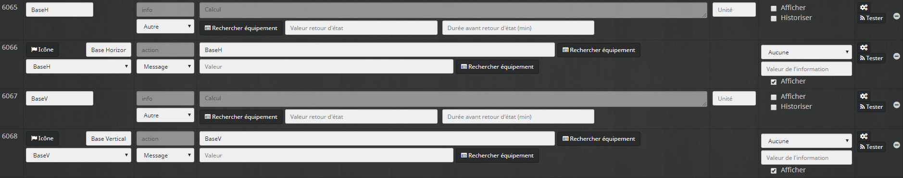

Commandes pour la base de chargement

Les commandes action **« Base Horizontale »** et **« Base Verticale »** permettent la saisie des valeurs correspondantes à l’emplacement de la base de rechargement, c’est le point de repère pour le calcul des zones.

Voilà pour le virtuel, pour les commandes **« Message »** vous pouvez appliquer le widget **[« Saisie Nombres »](https://www.jeedom.com/market/index.php?v=d&p=market&type=widget&&name=numbers)** que j’ai mis en ligne sur le Market.

Nous verrons plus bas la mise en place de la carte cliquable.

## Création du scénario dans Jeedom

Le scénario va contenir des **blocs simples**, mais aussi des **blocs codes** pour les **fonctions de calcul** des zones ou pour le **formatage des valeurs** envoyées par Google Assistant. Ceux qui ont du mal avec les blocs codes, ne vous inquiétez pas, je vais vous **détailler chaque partie**. Pour la mise en place de ce tutoriel, je prendrais comme **exemple** la poubelle pour le **nettoyage ciblé** et l’entrée pour le **nettoyage par zone**. J’ai découpé le scénario en plusieurs parties pour que vous puissiez plus facilement vous repérer.

- Aller dans Outils/Scénarios.
- Cliquer sur Ajouter.
- Nommer le scénario **« Zone Aspirateur Robot ».**
- Sélectionner un Groupe, Objet parent, une Catégorie et cocher : «Activer» & «Visible».
- Laisser le Mode de scénario sur **« Provoqué »**.
- Cliquer sur **« + Déclencher ».**
- Ajouter la commande **« Zone »** du virtuel **« #\[Cuisine\]\[Zones Aspirateur Robot\]\[Zone\]#».**
- Aller dans l’onglet Scénario.
- Cliquer sur **« + Ajouter Bloc »** pour ajouter un nouveau bloc**.**
- Sélectionner : **« Si/Alors/Sinon ».**
- **Enregistrer.**

```js
SI #[Appartement][Home Capteurs][Etat_Aspirateur]# == 1 ALORS
```

- Ajouter une commande action en cliquant sur **« + Ajouter »** et **« Action ».**

```js
Action : #[Cuisine][Mi-Robot 2][Pause]#
```

Ici, on **vérifie si l’aspirateur est en cours d’utilisation**. Si c’est le cas, on stoppe l’aspirateur pour qu’il puisse recevoir les nouvelles instructions de nettoyage.

La commande **« Etat_Aspirateur »** **n’est pas disponible dans le plug-in Xiaomi**, mais vient d’un virtuel que j’ai créé avec seulement **une commande info** et qui est mis à jour via un scénario en fonction du statut de l’aspirateur.

_Ceci est facultatif, mais beaucoup plus pratique que d’ajouter tous les statuts possibles._

**Exemple de scénario pour l’état de l’aspirateur :**

```
SI #[Cuisine][Mi-Robot 2][Statut]# == "En nettoyage" OU #[Cuisine][Mi-Robot 2][Statut]# == "Nettoyage de Zone" OU …
ALORS
Action : event Commande : #[Appartement][Home Capteurs][Etat_Aspirateur]# Valeur : 1
SINON
Action : event Commande : #[Appartement][Home Capteurs][Etat_Aspirateur]# Valeur : 0
```

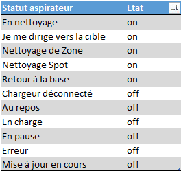

Tableau avec la majorité des statuts des l'aspirateurs robot Xiaomi

- Cliquer sur **« Ajouter Bloc ».**
- Sélectionner **« Code ».**
- **Enregistrer.**

Nous allons maintenant commencer le **premier bloc code** qui contient les différentes **fonctions de calcul**.

### Fonction pour le nettoyage ciblé

Cette fonction permet de **convertir les distances en centimètres** que vous aurez mesurées chez vous **en coordonnées**, utilisés par l’aspirateur pour atteindre la cible à nettoyer.

**Pour connaitre sa cible**, nous allons fournir à l’aspirateur les coordonnées du **point horizontalement** et **verticalement** par rapport à la **base de chargement.**

Par exemple, je veux que l’aspirateur aille vers la poubelle pour vider le bac à poussières. (_Cette bonne idée vient de [Sarakha63](http://sarakha63-domotique.fr/piloter-votre-aspirateur-xiaomi-zone-par-zone-meme-apres-une-rotation-de-la-carte/).)_

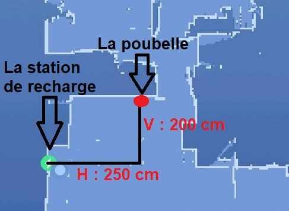

Je dois donc parcourir **250 cm horizontalement** et **200 cm verticalement** dans le cas où, le point se situe à **droite** et en **haut** de la **base de chargement**.

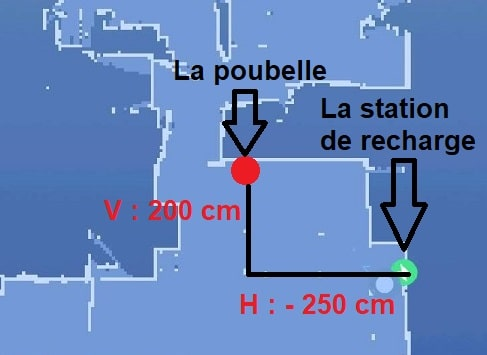

Dans le cas où le point se situe à **gauche** et en **haut** de la **base de chargement,** il aurait fallu parcourir – **250 cm horizontalement** et **200 cm verticalement.**

C’est le même principe **si le point se trouve plus bas** que la base de chargement il faut parcourir une **distance négative**. Cette petite gymnastique mentale demande un petit effort au début.

**Gauche & Bas** = négatif.

**Droite** & **Haut** = positif.

```
function GoThere($H,$V,$baseH,$baseV){
//Point Horizontal.
$H = round($baseH-(($H*1000)/108),0);
//Point Vertical.
$V = round($baseV+(($V*1000)/108),0);
//Résultat de la fonction.
$result =   $H.",".$V;
return $result;
}
```

La fonction va renvoyer les **coordonnées horizontales et verticales du point cible** ($H et $V).

Vous allez **indiquer la distance** en centimètres **entre la base de chargement et la cible** puis la fonction va faire la **conversion en points de coordonnées**.

**$baseH** et **$baseV** = coordonnées de la base de chargement en centimètres.

**$H** et **$V** = coordonnées du point cible.

**108** = nombre de centimètres pour 1000 points.

### Fonction pour le nettoyage par Zone

Cette fonction a le même but que la précédente sauf cette fois-ci nous aurons besoin de **2 points cible** pour générer les zones de nettoyage. Les zones sont représentées sous **forme de rectangles**, nous allons donc devoir fournir à l’aspirateur **un point en bas à gauche** et **un point en haut à droite** pour former ce rectangle.

Par exemple, je veux que l’aspirateur aille nettoyer la zone sous la table de la cuisine (le rectangle rouge). On voit bien que pour le point en bas à gauche la valeur verticale est négative, car, sous la base de chargement.

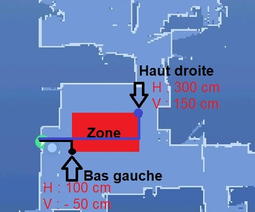

```
function CleanZone($Bgx,$BGy,$HDx,$HDy,$baseH,$baseV,$Q) {
//Point Bas Gauche Horizontal.
$Bgx = round($baseH-(($Bgx*1000)/108),0);
//Point Bas Gauche Vertical.
$BGy = round($baseV+(($BGy*1000)/108),0);
//Point Haut Droit Horizontal.
$HDx = round($baseH-(($HDx*1000)/108),0);
//Point Haut Droit Vertical.
$HDy = round($baseV+(($HDy*1000)/108),0);
//Résultat de la fonction.
$result = $Bgx.",".$BGy.",".$HDx.",".$HDy.",".$Q;
return $result;
}
$scénario->setData('Q',1);
```

La fonction va renvoyer les **coordonnées pour le point en bas à gauche et le point en haut à droite** de la zone de nettoyage.

**Chacun des points** aura une **valeur Horizontale** et une **valeur Verticale** ce qui fait 4 valeurs pour former le rectangle.

**$Bgx =** **Bas Gauche** horizontal.

**$BGy = Bas Gauche** vertical.

**$HDx =** **Haut Droit** horizontal.

**$HDy =** **Haut Droit** vertical.

**$baseH** et **$baseV** = coordonnées de la base de chargement en centimètres.

**$Q** = nombre de passage. 

(1 comme valeur par défaut modifiable plus bas si besoin.)

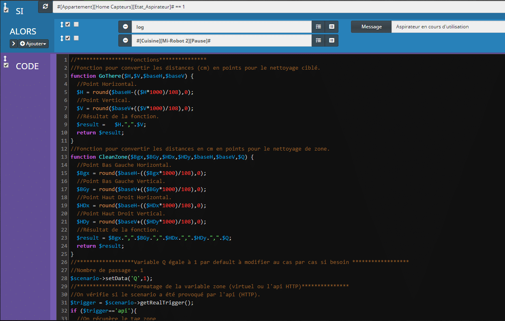

Scénario Zone Aspirateur Robot dans Jeedom, les fonctions.

### Fonction pour le formatage de la variable Zone

Comme nous l’avons vu plus tôt le **scénario est déclenché** par la **commande zone** du virtuel qui renvoie Salon, Cuisine, Table, Poubelle… mais nous pouvons aussi déclencher le scénario via **Google Assistant** en disant **_« Ok Google passe l’aspirateur sous la table »_**. Dans ce cas-là, le scénario ne va pas recevoir **« table »**, comme c’est le cas depuis le virtuel, mais **« sous la table »**. Cette fonction va donc nous permettre de **formater l’information reçu**e par le scénario lorsqu’il s’agit de Google Assistant en ne gardant que le dernier mot soit **« table »**.

```
//On vérifie si le scénario a été provoqué par l’api (HTTP)
$trigger = $scénario->getRealTrigger();
if ($trigger=='api'){
    //On récupère le tag zone
    $cmd = $scénario->getTags();
    $zone = $cmd['#zone#'];
    //On récupère le dernier mot du tag
    $zone=substr($zone,strrpos($zone,' ')+1);
} else {
    //Si ce n’est pas l’api alors on récupère la valeur zone de la commande du virtuel
    $zone = cmd::byString('#[Cuisine][Zones Aspirateur Robot][Zone]#')->execCmd();
}
```

**Pour éviter cela, vous pouvez ajouter un test du genre :**

```
if(stripos($zone,"table")!== FALSE) {
$zone = "table";$scénario->setLog($zone);
} else {
$zone=substr($zone,strrpos($zone,' ')+1);}
```

Je laisse les plus tatillons faire eux-mêmes le test s’ils ont une table de cuisine et une table basse 🙂

```
//On met en minuscule
$zone = strtolower($zone);
//On mets à jour la variable zone
$scénario->setData('zone',$zone);
```

Pour finir le formatage, on met la valeur de la **zone en minuscule** puis on l’**enregistre** dans la **variable zone**.

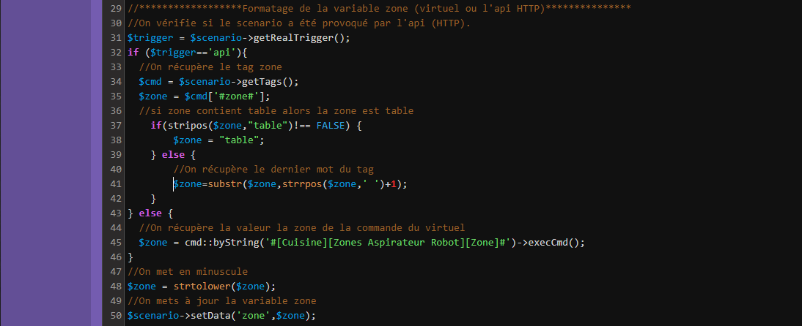

Scénario Zone Aspirateur Robot dans Jeedom, le formatage.

### Testeur de coordonnées

*Nous arrivons à la fin de ce premier bloc code qui est, je l’avoue, bien chargé.* 

Le testeur est **déclenché** en cliquant sur le **bouton « Test »** du virtuel. Les **valeurs** sont à saisir dans les commandes action **« Test Horizontal »** et **« Test Vertical ».**

Pour effectuer les tests, **pas** besoin de créer une **nouvelle fonction**, nous **utiliserons** **celle** que nous venons de créer pour le **nettoyage ciblé**.

```
//On vérifie la valeur de la variable zone si elle est bien égale à test.
if ($zone=='test'){
  //On récupère la valeur de rotation
  $cmd = cmd::byString('#[Cuisine][Zones Aspirateur Robot][rotation_map]#');
  $rotation = $cmd->execCmd();
  $rotation *= M_PI/180;

  //On récupère la valeur baseH de la base de recharge saisi dans le virtuel.
  $cmd = cmd::byString('#[Cuisine][Zones Aspirateur Robot][BaseH]#');
  $baseH = $cmd->execCmd();

  //On récupère la valeur baseV de la base de recharge saisie dans le virtuel.
  $cmd = cmd::byString('#[Cuisine][Zones Aspirateur Robot][BaseV]#');
  $baseV = $cmd->execCmd();

  //On récupère la valeur TestH saisie dans le virtuel.
  $cmd = cmd::byString('#[Cuisine][Zones Aspirateur Robot][TestH]#');
  $H = $cmd->execCmd();
  $H = $H * cos($rotation) + $V * sin($rotation);

  //On récupère la valeur TestV saisie dans le virtuel.
  $cmd = cmd::byString('#[Cuisine][Zones Aspirateur Robot][TestV]#');
  $V = $cmd->execCmd();
  $V = - $H * sin($rotation) + $V * cos($rotation);

  //On lance la fonction pour le nettoyage ciblé.
  $result = GoThere($H,$V,$baseH,$baseV);
  //On Log le résulta.
  $scénario->setLog($result);

  //On exécute la commande GoThere du plug-in Xiaomi avec les valeurs
  $cmd = cmd::byString('#[Cuisine][Mi-Robot 2][GoThere]#');
  $cmd->execCmd(array('message' => $result));

  //On attend 3 secs et on stop l’aspirateur
  sleep(3);
  $cmd = cmd::byString('#[Cuisine][Mi-Robot 2][Pause]#');
  $cmd->execCmd();
}
```

Voilà le premier bloc code est fini !

Il ne reste plus qu’a ajouter un test pour stopper le scénario, car la fonction stop() des blocs code ne fonctionne pas.

- Cliquer sur **« Ajouter Bloc ».**
- Sélectionner **« Si/Alors/Sinon ».**
- **Enregistrer.**

```js
SI variable(zone) == "aucune" ou variable(zone) == "test" ALORS
```

- Ajouter 1 commande Action en cliquant sur **« + Ajouter »** et **« Action »**.

```js
Action: stop;
```

Ce test permet de vérifier si la **zone** est égale à **« aucune »** ou à **« test »**, si c’est le cas on **Stop le scénario**, car on ne veut pas lancer plus d’action.

- Si la **zone est égale à aucune** alors **l’aspirateur** a déjà été mis en **pause** au début du scénario.
- Si la **zone est égale à test** alors **l’action** a déjà eu lieu dans le **bloc code précèdent.**

À ce stade, votre **scénario** est déjà **fonctionnel** pour la partie testeur de coordonnées, sous réserve que vous ayez **rempli** les valeurs **TestV** et **TestH** ainsi que **BaseH** et **BaseV** dans le virtuel.

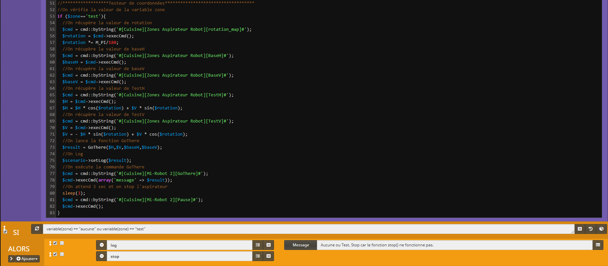

Scénario Zone Aspirateur Robot dans Jeedom, testeur de coordonnées.

### Exemple pour un nettoyage ciblé.

_Commençons pas créer notre premier nettoyage ciblé._ La **trame** sera la **même** pour **tous les nettoyages ciblés**, vous aurez toujours **2 commandes action** à créer pour **saisir** les coordonnées du **point cible** et un **bloc code** dans lequel copier un code qui est identique pour toutes les cibles. Nous prendrons la cible **« Poubelle »** pour l’exemple.

- Cliquer sur **« Ajouter Bloc ».**
- Sélectionner **« Si/Alors/Sinon ».**
- **Enregistrer.**

`SI variable(zone) == "poubelle" ALORS`

- Ajouter 2 commandes Action en cliquant 2 fois sur **« + Ajouter »** et **« Action »**.

```
Action : variable
Nom : H
Valeur : distance en cm du point horizontalement

Action : variable
Nom : V
Valeur : distance en cm du point verticalement
```

Les **2 commandes** permettent de saisir les **distances en centimètres** du point cible. _Vous pouvez utiliser le testeur de coordonnées pour trouver le point cible._ Rappelez-vous que le point de **référence** c’est la **station de chargement**. Dans les cas où le **point** se situe à **droite** ou en **au-dessus** de la base les valeurs sont **positives**, dans les cas contraires où le **point** se situe à **gauche** ou en **au-dessous** de la base les valeurs sont **négatives**.

- Cliquer sur **« + Ajouter ».**
- Cliquer sur **« Bloc ».**
- Sélectionner **« Code ».**
- **Enregistrer.**

Le **bloc code** suivant sera le **même** pour toutes les **cibles**, il n’y aura **rien à modifier** il suffira de le **copier-coller**. Il est très proche de celui utilisé pour les tests que vous pouvez reprendre pour vous simplifier la tâche.

```
//On récupère la valeur de rotation
$cmd = cmd::byString('#[Cuisine][Zones Aspirateur Robot][rotation_map]#');
$rotation = $cmd->execCmd();
$rotation *= M_PI/180;

//On récupère la valeur baseH de la base de recharge saisie dans le virtuel.
$cmd = cmd::byString('#[Cuisine][Zones Aspirateur Robot][BaseH]#');
$baseH = $cmd->execCmd();

//On récupère la valeur baseV de la base de recharge saisie dans le virtuel.
$cmd = cmd::byString('#[Cuisine][Zones Aspirateur Robot][BaseV]#');
$baseV = $cmd->execCmd();
```

On récupère la valeur de rotation de la carte puis les coordonnées de la base de rechargement.

```
//On récupère la valeur de la variable de H
$H = $scénario->getData('H');
$H = $H * cos($rotation) + $V * sin($rotation);
//On récupère la valeur de la variable de V
$V = $scénario->getData('V');
$V = - $H * sin($rotation) + $V * cos($rotation);
```

Ici on **récupère** les **valeurs** que l’on a saisi dans les **deux commandes** H et V qui correspondent aux coordonnées du point cible en centimètres.

```
//On lance la fonction GoThere
$result = GoThere($H,$V,$baseH,$baseV);
//On Log
$scénario->setLog($result);
```

On **utilise** à présent ces valeurs dans la **fonction nettoyage ciblé** pour que les distances en centimètres soient converties en point utilisable par l’aspirateur.

_Comme nous l’avions fait pour la partie test._

```
//On exécute la commande GoThere du plugin Xiaomi
$cmd = cmd::byString('#[Cuisine][Mi-Robot 2][GoThere]#');
$cmd->execCmd(array('message' => $result));
```

Il ne reste plus qu’a **exécuter** la **commande Gothere** du **plugin Xiaomi** avec les valeurs retournées par la fonction nettoyage ciblé.

- Ajouter 1 commande Action en cliquant sur **« + Ajouter »** et **« Action »**.

```js
Action: stop;
```

Pour finir on **stop le scénario** après l’exécution de la commande.

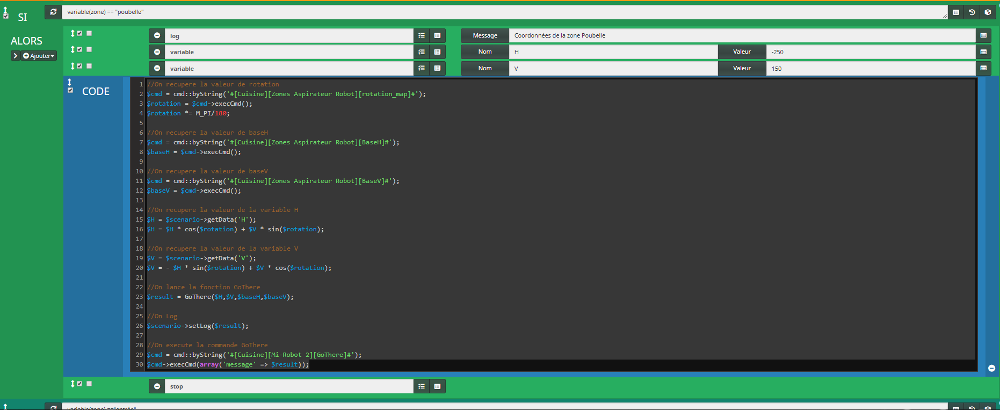

Scénario Zone Aspirateur Robot dans Jeedom, nettoyage ciblé.

### Exemple pour un nettoyage de zone.

_Maintenant que nous savons envoyer l’aspirateur à un point cible il nous reste à faire les zones de nettoyage._

La **trame** sera la **même** pour **toutes les zones** vous aurez toujours **4 commandes action** à créer pour **saisir** les distances des **points bas gauches et haut gauche** et un **bloc code** dans lequel copier un code qui est identique pour toutes les zones.

Nous prendrons la cible **« Entrée »** pour l’exemple.

- Cliquer sur **« Ajouter Bloc ».**
- Sélectionner **« Si/Alors/Sinon ».**
- **Enregistrer.**

```js
SI variable(zone) == "entrée" ALORS
```

- Ajouter 4 commandes Action en cliquant 4 fois sur **« + Ajouter »** et **« Action »**.

```
Action : variable
Nom : BGx
Valeur : distance en cm du point bas gauche horizontalement
Action : variable
Nom : BGy
Valeur : distance en cm du point bas gauche verticalement
Action : variable
Nom : HDx
Valeur : distance en cm du point haut droit horizontalement
Action : variable
Nom : HDy
Valeur : distance en cm du point haut droit verticalement
```

Les **4 commandes** permettent de saisir les **distances en centimètres** des points hauts et bas.

_Vous pouvez utiliser le testeur de coordonnées pour trouver le point cible._

Rappelez-vous que le point de **référence** c’est la **station de chargement**.

Dans les cas où le **point** se situe à **droite** ou en **au-dessus** de la base les valeurs sont **positives**, dans les cas contraires où le **point** se situe à **gauche** ou en **au-dessous** de la base les valeurs sont **négatives**.

- Cliquer sur **« + Ajouter ».**
- Cliquer sur **« Bloc ».**
- Sélectionner **« Code ».**
- **Enregistrer.**

Le **bloc code** suivant sera le **même** pour toutes les **zones**, il n’y aura **rien à modifier** il suffira de le **copier-coller**. Il est très proche de celui utilisé pour les tests que vous pouvez reprendre pour vous simplifier la tâche.

```
//On récupère la valeur de rotation
$cmd = cmd::byString('#[Cuisine][Zones Aspirateur Robot][rotation_map]#');
$rotation = $cmd->execCmd();
$rotation *= M_PI/180;

//On récupère la valeur baseH de la base de recharge saisie dans le virtuel.
$cmd = cmd::byString('#[Cuisine][Zones Aspirateur Robot][BaseH]#');
$baseH = $cmd->execCmd();

//On récupère la valeur baseV de la base de recharge saisie dans le virtuel.
$cmd = cmd::byString('#[Cuisine][Zones Aspirateur Robot][BaseV]#');
$baseV = $cmd->execCmd();
```

On récupère la valeur de rotation de la carte puis les coordonnées de la base de rechargement.

```
//On récupère la valeur de la variable Bgx
$Bgx = $scénario->getData('BGx');
$Bgx = $Bgx * cos($rotation) + $Bgy * sin($rotation);
//On récupère la valeur de la variable BGy
$BGy = $scénario->getData('BGy');
$BGy = - $BGx * sin($rotation) + $BGy * cos($rotation);
//On récupère la valeur de la variable HDx
$HDx = $scénario->getData('HDx');
$HDx = $HDx * cos($rotation) + $HDy * sin($rotation);
//On récupère la valeur de la variable HDy
$HDy = $scénario->getData('HDy');
$HDy = - $HDx * sin($rotation) + $HDy * cos($rotation);
```

Ici, on **récupère** les **valeurs** que l’on a saisi dans les **quatre commandes** Bas Gauche **« BG (x,y) »** et Haut Droit **« HD (x,y) »** qui correspondent aux coordonnées en centimètres de la zone.

```
//On récupère la valeur de la variable Q
$Q = $scénario->getData('Q');
```

Il faut aussi **récupérer** la valeur de **la variable Q** qui correspond au **nombre de passage**s. Nous l’avons enregistrée à 1 dans le premier bloc code.

```
//On appelle la fonction CleanZone
$result = CleanZone($Bgx, $BGy, $HDx, $HDy,$baseH,$baseV,$Q);
//On log les valeurs
$scénario->setLog("[".$result."]");
```

On **utilise** à présent ces valeurs dans la **fonction zone de nettoyage** pour que les distances en centimètres soient converties en point utilisable par l’aspirateur.

_Comme nous l’avions vu pour le testeur de coordonnés et le nettoyage ciblé._

```
//On exécute la commande CleanZone
$cmd = cmd::byString('#[Cuisine][Mi-Robot 2][CleanZone]#');
$cmd->execCmd(array('message' => "[".$result."]"));
```

Il ne reste plus qu’a, **exécuter** la **commande CleanZone** du **plugin Xiaomi** avec les valeurs retournées par la fonction zone de nettoyage.

- Ajouter 1 commande Action en cliquant sur **« + Ajouter »** et **« Action »**.

```js
Action: stop;
```

Pour finir on **stoppe le scénario** après l’exécution de la commande.

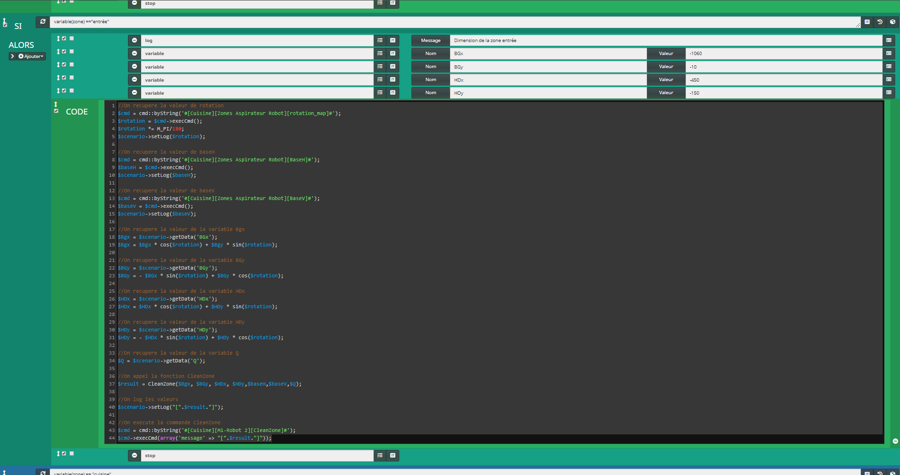

Scénario Zone Aspirateur Robot dans Jeedom, nettoyage par zones.

Il ne vous reste plus cas créé d’autre point cible ou zones de nettoyage comme celles-ci.

## Nettoyage par zone via Google Home

Maintenant que votre virtuel et votre scénario sont terminés et je l’espère fonctionnel nous allons pouvoir mettre en place la **commande vocale** pour lancer le nettoyage avec **Google Home via IFTTT**.

Si ce n’est pas déjà fait, **créez un compte** sur le site [https://ifttt.com](https://ifttt.com/).

Une fois connecté :

- Cliquer sur l’icône **« Account »** en haut à droite.
- Sélectionner **« Create ».**
- Cliquer sur **« + This »**.
- Rechercher **« Google »** et sélectionner **« Google Assistant »**.
- Se connecter au compte Google.
- Sélectionner **« Say a phrase with a text ingredient »**.
- Remplir les 3 premiers champs avec les phrases d’appel.
  - Exemple : **« Passe l’aspirateur dans »**.
- Ajouter le signe « $ » à la fin des phrases. Ce signe sera remplacé par la zone.
  - Exemple : « **$ = le salon »**.
- Remplir le 4e champ avec la phrase de réponse.
  - Exemple : **« Entendu, nettoyage : »**.
- Ajouter le signe « $ » à la fin de la phrase. Ce signe sera remplacé par la zone.
  - Exemple : « **$ = le salon »**.
- Sélectionner le langage à **« French »**.
- Cliquer sur **« Create Trigger »**.
- Cliquer sur **« +That »**.
- Rechercher **« web »** et sélectionner **« Webhooks »**.
- Sélectionner **« Make a web request »**.
- Dans URL saisir :
  - _https://**URL_EXTERNE_JEEDOM**/core/api/jeeApi.php?apikey=**API_JEEDOM**&type=scénario&id=**NB_SCÉNARIO**&action=start&tags=zone%3D »<<<{{TextField}}>>>»_
- Remplacer les 3 valeurs suivantes :
  - **URL_EXTERNE_JEEDOM** = l’adresse externe de votre Jeedom.
  - **API_JEEDOM** = l’API de Jeedom qui se trouve dans Configuration, API, Clef API.
  - **NB_SCÉNARIO** = Le numéro du scénario Zone aspirateur. Il se trouve dans le titre de l’onglet **« General ».**
- Sélectionner **« GET »** dans le champ **« Method »**.
- Sélectionner **« application/json »** dans le champ **« Content Type »**.
- Saisir **« <<<{{TextField}}>>> »** dans le champ **« Body »**.
- Cliquer sur **« Create Action »**.
- Cliquer sur **« Finish »**.

Maintenant, lorsque vous dites **« Ok Google passe l’aspirateur dans le salon »** votre Google home devrait dire **« Entendu, nettoyage : dans le salon »** puis le scénario devrait se lancer.

## Création de la carte cliquable sous Jeedom

On arrive au terme de ce tutoriel qui est, je le conçois, assez long, mais pour les plus téméraires nous allons voir comment créer une carte cliquable directement sur Jeedom.

Le but est d’afficher une carte du logement avec des zones cliquables pour pouvoir lancer le nettoyage. On utilisera l’option **« Ajouter une zone »** disponible dans le mode Design de Jeedom.

Pour créer la carte, j’ai fait une copie d’écran de la carte générée par l’application Mi-Home puis à l’aide de Photoshop j’ai redessiné les pièces.

- Créer un nouveau Design.
- Faire un clic droit puis **« Edition ».**
- Faire un clic droit puis **« Ajouter une image/caméra ».**
- Faire un clic droit sur l’image puis **« Paramètres d’affichage ».**
- Cliquer sur **« Envoyer ».**
- Sélectionner la carte du logement.
- Sauvegarder.
- Ajuster la taille de la carte.
- Faire un clic droit puis **« Ajouter une zone ».**
- Un petit carré transparent est apparu, l’agrandir et le placer sur la zone de la carte.
- Faire un clic droit sur la zone puis **« Paramètres d’affichage ».**
- Cliquer sur le **« + »** en face de **« Action ».**
- Recommencer pour toutes les zones.

Maintenant, il suffit de cliquer sur les zones pour démarrer le nettoyage dans la zone voulue. Vous pouvez aussi ajouter des commandes depuis le virtuel ou l’équipement Xiaomi en faisant clic droit puis **« Ajouter équipement »** ou **« Ajouter commande ».**

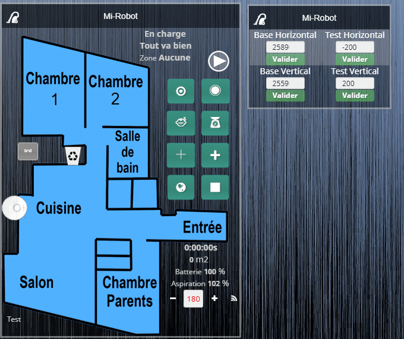

Virtuel Zone Aspirateur Robot (Après mise en forme)

Voilà j’espère avoir été clair pour ce tutoriel sur le nettoyage par zone dans Jeedom avec commande via Google Home et carte cliquable. Regardez bien les copies d’écrans pour la hiérarchie des blocs et la configuration des différents éléments.

Il y a beaucoup de thèmes abordés dans ce tutoriel que vous pourrez réutiliser pour améliorer Jeedom.

L’utilisation est assez simple en soi.

- Il faut dans un premier temps remplir les valeurs horizontales et verticales pour la base.
  - Utilisez la fonction de test pour que le drapeau arrive juste sur la base de chargement, c’est la base pour que vos zones soient correctement calculées.
  - Chez moi, je suis à « 25890 » et « 25590 ».
- Laissez la rotation à « 0° » puis modifiez-la si besoin.
- Pour chaque cible ou zone de nettoyage, il faudra saisir les valeurs en centimètre dans le scénario.
  - Là encore, je vous conseille d’utiliser la fonction test pour bien positionner vos points et vos zones.
  - Par la suite, si vous voulez modifier les zones ou les points, il suffira d’ajouter ou d’enlever quelques centimètres aux valeurs.

Évidemment, chacun doit adapter le scénario à ses besoins et ses habitudes si vous faites un simple copier-coller du code sans essayer de le comprendre ça ne fonctionnera surement pas.
