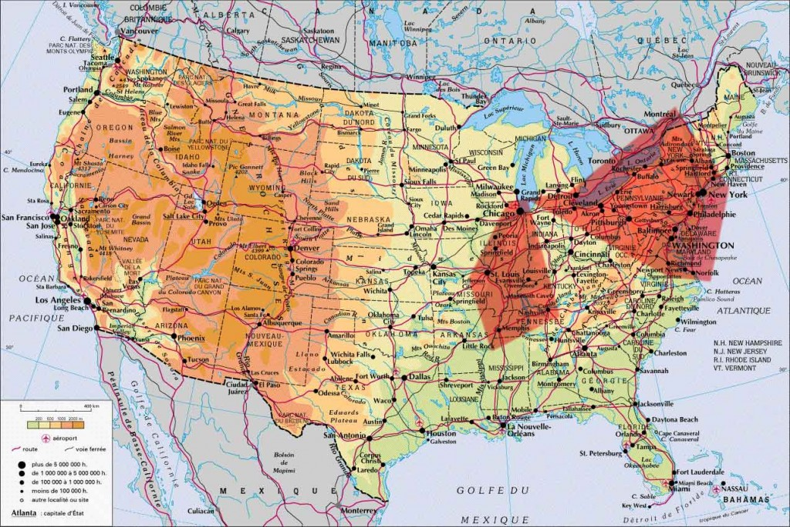
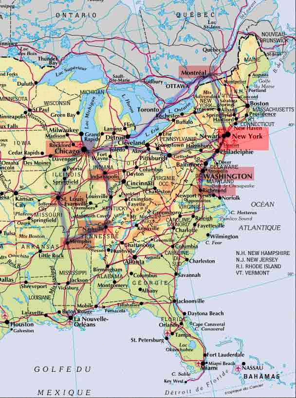
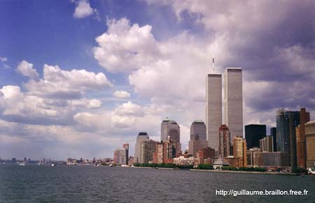
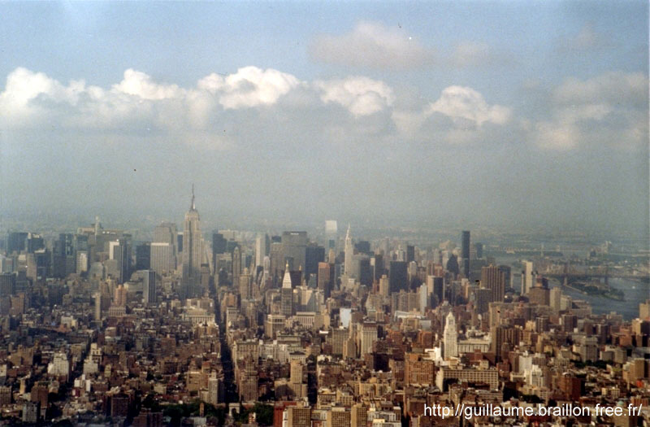
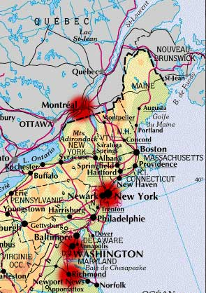
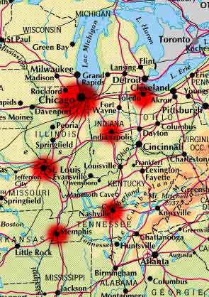

_Carnet de voyage de mon 1er voyage seul à l'étranger. Je suis parti à New York en mai 2001, puis j'ai bougé sur la côte Est, de Washington à Chicago, en passant par Saint-Louis, Memphis et plein d'autres villes..._

---

## Départ — Jeudi 10 Mai 2001

`Lyon → New York (JFK)`

J'ai pris l'avion à Lyon à 10h10. Bon voyage d'environ sept heures, je suis arrivé à New York à midi, heure de New York. Il fait 30 °C.

Après avoir tourné un bon quart d'heure dans l'aéroport, j'ai rencontré des Français qui m'ont proposé de partager un taxi pour rejoindre Manhattan. Ils sont allés à Madison Street à leur hôtel. Là, c'est le vrai départ pour moi.

Je me suis posé sur les marches de l'hôtel et j'ai commencé à rechercher un endroit où dormir. Je voulais aller au **West Side YMCA**, sur la 5e avenue, 63e rue, près de Central Park. J'ai marché bien une demi-heure et je me suis arrêté pour demander ma route à un passant qui m'a dit que l'auberge se trouvait de l'autre côté de Central Park, trop loin.

Je me suis posé sur un banc à Central Park et j'ai cherché une auberge ou une YMCA plus proche. J'en ai trouvé une et j'ai donc décidé d'aller au **« Big Apple Hostels »**, une auberge de jeunesse à Times Square.

Une fois arrivé dans l'auberge, j'ai pris une chambre — enfin, un lit dans une chambre de quatre personnes. Mes affaires rangées, je suis allé visiter les alentours. Je suis en plein centre de Times Square.

J'ai trouvé que les rues ressemblaient à « Walt Disney », c'est grandiose. Des écrans géants de partout, des pubs pour les voitures sur les façades des immeubles !

Je suis allé dans un magasin de disques grand comme la Fnac, mais que des CD. Le rayon blues, le rêve : des rangées pleines de CD de blues et au moins une vingtaine de CD en écoute libre, sans compter les CD de jazz…

Après avoir passé une bonne heure dans les CD, je suis retourné me balader dans Times Square. Au hasard de ma route, j'entends _« The Thrill is Gone »_ de BB King. Je me retourne et je me trouve juste devant le **« BB King Blues Club & Grill »**.

Je suis entré pour demander le prix du concert de ce soir (il y a Wilson Pickett) et j'ai discuté avec la vendeuse de souvenirs.

Le concert coûtait 37,50 $ (260,24 F), trop cher. Je lui ai demandé pour BB King qui passait jeudi 17 et samedi 19 mai : 55 $, soit 385,10 francs — un peu cher pour mon budget. Et je pense qu'à Chicago je trouverai de meilleures opportunités. New York, c'est New York…

J'en ai profité pour aller voir les salles, c'est génial : c'est un resto avec une scène immense, et il y a aussi un pub.

J'ai continué à me balader jusqu'à Midtown. J'ai vu un des gratte-ciel les plus connus, je l'ai pris en photo, mais en fait je pense que ce n'est pas l'**Empire State Building** mais le **Chrysler Building** qui lui ressemble.

Après, je me suis arrêté dans un parc, le **Bryant Park**. Sur les terrasses il y avait une soirée avec des personnes qui avaient l'air assez bourgeois. Dans le parc, plein de gens allongés dans l'herbe ou assis sur des tables de jardin au soleil — les étudiants lisent, les autres jouent aux échecs, certains discutent. Il y a vraiment une ambiance paisible, tout le monde paraît très calme, tranquille — les New-Yorkais paraissent vraiment très cool. Les gens ne sont pas comme je les imaginais : des gros pleins de hamburgers avec un verre de coca à la main. Je suis agréablement surpris et je ne m'attendais pas à voir des gens si élégants.

Après, je suis allé à la recherche d'un cahier et d'un stylo pour écrire le cheminement de mon voyage. Je pense que je vais avoir beaucoup à dire…

Il est 19h00, je vais voir si je trouve quelque chose à manger. J'ai trouvé une épicerie et j'ai acheté un drôle de sandwich : un _bun_, une sorte de pain rond garni d'une salade de thon à la mayonnaise et aux tomates.

Je suis sur une table dehors à l'hôtel et je fais le point. En fait je ne suis pas ressorti — il est 20h22 — je vais lire mon _Lonely Planet_ pour trouver une auberge et noter les excursions de ces prochains jours.

Je pense que demain je vais changer d'auberge : aller à la **Chelsea International Hostels**, sur la 5e avenue et la 20e rue, vers Greenwich Village. Il faut que je fasse ça en premier car mon sac est très lourd, et je ne veux pas le porter toute la journée sous peine d'être mort dès les premiers jours. Le mieux, c'est de trouver une auberge où je peux rester plusieurs jours et laisser mes affaires la journée.

> Ma journée a été longue : il n'est que 20h30 à New York mais je suis levé depuis 7h00, heure de Grenoble, où il est 2h30 du matin. Bonne nuit et à demain.

---

## Chelsea International Hostels

Ce matin je me suis levé à 9h45.

Dans ma chambre il y avait deux personnes, de jeunes Chinois, mais ils ne sont pas restés longtemps. Moi je n'allais dans ma chambre que pour dormir, donc je n'ai pas eu le temps non plus de discuter avec eux — surtout que l'anglais avec un accent chinois, c'est terrible. Il y a une autre personne qui est arrivée pendant la nuit mais ce matin elle n'y était déjà plus.

Je me suis préparé et je suis parti. L'aubergiste m'a rendu 10 $, c'était la caution — ce qui fait que la nuit n'était pas à 33 $ mais à 23 $. Oui, c'est quand même 160 F, mais bon, c'est Times Square aussi...

Je suis parti à la recherche d'une auberge et j'ai trouvé le **Vanderbilt YMCA** mais la nuit est à 70 $, no comment, je suis vite parti. On veut bien qu'on soit à New York, mais faut pas abuser quand même.

Me voilà reparti, je remontais la 5e avenue quand je suis passé devant l'**Empire State Building** — ce qui m'a confirmé qu'hier c'était bien le Chrysler Building que j'avais vu.

Je suis donc allé à la **Chelsea International Hostels** et c'est pas mal du tout : plein de jeunes, un grand espace dehors avec des tables en bois, il y a même des barbecues. J'ai réussi à me faire comprendre, j'ai donc un lit pour la nuit dans une chambre avec des Espagnols qui parlent français.

Une fois mes affaires rangées et après avoir fait connaissance avec mes colocataires, je suis allé manger. J'ai pris un **hot dog** chez un vendeur en charrette dans la rue — c'était une Roumaine, j'ai un peu parlé avec elle. Mais j'ai déjà du mal à comprendre les Américains, alors les Roumains ou les Chinois qui parlent anglais c'est pas génial — mais bon, ça va venir.

J'ai appelé maman pour dire que j'allais bien.

Il est 13h18, je pense que je vais rester un peu dans l'auberge pour faire connaissance avec les Espagnols, puis je vais regarder ce qu'il y a à faire dans le coin.

Voilà, il est 18h00. Cet après-midi je suis allé me promener dans le quartier de **Chelsea**, je suis allé dans un grand magasin sur neuf étages et je me suis payé un _fresh orange juice_, aussi bon que ceux en Grèce.

En marchant je suis passé devant le **Lancaster Building**, j'ai visité l'immeuble puis je suis allé au sommet : il y a une superbe vue au 102e étage et j'ai pris plein de photos. Je suis resté un bon moment, puis je suis allé sur Broadway et je suis rentré à l'auberge.

J'ai rencontré une des personnes de ma chambre mais il part aujourd'hui. Il est assez bizarre — il est directeur d'une agence de paiement à Paris.

J'ai rencontré aussi un Portoricain bizarre, je me demande si je dois rester car c'est très cher et je ne sais pas si dix jours ne sont pas encore trop longs. J'ai peur d'avoir vu un peu trop grand et d'avoir du mal à tenir jusqu'au 27 mai, voire jusqu'à Chicago.

Je vais peut-être prendre le bus et aller jusqu'à Miami ou la Nouvelle-Orléans. Le Français m'a dit qu'il y avait un centre d'ATM, peut-être que l'Espagnol de ma chambre doit y aller aussi — il faut que je lui demande.

Je vais peut-être rester encore quelques jours à New York, le temps de voir le **World Trade Center** et quelques autres trucs. J'ai reçu le mail de Lorraine, je vais peut-être aller la voir, ce serait bien. Sinon je pars et reviendrai pour aller chez les gens de Washington.

Comme ça je pourrais me poser et surtout tenir jusqu'au 27 mai.

Demain je vais aller voir les auberges et Central Park — sans mon sac, parce qu'il est trop lourd. D'ailleurs je crois que je vais y aller en bus. Mais c'est bien ici, je resterai quelques jours car il y a une bonne ambiance et c'est pratique. En plus, ils ont une laverie. En tout cas, il vaut mieux visiter avec beaucoup d'argent, et voyager seul c'est très dur — mais c'est peut-être bon, les voyages forment la jeunesse !

Il est presque 19h00 et je vais aller manger. Les Espagnols dans ma chambre me recommandent un restaurant, enfin un fast-food.

Dans le restaurant, le serveur parle français — je discute un peu avec lui, il est très sympa. Après, je suis revenu à l'auberge.

Il y avait deux Allemandes avec qui j'ai discuté, très sympas aussi. C'est vrai que j'ai du mal à parler avec les gens car mon anglais n'est pas très bon, mais j'essaie. Une d'elles, **Anna**, parle un peu français. Elles travaillent à Boston, elles sont venues à New York pour visiter le week-end. J'ai rediscuté avec le Portoricain mais il est vraiment bizarre — en plus il aime la musique électronique !

Sinon je suis allé me balader dans le quartier. La nuit, c'est très beau, j'ai encore pris l'Empire State Building en photo. Il est éclairé, je crois que c'était en bleu — on verra sur la photo. C'est drôle le monde qu'il y a le soir dans les rues.

Il est 22h30 et je suis à l'auberge. Il fait beau, il fait chaud, ça fait du bien !

Je pense que je vais aller me coucher car les personnes que je connais ne sont pas là, et les autres sont dans leur soirée — je ne pense pas arriver à bien communiquer pour passer la soirée avec eux. Je vais aller réviser mon anglais !

C'est vrai qu'il n'y a pas beaucoup de gens qui voyagent seuls, mais j'ai fait des efforts pour m'intégrer. J'ai du mal à me lâcher sans pouvoir discuter. Quand j'ai parlé avec l'Allemande, elle m'a dit : _« Tu n'es pas très… Houa !! »_ — elle ne connaissait pas le mot, elle voulait sûrement dire extraverti…

> Bon, allez, bonne soirée, moi je vais me coucher. À demain — je pense aller au World Trade Center si le temps est clair, car je pense qu'il faut un ciel très bleu pour profiter de la vue, vu que le WTC se trouve en bord de mer.

---

## Times Square

Cette nuit j'ai réfléchi à ce que m'avait dit le Français qui est parti : la nuit ne me coûtait que 25 $. Je suis allé voir à l'accueil — confirmé. J'ai donc décidé de rester trois nuits de plus ici, car l'Espagnol a l'air bien cool.

Je pense que 25 $ c'est un des meilleurs prix à New York. Si je ne pars pas vers le sud, je vais rester jusqu'au 20, ce qui me fait encore huit jours : 25 $ × 8 = 200 $.

Aujourd'hui il fait encore très beau et chaud. Je pense que je vais aller à Times Square — là-bas je pourrai lire mes mails et en envoyer, peut-être que Lauren ou les gens de Washington m'ont écrit.

Je voulais aussi aller au World Trade Center mais je pense qu'il vaut mieux y aller en semaine pour voir la vie de Wall Street.

Ah oui, en dormant j'ai cru entendre des Français — ce serait bien que je les rencontre pour qu'ils me disent ce qu'il ne faut pas rater.

Je suis allé dans un supermarché — enfin il paraît que c'en était un, ce n'est pas comme chez nous : en fait c'est plein de petits magasins spécialisés. Mais bon, j'ai trouvé ce que je voulais.

Puis je suis rentré pour manger et j'ai fait la connaissance de plusieurs personnes, dont deux Anglaises. On a essayé de communiquer, ça commence à venir. Elles m'ont donné l'adresse du centre de mail. J'y suis allé, c'est très bien comme endroit — il y a plein de PC, plus de 800, tous avec des webcams. Pour 1 $, on peut rester trente minutes, et si l'on n'a pas tout utilisé, on peut revenir plus tard.

J'ai lu mes mails. Il y avait celui de mon père en réponse des gens de Washington : ils sont très contents de me recevoir. Je vais les contacter pour y aller, mais je ne voudrais pas m'incruster — donc je ne sais pas combien de temps je peux rester. Je pense y aller les 20 et 21 mai, mais il faut que je tienne jusqu'au 27 mai…

Aujourd'hui je suis allé au **Central Bus** pour voir les tarifs. J'ai pris un papier mais ce ne sont que les horaires, je vais retourner. Je suis allé dans les magasins **Virgin**, très bien, il y a plein de trucs. J'ai écouté les nouveautés en blues — il y a des femmes, c'est trop bien ! Elles s'appellent **D. Davis**, un peu le style Stevie Ray, et une autre dont je ne me souviens plus du nom, je vais retourner pour vérifier.

Il y a aussi un double CD de Hendrix et un coffret de Stevie avec des lives : trois CD et un DVD.

Sinon, Times Square c'est génial, il y avait des jeunes qui faisaient du hip-hop, c'était impressionnant. Je n'ai toujours pas trouvé de magasin de guitares — je pense que je vais devoir regarder dans l'annuaire car on ne voit pas les vitrines des magasins puisqu'ils font neuf étages !

Voilà, sur l'annuaire j'ai trouvé des magasins de guitares, je vais y aller lundi.

---

## Empire State Building by Night

Ce soir je suis allé avec **Tracy** l'Écossaise et **Emma** l'Anglaise à l'**Empire State Building** — encore une fois ! Mais cette fois-ci c'était la nuit, c'est trop trop beau.

Après, nous sommes rentrés à l'auberge et Tracy m'a appris quelques mots en anglais…

---

## Central Park

Je me suis levé à 10h30 et nous sommes allés à **Central Park** avec un ami de Tracy qui est déjà venu cinq fois à New York. Ils sont allés manger à 11h00 du matin — ils sont Anglais...

Nous sommes arrivés à Central Park. Nous nous sommes arrêtés pour voir des gens jouer au base-ball. Après, en marchant dans le parc, il y avait un musicien qui jouait de la guitare et chantait au bord du lac. Nous sommes restés au moins trois heures — il y avait une superbe ambiance, des gens chantaient. Comme nous étions sur le bord du lac, des gens venaient en barque pour écouter la musique, s'arrêtaient et regardaient. Le musicien chantait aussi bien pour les gens du lac que pour ceux allongés dans l'herbe. Il fait encore superbe aujourd'hui, il a plu un peu hier soir mais juste une demi-heure.

Dans Central Park, plein de gens font du vélo ou sont en rollers, d'autres courent tous avec un walkman sur la tête. Central Park me fait penser à un lieu magique au milieu de New York : il y a de la verdure, des animaux, des écuries, des lacs, du calme, les gens font du sport — on se croirait à la campagne.

Après, nous avons marché dans le parc ; il y avait un groupe de jazz avec une batterie, un saxo, une trompette posés dans l'herbe.

Dans un parking — car le parc est fermé aux voitures le week-end — il y avait plein de gens qui dansaient en rollers. Ils avaient emmené une sono, tout le monde dansait ensemble : des vieux, des jeunes, tous mélangés et tous s'amusant. Je ne me croyais vraiment pas à New York, une des plus grandes villes du monde — je me serais presque cru à la campagne.

Plus loin, des gens faisaient naviguer des bateaux télécommandés sur le lac. Des gens un peu partout, déguisés en clown, faisaient du jonglage et des figurines en ballon — les enfants riaient. Le plus étonnant c'est que ce n'était même pas pour l'argent, juste pour le plaisir, c'était leur passe-temps du week-end.

Devant le musée, des jeunes dansaient comme à Times Square — du hip-hop. Nous sommes redescendus le long de la 5e avenue, il y avait plein de gens qui faisaient des tableaux, des portraits, comme à Montmartre à Paris.

Nous sommes rentrés à l'auberge pour manger.

J'ai discuté avec l'Espagnol qui m'a dit qu'il voulait trouver du travail pour quelques mois dans un bar et qu'il n'aimait pas trop la vie ici à New York. D'ailleurs, il faut que je pense à aller à la réception pour leur dire que je reste jusqu'à lundi. Lundi sera le 21 et je pense que je vais aller à Washington chez les gens dont j'ai l'adresse — il faut que je retourne au centre d'email demain pour dire à mon père de les contacter pour leur demander si je peux venir ce jour-là. Il faudrait aussi que je retrouve l'adresse mail de Franck pour lui écrire et savoir s'il va bien. Je pense qu'il va falloir que j'achète des cartes postales pour écrire un petit peu à tout le monde.

---

## Statue de la Liberté

Aujourd'hui je suis allé voir la **Statue de la Liberté**. Je suis descendu à pied jusqu'au World Trade Center mais je ne m'y suis pas arrêté — j'y retournerai. J'ai pris le bateau et je suis arrivé à l'île. Je suis monté à pied jusqu'au 1er étage car il était trop tard pour aller jusqu'en haut et redescendre à l'heure pour le bateau.

Avant d'aller à la statue, en marchant dans la rue du World Trade Center, il y avait un illusionniste qui faisait des tours impressionnants…

Ce matin il y avait deux Français qui vivent à New York, logés à l'hôtel. J'ai discuté avec eux — ils m'ont dit qu'ils travaillaient pour l'**Uptown Jazz Festival**. L'un d'eux m'a montré le site Internet du festival. C'est un grand festival : **Petrucciani** y est déjà passé.

En discutant, il m'a proposé de venir dans leur appartement au lieu de rester dans l'auberge. Je ne sais pas ce que je vais faire — je lui ai dit que j'avais payé ma chambre jusqu'à mercredi, donc je vais réfléchir. Ils paraissent très bien, ils sont musiciens. Il m'a donné sa carte et m'a dit d'appeler avant de venir voir où ils habitent.

Par contre, c'est vrai que c'est plus facile ici pour rencontrer des gens avec qui je peux parler en anglais, et en plus l'auberge est bien placée pour visiter à pied. Je vais voir. En rentrant de la Statue de la Liberté, je suis passé à **Washington Square**, près de l'université, et j'ai bien aimé — je vais y retourner.

En arrivant à l'auberge, je me suis allongé pour écouter de la musique et j'ai dormi trois heures. Ensuite j'ai mangé — je ne sais pas ce que je vais faire ce soir.

Ce soir je me suis promené et j'ai discuté avec quelques personnes, mais j'ai encore du mal à comprendre quand ils parlent entre eux, c'est trop rapide.

---

## Music Day

Hier soir l'Espagnol n'était plus là — je pense qu'il a trouvé du travail. Il y a un Japonais qui est arrivé, il s'appelle **Yasou**, il a l'air bien sympa.

J'ai décidé de rester à l'auberge encore cinq nuits, donc jusqu'à samedi.

C'est mieux pour moi : au moins je suis plus libre de faire ce que je veux et j'ai plus de chances de rencontrer des gens pour pratiquer l'anglais. Car avec les gens d'hier — ceux du festival — je n'aurais pas trop parlé anglais vu qu'ils sont Français. L'auberge est relativement bien placée, au milieu de Manhattan, donc les visites sont beaucoup plus simples.

Aujourd'hui je vais aller voir mes mails et donner des nouvelles — je vais peut-être appeler aussi. Les batteries de mon portable sont vides, donc je n'ai plus l'heure, c'est un peu gênant, mais bon je suis en vacances.

Dans ma chambre il y a un musicien qui joue demain et il m'a proposé de venir le voir. En discutant avec lui, j'ai appris qu'il allait voir des magasins de guitares — je lui ai demandé si je pouvais venir, et on y est allé. En chemin, il m'a raconté qu'il avait joué avec des gens comme **Steve Gadd**, le batteur de **Clapton**, et bien d'autres.

Après, il a joué dans les magasins de guitares. Dans la même rue, il y a quatre grands magasins qui font trois fois **Michel Musique**. Après il est parti vers Central Park et moi je suis allé voir mes mails.

Je suis revenu à l'auberge, et lui est arrivé avec une vieille guitare qu'il avait achetée 10 $ dans la rue. J'ai un peu joué, mais c'est lui qui a animé la soirée en chantant — c'était génial !

Après, vers 23h00, nous sommes allés dans un club de blues, le **Chicago Blues**, mais il était complet. Je pense que je vais y retourner plus tard. Donc nous sommes allés dans un jazz club, après nous sommes rentrés.

Dans ma chambre il y a trois personnes ce soir.

---

## World Trade Center

Aujourd'hui je suis allé au **World Trade Center**. Il ne fait pas très beau et assez froid — j'ai mis un pull !

Je suis allé jusqu'au **City Hall**, là où se trouve l'administration municipale, j'ai fait le trajet proposé par le _Lonely Planet_. Je suis passé à **Wall Street**, au centre juridique où se passent tous les procès de la ville. Je suis allé dans les **Twin Towers** — je ne suis pas monté car il ne fait pas beau et la vue ne doit pas être aussi belle que les jours de grand soleil. J'y retournerai lorsqu'il fera beau.

J'ai fait une bonne marche de 13h00 à 18h00 et je suis rentré à l'auberge.

Les deux Écossaises partent ce soir, mais leur collègue est allé au Bronx et n'est toujours pas revenu, du coup les filles sont parties seules…

Tous les mercredis soirs l'auberge de jeunesse paye des pizzas pour tout le monde — c'est génial, enfin un vrai repas ! Pour une fois je n'ai plus faim après avoir mangé.

À l'auberge il y a un Hollandais qui habite à Paris et donc parle français, mais je ne parle pas français car je suis dans un groupe où il y a deux Japonaises, deux Hollandais et une Française qui fait ses études au Québec. Je commence à comprendre les discussions — mais avec tous ces accents différents, ce n'est pas très facile.

Ce soir **Nixon**, le guitariste qui est dans ma chambre, joue aux **CBGB's** et il m'a dit qu'il me mettait sur la liste pour entrer gratuitement. Je pense que je vais y aller avec l'Anglaise, bien qu'il joue du rock style Nirvana…

Les organisateurs du festival de jazz sont revenus aujourd'hui. Je leur ai dit que je ne voulais pas aller chez eux car ici je peux parler anglais et que je commence à avoir quelques amis, ce qui me permet de sortir dans New York. Ils m'ont proposé de venir vendredi soir pour jammer — il y aura un bassiste, un batteur. Je pense que je vais y aller, il faut que je téléphone avant de venir pour avoir l'adresse.

D'ailleurs, en parlant de téléphone, je vais appeler maman demain si je ne me lève pas trop tard — et oui, avec le décalage horaire.

Je vais aussi aller au centre d'email pour voir si j'en ai reçu.

---

## Une semaine déjà

Voilà une semaine que je suis là !

Aujourd'hui il ne fait pas très beau et un peu frais. J'ai décidé de ne pas aller visiter Chinatown et Little Italy — j'irai sûrement demain s'il fait meilleur. Aujourd'hui je suis allé au **EasyThing** pour écrire mes emails. Je pense que je vais aller chez les **Morris** le lundi 21 mai car j'ai eu un mail de mon père qui m'a dit qu'ils m'attendaient pour me faire visiter leur région. Je vais rester quelques jours, puis j'irai à Chicago — sûrement en deux jours car je pense qu'il y a au moins 10 heures de route depuis Washington.

J'ai donc fait du shopping aujourd'hui et je suis allé au **Virgin Megastore** de Union Square. J'ai écouté des nouveautés de **Buddy Guy**, **Clapton** et **Robert Cray**. J'ai aussi écouté **Marcia Ball** et **Debby Davis** — c'est génial ce qu'elle joue, elle est guitariste et chanteuse, elle joue du Texas Blues.

Voilà, sinon petite journée aujourd'hui. En plus, la Française du Québec repart, le Hollandais de Paris aussi, et demain l'Anglaise. J'espère que je vais trouver d'autres personnes aussi sympas cette semaine — il n'y a pas de raison que ce ne soit pas le cas.

La soirée a été très calme, j'ai juste discuté avec quelques personnes. L'Anglais qui est dans ma chambre est très bizarre — je ne l'aime pas trop, il a plein de manières et ne fait pas d'effort pour me comprendre. Par contre Yasou est très sympa.

---

## Chinatown, Little Italy et le pont de Brooklyn

Aujourd'hui il ne fait toujours pas beau, il a plu toute la nuit et ce matin il y a des nuages.

Je vais aller visiter **Chinatown**, **Little Italy** et aller voir le **pont de Brooklyn**. Il faut aussi que j'aille faire du change car je n'ai plus de liquide — j'ai dépensé mes 200 $ plus des traveller's cheques, je dois être à 400-500 $ pour le moment.

Il va falloir que j'aille voir aussi pour le bus : est-ce que je prends juste le ticket New York → Washington et après Washington → Chicago, ou si je prends un pass pour une semaine.

Ce matin je suis allé visiter Chinatown — c'est vrai qu'on a l'impression d'être en Chine, enfin j'imagine, j'y suis jamais allé :)

Je suis entré dans un magasin d'électronique pour acheter un transformateur 110-220 V pour pouvoir recharger mon portable car je n'ai plus l'heure et c'est pénible. Dans ce magasin il y avait plein d'appareils : des magnétoscopes, des DVD sans boîtes entassés les uns sur les autres. Mais j'espère qu'ils marchent mieux que mon transformateur car au lieu de faire du 220 V il fait du 12 V avec du 110 V :(

Je suis aussi allé dans un grand magasin où il n'y a que des produits chinois — mais comme c'est écrit en chinois j'ai rien compris. Je ne voulais pas acheter un truc à manger et me rendre compte que c'était du chien :D Dans la rue des magasins alimentaires, il y a une odeur très forte, ça pue !! Une odeur de poisson pourri et de viande séchée — d'ailleurs tout ça pend un peu de partout.

Après cette balade en Chine, je suis allé à **SoHo**, le quartier de l'art. J'ai fait quelques galeries d'art au sens large du terme. J'ai aussi visité une galerie **Andy Warhol** sur **Léonard de Vinci** — c'était du Warhol.

En remontant, je me suis arrêté au **Washington Square Garden** pour lire un livre et je suis retourné à l'auberge par **Greenwich Village**. Ce quartier est plein de bars où il y a de la musique le soir. Je suis passé devant le **« Café Wha' »** où un certain Jimi Hendrix s'est produit à ses débuts. J'ai aussi pris le temps de visiter quelques-uns des magasins de guitares du quartier. Je suis rentré à l'auberge vers 17h00.

Ce soir je suis sorti voir s'il n'y avait pas de concerts. Je suis allé au **Chicago Blues** et j'ai vu que la veille il y avait **Bill Perry** — dommage pour moi. Ce soir c'est un autre musicien, j'ai écouté de dehors mais je n'aime pas trop son style, alors à 20 $ l'entrée je vais me retenir pour un meilleur concert.

J'ai continué à me balader dans les rues de Greenwich et j'en ai profité pour aller écouter quelques CD dans des magasins — c'est trop bien les magasins ouverts tard le soir à New York City.

Après, je suis rentré à l'auberge — il y avait les 2 Belges, elles ont loupé leur avion, les pauvres. Je les ai aidées à chercher un billet d'avion sur internet mais nous n'avons rien trouvé pour le lendemain matin.

---

## Concert au Chicago Blues Bar

Il fait beau et très chaud !!!

Ce matin je vais donner un coup de main aux Belges car les pauvres sont désespérées. Je dois aussi aller chercher mon billet pour le bus — ou prendre mon pass, suivant les tarifs. Dans l'après-midi j'irai visiter un autre coin de New York, je vais sûrement aller vers le **Rockefeller Center**.

Les Belges sont toujours à la recherche d'un billet d'avion, elles en ont trouvé un mais c'est avec **Koweït Airlines**…

Je suis allé au bureau de l'auberge pour rester 2 nuits de plus, jusqu'à lundi matin, mais elle m'a dit de revenir dans 10-15 minutes. J'espère que je vais pouvoir rester ici. Si je ne pouvais pas rester, je partirais à Washington aujourd'hui — mais je n'ai pas trop envie, je suis bien ici.

**Problème !!!!!**

Je ne peux rester qu'une nuit de plus, donc jusqu'à dimanche matin. Comment vais-je faire pour la nuit de dimanche à lundi ? Je vais essayer de trouver une autre auberge de jeunesse pour cette nuit, et je vais quand même redemander s'il n'y a pas une place.

Je suis allé au **Central Bus** pour chercher les prix des bus. Je vais prendre le pass qui est beaucoup plus avantageux : pour 7 jours il coûte 185 $ alors que le voyage New York → Richmond → Chicago coûte 175 $. Avec le pass, je peux voyager comme je veux — c'est beaucoup plus simple et pratique.

De toute façon je vais aller lundi chez les Morris à Richmond, donc il ne reste qu'à trouver une place pour la nuit de dimanche. Il me reste le **Big Apple**, la 1ère auberge où j'ai dormi — en plus elle est près du Central Bus.

Pour le bus j'ai le choix entre des départs à 12h01, 14h00, 16h00 et même 18h30 — mais j'arriverai à 23h00 à Washington.

Sinon, aujourd'hui je suis allé au **Rockefeller Center**, c'est pas mal mais sans plus.

J'ai enfin acheté des cartes postales, 1 $ les 12, pas mal. Je suis aussi allé à la **bibliothèque de New York** — là c'était très bien, mais il faudrait pouvoir rester et faire des recherches, il y a plein de trucs super intéressants.

Ce soir j'ai discuté avec un Philippin qui habite à Rome et qui est chef cuisinier. Il est très sympa et nous sommes allés voir un concert de blues au **Chicago Blues** : c'était **Jon Paris**, il jouait du Texas blues.

> Bon, j'espère que ce n'est pas mon dernier soir ici et que demain je pourrai avoir une nuit supplémentaire. Sinon, Ernesto m'a dit que je pourrai dormir par terre dans la chambre.

---

## Dimanche 20 Mai 2001

Je me suis levé à 8h30 pour avoir le temps de me préparer et aussi aller voir le bureau de l'auberge pour avoir une chambre — sinon je crains de devoir partir, sûrement au Big Apple.

C'est bon, je peux rester là une nuit de plus — comme ça, demain je pourrai partir à Washington.

Je suis allé au terminal des bus mais comme on est dimanche c'était fermé, j'irai demain pour prendre le bus de 14h00, ce qui me fait arriver vers 20h30-21h30 à Richmond. J'ai dit à mon père de les prévenir, mais que je les appellerai pour leur dire si je n'arrive pas à l'heure. Sinon je vais peut-être aller à Central Park car je n'ai pas envie de faire de grosses visites aujourd'hui.

À Central Park j'ai fait une bonne marche — il n'y avait pas autant de monde que la dernière fois car il fait moins beau.

J'ai préparé mon sac pour demain.

J'ai passé la soirée avec tout le groupe que nous formons et on est allé dans un parc discuter de nos pays respectifs. Cette soirée était très sympathique et intéressante, bien que je me sois senti largué de temps en temps. Nous sommes rentrés vers 3h00 du matin à l'auberge.

---

## Direction Washington

`New York → Richmond (Greyhound)`

Aujourd'hui je pars pour Washington par le bus de 14h00, s'il y a de la place — sinon je suis mal.
Ce matin je vais aller chercher mon **Ameripass** pour 7 jours pour pouvoir aller à Richmond, Chicago et aussi me balader où je veux.

À 10h30 je suis parti au Central Bus pour prendre mon Ameripass. Mais là, au guichet, ils m'ont dit que le seul bus pour Richmond partait à 12h00 et il était 11h25. J'ai donc couru à l'auberge — qui est à la 20e rue — pour prendre mon sac, rendre la clef, et retourner au Central Bus — qui est à la 40e rue — tout ça en moins de 30 minutes. Je suis arrivé à 12h10, le bus était parti. Mais beaucoup de personnes attendaient et j'ai demandé si le bus allait à Richmond : c'était le cas, donc j'ai attendu le départ à 12h45. Là, le chauffeur m'a dit que sur le quai d'en face il y avait un bus direct pour Richmond — je suis allé le prendre. La femme du guichet était vraiment à la rue.

À 16h25, nous nous sommes arrêtés à **Baltimore**, dans le Maryland. Je suis allé acheter à manger car je n'avais pas mangé depuis la veille au soir. Les gens dans le bus sont bizarres — ce ne sont pas des touristes comme moi. À 16h45, nous voilà repartis.

Je suis arrivé à 19h30 à **Richmond**, au lieu de 20h30. J'ai donc appelé Mr Morris qui m'a répondu en français qu'il arrivait dans quelques minutes. J'attends au terminal des bus, il est 19h50.

Voilà, je suis arrivé chez les **Morris** qui m'ont très bien accueilli. Ils sont très gentils — les deux parents parlent français car la femme est française, mais pas les deux enfants. Je vais faire l'effort de parler avec eux. Ce soir leur fils m'a montré des jeux sur son PC, je suis bien nul en jeu mais c'était sympa.

J'ai un lit dans l'entrée de la maison, donc pas de grasse matinée — c'est pas plus mal, comme ça je pourrai mieux découvrir la vie d'une famille américaine. Je ne sais pas ce que je vais faire demain, mais je fais confiance aux Morris. Par contre, je ne suis pas à côté des bus, alors je ne sais pas comment je vais faire pour partir — je vais devoir demander à Mr Morris de m'emmener au terminal.

> Vivement dans une semaine que je sois à Chicago pour retrouver Jérôme et Philou.

---

## À suivre...

J'ai pas trop le temps de continuer mais j'y pense.... :-)

Déjà si vous avez tout lu, chapeau — parce que moi je ne l'ai jamais relu, c'est trop long. Et dire qu'il reste encore 1 mois... Si quelqu'un veut vraiment la suite, je la mettrai en ligne.

Voilà où je me suis aussi baladé :

