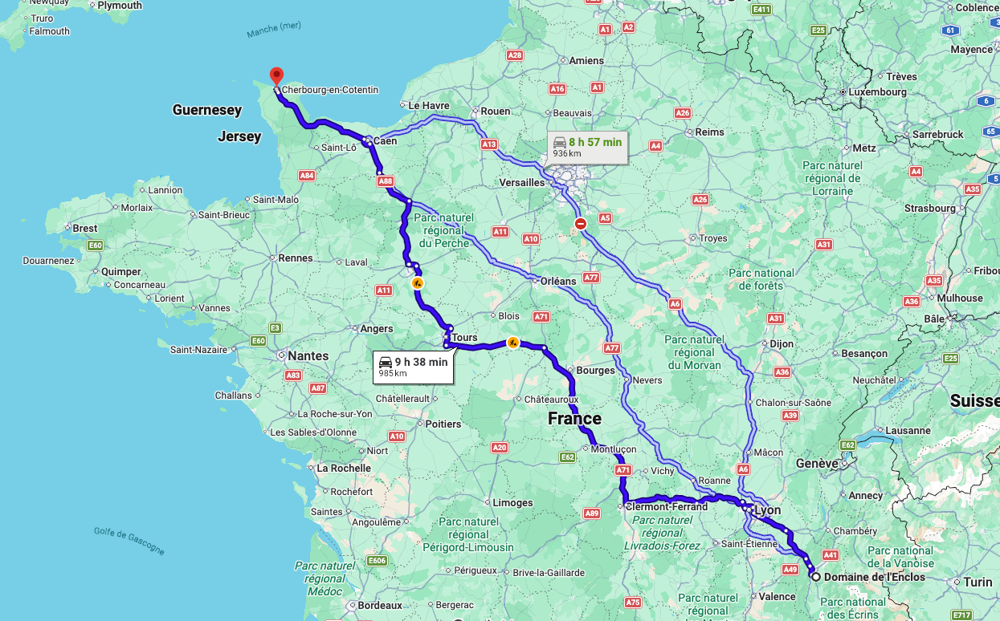
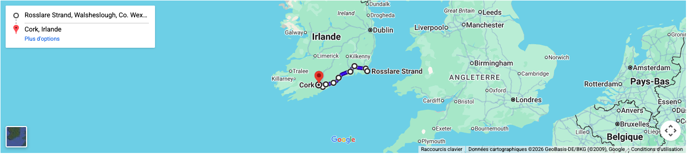
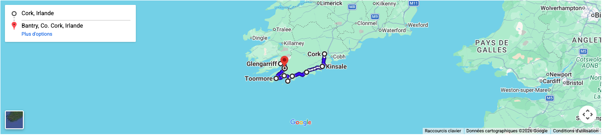
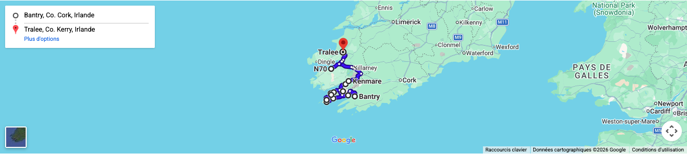
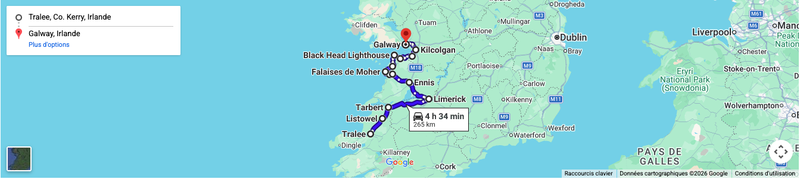
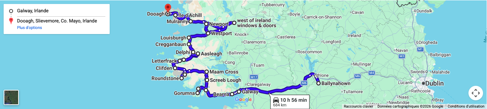
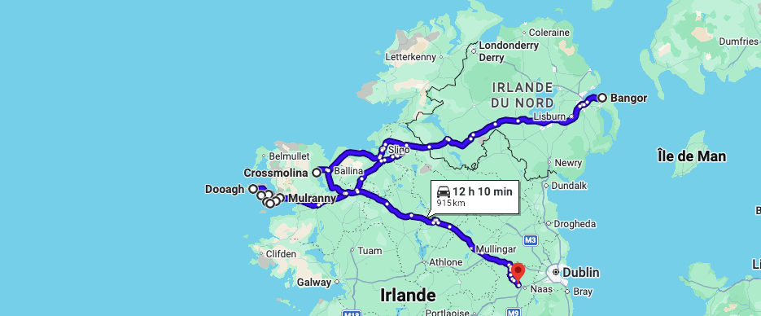
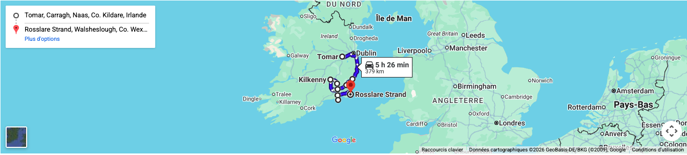
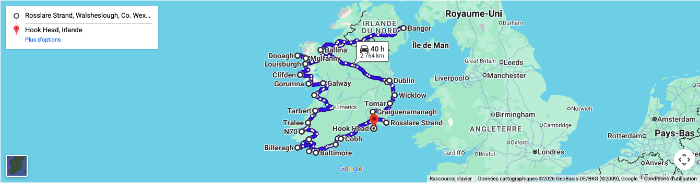

_Récit réalisé par Jean-Claude Braillon._

## Jeudi 3 Septembre 1998

`Haute-Jarrie → Cherbourg → Irish Ferries`

Départ de Haute Jarrie, vers 4 heures du matin, direction CHERBOURG. Il pleut. Guillaume nous a concocté un excellent programme de "Blues" pour la route. Il y a du "matos". Radio, cassettes, mini-Disks. Des fils partout. Nous roulons dans un studio. Mais on aime ça.

Le voyage se passe sans problème. La météo nous fait un clin d'œil et nous arrivons à CHERBOURG avec le beau temps, en milieu d'après midi.

28 ans après mon dernier passage dans cette ville, je ne reconnais rien. Il faut dire que je n'avais guère fait d'autre trajet que de la gare à l'hôpital militaire, et retour. Les autres sorties restent dans ma mémoire très embrumées, et pas forcément à cause de l'humidité normande.

Embarquement sur le cargo de l'**Irish Ferries**. La voiture est dans la cale, notre cabine aussi d'ailleurs. Un peu angoissant quand on est légèrement "clostro". On fait avec ses moyens et finalement, c'est l'aventure. Ça nous va bien.

Le bateau largue les amarres, la mer est très calme, c'est beau.

On reste sur le pont presque jusqu'à la nuit, avant de s'approcher du restaurant, où nous apprécions le repas. _Chicken, French fries for the first time…_

Promenade digestive à tous les ponts du bateau pour repérer les secteurs sympas et notamment le bar avec sa salle de spectacle, où nous allons très vite nous installer pour un premier contact avec la musique et les danses irlandaises. On ne voit pas la nuit qui avance, et décidons d'aller dormir un peu, vers 2h30 du matin.

## Vendredi 4 Septembre 1998

`Rosslare → Wexford → Waterford → Cork`

Après un petit déjeuner sur le bateau, vite on grimpe sur le pont, pour être les premiers à voir les côtes irlandaises. Le crachin et la brume ne nous laissent pas ce plaisir. Soudain, on distingue la terre. On arrive à ROSSLARE, il est 10h30.

Débarquement, c'est l'effervescence tout autour de nous.

Ça y est ! on est sur le sol irlandais. **Attention, KEEP LEFT !**

Quelques kilomètres d'adaptation et hop ! on est dans le coup. Pas facile pour doubler quand même. Heureusement, j'ai un coéquipier de confiance.

C'est parti ! direction WEXFORD, NEWROSS, WATERFORD où nous nous arrêtons pour déjeuner. On n'est pas encore familiarisé avec les £ (Livres irlandaises) et on se fait arnaquer. Bien fait ! c'était le piège à touriste. On retiendra la leçon pour la suite.

Allez, on repart. DUNGARVAN, YOUGHAL, MIDLETOWN, COBH _(prononcer "Cove")_, c'est beau ces petites villes avec les couleurs des maisons dans ce superbe environnement éclairé par un beau soleil. Dommage, Guillaume dort. Le coéquipier a craqué.

Arrivée à CORK. Aïe ! c'est une grande ville, je suis un peu inquiet. J'ai envie de continuer pour trouver un village pour passer la nuit. Guillaume qui connaît déjà Cork insiste pour que l'on reste.

Surprise ! même en ville les irlandais sont des gens bien, courtois, disciplinés et respectueux. Ça me rassure. Nous retrouvons l'auberge de jeunesse où Guillaume avait déjà séjourné. Le **Sheila's Hostel**. Tout est complet.

Le propriétaire nous demande si nous serions d'accord pour dormir dans une petite maison située à 800 m. Tu parles ! qu'on est d'accord.

Elle est très belle cette petite maison avec sa porte jaune et son intérieur en bois. On a d'ailleurs fait plusieurs photos… sans pellicule dans l'appareil. _No comment._

Super soirée irlandaise, trempés jusqu'aux os, chicken… et le tour des pubs. Quelle ambiance, des gens heureux, de la musique et aucune impression d'insécurité.

Et hop, une bonne nuit là-dessus dans notre petite maison.

> Un bon souvenir.

## Samedi 5 Septembre 1998

`Cork → Kinsale → Baltimore → Glengarriff`

Il fait beau, _little breakfast_ au Sheila's Hostel. C'est vrai que c'est bien ces gros "petits déjeuners" !

Ce matin, on a envie de saluer tout le monde, ce qu'on fait d'ailleurs, et d'être agréable avec tous ceux qui sont dans la salle. Il semble que pour eux c'est pareil. Que se passe-t-il ? Ça fait bien longtemps que je n'avais plus ressenti cela.

Allez en voiture ! il est 10h00. Direction KINSALE _(Port du dernier départ du Titanic)_. CLONAKILTY, BALTIMORE, magnifique petit port au bout d'une presqu'île. Repas de midi léger, au calme, dans une belle nature au milieu de ses inévitables moutons.

On se rend enfin compte que notre appareil photo est vide. Il vaut mieux en rire.

Direction SKIBBEREEN, BALLYDEHOB, TOORMORE, BANTRY, puis arrivée à GLENGARRIFF à 17h00. On recherche un B&B pour la nuit et on trouve après 10 mn, le **"Bay View"** qui sera le meilleur de notre séjour à tout point de vue, accueil, hébergement, _little breakfast_, environnement, etc.

Pour le dîner, on décide de retourner vers BANTRY, où on choisit un petit restaurant sympa dans cette belle petite ville. On découvre alors **l'Irish stew**, excellente spécialité irlandaise. Très bien. Retour au B&B où nous passons une très bonne nuit malgré le vent et la pluie à l'extérieur, que l'on trouve quand même particulièrement forts.

## Dimanche 6 Septembre 1998

`Glengarriff → Beara Ring → Kerry Ring → Tralee`

Dehors, c'est pas terrible, nuages très bas, pluie, vent froid.

On apprend au _little breakfast_ qu'on a eu droit à _"a terrible hurricane from USA"_. C'est pendant la suite de notre voyage que l'on comprendra mieux que cet ouragan était réellement exceptionnel, et surtout lorsqu'il a fallu déplacer des arbres tombés sur notre route.

Aujourd'hui, c'est Guillaume qui a pris "les pouvoirs" au volant.

L'étape du matin, c'est le **Beara Ring**. Malgré le temps très mauvais, on découvre une presqu'île de toute beauté à ne rater sous aucun prétexte.

C'est parti pour en prendre plein les yeux : CASTELTOWNBERE, CAHERMORE, GARNISH POINT, BALLYDONEGAN, EYERIES, GORTGARRIFF, ARDGROOM, DEREEN GARDENS, KENNEMARE où nous nous arrêtons pour grignoter et faire un petit tour en ville entre deux averses.

L'après midi, encore sous le charme du Beara Ring, nous repartons pour le **Kerry Ring**. Après ce que nous avons vu ce matin, nous sommes déçus. Le paysage est plus moyen, plus touristique et les habitants paraissent moins accueillants. À noter quand même le brouillard qui ne nous permettait pas une grande visibilité, surtout vers les sommets.

Nous trouvons à TRALEE un Youth Hostel pas mal pour passer la nuit, mais plus froid et plus impersonnel que nos précédents hébergements.

Nous dînons dans un pub où je m'offre une bonne **Guinness**.

L'ambiance n'étant pas au top, nous rentrons à notre Youth Hostel pour nous coucher de bonne heure.

## Lundi 7 Septembre 1998

`Tralee → Cliffs of Moher → Burren → Galway`

Départ 10h00, la météo n'est toujours pas formidable et nous décidons d'accélérer notre montée vers le nord, du côté des "Aran Islands".

En avant pour LISTOWEL, TARBERT puis les rives de la **Shannon River** jusqu'à LIMERICK. Une grande ville où nous ne faisons pas de vieux os en prenant la direction de ENNIS, pour retrouver enfin des petites routes jusqu'à ENNISTIMON, où commence alors l'émerveillement du jour. LAHINCH puis les superbes **Cliffs of Moher**, avec les inévitables boutiques de pulls traditionnels, que je trouve cependant un peu chers, mais que je regretterai plus tard, en voyant les prix beaucoup plus élevés ailleurs.

Nous poursuivons vers le **Burren** par LISDOONVARNA, BLACK HEAD, BALLYVAUGHAN, KINVARRA… Quel beau pays ! On ne cesse de se le répéter.

Encore KILCOLGAN, puis arrivée à **GALWAY** qui est une ville assez importante _(pour l'Irlande)_, mais qui nous séduit immédiatement, comme une belle fille vers qui on se sent irrésistiblement attiré.

Nous trouvons sans peine un Youth Hostel idéalement situé, proche du centre de la vieille ville.

Zut ! en sortant de la voiture nous constatons qu'un pneu est à plat. Nous installons la roue de secours et prenons possession de notre chambre en sous-pente, proche de la gare, mais relativement calme.

Nous poussons le plaisir du jour jusqu'à flâner dans cette belle petite ville en ne négligeant aucun magasin de musique, dont un où nous achetons notre **Tin Whistle**, en ré s'il vous plaît. Guillaume hésite à s'offrir un violon irlandais, mais le prix reste quand même élevé pour son budget.

Comme pour confirmer que la météo n'est vraiment pas avec nous, nous constatons que l'eau qui s'écoule du **Lough Corrib** arrive en haut des arches des ponts avant de se jeter dans l'Océan. À voir comme les propriétaires de bateaux s'affairent, c'est la preuve que cela n'est pas habituel.

Nous dînons dans un restaurant très sympa. Nous commencions à peine à sécher à la fin du repas quand nous sommes repartis faire le tour de quelques pubs, avant de regagner plus tard notre chambre… sous la pluie.

## Mardi 8 Septembre 1998

`Galway → Connemara → Roundstone → Achill Island`

Départ 10h00 _(As usual)_. Il fait assez beau, et aujourd'hui, nous nous dirigeons vers ce fameux **Connemara** dont on a tant entendu parler.

Tout d'abord, nous recherchons un réparateur de pneu pour partir avec notre roue en état. Le travail est très bien fait, immédiatement, avec gentillesse, le sourire, et à petit prix. Je demande à Guillaume de me pincer pour voir si je rêve. C'est aussi ça l'Irlande.

Nous nous éloignons un peu à regret de GALWAY vers BARNA, BALLYNAHOWN, CASLA puis soudain, en pleine figure, l'entrée au pays des merveilles. Les superbes îles LETTERMORE ISLAND et GORUMNA ISLAND, puis SCREEB et MAAM CROSS, avant une nouvelle vision d'exceptionnelle nature — pour laquelle on ne trouve pas de mot assez fort pour exprimer la beauté — de TOOMBEOLA jusqu'à ROUNDSTONE, petite ville réputée pour ses fabricants de **Bodhran** et d'instruments de musique traditionnelle, où une halte s'impose bien évidemment.

Au milieu de ce rêve éveillé, nous prenons un petit repas et, avant de reprendre notre route, nous pensons à expédier nos cartes postales écrites la veille.

Direction CLIFDEN, puis LETTERFRACK, KYLEMORE ABBEY, LEENARE, AASLEAGH où nous nous arrêtons pour immortaliser un magnifique rapide et ses pêcheurs au lancer, sur notre pellicule qui cette fois est bien dans l'appareil, avant de poursuivre notre voyage par DELPHI, CREGGANBAUN, LOUISBURGH, jusqu'à WESTPORT. Nous osons à peine respirer et avancer, de peur de blesser par notre seule présence, ces paysages de nature exceptionnels, et bien au-delà de tout ce que nous pouvions imaginer.

Que de merveilles en quelques heures ! Nous sommes comme des enfants au pied d'un arbre de Noël chargé de cadeaux, tous plus beaux les uns que les autres.

Nous continuons maintenant vers NEWPORT, MULRANY, puis découvrons alors une nouvelle perle, très différente du Connemara, un peu plus austère avec sa végétation plus pauvre et plus désertique, mais très belle et étrangement mystérieuse.

C'est **ACHILL ISLAND**, la terre la plus à l'ouest de l'Europe.

Nous traversons DOOAGH, où nous ne trouvons pas le B&B dans lequel nous avions prévu de passer la nuit. Nous verrons le lendemain que nous avions confondu avec le village de DOOEGA, situé plus au sud de l'île.

Nous nous arrêtons au bout de la route, face à l'Océan, dans ce nouveau site hors du commun, où une petite rivière qui descend du Lough Acconymore est exactement de la couleur d'une **Guinness**, qui coule dans un verre qu'on remplit.

Nous sommes dans **KEEM BAY** à MOYTEOGE HEAD. Nous n'avions jamais été aussi proches des États-Unis d'Amérique.

> Nous ne pouvons résister à l'envie de prendre une poignée de sable pour ne jamais oublier cette journée, si tant est que l'on puisse l'oublier.

Nous nous posons enfin au **"Panorama B&B"** de DOOHAG, où la propriétaire, qui en faisait quand même un peu trop, était un modèle d'hospitalité irlandaise. Pour nous permettre de dîner, c'est elle-même qui a préparé notre repas _(chicken, French fries, Guinness)_ dans le restaurant pub qu'elle nous avait indiqué, à quelques kilomètres.

Retour au B&B où nous ne traînons pas pour nous endormir, protégés par la bible posée sur la table de nuit, et bien décidés à continuer le rêve de la journée, mais dans les bras de Morphée, qui cette nuit-là plus particulièrement, était rousse avec des taches de rousseur.

## Mercredi 9 Septembre 1998

`Achill Island → Dublin → Wicklow`

Petit déjeuner, toujours très copieux en Irlande, autour d'une grande table au centre de laquelle notre hôtesse a placé tous les drapeaux des pays européens, et où nous nous régalons en compagnie de Belges et d'Allemands ainsi que de nos irlandais, avec qui nous tentons d'avoir de grandes discussions en anglais. Sur ce coup-là, nous n'avons pas été les meilleurs.

Au départ, il fait beau. Je reprends les pouvoirs au volant, et nous décidons de terminer notre tour de l'île par DOOEGA, CLOGHMORE, ACHILL SOUND, BOLINGLANNA, DOOGHBEG, avant de reprendre notre route sur le continent à MULRANY et remonter une dernière fois vers le nord par SHRANAMANRAGH, BANGOR, CROSSMOLINA au milieu des tourbières plus industrielles, puis repartir vers le sud à BALLINA le long du Lough Conn, PONTOON, FOXFORD où nous prenons une auto-stoppeuse _(essentiellement pour rendre service)_ qui nous explique qu'elle a des problèmes de voiture. Vu l'accent irlandais particulièrement marqué, notre conversation sera relativement limitée de SWINFORD jusqu'à CHARLESTOWN où nous la déposons. Elle nous quitte avec un gentil _"God bless you"_.

Nous continuons sur BALFAGHADEREEN, TUSK, LONGFORD, arrêt casse-croûte — le paysage n'est plus aussi beau, notre humeur aussi — on roule, c'est une grande nationale, MULLINGAR, BLACK WATER BRIDGE, MAYNOOTH, on est fatigués. Nous avons traversé les deux tiers de l'Irlande du Nord au Sud depuis ce matin. Enfin, **DUBLIN**. La ville est plutôt belle, mais un peu trop grande à notre goût. On cherche le Youth Hostel où l'on avait prévu de s'arrêter. Tout est complet. On se sauve, direction plein sud.

On s'échappe dès que possible des "prisons" à 4 voies, pour reprendre une petite route côtière, avec à l'est la mer, et à l'ouest, les **Wicklow Mountains**. Guillaume consulte tous nos documents de long en large, pour trouver un B&B ou un Youth Hostel pour la nuit. On arrive à WICKLOW, toujours rien et la fatigue qui commence à sérieusement se faire sentir. Il trouve une adresse de B&B à COOLGREANY, on fonce, on arrive, mais malheureusement, c'est complet. Cependant, la propriétaire nous donne une autre adresse à TOMAR, et téléphone pour les avertir de notre arrivée. C'est un minuscule village qu'on ne trouve pas sur la carte, mais très bien dans notre style. Ouf ! ça y est, on peut se poser. Dans le jardin, un pommier avec des pommes comme dans _"Blanche Neige"_. C'est réconfortant.

Aussitôt installés, on repart pour chercher un restaurant. La propriétaire nous en indique un à GOREY, mais quand on arrive, c'est trop tard, ils ne servent plus. On repart ventre à terre à ARKLOW, on arpente les rues pour trouver quelque chose d'ouvert, mais en Irlande, à 21h00 c'est trop tard pour dîner. On finit par trouver… une pizzeria qui veut bien nous servir. On avale nos pizzas, puis on rentre aussitôt se coucher.

> C'est la plus mauvaise journée de notre séjour irlandais. Il en fallait bien une.

## Jeudi 10 Septembre 1998

`Wicklow → Kilkenny → Hook Head → Rosslare → Ferry retour`

Dans cet excellent B&B, un somptueux petit déjeuner nous est servi par **Marion Whelan**, notre hôtesse qui, dès que nous engageons la conversation pour lui raconter notre voyage, sort de sa discrétion, et se montre particulièrement sympa et très agréable. Elle nous indique des sites à visiter et nous offre avec beaucoup de gentillesse, le guide des _Beds and Breakfast_ de l'Irlande.

Nous nous décidons enfin à partir, un peu comme si nous devions quitter quelqu'un de notre famille. Direction, GOREY, ENNISCORTHY, NEW ROSS, GRAIGUENAMANAGH puis un arrêt pour une visite de la belle ville de **KILKENNY** et son superbe château, qui nous offrira son parc pour déguster tranquillement notre casse-croûte, avant de reprendre la direction du mémorial JF. KENNEDY, édifié sur les terres des ancêtres du célèbre président des USA. C'est un piège à touristes, mais le site est agréable.

Nous nous dirigeons vers le sud et la mer par ARTHURSTOWN jusqu'à **HOOK HEAD**, où nous restons le plus longtemps possible, avant de nous diriger lentement vers ROSSLARE pour embarquer sur notre bateau du retour en France.

Nous n'avons pas envie de partir. Les Fées irlandaises se sont penchées sur nous. Elles nous ont emportées pour danser avec elles au son des flûtes, tin-whistles, bombardes et bodhrans dans leur monde merveilleux et enchanteur. La magie a fonctionné. Nous nous accrochons à leurs cheveux roux, pour survoler un instant encore cette terre fabuleuse qui nous a fait aimer la pluie, où les lutins se confondent avec la nature, en ouvrant les nuages comme des rideaux, pour laisser passer les rayons irréels du soleil, et créer d'incroyables pastels qui contrastent avec les anthracites, les verts et les bleus, comme nulle part ailleurs.

Sans trop comprendre comment, nous nous retrouvons sur le pont du ferry, les yeux rivés sur cette terre qui s'éloigne irrémédiablement.

Lorsqu'elle a disparu à l'horizon, je me rends compte que la mer est très forte. Le bateau est frappé par les vagues et fait d'impressionnantes embardées.

Je commence à ne pas être très bien. Guillaume propose que l'on aille au restaurant du bateau pour dîner, où l'on constate que très peu de passagers sont présents au repas, plus occupés à tenter de garder le précédent.

Par la baie vitrée face à notre table, je peux juger de l'amplitude des vagues et de l'incroyable mouvement de haut en bas de notre bateau. Pendant tout le dîner, le "sac en papier" à portée de main, j'ai le cœur tantôt dans la cervelle, tantôt dans les pieds. Ça ne va pas fort.

Guillaume, qui semble parfaitement supporter, m'entraîne vers la salle de spectacle. Tout est attaché. Les danseurs irlandais ne se produiront pas ce soir, le bateau "saute" trop.

Les musiciens commencent à jouer, juchés sur leurs tabourets scotchés au sol. Ce soir, pas de bousculade pour avoir les meilleures places. La tempête a parfois du bon.

Étrangement, après un ou deux morceaux de cette envoûtante musique Celtique, je me sens beaucoup mieux. Les fées sont là.

Nous restons jusqu'à la fin du spectacle, cramponnés à nos fauteuils.

Fatigués, nous descendons ensuite dans notre cabine pour dormir jusqu'au retour en France. Une fois couchés, il semble que nous sommes dans un ascenseur qui ne cesse de battre des records de vitesse de montée et de descente dans un gratte-ciel. Tantôt écrasés, tantôt éjectés de la couchette, on s'accroche, et on finit par s'endormir, malgré les sinistres craquements du ferry, et le choc des énormes vagues sur sa coque.

Notre arrivée en France a été un peu bousculée. J'avais oublié le décalage horaire, et nous avons eu juste le temps de sortir sur le pont avant le port de Roscoff, pour apercevoir l'île de Batz où nous avions été en vacances quelques années plus tôt.

Pendant cette cavalcade, ayant perdu Guillaume, j'ai été contraint de faire tous les ponts du navire, avant de retrouver la voiture dont je n'avais pas mémorisé l'emplacement.

Débarquement, attention "rouler à droite". Fini la courtoisie. C'est le retour dans la jungle urbaine où règne la loi du plus fort, du plus vicelard.

Une petite balade Bretonne sous la pluie nous permet cependant de nous réhabituer progressivement, avant de prendre la direction du sud sous des trombes d'eau que nous subirons pendant la plus grande partie du voyage, jusqu'à Haute Jarrie où nous arrivons vers minuit, très, très fatigués, mais tellement heureux avec nos merveilleux souvenirs en tête.

## Le voyage en chiffres

- **2 198 km** de route en Irlande
- **39 heures** de conduite, soit en moyenne **314 km/jour** et **5h35 de route/jour**
- **+ 1 876 km** et **18h24** pour l'aller-retour Haute-Jarrie ↔ Cherbourg

