## **Mercredi 29 juin.**

Me voilà arrivé à Lyon. Il est 18h00, j'enregistre mes bagages et déjà, le panneau d'affichage indique une heure de retard sur mon vol vers Londres. En principe, je peux quand même prendre le vol vers Hong Kong dans les temps. Je vais donc prendre un verre en attendant le départ. Mais à mon retour, le vol est annoncé avec 3h00 de retard à cause des mauvaises conditions climatiques. Résultat des courses, je ne peux pas assurer la correspondance vers Hong Kong. Après un peu plus d'une heure de recherches, l'hôtesse me trouve un vol pour le 1er juillet à 7h15. Me voilà donc de retour au point de départ, à la maison.

## **Vendredi 1er juillet.**

C'est reparti pour un tour, direction Lyon. Il est 6h00 du matin, j'enregistre mes bagages. Je passe ma guitare en « hors gabarit fragile » et je croise les doigts. L'avantage, c'est que je n'aurai pas à la transporter lors des escales, puisque je reste une journée entière à Hong Kong.

Quelques heures plus tard, j'arrive à Londres. Direction le guichet de la Cathay Pacific pour récupérer mes billets vers Hong Kong et Brisbane. Quelle n'est pas ma surprise quand l'hôtesse m'annonce que mes vols ont été annulés et qu'il n'y a plus de place dans l'avion. Après une bonne demi-heure, elle me dit qu'il y a peut-être une chance et que je sois mis en liste d'attente. Je dois donc revenir toutes les quarts d'heure pour voir si je peux partir. Au bout d'une heure, juste avant que l'avion ne décolle, elle me trouve une place. Je lui demande de vérifier que mes bagages sont bien dans l'avion, et une course folle commence pour rejoindre la porte d'embarquement à temps. J'arrive limite, l'hôtesse me demande mon passeport et vérifie mon visa électronique. Bien sûr, pour rendre la chose encore plus stressante — l'avion m'attend déjà — ils ne trouvent pas mon visa et me disent que je dois refaire une demande et repayer 100 euros. Je râle un peu, et après deux ou trois coups de fil en Australie, ils retrouvent enfin mon visa. Je monte enfin dans l'avion, direction Hong Kong. J'aurais dû être à Brisbane depuis quelques heures, mais ce n'est plus qu'un détail maintenant.

Je m'installe à ma place, prêt à affronter les 12h00 de vol sur mon petit siège, en espérant ne pas avoir deux costauds de 150 kilos à côté de moi. Mais la chance me sourit : il n'y a personne à côté, j'ai donc trois sièges rien que pour moi. Dire qu'une heure plus tôt je n'avais même pas de place dans l'avion. Comme pour me redonner du courage, une jolie jeune fille — dont le système vidéo ne fonctionnait pas — vient me rejoindre. Les 12 heures de vol ont été bien plus agréables que prévu.

## **Samedi 2 juillet.**

Après deux repas, cinq films et 12 heures de vol, me voilà à Hong Kong. Il est 8h30 du matin et mon vol pour Brisbane n'est que dans 15 heures. Je vais donc en profiter pour faire un tour en ville. À la douane, je rencontre un Français dont le vol part à peu près à la même heure que le mien ; nous décidons de visiter la ville ensemble.

Nous prenons le train depuis l'aéroport, direction le centre de Hong Kong. Cette ville est impressionnante : les gratte-ciel style _Le Cinquième Élément_ côtoient de petits jardins chinois. Les rues du centre sont vraiment très propres, les gens courtois et disciplinés.

À midi, nous allons dans un petit restaurant de la ville. À notre arrivée, le serveur pose deux verres qui ressemblent à du thé ; nous les goûtons, et le goût est particulier, voire douteux. Nous nous rendons compte à la fin du repas que c'est en fait pour y déposer les baguettes et les cuillères avant de manger. Mais à ce stade, nous avions déjà terminé — après avoir testé les _noodles with beef_ à la sauce gluante (voir photos). Pour vivre l'expérience à fond, je décide de prendre le _Lotus Seed Sweet Milk_ (voir photos), qui n'est en fait que du lait chaud sucré dans lequel baignent des graines de lotus ressemblant à des yeux. C'est comme... je ne sais trop quoi — un légume pas cuit, un bout de bois, ou peut-être des queues de cerises.

Après ce fameux repas dans un restaurant climatisé à −15 °C, nous ressortons dans les rues à +45 °C à l'ombre. Nous continuons notre périple et décidons de prendre un bateau pour l'île de Hong Kong. De là-bas, nous pouvons voir toute l'étendue de la ville (voir vidéo). Plus tard, nous retournons à l'aéroport pour nous reposer, car ces dernières heures ont été éprouvantes. La fatigue, le stress, la chaleur et le décalage horaire ont eu raison de moi.

J'arrive enfin à la porte d'embarquement de mon dernier vol, direction Brisbane via Cairns. Pour me remettre dans le bain, le stewart vient me voir pour me dire qu'il lui manque des informations sur mon passeport — mais heureusement tout se règle en cinq minutes. Je monte dans l'avion sans problème. J'arrive à Cairns dans 8 heures, et à Brisbane deux heures après.

## **Dimanche 3 juillet.**

Me voilà enfin à Brisbane, la guitare et mon sac ont bien suivi, tout est en un seul morceau.
Une fois sorti de l'aéroport, je vois bien sûr le bus partir, mais ce n'est pas grave : je vais prendre le train, qui coûte le même prix et me dépose juste à côté de l'auberge.
La température à Brisbane n'est que de 20 °C, mais c'est très agréable et il fait un beau soleil.
De toute façon, là, je n'ai qu'une envie : prendre une douche et me coucher.

## **Après quelques jours...**

Me voilà installé à la City Backpacker sur Roma Street, où j'ai retrouvé Rémy, un pote de France venu passer l'été en Australie. Il était déjà venu me voir quand j'étais en [Irlande](../voyages/irlande-2003-2005/).

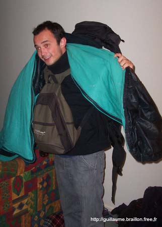

L'auberge est bien, mais je suis dans une chambre de six personnes, ce qui fait que je paye 23 $ la nuit — un peu cher.
Mercredi, nous allons changer d'auberge pour une moins chère : 90 $ la semaine.
Nous avons rencontré pas mal de monde, dont une Irlandaise qui va peut-être venir avec nous à Cairns, la ville du nord où nous voulons aller dès que nous aurons notre van.
Dans l'auberge, il y a aussi un Français qui joue de la guitare, et nous jouons le soir — du Jack Johnson, entre autres. Il y a pas mal de Français à l'auberge, et le fait de parler français avec Rémy ne facilite pas les choses.
Nous avons rencontré deux Françaises bien sympas qui sont en Australie pour leurs stages et qui en profitent pour faire un petit tour avant de commencer à Sydney et Melbourne.

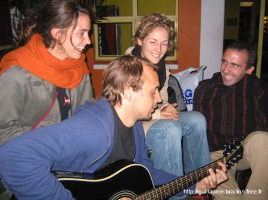

## **Un jour horrible.**

Aujourd'hui, nous allons changer d'auberge car nous la trouvons trop chère. Rémy, Ludo — le Français avec qui je joue de la guitare — et moi, partons chargés comme des mules vers l'auberge de l'autre côté de la ville.
Après 1h30 de marche en plein soleil, nous arrivons enfin à l'auberge, qui ressemble plutôt à une coloc de potes, mais l'ambiance paraît cool.
Un des locataires nous dit que le responsable n'est pas encore là, mais qu'il ne va pas tarder. Nous décidons donc d'attendre et d'en profiter pour appeler quelques propriétaires de van. Quelques minutes plus tard, le responsable arrive et nous annonce qu'il n'y a en fait plus qu'un lit de libre. Rémy et moi laissons donc la place à Ludo.

Nous ne perdons pas une minute et commençons à appeler les auberges du coin. Après une heure au téléphone, nous en trouvons une avec deux places — mais seulement pour une nuit. Et je vous le donne en mille : où se trouve l'auberge ? Juste derrière la City Backpacker, de l'autre côté de la ville.

Nous voilà repartis avec notre chargement sur le dos. Cette fois nous prenons un taxi, car il est déjà 13h30 et je dois aller à la banque ouvrir un compte pour pouvoir travailler ce soir au stade en tant que _runner_ — genre de serveur pour les salons VIP — et il faut aussi que je passe en ville acheter une paire de chaussures noires, obligatoires pour travailler.
Bien sûr, l'auberge trouvée est 4 $ plus chère que la City Backpacker. Comme elle se trouve tout à côté, nous réservons deux nuits. Tant de marche, de coups de fil et de perte de temps pour se retrouver au même endroit. On se console en se disant que ça fait partie de la vie de routard que nous avons choisie.

L'heure tourne et il me reste beaucoup à faire avant de travailler à 17h00. Une fois installés à l'auberge, nous mangeons vite fait, et je pars à toute allure vers la banque qui ferme à 16h00. J'arrive à 15h58 — la porte n'est pas encore fermée, ouf. Quand je dis au banquier que je veux ouvrir un compte, il commence par me dire qu'il est trop tard et de revenir demain. J'insiste en lui expliquant que je commence à travailler à 17h00, et très gentiment, il crée mon compte en quelques minutes.

16h15 : la course contre la montre n'est pas finie. Je pars chercher des chaussures dans un magasin pas loin de la banque, mais impossible de trouver ma pointure. Je cherche dans d'autres magasins, en vain. Je n'ai plus le temps — je tente le coup et retourne à l'auberge pour me laver, me raser, me changer, puis je repars vers le stade. J'arrive à 16h55.
Je vais voir la manager au point de rendez-vous et là, grosse déception : elle me dit que je ne peux pas travailler sans chaussures noires. Je rentre donc à l'auberge en repensant à cette course folle accomplie dans les temps... pour échouer si près du but à cause d'une simple paire de chaussures noires.

Cette journée a été vraiment éprouvante. Je fais une petite sieste.
Pendant notre attente du responsable d'auberge, nous avons repéré un van pas trop mal, mais un peu vieux et sans aménagement intérieur, pour 3 900 $, que nous avons déjà fait baisser à 3 400 $. C'est le premier van vu, alors on va en regarder d'autres pour avoir une meilleure idée du marché.

Le soir, je passe à la City Backpacker où je croise l'Irlandaise qui me propose d'aller boire un coup en ville — et bien sûr, j'ai oublié ma carte d'identité, donc je ne peux pas rentrer dans le bar, et je retourne seul à l'auberge.
Des jours comme ça, il vaudrait mieux ne pas se lever le matin...

L'aventure continue — bonne nuit de sommeil, et on repart !

## **1er week-end en Australie.**

Jeudi soir, j'ai reçu un appel de Kristy, une Australienne rencontrée à Dublin (voir Irlande 2004). Nous sommes allés boire un verre dans la soirée et avons reparlé des souvenirs d'Irlande et de ce que nous faisons maintenant. Elle est aujourd'hui avocate à 25 ans, ce qui paraît jeune pour nous mais est tout à fait normal ici — sa collègue a 24 ans et est également avocate. Elle nous a proposé de sortir vendredi avec ses amis, et nous a aussi très gentiment proposé de passer le week-end chez elle.

### Photos

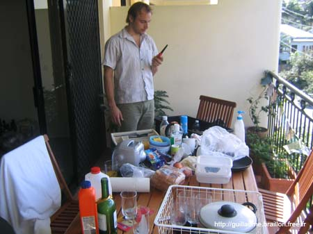

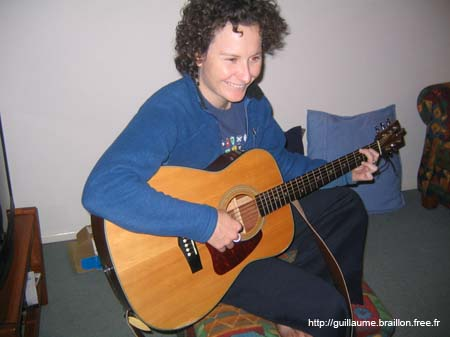

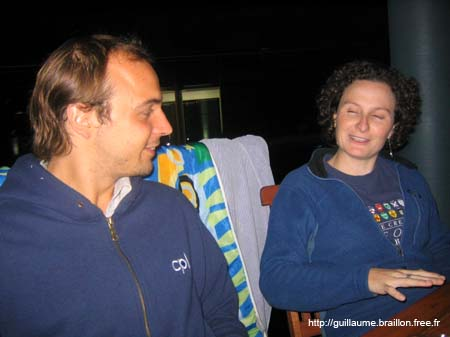

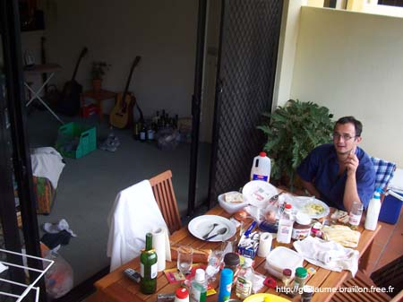

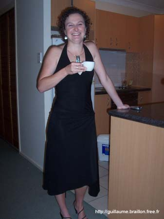

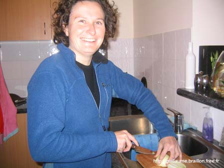

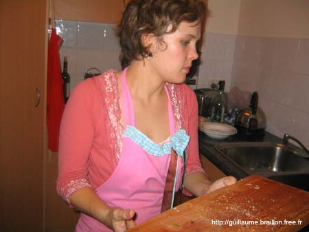

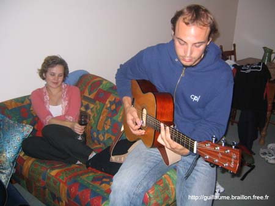

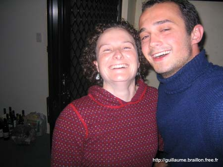

Vendredi, nous avons pris rendez-vous avec plusieurs personnes pour voir des vans. Nous sommes tombés sous le charme du premier : un Toyota qui ressemble de très près au célèbre VW. Après en avoir vu deux autres, nous confirmons l'achat et partons retirer 2 700 $, soit 1 600 €, prix négocié car il était d'abord à 3 300 $.

Mais là, les problèmes ont commencé. Je ne peux retirer que 1 000 € par semaine, ce qui pose un gros problème car le vendeur est allemand et rentre dans cinq jours. Je lui propose donc un virement sur son compte. Après plusieurs coups de fil à la banque, j'arrive à faire réaliser le transfert, mais le week-end et les délais bancaires font que l'argent ne sera pas sur son compte avant mercredi ou jeudi — je vais essayer de négocier ça avec lui.

Le soir, nous retrouvons Kristy et passons la soirée dans le Valley, le quartier des bars et clubs de Brisbane. Le lendemain, elle nous conduit chez elle et nous restons pour le week-end.
Samedi soir, j'ai travaillé au Tivoli Theater Restaurant en tant que _kitchen hand_ — aide de cuisine. Cette première expérience en restauration s'est plutôt bien passée ; à la fin, le manager m'a dit que je retravailerais sûrement pour eux.
Le dimanche a été repos dans l'appartement de Kristy, et le soir, Rémy et moi sommes sortis. Nous avons passé une superbe soirée et discuté avec beaucoup de gens, surtout des Australiens.

Ce premier week-end a été plutôt réussi, mais nous n'avons pas encore notre van, et l'impatience de partir sur les routes se fait vraiment sentir.

## **Bientôt prêts pour l'aventure.**

Je suis enfin propriétaire d'un van.
Après de dures négociations avec le vendeur, des fax à la banque et beaucoup de stress, me voilà enfin prêt — ou du moins presque — à partir sur les routes. Seul petit problème : le van n'a pas de contrôle technique, alors il va falloir aller au garage. S'il y a trop de frais, je partirai comme ça et ferons les réparations au fur et à mesure.

### Photos

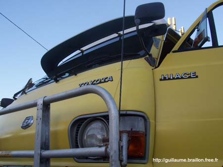

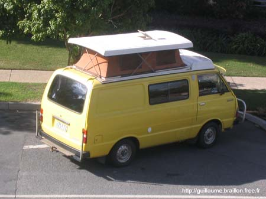

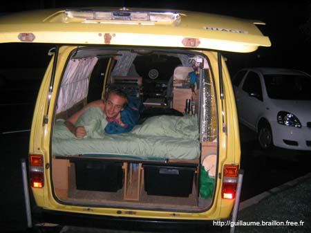

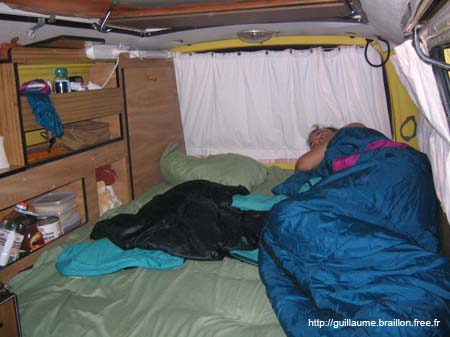

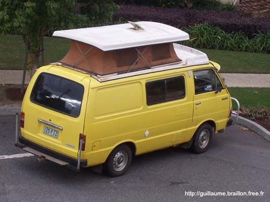

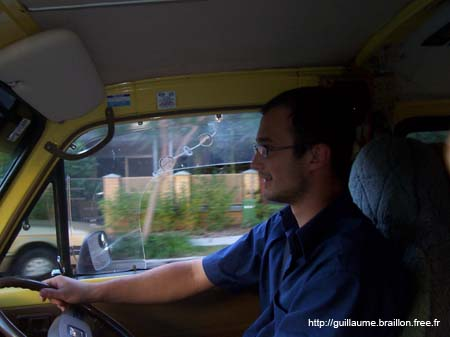

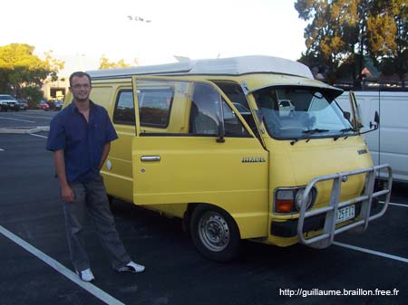

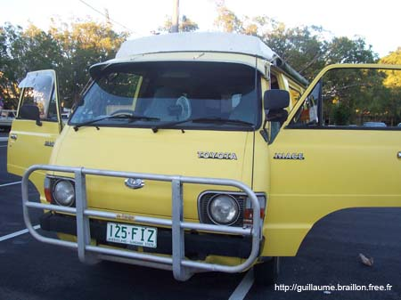

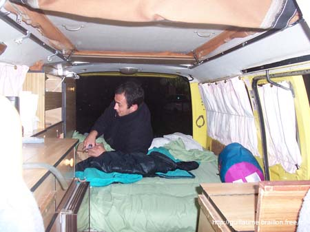

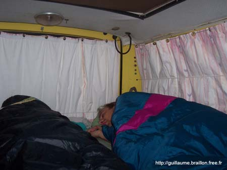

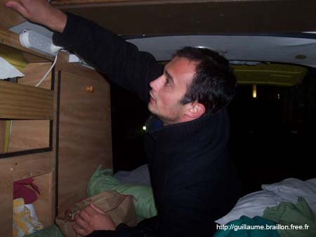

Pour un premier test, nous allons passer le week-end sur la Gold Coast, direction Surfers Paradise. Nous sommes passés par Southport et Main Beach. Notre premier arrêt sur la plage a été à The Spit — regardez les photos, c'est là qu'il y a les jet-skis.
Pour la nuit, nous sommes allés au camping de Burleigh. Un peu déçus car il n'y avait que des gens âgés, mais cela nous a permis de profiter du van avec l'équipement électrique : micro-ondes, lumières, et chauffage car la nuit était fraîche.

Pour la soirée, nous avions décidé d'aller sur Surfers Paradise, mais ça représentait 10 km à pied et nous ne pouvions pas prendre le van sans être obligés de rentrer avant 23h00. Nous nous sommes arrêtés dans un bar-restaurant de Miami, une ville proche, mais là aussi il n'y avait que des gens plus âgés. Nous avons donc pris le bus de ville.

Une fois arrivés sur Surfers Paradise, j'ai eu l'impression d'être à Miami Beach. De hauts gratte-ciel, des jeunes partout dans les rues qui font la fête, la plage juste à côté où des gens jouent au football et au frisbee. Voilà où se trouvait la jeunesse.
Les Australiens donnent vraiment l'impression d'être une population sans soucis, qui a une vraie culture de la fête. Un pays en pleine croissance économique, mais où l'on ressent aussi l'absence d'histoire ancienne, à l'inverse des pays d'Europe.
Après avoir fait un petit tour en ville, nous avons repris le dernier bus vers minuit pour ne pas avoir à marcher 10 km jusqu'au van.

Il est vrai que nous ne sommes pas encore très bons pour nous orienter et trouver les bons coins du premier coup, mais tout cela devrait s'améliorer avec le temps.

### Photos

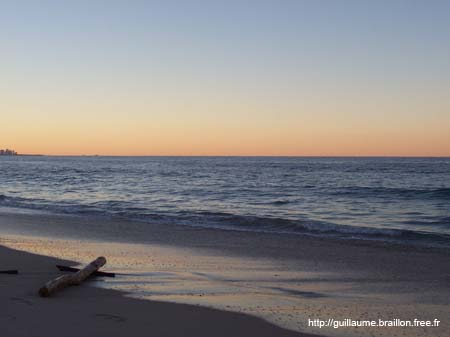

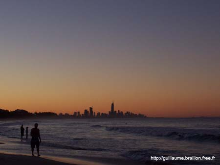

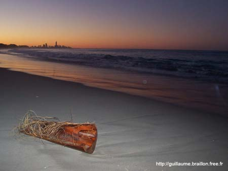

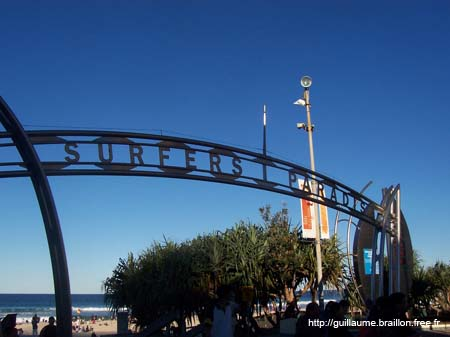

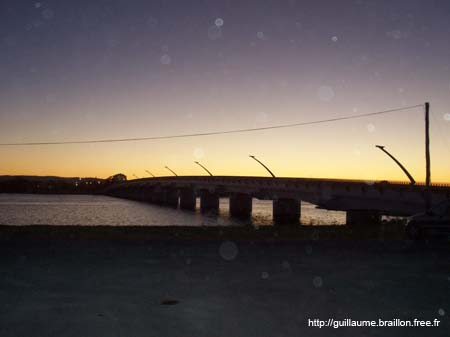

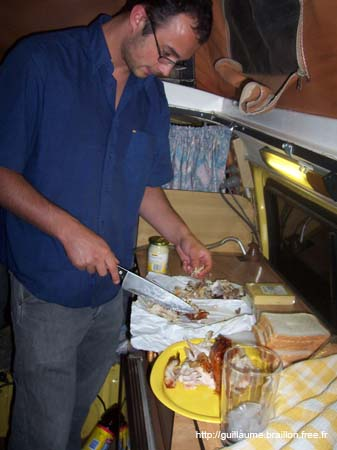

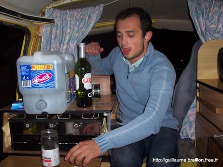

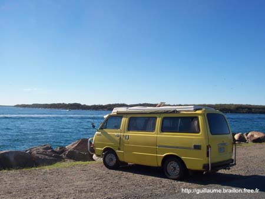

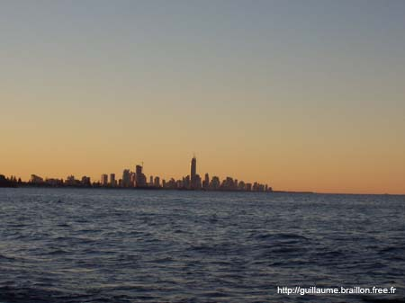

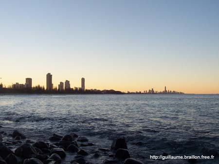

## 

## **1er contact avec les koalas.**

Une expérience inoubliable !
Lors de notre descente vers Surfers Paradise, nous nous sommes arrêtés au Lone Pine Koala Sanctuary. Comme c'était notre première virée en van, nous nous sommes un peu perdus et sommes arrivés vers 16h00, soit une heure avant la fermeture du parc. À l'entrée, les tarifs adultes étaient à 14 $ — pas question de payer 28 $ pour une heure. Nous avons négocié et n'avons finalement payé que 7 $ pour deux. Well done !

Une fois à l'intérieur, l'émerveillement total. Nous avons vu des troupeaux de kangourous que nous pouvions toucher et nourrir.
Je ne peux pas vous décrire l'impression que cela procure de voir de près ces animaux si étranges et de pouvoir les caresser comme des chiens. Je ne vous cache pas que je ne faisais pas le malin quand j'en voyais un arriver à toute allure vers moi.

Après les kangourous, nous sommes allés voir les koalas. Ce sont de petites créatures qui ressemblent à des peluches et passent leur vie dans les arbres à manger des feuilles d'eucalyptus. Leur pelage est merveilleux, et leurs petites pattes crochues montrent bien qu'ils ne sont faits que pour grimper. Cela dit, un coup de griffe ne doit pas faire de bien.
Nous avons ensuite découvert les autres animaux, tout aussi magnifiques : les différents oiseaux exotiques et autres bestioles dont je ne me rappelle plus les noms. Je vous laisse regarder les photos et la vidéo pour juger par vous-mêmes.

### Photos

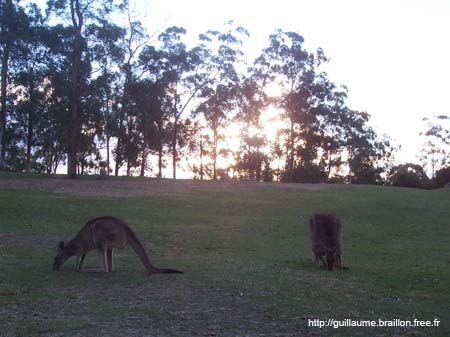

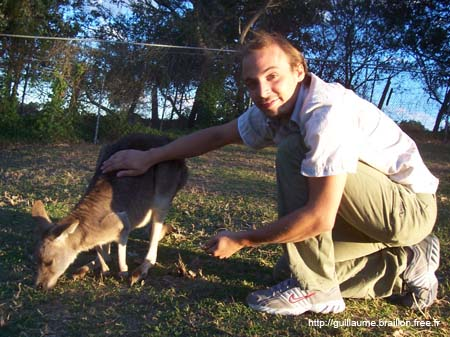

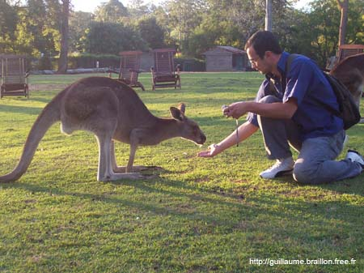

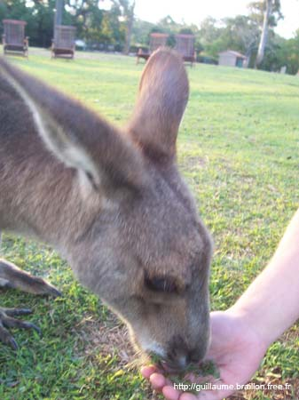

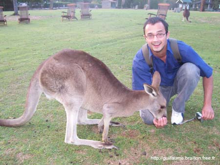

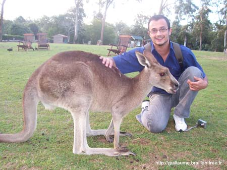

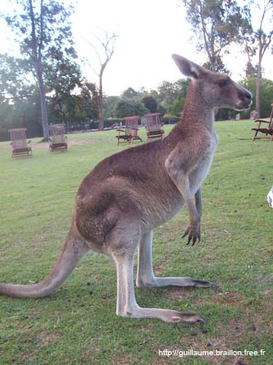

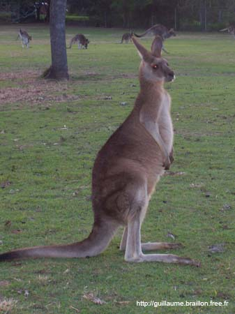

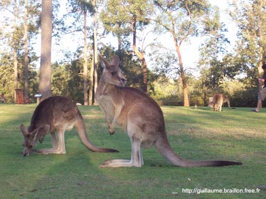

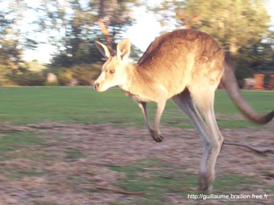

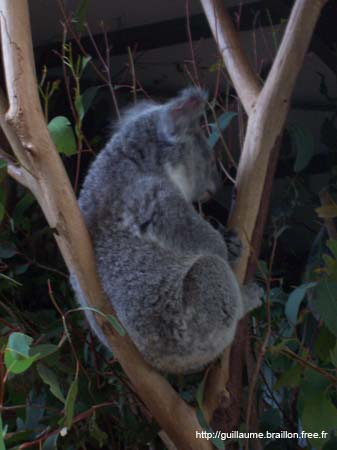

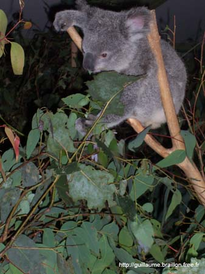

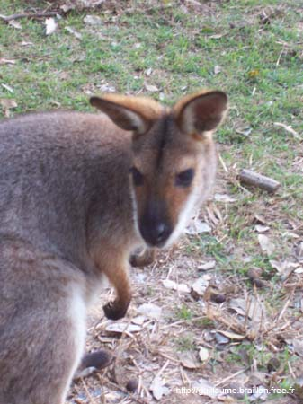

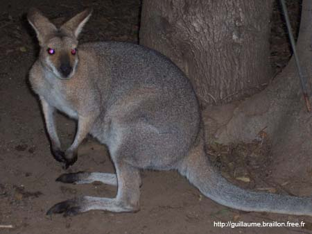

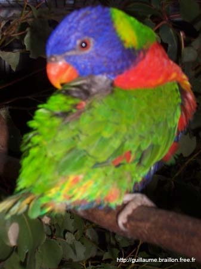

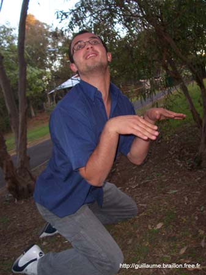

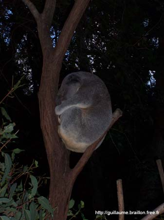

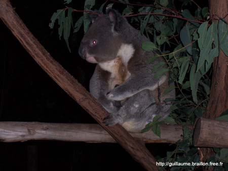

## 

## **C'est parti, direction Cairns — 1 600 km.**

Nous sommes donc allés chez Toyota pour faire inspecter le van, et la nouvelle n'est pas très bonne : il ne passe pas le contrôle technique. Ce n'est pas vraiment un problème pour l'instant, sauf si le moteur lâche ou si je veux le revendre.

Nous allons donc faire la montée vers Cairns pour voir comment il se comporte, et si ça vaut le coup de le garder — d'autant que Rémy repart fin août, et je ne suis pas sûr qu'il soit rentable de garder ce van quand je serai seul, l'essence coûtant le même prix que je sois seul ou à deux. Ces questions trouveront une réponse au fil des jours.

Nous voilà donc partis vers Maroochydore, une petite ville bien sympathique avec de belles plages.
Sur la route, nous avons fait une escale repas au sommet d'une petite montagne offrant une superbe vue, et en avons profité pour faire un barbecue — il y en a partout en Australie, dans les parcs, les aires de repos, et même sur les plages. Quelques oiseaux ont tenté de nous piquer notre repas, mais nous avons tenu bon ; ils ont renoncé au bout d'un moment, même s'ils sont téméraires.
Le soir, nous sommes arrivés à Maroochydore et avons trouvé un coin pour dormir.
Le lendemain, nous sommes allés faire un tour sur la plage avant de repartir vers Noosa.

### Photos

## 

## **Noosa National Park.**

Aujourd'hui, mercredi 19 juillet 2005, nous sommes montés à Noosa pour une balade dans le parc national, qui s'étend sur 2 km à l'extrémité de la Sunshine Coast.
La promenade à travers la forêt du parc et ses plages de sable fin nous a pris la journée, et en prime, nous avons eu droit à un superbe coucher de soleil en sortant de la forêt tropicale. Les photos en disent plus que les discours, alors je vous laisse apprécier.

## Photos

## 

## **Jusqu'où va-t-on aller ?**

Là, c'est le moment où le moral est à zéro et où la remise en question s'impose pour pouvoir repartir de plus belle. C'est aussi ce qui rend les bons moments d'autant plus agréables ensuite.

Après quelques jours de voyage en van, je me rends compte qu'il n'est pas dans l'état que j'aurais espéré. Je m'explique : même si nous roulons bien et que son aménagement est génial — frigo, plaques chauffantes, lumières, lavabo, chauffage, table, auvent et même télé — il fait des bruits très bizarres et la consommation est énorme.

Après réflexion, et fort de ce que j'ai déjà appris sur la vie ici en deux semaines — j'ai trouvé du boulot, vécu en auberge, chez des amis (merci Kristy) et parcouru pas mal de kilomètres — ma vision du pays a évolué.

Je me dis qu'il serait plus judicieux de monter à Cairns comme prévu, si le van tient le coup, et une fois là-haut de le revendre en essayant d'en tirer 2 500 $, ce qui ne représenterait qu'une perte de 200 $ — presque rien pour un mois d'utilisation. Ensuite, je compte changer mon mode de voyage. Après le départ de Rémy fin août, je ne pense pas que voyager seul en van serait très sécurisant ni économique.

En résumé : j'essaie de monter à Cairns, de vendre le van, et après je repars à zéro.
Par contre, si le van me lâche ou si je n'arrive pas à le vendre, je risque de rentrer en France plus tôt que prévu, avec le moral en berne. On verra bien la suite, et on garde le sourire — parce qu'ici, c'est trop beau. Bye-bye.

## **Hervey Bay.**

Aujourd'hui, nous nous sommes arrêtés à Hervey Bay, petite ville sans grand intérêt mais bordée de kilomètres de plage superbe.
Vous me direz que des plages superbes, il y en a partout ici — mais le but de notre visite, c'est Fraser Island, qui n'est autre que la plus grande île de sable au monde.

Pour visiter l'île, nous avons opté pour une formule proposée par une auberge-camping : deux nuits au camping, puis une excursion en 4x4 sur l'île pendant deux jours, et encore une nuit au camping.

La première nuit au camping a été très cool, ne serait-ce que pour les douches et pour laver le linge. Plus tard, nous avons rencontré deux Allemandes qui visitent l'Australie en 4x4 et partent elles aussi pour Fraser Island le lendemain. Elles nous ont donné des conseils et des adresses pour faire du fruit picking dans le nord. Nous allons peut-être les retrouver sur l'île ce week-end et au fruit picking plus tard.

Le lendemain, nous sommes allés faire un tour sur la plage lors de la marée basse — décor splendide, mais l'appareil photo était resté dans le van, désolé.
Le soir à 17h00, nous avons eu un briefing pour préparer le séjour sur l'île. On nous a expliqué les déplacements : là-bas c'est un peu Mad Max, pas de route, que des 4x4 qui traversent forêts tropicales et dunes de sable. L'île fait 120 km de long sur 15 km de large.
C'est un parc naturel avec des animaux sauvages en tous genres, notamment les dingos — des chiens sauvages pas vraiment commodes, paraît-il.
Voilà pour aujourd'hui, car demain départ à 6h30 et retour dimanche soir.

### Photos

## 

## **3 jours de bonheur sur Fraser Island.**

Tout a commencé jeudi soir au pub de l'auberge où nous nous sommes retrouvés pour faire connaissance avec les autres participants du tour. Bonne ambiance autour du billard et de la piste de danse. À minuit, nous sommes allés nous coucher pour être prêts à 6h30.

Avant de partir sur l'île, nous avons eu un briefing présenté par un Australien dont le but était clairement de nous faire peur pour nous préparer à l'hostilité du lieu. Il nous a dit que nous partions pour a _world of pain_ ! Le tour que nous avions choisi est en self-drive : chaque groupe a son propre Land Cruiser 4x4, identique à ceux du Camel Trophy.

Après quelques reportages sur les accidents survenus sur l'île et quelques conseils utiles, nous avons chargé le 4x4 avant de prendre le bac à 8h00.

Arrivés là-bas, nous avons suivi de petites pistes à travers la jungle, entre des arbres de plus de 2 mètres de diamètre, jusqu'au lac McKenzie — un lac d'eau douce si cristalline qu'elle est potable. Après une petite baignade et un repas, nous sommes repartis vers Eurong Beach.

Au bord de la route, nous avons vu notre premier dingo, qui n'avait pas l'air bien méchant — une bonne tête de toutou. Après 25 km de plage, nous sommes arrivés sur le site de Maheno, où l'on peut voir l'épave d'un navire construit en 1904 — rapide, luxueux et coulé, un peu à la Titanic.

Plus au nord, sur cette plage qui fait 70 km de long, nous nous sommes retrouvés bloqués dans du sable mou. Après quelques efforts, nous avons pu repartir et monter le camp sur la plage, où une vingtaine de personnes faisant le même tour nous ont rejoints.
Pendant le barbecue, nous avons vu un serpent d'un bon mètre se balader à côté de nous — de quoi prendre conscience de la faune qui vit sur cette île.

Le deuxième jour, lever à 7h00, petit déj, départ à 9h00 pour les _Champagne Pools_ — une sorte de piscine naturelle à l'abri des vagues où l'on peut se baigner sans risquer de croiser les requins qui patrouillent au large.
Nous sommes ensuite montés à Indian Head, un belvédère pour observer baleines et requins. Nous n'avons aperçu que quelques baleines au loin.

## **À la recherche d'un boulot dans le nord.**

Lundi matin, petit déjeuner au camping autour du van avec tous les potes du week-end. On s'échange les numéros et les mails, on se souhaite bon courage et on se promet peut-être de se retrouver sur les îles Whitsunday.

La veille sur l'île, nous avions retrouvé les deux Allemandes de Hervey Bay et décidé de faire un bout de route ensemble. Elles ont déjà travaillé dans le nord et connaissent quelques adresses. Et puis c'est plus sympa à quatre en parlant anglais.

Nous sommes donc partis pour Childers, où elles connaissent une auberge en contact avec les fermes du coin. Après quelques heures de route, arrivés dans cette petite ville sympathique, il n'y avait pas de travail pour le moment. À l'auberge, nous avons retrouvé l'Anglais et l'Irlandaise de Fraser Island — eux aussi cherchent du travail et montent vers le nord. Nous avons donc décidé de partir pour Bundaberg, en espérant avoir plus de chance.

Pas de chance non plus, et en plus il faut loger dans une auberge à 110–160 $ la semaine pour accéder au fruit picking. Pas bon pour nous.

Comme il est assez tard, nous décidons de descendre un peu vers la mer, à Bargara Beach, pour manger et dormir dans un coin tranquille avant de reprendre la route tôt le lendemain.
Le soir, pique-nique sur les barbecues de la plage. Nous avons trouvé un coin dans les arbres pour passer la nuit. Au matin, nous nous sommes rendu compte que nous étions au milieu des vaches — décor splendide. Petit déjeuner au soleil avant de reprendre la route.

Nous avons roulé toute la journée, avec un arrêt vers 16h00 à Rockhampton, capitale du bœuf australien. Rémy avait alors très envie d'un bon steak, sauf que les restaurants ne servaient pas à cette heure-là. Après une heure de marche, nous avons trouvé un café-resto — mais quand le serveur a donné le menu à Rémy, nous sommes repartis face aux prix exorbitants.
Nous avons donc fini au supermarché pour acheter un steak... qui n'était même pas de la viande de Rockhampton.

Nous sommes repartis vers Mackay. Vers minuit, nous avons posé le camp dans un coin sympa et sommes allés nous coucher : la journée avait été longue avec 12h00 de route d'un seul coup.

Le lendemain, au réveil, le rêve : nous étions au bord d'un lac, seuls au monde, avec juste un aéroport au loin qui ne nous dérangeait pas. L'endroit était si agréable que nous avons passé la journée à lézarder au soleil, à jouer à des jeux, à profiter du moment. Vers 16h00, tour en ville, puis route vers Airlie Beach à 185 km. Vers 20h00, barbecue au bord d'un lagon artificiel splendide. Le soir, un agent de sécurité nous a chassés du parking, alors nous nous sommes installés un peu plus loin.

Le lendemain matin, des agents de la commune nous ont réveillés à 6h30 — nous et les six ou sept autres vans autour — car le camping était interdit. Mais nous nous sommes rendormis, et à 10h00, petit déj et direction le centre-ville pour chercher du travail.

## **La chance n'est pas vraiment avec nous.**

Tous les boulots disponibles à Airlie Beach sont des contrats de deux à trois mois, ce qui ne nous convient pas : Rémy repart fin août et nous voulons aller à Cairns.
Nous partirons donc demain pour Bowen, le soi-disant paradis du fruit picking.

Le soir, nous avons passé la soirée avec les Allemandes. Tout a commencé par le coucher de soleil — notre plaisir quotidien, car ils sont magnifiques ici — puis nous sommes allés faire du trampoline sur la plage et avons fini la soirée dans le van après un bon repas de pâtes, pour changer.

Le lendemain matin, les filles sont parties très tôt pour un tour en bateau sur les îles Whitsunday. N'ayant pas les moyens, nous ne sommes pas allés avec elles.
Nous sommes partis pour Bowen vers 11h00, mais dès que j'ai voulu démarrer, les problèmes ont commencé. La batterie du van était morte ; il a fallu demander à des gens très sympas de nous aider à pousser. Nous voilà partis, mais après 20 km, le van a commencé à cracher des flammes et à caler. J'ai d'abord cru que c'était le moteur, mais c'était en fait la batterie à plat qui ne fournissait pas une bonne alimentation. Après deux ou trois arrêts sur les 80 km séparant les deux villes, nous sommes enfin arrivés. Je me suis garé en descente et nous sommes partis à la recherche de travail.

Après trois heures de marche dans une ville qui ressemble fortement au Mexique — rues cabossées, climat sec et chaud, pickups et 4x4 partout — nous avons compris qu'ici il n'y avait que des fermiers et des ouvriers agricoles. Et de partout, on nous a dit que la saison était mauvaise et qu'il n'y aurait pas de travail avant deux ou trois semaines.

Nous sommes retournés au van, et Rémy a eu la brillante idée d'aller prendre une douche dans l'auberge d'à côté. Le problème, c'est que dix minutes plus tard, il est revenu accompagné du manager de l'auberge qui l'avait vu entrer et sortir de la douche. Très en colère, il lui a dit : « 10 $ pour la douche ou j'appelle les flics. » Bien joué. Il nous a également interdit de rester garés là et dans les rues alentour. En pleine nuit, nous avons donc poussé le van et cherché une pente pour dormir.

Vue la superbe journée, nous nous sommes couchés à 20h00 — le genre de journée qu'on veut courte.

Le lendemain matin, nous sommes allés dans un garage faire recharger la batterie et au port de pêche demander s'ils avaient besoin d'aide — rien là non plus.

Après mûre réflexion, j'ai décidé de retourner à Airlie Beach et de prendre un boulot pour deux à trois mois. J'ai appelé les contacts que nous avions.
Vers 11h30, nous avons récupéré la batterie — pas tout à fait chargée — et sommes repartis avec une demi-batterie.

Arrivés à Airlie Beach vers 13h00, je suis allé remplir un formulaire mais suis tombé sur quelqu'un d'antipathique qui a posé mon dossier en vrac sur une pile. J'ai donc fait le tour des auberges proposant logement gratuit et 200 à 300 $ par semaine pour divers boulots. J'ai aussi appelé quelqu'un qui proposait du travail sur une île. Mon téléphone étant à plat, j'avais donné le numéro de Rémy — c'est lui qui a répondu quand la personne a rappelé, et c'est lui qui a eu le boulot : cinq jours sur l'île à nettoyer les cuisines. C'est le genre de mission qui lui convient, pas de contrat long.

Moi, j'ai eu un entretien pour conduire le bus d'une auberge. Le manager m'a dit que j'avais 50 % de chances car une autre personne passait juste après. J'attends, je vous dis pas la pression... Je vais retourner à l'auberge montrer que je suis motivé.

Je vous donne des nouvelles le plus vite possible. Bye-bye.

## **Tant de choses se sont passées en seulement un mois.**

Eh bien voilà, le job m'est passé sous le nez ! Le manager m'a dit qu'une fille s'était présentée, et qu'il préférait équilibrer car il y avait déjà un homme parmi le staff.

Bien énervé et découragé, j'ai pris mon courage à deux mains, mon sac à dos, et je suis parti faire le tour de tous les restos, auberges, magasins et autres endroits où je pourrais éventuellement trouver du boulot. Plus tard, une auberge qui avait pris mon CV m'a orienté vers un backpacker-restaurant-bar où j'ai effectivement trouvé un poste de kitchen hand — le même travail qu'à Brisbane pour un soir, mais cette fois j'ai dit que j'avais de l'expérience, et j'ai donc commencé le soir même à 18h00.

Je peux rester deux à trois mois. J'ai le logement gratuit, Internet gratuit, un repas gratuit par jour, des boissons gratuites, des réductions dans plusieurs bars et clubs de la ville, et 300 $ par semaine pour cinq jours de travail. Je bosse de 11h30 à 15h00 et de 18h00 à 23h30. Ces horaires me conviennent très bien car je ne suis pas du matin, et le soir je peux sortir après 23h30. Entre nous, c'est mieux que l'autre job où je devais commencer à 5h00 du matin !

La roue tourne, et ça fait du bien.
Évidemment, pas de photos aujourd'hui car ce n'était pas vraiment des vacances — et en plus il a plu toute la semaine.

Ça fait donc un mois que je suis parti de France. Honnêtement, j'ai vécu l'un des mois les plus mouvementés de ma vie, plein de hauts et de bas (je n'ai pas tout mis sur le site pour ne pas que mes parents viennent me chercher en urgence). Mais tout est rentré dans l'ordre, et je pense que ça va me faire du bien de me poser deux mois dans ce coin paradisiaque.

Merci à tous pour votre soutien, et continuez à passer de temps en temps sur le site. L'aventure continue, même si ça risque d'être plus calme pour quelques mois.

_À oui, au fait — un grand merci à mon père qui fait de son mieux pour corriger mes fautes « d'ortograffe », et c'est du boulot !_

## **Petit rappel.**

Je suis allongé sur la plage du lagon d'Airlie Beach, sous un soleil de plomb, devant une belle page blanche. Je ne sais pas trop par où commencer. Voilà déjà un mois que Rémy et moi sommes arrivés à Airlie Beach. Nous avions retrouvé nos amies allemandes après notre périlleuse virée à Bowen.
Elles ont visité les îles Whitsunday, l'archipel au large d'Airlie sur la barrière de corail. Comme nous étions revenus, elles ont décidé de rester un peu avec nous. Elles ont fait la connaissance d'Adam, un Australien qui voyage seul dans son van et joue de la guitare — nous avons tout de suite sympathisé. Rémy est parti dimanche sur South Moll Island pour travailler dans le complexe touristique de l'île, et moi j'ai trouvé un boulot aux Beaches Backpacker comme kitchen hand.

### Photos

## 

## **La 1ère semaine à Airlie Beach.**

Les Allemandes sont parties lundi matin pour Cairns, puis Darwin. Je me suis donc retrouvé seul pour la première fois depuis le départ. Enfin, pas tout à fait — Adam compte rester quelque temps à Airlie, même s'il ne sait pas combien.
Quand je ne bosse pas, on va jouer de la guitare ou du frisbee sur la plage.
Souvent le soir, nous jouons de la guitare en regardant le coucher de soleil sur la baie d'Airlie. Je pense que c'est l'un des plus beaux endroits où j'ai joué de la guitare.

Bien que j'aie connu pas mal d'Australiens en Irlande, je commence seulement à m'habituer aux différents accents du pays — sûrement grâce à Adam qui est vraiment cool et m'apprend les mots d'argot et autres expressions locales.

Nous avons donc découvert la ville. Elle n'est pas très grande : une rue principale avec un supermarché, une dizaine de backpackers et pas moins de trente agences de voyage pour vendre des tours sur les îles Whitsunday. L'économie de la ville repose entièrement sur ces visites. En général, les gens ne restent pas plus de deux ou trois jours. Il n'y a donc pas grand-chose à faire, si ce n'est la plage, des balades dans les collines et dépenser ses économies dans les pubs et clubs.

Niveau pubs, j'ai déjà bien donné pendant deux ans en Irlande, alors je vais passer mon tour et essayer de voir autre chose.
Je compte économiser mes salaires pour voyager en van, payer l'essence, l'entretien, le camping si besoin, et surtout faire des activités : plongée sous-marine, visite des îles Whitsunday, barrière de corail, observation des baleines, quad ou cheval dans le bush australien...

Honnêtement, je n'ai pas été très bon pour le moment côté économies — c'est peut-être le fait d'avoir vécu deux semaines avec 20 $. Mais j'ai dépensé tout mon salaire. Il faut bien vivre de temps en temps.

Voilà comment s'est passée la première semaine.

## **La 2ème semaine.**

Lundi, j'ai rejoint la chambre du personnel car je vivais toujours dans le van pendant ma première semaine de boulot. J'ai donc fait connaissance avec le staff. Je suis, sur la trentaine de personnes, le seul qui ne vient pas d'un pays anglophone. Il y a des Anglais en pagaille, des Irlandais, des Néo-Zélandais, des Australiens, des Canadiens... Je pensais que mon niveau d'anglais était assez bon quand je n'étais qu'avec des non-anglophones, mais là, entouré exclusivement d'anglophones natifs, les choses se compliquent et il est difficile de trouver sa place. En Irlande, les gens sont habitués à parler avec des étrangers, mais ici, certains ne semblent même pas savoir que ça existe.

Après réflexion, j'ai décidé que c'était une très bonne chose : j'ai appris à parler anglais en Irlande, et ici je vais pouvoir peaufiner.

Il faudra du temps pour m'intégrer — par exemple, personne n'arrive à prononcer mon prénom. Guillaume devient « Juilomy » ou « Guylomee ». Et quand les gens ne retiennent pas ton prénom, ils te parlent moins. Avec le staff de cuisine, avec qui j'ai bien sympathisé, nous avons cherché un surnom. Après avoir refusé tous les « Frenchy », « Froggy » et consorts, nous nous sommes mis d'accord sur « G », qui sonne un peu comme « Ji » en anglais. Ça ira pour le moment. J'ai aussi refusé « William » — c'est un autre prénom, pas un surnom.

Je bosse donc cinq jours sur sept en cuisine, de 11h30 à 15h00 et de 18h00 à 23h00.
L'ambiance est cool, il y a toujours de la musique. On écoute Radio Classic, mais ici les classiques, c'est la zique des années 60–70 et les bons rocks des 80–90, ce qui me va très bien. Faire la vaisselle en écoutant de la bonne musique, pas mal comparé au fruit picking.

Au début, j'avais un peu peur de perdre le job rapidement car je ne savais pas trop ce que j'allais faire. Alors je me suis donné à fond — et je ne m'en sors pas mal du tout. Le chef a même dit au directeur des Beaches que j'étais le meilleur kitchen hand qu'ils avaient eu. Il m'a même proposé de passer en préparation de plats. J'ai déjà fait quelques essais et je m'applique, car ça peut être une bonne expérience pour trouver du boulot dans les villes que je visiterai.

Je commence à faire mon chemin : je discute de plus en plus avec le staff. Le fait de ne pas trop parler au début a intrigué les gens, et quand ils ont enfin l'occasion de discuter avec moi, ils sont agréablement surpris de voir que je parle bien anglais et que je ne suis pas si renfermé. Les conversations en sont d'autant plus intéressantes.

Je ne pense pas trouver de compagnons de voyage dans le staff actuel — ils sont tous très portés sur les beuveries, ce qui prend tout leur temps libre et tout leur argent. Forcément, les pubs, c'est cher, même avec 50 % de réduction sur les consos.

Mon objectif avant de quitter Airlie Beach : trouver au moins une personne pour partager la route et les frais, et ne pas être seul. Le top serait de trouver quelqu'un dans le van, et deux autres personnes dans un autre véhicule, comme nous l'avions fait avec les Allemandes.

## **Bye bye, Rémy.**

Rémy est parti pour la France — c'est comme un nouveau départ pour moi.
Quand il est revenu après deux semaines de travail sur South Moll Island, il a décidé de rester à Airlie pour les quelques jours qui lui restaient. Comme je travaillais, nous n'avons pas pu faire grand-chose d'intéressant, mais lui s'est tout de même offert une journée de plongée sur la barrière de corail. Il a adoré — il a même vu des baleines.

Nos journées se sont limitées à la plage, au lagon, et le soir je le retrouvais la plupart du temps au Paddy's, un pub irlandais où un groupe joue tous les soirs. Nous allions souvent voir Wazabi, un groupe de jeunes qui jouaient du rock folk à la Ben Harper ou Jack Johnson.

C'est d'ailleurs au Paddy's qu'a commencé la soirée de départ de Rémy.
Il pensait partir le jeudi, alors nous avions prévu une _leaving party_ le mercredi soir. Quand j'ai fini le boulot mardi à 22h30, il est venu me dire qu'il partait le mercredi matin. J'ai vite pris une douche et nous sommes filés au Paddy's. Adam avait trouvé du travail et n'était pas avec nous.

À la sortie du pub à 1h00, il y avait un jeune qui jouait du didgeridoo. Je lui ai demandé si je pouvais jouer avec lui, et je suis allé chercher ma guitare dans le van.
Ce jeune joueur n'était pas australien mais... français ! Son didge est en clé de fa, pas très courant pour la guitare. Après quelques minutes, nous avons trouvé des rythmes sympas. Des gens s'arrêtaient pour danser, écouter, et donner quelques pièces.

Vers la fin, un groupe de notre âge est arrivé. L'un d'eux jouait de la guitare et nous avons décidé d'aller jouer sur la plage. Émeric, le « didge man », était fatigué et est parti se coucher, mais nous avons pris rendez-vous pour le lendemain.

Nous étions six ou sept sur la plage avec deux guitares. Tout le monde chantait — deux Américains, dont le guitariste, deux Françaises et moi. Rémy était parti chercher à manger et je ne l'ai pas revu avant le lendemain matin.
La Française m'a montré les accords d'une chanson d'un de mes musiciens français favoris — _Nostalgic du cool_ de Mathieu Chedid. Elle a chanté, puis j'ai joué quelques blues et du Jack Johnson avec l'Américain. C'était génial. Dommage qu'il soit reparti le lendemain.

Cette soirée m'a vraiment convaincu que les bons moments ne se trouvent pas dans des pubs avec des gens ivres, mais avec des gens prêts à partager de belles choses, en toute simplicité.

Voilà où j'en suis. J'espère pouvoir jouer ce week-end avec Émeric, car cette expérience guitare/didge me plaît beaucoup. Hier soir, je suis allé avec mes collègues de cuisine chez Phil, un des cuisiniers néo-zélandais, et avons passé une bonne soirée.

En cuisine avec moi, il y a la chef Randi, une femme d'une trentaine d'années venue du Canada mais installée ici depuis huit ou neuf ans. Il y a aussi Steve, le premier cuistot — un Australien de la quarantaine, bon vivant qui vit dans un bus et voyage en bossant dans les restos. Puis Phil le Néo-Zélandais, super sympa. Un autre Steve, arrivé après moi — bien tranquille mais un peu perdu, venu d'Angleterre. Et un troisième Anglais, Gary, une vingtaine d'années, qui était kitchen hand à mon arrivée et est passé cuistot. J'aimerais faire pareil, mais je ne sais pas s'il restera longtemps. Gary, c'est le bon gars — il articule peu et c'est parfois dur à suivre, mais tout le monde galère avec lui, alors je me fais répéter sans complexe.

En kitchen hand, il y a Stacy, une Canadienne de 18–19 ans qui voyage aussi. Et depuis peu, David — Dave — un Irlandais arrivé récemment. Nous discutons beaucoup en faisant la vaisselle et il m'a dit qu'il joue de la guitare mais surtout qu'il chante.
Tous les soirs, le staff de cuisine se retrouve autour du billard. L'autre jour, j'ai sorti ma guitare et Dave a chanté quelques chansons. Il n'avait pas la sienne, mais dès qu'il emménage dans la chambre du personnel, nous allons jammer ensemble. Suivant comment ça se passe, il y a peut-être moyen de monter vers Cairns ensemble.

Après la session guitare, ils sont partis au Paddy's, mais moi je suis allé rejoindre Émeric pour jouer avec lui. Nous avons trouvé quelques rythmes. Cela fait deux ou trois soirs que nous jouons ensemble, et le week-end ça marche bien — il s'est fait 80 $ sur les deux soirs. Je ne veux pas que l'on partage car j'ai un boulot, et surtout parce que le plaisir de jouer m'apporte bien plus que 40 $.
Le fait que je joue avec lui n'apporte d'ailleurs pas grand-chose à sa prestation, car les gens sont uniquement attirés par le didgeridoo.

Je rêve de pouvoir voyager en jouant de la guitare. Peut-être qu'un jour je pourrais monter un groupe avec d'autres amis rencontrés sur la route. Ça vaudrait le coup d'essayer.
Chaque jour apporte son lot de bonnes surprises. L'aventure devient de plus en plus intéressante et passionnante. Je vais faire de mon mieux pour vous faire partager ces beaux moments.

Désolé pour l'absence de photos — mon appareil numérique a rendu l'âme. Dès que j'aurai 500 $, j'en achèterai un autre et vous aurez des photos.

## **Fin de saison à Airlie Beach.**

Samedi 3 septembre 2005, The Beaches Backpacker Airlie Beach.

Dave, Steve, Randi et moi finissions de nettoyer la cuisine quand John, le manager, entre et dit : « Hey guys, venez par là s'il vous plaît. Comme vous le savez, la haute saison se termine et depuis une bonne semaine nous tournons au ralenti. Je suis désolé, mais je ne vais pas pouvoir vous garder plus longtemps. »

Je vous laisse imaginer notre surprise. Il nous a expliqué que nous étions les derniers arrivés, et que c'est pour cette raison qu'il ne nous gardait pas. Très aimablement, il a proposé d'appeler Magnetic Island, plus au nord, pour voir s'ils cherchaient du staff.

Nous voilà à la rue, et le travail ne court plus les rues à Airlie Beach. Comme je n'ai pas les moyens de payer l'auberge, je repars le soir même avec mon van.
Bien sûr, la batterie était à plat, mais j'ai réussi à démarrer grâce à quelques personnes qui m'ont poussé.

Randi, la chef, avait elle aussi été licenciée. Elle nous a proposé de venir chez elle. Steve l'Anglais est monté avec moi car il prétendait connaître la route — sauf qu'une fois dans le quartier, il était complètement perdu. À droite, à gauche, au rond-point, non c'est la prochaine... La pression montait. À force de tourner en rond, une voiture de police nous arrête.

Vu que Steve n'était pas très fiable, et bien qu'anglophone, je lui ai dit : « Laisse-moi faire, ne dis pas un mot. » Le policier s'est approché, m'a demandé de souffler dans l'éthylotest — négatif, bien sûr. Je lui ai expliqué que nous cherchions la maison d'une amie. Il demande mon permis, je lui donne, je lui propose même le permis international. Après quelques minutes, il nous laisse partir.

Je remonte dans le van, tourne la clé, et... rien. Plus de batterie.
Le policier était toujours derrière nous. Je suis descendu lui expliquer la situation, et en rigolant il me dit : « Tu veux peut-être qu'on te pousse ? » Je n'ai pas osé dire oui.
Nous étions légèrement en pente — Steve a poussé, et nous avons démarré.

Finalement, nous avons trouvé la maison, mais après quinze minutes d'attente, toujours personne. Nous sommes donc repartis vers le parking gratuit de la ville où Rémy et moi avions dormi au début.
Nous avons passé la nuit là. Je n'étais pas très rassuré, mais tout s'est bien passé.

Le lendemain, Steve est allé réserver une chambre au Magnums Backpacker pour 20 $ / 3 nuits.
Moi, je suis allé voir Adam, qui avait fini de travailler mais était toujours au camping.

Dans l'après-midi, Steve et moi sommes retournés aux Beaches pour demander le numéro du backpacker de Magnetic Island. Nous avons appelé — et là non plus, pas de boulot.

Adam prévoyait de monter à Cairns, alors je pensais faire la route avec lui. Émeric, le Français au didgeridoo, se trouvait déjà à Cairns pour un rassemblement hippie d'un mois, perdu dans le bush australien. Nous avons donc décidé de le rejoindre. Je lui ai envoyé un mail pour avoir les indications.

Le lundi, Adam et moi sommes partis avec nos vans à Coral Beach, une plage tranquille à quelques km d'Airlie. Après une demi-heure de marche dans le bush, nous avons découvert une plage déserte. Elle portait bien son nom : pas de sable, mais un tapis de corail. Cela ne nous a pas empêchés de jouer de la guitare en regardant le coucher de soleil.

Après sa disparition à l'horizon, nous avons repris le chemin dans la nuit tombante. Quelle expérience de marcher dans la forêt semi-tropicale à la nuit, entouré de sons d'animaux — j'aurais voulu enregistrer ce moment magique.
De retour aux vans, nous avons préparé le dîner et passé la nuit sur place, sous un ciel étoilé traversé d'étoiles filantes magnifiques.

## Photos

## 

## **Whitsunday Island.**

Voilà plus d'un mois que je suis à Airlie Beach et je n'avais toujours pas visité les îles — idem pour Adam. Nous avons donc décidé de passer une journée sur les îles avec l'Ocean Rafting Tour. C'est une excellente formule : snorkeling, balade dans le bush, visite des plus belles plages, le tout sur des bateaux ultrarapides.

Un bus devait venir nous chercher à 9h30, mais à 9h45 nous avons vu arriver la femme de l'agence en courant — elle avait oublié de prévenir le chauffeur. Elle a appelé, et cinq minutes plus tard nous étions dans le bus. À 10h00, nous embarquions.

Pendant le trajet vers les îles, le pilote annonce qu'il aperçoit des baleines au loin. Tout le monde se demande s'il nous mène en bateau (c'est le cas de le dire), car personne ne voit rien. Nous ne pouvons pas nous approcher sans permis spécifique. Un peu déçus, nous scrutons l'horizon — quand soudain, une baleine énorme surgit juste derrière nous, suivie de son veau, aussi grand que le bateau. Le pilote coupe les moteurs. Nous observons, ébahis, le ballet de ces mammifères qui semblent sortis d'un autre temps. Comme pour nous dire au revoir, elles font de grands signes avec leurs queues — le spectacle est époustouflant.

Nous repartons ensuite vers une zone réputée pour le snorkeling. Et effectivement, des poissons de toutes les couleurs nagent autour de nous, et le fond est tapissé de corail. Il ne manque que Nemo, Marlin et Dory. C'est splendide. La guide nous apprendra plus tard que depuis _Le Monde de Nemo_, il y a beaucoup moins de poissons-clowns — les gens les attrapent pour les mettre en aquarium.

Doucement, je retourne vers le bateau en gardant la tête sous l'eau, quand j'aperçois un poisson énorme, plus d'un mètre de long, genre mérou multicolore. Il venait si près qu'on aurait pu le caresser.

Une fois séchés, c'est le rodéo : je me mets sur le côté pour avoir encore plus de sensations sur ces zodiacs géants qui rebondissent sur les vagues à toute allure.

L'escale suivante : une plage de sable blanc pur à 99,9 % — uniquement composé de silice, il ne brûle pas les pieds même par grande chaleur. Repas de midi sur la plage, puis balade dans le bush jusqu'au sommet d'une montagne avec vue sur les plages environnantes.

De retour au bateau, direction une petite crique pour observer des tortues de mer. Sur les sept espèces mondiales, les îles Whitsunday en abritent six.

Un dernier rodéo en zodiac, et retour à Airlie Beach vers 17h00. Une excellente formule qui conjugue visite des îles, faune, flore, snorkeling et frissons garantis.

### Photos

## 

## **On the road again.**

Le mois passé à Airlie Beach a été très riche sur bien des points. J'y ai vécu des moments forts, bons ou moins bons, mais qui m'ont tous beaucoup apporté.

Cette journée sur les îles nous a vraiment décidés à reprendre la route. Adam est allé chez le mécanicien pour un problème de carburateur ; j'en ai profité pour faire un check-up de mon van. J'aurais peut-être mieux fait de m'en abstenir : le garagiste m'a dit que mon carburateur ne faisait pas bien le mélange et qu'un cylindre avait un déficit de compression de 40 %. Bref, pour tout réparer : au moins 2 000 $, ou 1 000 $ avec des pièces d'occasion. Comme je ne veux pas engager de nouveaux frais — et que je n'ai de toute façon plus que 300 $ — je vais partir comme ça et essayer de vendre le van si j'arrive jusqu'à Cairns.

Pour partager les frais d'essence, nous avons posé des affiches pour proposer des lifts jusqu'à Cairns — c'est très courant ici.

Une Canadienne nous a contactés, mais la veille du départ, elle a trouvé un boulot à Airlie Beach. Nous avons donc décidé de rester un jour de plus pour trouver d'autres personnes. Un couple d'Anglais nous a appelés le jour même.

Ils vont partager l'essence avec moi, puisque mon van consomme plus que celui d'Adam. Le jour du départ, une Suédoise a contacté Adam — le veinard.

Tout le monde est bien installé, Adam me prête des CD pour la route. Nous avalons des kilomètres de routes droites, passons des dizaines de villes qui semblent toutes inhabitées, séparées par des hectares de champs de canne à sucre et d'immenses distilleries de rhum.

Tout se passe bien.

Nous sommes repassés par Bowen, ce qui m'a rappelé les « bons » moments que Rémy et moi y avons vécus. Ensuite, Home Hill, Ayr, et un peu avant Townsville, nous nous sommes arrêtés voir une réserve de kangourous pour la Suédoise qui n'en avait vu que d'écrasés sur le bord de la route. C'était fermé, mais quelques-uns mangeaient près de l'entrée et nous avons pu les observer et en caresser. Après une demi-heure, nous sommes repartis. À peine sorti du parking, une flamme a jailli du pot d'échappement de mon van. Après quelques tours, tout semblait redevenu normal. Je pense que c'était simplement de l'essence mal brûlée à cause du mauvais mélange, qui s'enflamme dans l'échappement.

Nous avons passé Townsville, puis Ingham, où nous avons mangé dans un restaurant chinois proposant un buffet à volonté le samedi et dimanche soir. Nous nous sommes tous calés pour au moins trois jours.

La nuit est tombée, mais nous décidons de continuer vers Cairns. Entre Cardwell et Tully, mon van s'est mis à toussotter et à faire des retours de flamme. Il a fallu s'arrêter, faire une pause, puis nous avons pu repartir sans autre problème.

À 21h45, nous nous sommes arrêtés sur une aire de repos à El Arish pour camper.

Après la session montage de tente dans le noir pour le couple anglais, un peu de guitare, et tout le monde au lit : nous venions de parcourir plus de 500 km, non sans mal.

### Photos

## 

## **Welcome to Cairns.**

10h00 du matin, Adam frappe à la porte de mon van : « Get up Guillaume, let's go to Cairns ! » Je réponds par le grognement habituel...

Après une toilette rapide, tente pliée, sacs chargés, je démarre _Big Banana_ sans trop de problèmes. Big Banana, c'est le nom que j'ai donné à mon van quand je lui parle pour le motiver.

Il ne nous reste plus que 100 km avant Cairns quand nous voyons un panneau : « Josephine Falls – 8 km ». Nous n'hésitons pas une seconde.

En quelques minutes, nous nous retrouvons au beau milieu d'une forêt tropicale. Après 600 mètres sur un chemin bordé d'arbres géants : le paradis. Une cascade monumentale formant à ses pieds deux piscines naturelles reliées par des rochers en guise de toboggan.

Petite baignade bien agréable, encas de fruits frais, et nous reprenons la route jusqu'à Edmonton pour un petit déjeuner certes tardif.

Vers 15h00, nous arrivons à Cairns. Arrêt au centre d'information pour prendre une carte et essayer de trouver le « Rainbow », le festival où se trouve Émeric. Grâce aux grandes compétences de l'agent qui nous reçoit, nous repartons avec une petite carte de la ville et zéro information sur le Rainbow.

Voilà plus d'une heure que nous tournons pour trouver une plage recommandée par un ami d'Adam pour dormir. Nous en trouvons une magnifique mais où le camping est interdit. Adam rappelle son pote qui lui donne enfin le bon nom : _Holloways Beach_. Au passage, il lui explique que le Rainbow n'est pas un festival mais un rassemblement hippie quelque part autour de Cairns, dont le lieu change chaque année.

Nous arrivons finalement à Holloways Beach. Toilettes publiques avec douche, barbecues, tables abritées, et bien sûr un grand panneau « NO CAMPING ». Deux ou trois vans sont déjà garés — nous restons pour la nuit.

Il est 19h00, la nuit est déjà tombée. Nous préparons à manger tandis que le couple anglais monte sa tente une dizaine de mètres plus bas sur la plage. D'après leurs calculs, la marée descend. Ils devraient rester au sec.

La soirée est tranquille. Tout le monde est soulagé d'être arrivé à Cairns — moi le premier, car le moteur de Big Banana est entier, et il était temps. Je suis parti pour Cairns il y a deux mois.

Le climat semble plus chaud ici, la végétation bien plus tropicale. Tout autre environnement.

Il est 1h30 du matin, il fait encore très bon. Je vais me coucher, et en m'endormant au son des vagues, j'ai une pensée pour les Anglais. J'espère qu'ils ne se sont pas trompés dans le sens de la marée.

## **Prochaine destination : Inconnue.**

Les oiseaux chantent, j'entends les vagues au loin, c'est l'heure de se lever. Toc-toc : « Guillaume, get up ! » Tout le monde est déjà debout. Les Anglais ont effectivement mal calculé leur coup et se sont fait surprendre par la marée — et dévorer par les moustiques en prime.

Aussitôt sorti du van, je me suis posé un instant sur la plage. Le soleil semblait sortir de l'océan. Je découvre une plage sans fin bordée de cocotiers. Plus tard, nous déposons nos compagnons de route dans un backpacker en centre-ville.

Adam et moi partons ensuite pour le lagon — comme à Airlie Beach, la baignade en mer est déconseillée à cause des méduses, et ici il y a aussi des crocodiles.

Dans l'après-midi, je suis allé dans un cybercafé pour trouver l'adresse du Rainbow Gathering. Je n'ai trouvé que « Walshes River » comme info — pas terrible, elle n'est même pas sur la carte — mais j'ai trouvé une montagne appelée Walsh's Pyramid près de Josephine Falls. Sur le site, j'ai vu deux personnes qui voulaient aussi aller au Rainbow : je leur ai envoyé un mail.

Le soir, nous sommes retournés à Holloways Beach, un peu plus loin pour être tranquilles. Coucher avec les poules à 22h00.

## **Ça sent le blues !**

Ce matin, c'est moi qui me réveille le premier. Un écriteau sur la fenêtre du van d'Adam, un autre sur mon pare-brise : un avertissement nous prévenant qu'une prochaine fois nous aurions une contravention. Plus sympa qu'à Airlie Beach où ils tapaient dans les portières à 6h00 du matin.

Nous sommes partis en centre-ville, Adam pour la registration de son van, moi pour me baigner au lagon et jeter un œil aux offres d'emploi. Il semble qu'il y ait pas mal de jobs dans la région de Cairns.

La ville n'a pas l'air mal du tout, bien que beaucoup de gens que j'ai rencontrés ne l'aient pas appréciée. Je pense y rester quelques jours après le Rainbow, peut-être jusqu'au début de la saison humide mi-novembre.

Pour le moment, l'objectif c'est le Rainbow. L'une des personnes contactées par mail m'a rappelé : elle connaît l'endroit, à environ 2h30 de Cairns — soit 300 km. Nous ne pouvons pas partir avant vendredi car Adam attend un papier pour son registration.

Le soir, nous sommes allés dans un camping où se trouvaient deux potes australiens d'Airlie Beach. Trop cher à 35 $ par personne — nous avons cherché et trouvé par hasard le _Sun Land_ camping : 28 $ pour les deux vans, soit 14 $ par personne, avec courant électrique, piscine et laverie. Parfait.

En se baladant en ville, j'ai trouvé le _Johno's Blues Bar_. Entrée gratuite. Le groupe n'était pas terrible, mais les photos aux murs montraient que de grands noms du blues sont passés ici. En consultant le programme : les 28 et 29 septembre, Kenny Neal vient jouer — celui que j'avais vu à Vienne et à Grenoble. Je ne sais pas où je serai ces jours-là, mais si je suis à Cairns, je ne raterai pas ça.

À l'extérieur du bar, un tableau d'affichage proposait des recherches de musiciens — pas forcément rémunérées. Un bon plan pour rencontrer du monde dans le milieu musical.

Après ce concert plus que moyen, tour en ville, et comme la plupart des pubs sont payants, retour au camping vers 1h00 du matin pour jouer un peu de guitare comme chaque soir.

## **Avant de partir.**

Aujourd'hui, je suis allé chez un réparateur d'appareils photo — réparation plus chère que l'appareil lui-même. Pas de photos pour le moment.

La personne que nous devions emmener au Rainbow a finalement trouvé quelqu'un d'autre, mais nous a tout de même indiqué la direction.

Ce soir, nous voulions aller en ville, mais nous avons joué de la guitare toute la soirée. Trop tard pour sortir. Demain, départ pour le Rainbow.

Dans deux jours c'est la pleine lune et une fête doit avoir lieu pour l'occasion.

## **Le Rainbow Gathering (Rassemblement de l'arc-en-ciel).**

Nous y sommes enfin arrivés !

Tout a commencé par un petit déjeuner tranquille au soleil et une bonne douche avant de partir pour l'aventure.

Nous sommes allés en ville récupérer les papiers d'Adam. J'en ai profité pour vérifier le niveau d'huile moteur, car Big Banana en consomme pas mal. En voilà une bonne idée que j'ai eue là ! Le niveau était en dessous du minimum. Direction Super Cheap Auto. Il y avait une promo sur le bidon de 6 litres au prix de 4 — sauf que je n'avais pas remarqué que c'était un bidon de 6 litres, et j'en ai mis comme si c'était un bidon de 4. Résultat : 2 litres en trop. Nous voilà donc à faire une vidange improvisée sur le parking, avec des bidons découpés, une paire de pinces pour dévisser l'écrou et un vieux pot qui traînait dans le van depuis des lustres. En un quart d'heure, problème réglé.

## Direction Mareeba, Atherton, Herberton, puis Irvinebank où se trouve le Rainbow.

Pour arriver à Irvinebank, nous avons emprunté une route de montagne. À chaque col, c'était l'aventure — Big Banana a tourné comme une horloge, même si j'ai dû passer en première plus d'une fois.

Arrivés à Irvinebank, nous avons pris un chemin de pierres rouges — rodéo pendant plus d'une demi-heure. Je me suis même retrouvé bloqué sur un petit pont, mais après plusieurs manœuvres j'ai pu m'en sortir. Nous avons garé le van dans un champ improvisé en parking.

Nous nous sommes préparés à manger avant de partir à pied — une demi-heure dans le bush — pour rejoindre le campement du Rainbow. Impossible d'y accéder en van.

Il fait déjà nuit. Des gens partout, regroupés autour d'un énorme feu central. J'ai trouvé Émeric et Melinda, les Français d'Airlie Beach. Ils sont là depuis deux semaines. Au début ils n'étaient qu'une dizaine, mais à présent ils sont près de 150, et d'autres personnes doivent encore arriver pour la pleine lune.

Nous avons passé la soirée à jouer de la guitare. La musique est omniprésente : percussions, guitares, didgeridoos, tin whistles, saxophones, mandolines...

En fin de soirée, nous rejoignons nos vans pour la nuit. Demain, il faudra trouver comment monter un campement de fortune sans tente — mais il fera jour, on y verra plus clair.

### Photos

## 

## **Introduction au Rainbow.**

Réveil tranquille. Après le petit déjeuner, nous avons préparé nos affaires pour monter un campement de fortune. J'ai pris l'auvent du van en guise de tente — jamais utilisé, mais suffisamment grand pour faire quelque chose de bien.

Sacs à dos, guitares, auvent... nous voilà bien chargés pour ce chemin qui n'est pas une promenade de santé.

Et là, comme par magie, à dix mètres du parking, un pêcheur du coin surgit dans son 4x4 et nous propose de grimper à l'arrière pour nous emmener au campement.

Au début, allongés tranquillement sur nos sacs, nous jouons de la guitare. Mais une fois sortis du parking, c'est le rodéo — le 4x4 crapahute sur un chemin défoncé par l'érosion. Le chauffeur était vraiment excellent. Ce petit rodéo m'a rappelé Fraser Island avec Rémy.

Arrivés au campement, nous avons cherché un coin pour nous installer en visitant les lieux. Après une demi-heure de montage-démontage, nous avons finalement trouvé notre place.

Cachés dans les arbres, perchés sur une colline qui surplombe la rivière et le feu central — un petit coin pas mal du tout.

Le campement se trouve sur un lieu très spirituel habité par des aborigènes il n'y a pas si longtemps. De grands rochers blancs usés par l'érosion donnent l'impression d'être sur la lune.

À l'heure des repas, on appelle tout le monde en criant « Food circle ! », le mot se répercutant de proche en proche. Nous mangeons en cercle autour du feu. Quelques personnes font le service, tout est très bien organisé — sans leader, sans obligation. Chacun fait ce qu'il veut.

Voilà ma première journée au Rainbow. Le rythme de vie est vraiment cool, dans le vrai esprit hippie — tout le monde il est beau, tout le monde il est gentil. Même si je suis un peu sceptique sur ce genre de communauté, l'expérience me paraît intéressante à vivre, et c'est l'occasion de me faire ma propre opinion.

Une chose m'inquiète un peu : l'intégration. J'ai l'impression qu'il faut vraiment avoir le look hippie pour s'intégrer — pantalons larges, dreadlocks et foulards à fleurs semblent être de rigueur.

Le soir, la célébration de la pleine lune a eu lieu dans une ambiance chaleureuse. Tout le monde dansait sur les rythmes des percussions et des didgeridoos.

Après avoir hésité, nous avons finalement décidé de rester dormir dans notre maison perchée dans les arbres. Le confort de mon van me manque déjà...

### Photos

## 

## **1ère nuit dans la forêt tropicale.**

La lune était pleine, illuminant les immenses pierres blanches qui constituaient le sol du campement. Dans le ciel, des milliers d'étoiles. Tel était le décor de notre première nuit dans la forêt tropicale.

Je vous passe les sons plus surprenants que peut faire la nature la nuit.

Le matin, nous nous sommes réveillés assez tôt, vers 8h00. Nous sommes retournés aux vans — Adam ne reste pas, il ne veut pas vivre l'expérience hippie. J'en ai profité pour prendre le lit pliant et les piquets pour améliorer mon installation.

Je me suis fait un petit coin vraiment confortable, avec une terrasse où j'ai installé un petit feu de camp. J'ai pris des plaques d'ardoise : une posée sur des pierres en cercle comme foyer, une autre en face de ma tente en guise de porte-pare-feu, qui diffuse la chaleur comme un radiateur même après que le feu est éteint.

À l'intérieur, le lit — bien plus rassurant que de dormir à même le sol. Une bâche au sol pour poser mes affaires et m'isoler.

Après le petit déjeuner, je suis allé aider en cuisine. Vaisselle à l'eau bouillie et au vinaigre — pas d'eau courante, pas de produit vaisselle pour préserver l'environnement, et surtout parce que nous buvons l'eau de la rivière puisée en amont et nous baignons sans savon.

Une fois la cuisine terminée, balade le long de la rivière — magnifique — puis guitare à mon campement. L'atmosphère est très reposante.

Maintenant que je suis seul, il est plus facile d'aller vers les autres. Je vais voir si ces gens sont vraiment sereins ou si c'est seulement en apparence.

Le soir, repas en commun comme tous les jours, puis musique et discussions autour du feu. Très relaxant.

Il y a ici toutes sortes de personnes : beaucoup de jeunes voyageurs de tous pays, mais aussi des gens qui voyagent depuis des années et font tous les Rainbow du monde, des familles — une dizaine d'enfants de 4 à 15 ans. Ces enfants sont impressionnants : épanouis, débrouillards, vivant au bord de la rivière avec pour seuls jouets la forêt et l'eau.

Pour cette deuxième nuit, je suis seul dans ma tente. Grand moment. Il me faudra du temps pour faire abstraction de tout ce qui se passe autour quand je dors.

## **La vie sur le Rainbow.**

Quelques jours ont passé depuis mon arrivée au Rainbow.

En quelques mots : _la vie, elle est bien belle_. Plus d'horloge, plus de course, plus de téléphone, d'Internet, de télé. Pas de bruit si ce n'est la rivière et les oiseaux. Ici, c'est le paradis.

Le matin, je me réveille quand je veux, puis je pars me baigner dans la rivière en guise de douche — en général dans un coin où une petite cascade a formé une baignoire naturelle. Très agréable.

Plus tard, le « Food circle ! » annonce le petit déjeuner. Les gens se regroupent sans se presser. Nous sommes maintenant un peu plus de 80 sur le site — beaucoup sont repartis après la pleine lune, ce qui est plus tranquille. Le petit déjeuner est composé de fruits frais, de riz aux raisins avec du lait et du miel, et souvent de gâteaux — j'apprécie particulièrement le gâteau banane-chocolat.

Après le petit déjeuner (vers 11h00–12h00), le _Magic Hat_ — le chapeau magique — passe devant tout le monde. Ceux qui le peuvent y mettent de l'argent pour acheter la nourriture. Principe simple : si tu as, tu donnes ; si tu n'as pas, tu donneras quand tu en auras.

Ensuite, le _Talking Circle_ : un bâton circule et qui le tient peut s'exprimer sur n'importe quel sujet. Les ateliers y sont annoncés — yoga, médecine douce, initiation à un instrument, astrologie... Chaque annonce est possible. Si quelqu'un veut cuisiner, il recrute des volontaires. Si une discussion nécessite plus d'approfondissement, les intéressés se retrouvent plus tard.

En général, mes journées se passent entre coups de main en cuisine, guitare et baignades.

Le soir, nouveau _Food Circle_, service par quelques volontaires.

La nourriture est toujours de très bonne qualité, variée et consistante : entrée (salade ou soupe), plat principal, parfois dessert, et même du pain cuit dans un four à pain construit en terre de termitière. À la fin du repas, le _Magic Hat_ circule souvent accompagné de musique et de quelques improvisations.

Ce soir après le repas, c'est la fête de la musique autour du grand feu. Didgeridoos, guitares, percussions et tous les autres instruments s'accordent en improvisation, laissant l'imagination de chacun s'exprimer.

Plus tard dans la nuit, nous nous retrouvons dans le _Chai Space_ — la tente du chai, un thé épicé. Ce que j'aime le plus dans cet espace, c'est l'ambiance intimiste : musique, discussions tranquilles, thé chaud.

Voilà comment se passent les journées ici. C'est si reposant, relaxant et intéressant qu'on se demande pourquoi on ne vit pas tous comme ça...

## **10 jours à la manière hippie.**

Voilà dix jours au Rainbow. L'expérience a été passionnante et riche.

Tout d'abord, vivre hors de la société dans un système communautaire basé sur le partage, où les notions de biens matériels sont réduites au minimum, change profondément la vision des choses, la manière d'aborder la vie et les relations humaines.

Le site était chargé de spiritualité — des aborigènes y ont vécu et il est plus ou moins sacré.

Le mouvement hippie est très proche de la nature et de l'environnement. Nous prenions bien soin de ne pas polluer. Personne ne se lavait dans la rivière avec du savon, même naturel. Pour les toilettes, nous avons creusé des _shit pits_ — des trous dans le sol où chacun recouvre ses déjections avec de la terre. Avec parfois plus de 150 personnes, c'est un travail quotidien.

En cuisine, tous les déchets organiques étaient enterrés dans des trous recouverts de chaux pour faire du compost. Nous vivions vraiment en harmonie avec la nature, et il y a beaucoup de choses que l'on pourrait adopter au quotidien — mais je ne vous conseille pas les _shit pits_ dans votre jardin.

La spiritualité était très présente. Cérémonies pour la pleine lune, pour l'équinoxe, très inspirées des coutumes aborigènes — peintures corporelles à la cendre et à la terre rouge, danses autour du feu au rythme des didgeridoos et percussions.

J'aurais aimé en apprendre plus sur le yoga, la relaxation et la médecine douce. J'ai pu voir à quel point on peut maîtriser son corps, ses émotions et ses énergies, et à quel point cela agit sur le moral et le bien-être.

Ces dix jours ont été dix jours de ressourcement. Les bons moments se sont multipliés. Le _Chai Space_ était vraiment un lieu de paix — chaque soir dans cette ambiance tranquille et magique, accompagnée de chants, guitares et mandolines.

Amid, d'origine indienne, jouait et chantait les chansons propres au Rainbow, pleines d'espoir et de joie. Mickey, un Belge installé en Australie depuis quelques années, habitué des Rainbow du monde entier, chantait un nombre infini de chansons traditionnelles de multiples pays, à la mandoline ou à la guitare, accompagné de sa compagne Meghan au chant et au tin whistle.

Mais le dernier soir, nous ne l'avons pas passé à la tente chai.

Avec Guillaume, un autre Français venu de Clermont-Ferrand, et Stéphane, nous avons fait un spa naturel.

Grâce à un tuyau de cuivre enroulé plongé dans le foyer d'un feu de bois, nous avons créé un circuit d'eau chaude se déversant dans un creux formé par l'érosion dans la pierre. Ce trou d'environ 80 cm de profondeur et plus de 2 mètres de diamètre accueillait une dizaine de personnes. Nous étions une dizaine à regarder les étoiles en mangeant du gâteau au chocolat, prélassés dans cette baignoire à ciel ouvert agrémentée de feuilles d'eucalyptus fraîchement cueillies.

Cette soirée a magnifiquement clôturé cette expérience extraordinaire que j'espère sincèrement renouveler un jour. Le prochain Rainbow en Europe devait avoir lieu en Angleterre en août 2006, et un autre en Australie en avril. Si vous êtes intéressés, cherchez « Rainbow Gathering » ou « Rainbow Family » sur Google.

### Photos

## 

## **L'après-Rainbow.**

Les tentes sont pliées, les sacs fermés — l'aventure se termine, c'est le retour à la réalité.

Parti d'Airlie Beach avec 300 $, je suis arrivé ici sans un sou. Grâce aux 50 $ que m'ont donné les Anglais que j'avais emmenés, j'ai encore les trois quarts du réservoir — assez pour aller jusqu'à Cairns. Adam m'a dit qu'ils auraient dû m'en donner au moins 100 $. Mais au moins, je ne reste pas bloqué sur place.

Ici, tout le monde parle d'un week-end à Cap Tribulation, au nord de Cairns. Guillaume, avec qui je m'entends bien, m'a demandé si je voulais y aller, mais je lui ai expliqué que j'étais fauché. Avec l'envie de prolonger l'expérience, nous avons fait un deal : moi j'ai un van mais plus d'argent pour l'essence, lui est à pied mais a des sous. Melinda, une Française venue avec Émeric, voulait aussi venir — parfait pour partager les frais.

Heureusement, un 4x4 fait des allers-retours pour les sacs et les tentes de tout le monde, ce qui rend les 30 minutes de marche dans le bush bien plus légères. La végétation est magnifique — très tropicale mais sèche. La saison des pluies n'arrivera qu'à la mi-novembre.

Avant le départ, pause à la cuisine qui reste ouverte encore quelques jours pour ceux qui prolongent. Un ami de Melinda, Aloo, venu du Japon, voulait aussi venir — nous voilà donc partis à quatre pour un week-end sur la plage de Noah Beach à Cap Tribulation.

Comme si les aborigènes me prévenaient de faire attention, je me suis éclaté le pied sur une racine. Pas aussi grave que l'an dernier en Irlande, mais il manque un beau bout de peau. Un peu de Bétadine et d'antiseptique — merci maman pour la trousse à pharmacie bien remplie — et on est partis.

Le van démarre au quart de tour, mais je lui fais confiance. Direction Cairns avec 45 minutes de piste pour un rodéo endiablé à quatre. On prie pour ne pas éclater un pneu. Guillaume en copilote.

À la nuit tombée, après avoir demandé deux fois la route, nous arrivons à la maison où quelques personnes du Rainbow passaient la soirée. Terrasse en hauteur perchée sous les palmiers, une dizaine de personnes, bonne ambiance.

Tout le monde a pu se laver — avec du savon, s'il vous plaît — et nous avons fait un bon repas. Il y avait même de la viande, chose qu'on n'avait pas vue au Rainbow.

Petit à petit, tout le monde s'endort sur la terrasse en repensant à la belle aventure vécue.

### Photos

## 

## **Noah Beach, Cap Tribulation.**

Aujourd'hui, direction Noah Beach.

Avant de partir, arrêt à la laverie pour nettoyer les vêtements qui portaient encore trop bien la mémoire olfactive du Rainbow.

La route qui mène à Noah Beach est magnifique. Elle longe le bord de mer sur les premiers kilomètres. Nous nous arrêtons sur une plage pour pique-niquer rapidement. Guillaume, qui n'a découvert de l'Australie que le Rainbow, commence à voir les autres merveilleux décors de ce pays et ne résiste pas à une petite baignade avant de repartir.

À notre gauche, le soleil descend lentement derrière les montagnes ; à droite, la mer change doucement de couleur en laissant apparaître les premières étoiles. Nous arrivons à l'embarcadère du bac qui traverse la rivière de la Daintree Rainforest, nous plongeant dans la forêt tropicale humide. La nuit est tombée, et maintenant les immenses feuillages et la hauteur des arbres nous enveloppent dans un noir complet. La route slalome entre les arbres comme si elle s'y frayait un passage. Après quelques passages difficiles à quatre dans le van, nous arrivons enfin.

Nous allons rester dans un camping rudimentaire à seulement 4 $ par nuit. Toilettes, pas de douche ni d'eau potable, emplacements pour tentes et camping-cars.

Mes trois compagnons montent leur tente. Il est tard — on mange et on se couche.

### Photos

## 

## **J'en rêvais, l'Australie l'a fait.**

Réveil tranquille. Le van est complètement à l'ombre grâce aux immenses feuillages des arbres tropicaux. Je découvre de jour le site : la forêt est omniprésente. Pendant le petit déjeuner, nous apercevons même des lézards monitors d'au moins 1,5 mètre qui se baladent autour des tentes.

Après la rivière du Rainbow, ici c'est la mer qui fait office de lave-vaisselle — bonheur pour les poissons à qui je partage les restes.

La magnifique plage de sable blanc bordée par la forêt a été notre lieu de vie du matin au soir. Guillaume et moi avons commencé par une baignade puis une session de frisbee. Retour au van pour se rafraîchir et jouer de la guitare avec quelques personnes qui s'entraînent au tin whistle.

Quelle n'est pas ma surprise quand j'aperçois arriver Adam, toujours dans le coin, qui loge dans un camping une plage plus au nord avec sa planche de surf. Frisbee, surf, bronzette — notre journée est bien remplie. Vient l'heure de manger.

Toujours dans le même esprit, nous mangeons tous ensemble sur la plage autour d'un feu de camp.

Je viens de finir un château de sable avec Ochina, une petite de quatre ou cinq ans dont la mère était au Rainbow. Les guitares, percussions et didgeridoos se posent petit à petit autour du feu. La nuit tombe.

Sous mes yeux apparaît la copie conforme de l'image que je me faisais de l'Australie, quelques mois plus tôt dans le froid de Dublin. Je m'imaginais sur une plage paradisiaque, jouer de la guitare avec plein de potes assis autour d'un feu sous un ciel couvert d'étoiles. Et bien j'y étais, tout était parfait. J'en rêvais — l'Australie l'a fait.

## **Fini les vacances.**

Ces derniers jours à Noah Beach ont été plus que reposants. Baignades, frisbee et surtout guitare toute la journée — il y avait toujours quelqu'un pour jammer, que ce soit mandoline, guitare, percussions ou voix. Un soir, des aborigènes sont venus nous rendre visite. L'après-midi, ils ont parlé de leur façon de vivre, puis joué de la guitare avec nous. Le soir, autour du feu, ils nous ont expliqué comment survivre dans le bush, les dangers et les précautions essentielles dans cet environnement hostile et sauvage.

Bien qu'il existe encore quelques tribus vivant de manière très traditionnelle, la plupart ont été rattrapées par la société moderne — et comme chez les Amérindiens, l'alcool fait des ravages dans leurs communautés. Voilà une arme bien « pacifique » qui a bien aidé à conquérir le pays.

J'ai été très déçu de voir à quel point certains étaient abîmés en fin de soirée. Une chose m'a aussi beaucoup choqué : la relation que les Australiens ont avec les aborigènes. Ils restent ébahis devant eux, même ivres morts, à valider n'importe quoi. Je ne pense pas que les conforter dans leur déclin soit le meilleur moyen de rétablir un équilibre social, ni une façon sincère de se faire pardonner les dérives du passé.

Samedi soir, retour à Cairns pour une soirée dans la maison où nous étions quelques jours plus tôt. Après avoir branché le PC sur des enceintes de 200 watts, nous avons fait la fête tous ensemble. Quand la soirée a dérivé vers la techno, je suis sorti préserver mes oreilles en jouant de la guitare.

Un guitariste professionnel m'a rejoint. Son style principal est le jazz manouche — mon niveau ne me permettait pas de le suivre dans ses envolées, mais il m'a montré quelques suites d'accords sympas. Nous avons ensuite improvisé sur des morceaux de jazz et, pour finir, joué de bons vieux blues qu'il a enrichis de quelques accords tordus.

Le lendemain, repos dominical et guitare. La mère d'Ochina a beaucoup aimé un de mes morceaux — une composition que j'ai faite en Irlande — et m'a demandé de lui apprendre. À chaque fois que je rencontre quelqu'un qui joue de la guitare, il me demande de lui apprendre ce morceau. J'essaie de le transmettre au plus de personnes possible — peut-être qu'un jour je rencontrerai quelqu'un qui le joue sans savoir que c'est le mien. Adam l'a appris à Airlie Beach. Dès que j'aurai pu en faire un bon enregistrement, je le mettrai en ligne sur le site. Il s'appellera **Rainbow**.

<iframe id="ytplayer" type="text/html" width="480" height="270" src="https://www.youtube.com/embed/SqI9cLTqla8" frameborder="0" allowfullscreen></iframe>

<iframe 
  width="100%" 
  height="166" 
  scrolling="no" 
  frameborder="no" 
  allow="autoplay" 
  src="https://w.soundcloud.com/player/?url=https%3A//soundcloud.com/guillaume-braillon/rainbow&color=%23ff5500&auto_play=false&hide_related=false&show_comments=true&show_user=true&show_reposts=false&show_teaser=true">
</iframe>

---

## **Plus un sou en poche, il est temps de travailler.**

Voilà un mois jour pour jour que je voyage, et comme j'étais parti d'Airlie Beach avec seulement 300 $, je n'ai vraiment plus un sou en poche.

Le temps passé au Rainbow ne m'a rien coûté mais m'a tellement apporté. Le retour à la réalité est dur.

J'ai dû demander à mes parents un coup de pouce financier. Ils m'ont viré 150 € sur mon compte français — que je savais débiteur de 50 €. J'ai retiré 40 $ pour acheter un peu de nourriture et d'essence. Mais en consultant mon compte en ligne, mauvaise surprise : un prélèvement de 90 € venait d'être débité par l'assurance souscrite avant le départ — j'avais oublié ce prélèvement mensuel. Urgent de trouver du travail.

J'ai remis mes chaussures — que je n'avais pas portées depuis plus d'un mois — et suis parti en centre-ville avec trois amis qui cherchaient eux aussi du boulot : Bianca et Tina, deux Allemandes, et Russell, un Australien. Les filles voulaient travailler dans des fermes équines ou faire du fruit picking. Je n'étais pas très chaud pour ce genre de travail — casse-dos et pas très rentable. Mais ce serait une option si je ne trouve rien dans les prochains jours. J'ai donc fait le tour des restaurants, auberges et agences d'emploi.

En moins de deux heures, j'ai trouvé un boulot de nuit dans un kebab turc — 10 $ de l'heure pour 7 heures de travail. Le patron est un peu louche, voulant me payer une partie en liquide, ce qui m'empêcherait de récupérer les taxes en partant. J'ai continué à chercher et trouvé un autre job dans le restaurant d'un pub. Le chef n'était pas là, mais je devais revenir le lendemain.

En fin d'après-midi, je commençais à me sentir très mal : fièvre, maux de tête, bras et jambes engourdis. Pas en état de travailler 7 heures à faire des kebabs. Je suis retourné annuler mais le patron n'était pas là — un autre responsable m'a dit de revenir le lendemain.

Sur le chemin, arrêt dans une agence pour déposer un dossier.

En fin de journée, l'agence m'a rappelé. La personne m'a proposé un job de kitchen hand dans un centre de vacances à 45 minutes de Cairns, à commencer le lendemain à 8h00.

Je suis retourné à l'agence en essayant d'avoir une tête présentable. Petit entretien pour tester mon anglais et m'expliquer le poste. Rémunération : 15 $/h en semaine, 19 $/h le week-end, avec logement gratuit pour les premières semaines. Il n'y a plus qu'à espérer ne pas être malade demain.

De retour à la maison, on m'a donné un antibiotique naturel, le _Silver Colloid_, puis je suis allé me coucher.

## **Thala Beach Lodge.**

6h00 du matin — je me réveille en pleine forme. L'antibiotique naturel a très bien fonctionné. Douche, papiers remplis pour l'agence, et je pars.

J'ai besoin d'essence — Bianca m'a prêté 20 $, juste assez.

Arrivé à 7h00 avec le réservoir vide. Je me présente à l'accueil et commence immédiatement.

Me revoilà dans l'ambiance cuisine, après un mois dehors dont quinze jours dans les bois sans électricité ni eau courante. Je me retrouve enfermé dans une cuisine immense — au moins quatre fois celle d'Airlie Beach.

À midi, repas avec les autres employés. Enfin un vrai repas assis à une table.

Le cuistot me dit d'aller à la réception demander une chambre pour patienter jusqu'à 17h30. La réceptionniste me donne une clé en me disant de la rendre avant 17h00. J'explique que je n'ai pas de logement — elle passe un coup de fil et me dit finalement que je peux rester ce soir.

Et là, le bonheur : une chambre immense avec frigo rempli, télévision, salle de bain avec douche et... baignoire !

Je ne résiste pas — un bon bain pour me décrasser des restes du Rainbow.

À 17h00, retour en cuisine jusqu'à 23h00.

En cuisine nous sommes six ou sept, dont Heinz, un Suisse alémanique, qui a l'air très sympa. Il vit en Australie depuis quelques années et m'a dit qu'il ne voudrait retourner en Europe pour rien au monde. Il y a aussi Dean, l'air bien cool.

Le cuistot du matin, Paul, a l'air d'être un vrai con — mais on verra.

À la fin de la journée, je me suis fait deux gros sandwichs avec tout ce que j'ai trouvé dans le frigo, puis je suis retourné au bungalow. J'allume la télé — chose que je n'avais pas faite depuis des mois — et tombe sur un concert d'Éric Bibb, un guitariste de blues acoustique que j'adore. J'ai englouti mes sandwichs et me suis endormi confortablement, bercé par le concert d'Éric Bibb.

Demain, travail à 8h00. Le pire, c'est de remettre des chaussures toute la journée — je n'en avais pas porté depuis plus d'un mois et j'ai des ampoules partout.

Les mois se suivent mais ne se ressemblent pas, c'est le moins qu'on puisse dire.

## **Du bush au luxe.**

7h00, le réveil sonne, mais je me prélasse jusqu'à 7h40. J'avais oublié à quel point c'est bon de dormir dans un vrai lit avec des draps.

À 8h00, je commence tranquillement car il n'y a pas beaucoup de monde en ce moment.

À 10h00, vrai petit déjeuner — fini le riz aux raisins secs avec du lait de soja du Rainbow. Croissants, viennoiseries, fruits exotiques. J'ai même appris à faire le chocolat chaud avec la machine à mousse. Fini aussi l'eau de la rivière : je jongle maintenant entre le jus d'ananas, d'orange, de pommes et surtout de mangue.

À 12h00, déjeuner : saumon fumé en entrée, roast beef.

Vers 12h30, sieste, puis guitare. Je commence à bien maîtriser le chant sur _Tomorrow Morning_ de Jack Johnson. Demain, j'apprendrai les paroles de _Since I've Been Around_ des Waifs.

À 17h30, retour au boulot, mais avant, une bonne assiette de spaghettis bolognaise. En discutant avec Dean, j'apprends que les bungalows coûtent 300 $ la nuit. Il n'en revient pas que l'agence m'ait proposé ce job en premier — normalement ils réservent ça à des gens qu'ils ont déjà « testés ». Je pense que l'agence a dû appeler le cuistot d'Airlie Beach que j'avais mis en référence. Ou peut-être que j'ai juste beaucoup de chance.

À 23h00, fin du boulot. Deux sandwichs, dont un au saumon fumé, et retour au bungalow.

Voilà une journée type au Thala Beach Lodge. Pas très palpitant, mais il faut bien passer par là. On ne peut pas vivre d'amour et d'eau fraîche tout le temps.

J'espère pouvoir travailler ici plusieurs semaines — rien n'est sûr car l'agence peut me demander d'aller ailleurs à tout moment. Tant que je travaille ici, c'est le jackpot : pas de logement à payer, nourriture à volonté, et un salaire de 15,94 $/h en semaine et 19,16 $/h le week-end. Même avec 30 % de taxes — que je récupère en partant d'Australie — je devrais pouvoir bien économiser. Le chef m'a dit qu'il pouvait me donner beaucoup d'heures : je vais viser 10h00 par jour six jours sur sept pendant plusieurs semaines.

Pour vous donner une idée de l'endroit où je vis, allez faire un tour sur [http://www.thalabeach.com.au](http://www.thalabeach.com.au/) — il y a même une version française.

## **Fini le boulot, à moi les vacances !**

Voilà six semaines de passées au Thala Beach Lodge en tant que kitchen hand. Heureusement que j'étais bien payé, sinon j'aurais pété les plombs.

Bien que dans un resort cinq étoiles, ce n'était pas vraiment le paradis.

Mes journées étaient toutes identiques. J'avais l'impression de revivre la même journée en boucle. Je n'avais de contact qu'avec les cuisiniers, tous à l'autre bout de la cuisine, ce qui limitait vraiment les échanges. Heureusement, Heinz était vraiment quelqu'un de bien, il prenait le temps de discuter avec beaucoup d'intérêt.

Heinz s'occupait surtout de la pâtisserie — et sachant à quel point je suis gourmand, j'ai passé six semaines à finir les glaces, les mousses au chocolat, les coulis en tous genres. Le week-end c'était Noël : mariages, repas d'entreprises, et il me gardait toujours des parts de gâteaux ou de pièces montées. Il me préparait des sandwichs avec le pain frais qu'il venait de faire cuire.

À la carte du restaurant il y avait de la meringue, et quand il en préparait, je la partageais avec Trish, une serveuse d'une soixantaine d'années vraiment sympa. Ça me faisait de la peine de la voir travailler presque tous les jours, y compris le dimanche. À son âge, cette pauvre femme devrait plutôt jouer avec ses petits-enfants au lieu de servir des clients fortunés. Voilà donc à peu près les seules personnes sympathiques de mon environnement de travail. Le cuistot du matin, Paul, était bien tel que je l'avais cerné dès les premiers jours.

Je ne vais pas m'étendre sur le sujet, mais c'est le genre de personne qui se fout d'avoir de bonnes relations avec ses collègues, qui te parle comme à un chien, te confie tous les travaux les plus ingrats — comme laver un four le dimanche dix minutes avant la fin de la matinée.

Herbert, le chef de cuisine, n'était pas non plus quelqu'un de facile à vivre. Il avait ce tic insupportable de ponctuer chaque phrase d'un « You know what I mean ? » La première semaine, il était très sympa ; passée la période d'essai, il a complètement changé d'attitude. Plus de boissons à volonté — que de l'eau du robinet avec des glaçons, par 40–45 °C en cuisine. Plus de jus de fruits, plus de chocolat chaud, plus de croissants.

Un jour, il s'est trompé dans la préparation d'un plat et était prêt à le jeter. Un cuistot lui a dit de me le donner. J'ai entendu un sifflement depuis le fond de la cuisine — comme on appelle un chien. Je ne me suis pas retourné. Il a alors crié : « Ho ! Guillaume ! Tu le veux ça, ou je le jette ? » J'étais dans une position délicate — ma fierté me disait non, mais quand j'ai vu ce beau pavé de bœuf avec ses légumes, mon ventre a été le plus fort. J'ai accepté avec un sourire d'hypocrite.

Sur les six semaines, j'ai vu trois cuisiniers démissionner suite à des engueulades. Une serveuse m'a dit qu'il travaillait là depuis huit ans et que c'était toujours comme ça. Ni bonne réputation culinaire, ni menus renouvelés depuis huit ans. Quand je lui ai demandé pourquoi ils le gardaient, elle a répondu : « It's a mystery. »

Mon bungalow était perdu dans la forêt, entouré d'une quinzaine de magnifiques perroquets qui chantaient sans arrêt. Vous les entendrez sur l'enregistrement que j'ai fait avec Adam un jour de repos — un morceau de Jack Johnson, _Rodeo Clown_. Dans cette forêt, il n'y avait pas que des oiseaux : un gecko, une sorte de lézard vert fluo aux gros yeux noirs, m'a rendu visite quelques jours. Il m'a fallu trois jours pour le trouver — je l'entendais bouger chaque soir au moment de me coucher. J'en ai même écrit une chanson, mais sans musique encore.

Un jour, un iguane est venu fouiller dans ma poubelle sur la terrasse. Je l'ai filmé — j'ai enfin pu acheter un nouvel appareil photo numérique. Un Canon IXUS 50 : robuste, bonne qualité. Je n'ai pas pris le nouveau modèle, 100 $ de plus pour un écran plus grand et plus fragile — pas bon pour moi.

Roberto, un serveur qui logeait dans le bungalow à côté, était la seule personne avec qui je pouvais vraiment parler, et vice versa. Je lui apportais un sandwich tous les soirs vers 23h30 après le boulot — notre moment de détente quotidien. Roberto est un backpacker de l'île de Malte. Il m'a rassuré dès son premier jour de remplacement en confirmant ce que je pensais de Paul. Puis un soir, il ne voulait plus faire les remplacements — il s'était engueulé avec le chef Herbert.

Je vais descendre à Cairns pour essayer de vendre le van au meilleur prix. Roberto est parti pour Darwin — mais après 1 000 km, il a cassé le moteur de son van, identique au mien. Le garagiste lui en a donné 100 $.

### Photos

---

## **Adieu Big Banana !**

Lundi 7 novembre, à 23h00, j'ai quitté la cuisine pour la dernière fois.
Le chef m'a dit au revoir très furtivement. Heinz, lui, m'a souhaité bonne chance pour la suite, en me disant que ça avait été un plaisir de travailler avec moi. Trish aussi est venue me dire au revoir. C'est toujours agréable de se sentir apprécié par des gens qu'on aime bien.

Je suis retourné à mon bungalow avec le sourire jusqu'aux oreilles. Roberto, qui reste jusqu'à vendredi, m'a rejoint pour notre dernier casse-croûte. Demain matin, c'est lui qui me remplacera en cuisine.

Le lendemain, levé vers 9h00, rendu la clé et les draps.
Big Banana ne voulait pas démarrer — je me suis vu bloqué sur le parking avec un van à mettre à la casse. Après presque une demi-heure, j'ai réussi à le faire partir. Je pense que le parking était vraiment en pente et que le carbu s'était noyé.

Arrivé à Cairns, garé sur un parking gratuit, j'ai contacté les amis encore sur place. Après six semaines, presque tout le monde était parti, mais Russell était là, et Bianca — qui repartait le lendemain pour Melbourne.

Le soir, j'ai pu dormir dans le park derrière la maison Rainbow, mais je ne pouvais pas rester plus longtemps.
J'ai cherché un coin pour la deuxième nuit et me suis garé à l'esplanade, où d'autres vans étaient stationnés. Le matin, nous avions tous un avertissement de la commune nous interdisant de camper là. Je l'ai rangé avec le précédent.

Il fallait de toute façon trouver un camping pour faire le ménage dans le van et mettre toutes les chances de mon côté pour en tirer le meilleur prix possible. J'avais également posé des affiches dans toute la ville.

En regardant les autres vans à vendre, j'ai constaté que les prix étaient bien plus élevés qu'à Brisbane où j'avais acheté le mien. Les premiers prix avoisinaient 4 000 $ — et ils n'étaient souvent pas aussi bien que Big Banana.
Je n'avais pas de contrôle technique, mais beaucoup de vans circulent sans à Cairns. J'ai donc affiché le prix à 3 700 $, sachant que l'acheteur voudrait sans doute négocier d'au moins 1 000 $. Si la vente traînait, je pourrais descendre à 2 000–2 500 $. À ce prix, l'achat de 2 700 $ il y a quatre mois aurait quand même été une location pas chère du tout.

Affiches posées, il ne restait plus qu'à attendre un coup de fil et faire le ménage.

Je suis retourné au camping Sun Land, où j'avais été avec Adam avant le Rainbow. Les gérants sont vraiment très gentils — la dame s'est même souvenue de moi. 15 $ la nuit avec courant électrique, c'est correct.

À côté, trois Français sympas. Le soir, un peu de guitare ensemble. Le matin, ils sont partis très tôt.

À 14h00, tout étalé dehors autour du van, j'ai reçu un coup de fil de deux Anglais. Le gars a commencé à négocier au téléphone. Je lui ai tout de même fixé un rendez-vous à 15h30. Ils ont bien aimé le van, mais n'ont pas voulu l'acheter à cause du contrôle technique. Je suis retourné au camping, désespéré, et ai repris le ménage.

Le lendemain, j'ai pris une chambre pour la semaine au Leo's Backpacker — l'ancienne Armée du Salut réaménagée, avec piscine — pour 80 $ la semaine.

Et là, nouveau coup de fil pour le van — encore un Anglais. Je lui donne rendez-vous devant son auberge. Il est immédiatement tombé amoureux du van. Après un tour, il m'a dit aussitôt qu'il le prenait.

Et tenez-vous bien : il n'a même pas négocié le prix. Il me le prend à 3 700 $ — soit 1 000 $ de plus que ce que je l'ai payé il y a quatre mois. Je n'allais certainement pas lui suggérer de négocier.

Comme lors de mon propre achat, il a besoin de quelques jours pour le virement depuis son compte anglais. Quand j'aurai les 3 700 $, il aura le van. Je ne crie pas victoire tant que l'argent n'est pas sur mon compte.

Malheureusement, j'ai cassé le chargeur de mon téléphone. Vrai problème : j'attendais sa confirmation. Je commençais à m'inquiéter quand, comme par magie, je l'ai croisé en ville après deux heures de déambulation. Après avoir tourné partout, j'ai finalement trouvé un magasin avec un chargeur pour mon téléphone. J'en ai profité pour acheter aussi une batterie de rechange pour l'appareil photo.

Le lendemain, van vidé de mes dernières affaires, plein d'essence fait, et je suis allé le retrouver à son auberge. Coup de sueur froide quand il m'a demandé le document de contrôle technique — je lui ai donné le seul que j'avais, daté d'un an. Il a aussi voulu remplir un formulaire de transfert de véhicule. Au fond de moi, je savais que ces papiers n'avaient aucune valeur, le van étant toujours au nom des Allemands. Mais c'était eux qui étaient hors la loi, pas moi ni le nouveau propriétaire.

Après ces formalités, je lui ai donné les clés, il m'a donné les 3 700 $ en liquide. Je ne me promenais pas sereinement dans la rue en allant à la banque.

J'ai aussitôt réservé un billet d'avion pour le jour même, direction Brisbane : départ à 20h00, arrivée à 10h00 le lendemain, pour 129 $.

### Photos

## 

## **Ma vie de baroudeur a pris fin avec la vente de Big Banana.**

Fini les réveils par la police, les pannes en tous genres. Mais c'est aussi la fin du voyage libre, de l'assurance d'un toit même quand on est fauché, et de la découverte des merveilleux paysages au volant de Big Banana.
Pour marquer définitivement la fin de cette période, je suis passé chez le coiffeur, me suis rasé et ai quitté le look pseudo-hippie que j'avais depuis le Rainbow.

Un van c'est plus gros qu'un sac à dos !
Pour porter mes affaires, maintenant je n'ai que mon pauvre dos. À l'embarquement, je me suis rendu compte que j'avais 45 kg à transporter. À 5 $ le kilo supplémentaire, j'ai dû alléger — j'ai gardé le Nutella, faut pas pousser. J'ai réussi à descendre à 40 kg, et l'hôtesse n'a prélevé que 40 $ au lieu de 100 $. Sympa.

Après quelques orages pas sympas, j'arrive enfin à Brisbane, récupère mes affaires et prends le bus pour le centre-ville où j'ai réservé une chambre au Billy Backpacker pour 25 $ la nuit.
Au deuxième arrêt, une fille avec une guitare monte dans le bus. Je lui demande si elle connaît une auberge moins chère. Elle reste au Bulk Backpacker pour 18 $ la nuit. Je suis donc parti avec elle.

Mélanie est Française, elle joue un peu de guitare et chante. Elle a même travaillé à Melbourne ces deux derniers mois. En arrivant au Bulk, nous avons retrouvé Julien, un ami à elle qui termine son aventure australienne après douze mois de voyage.

Après avoir posé les sacs, nous sommes sortis dans un pub, le Down Under. Après ces derniers mois sauvages sous les tropiques, le fait de me retrouver en ville avec un climat tempéré m'a fait bizarre. J'ai froid et suis obligé de porter des chaussures en permanence.

L'ambiance dance-techno du pub n'est pas trop mon truc, mais nous sommes tout de même rentrés à 3h30 du matin.

Le lendemain, je suis allé à la gare routière prendre mon ticket pour Lismore, où je dois retrouver Adam. Le départ n'est que le lendemain matin — nous avons donc été faire un tour au lagon du Riverside.

Le soir, guitare à l'auberge. Deux ou trois personnes nous ont rejoints, dont un Anglais qui a chanté toute la soirée, bien aidé par la bière je pense.

### Photos

Mardi 17 novembre, 11h00, je monte pour la première fois dans un bus longue distance. Quel changement après quatre mois en van.
J'arrive quatre heures plus tard à Lismore. Il est 16h00 — il y a ici une heure de décalage. Me voilà dans un nouvel État : fini le Queensland, c'est le New South Wales.

Cet État est le plus peuplé d'Australie, il abrite Sydney. Le climat y est tempéré. L'État se divise en plusieurs régions : côtières avec plages et parcs nationaux, les Blue Mountains et les Snowy Mountains, et une région plate qui couvre les deux tiers de l'État.

Adam est venu me chercher dans la 405 de sa mère. Il habite à Channon, dans une grande maison en bois perchée sur la colline avec une vue sur la plaine et les montagnes. Il m'a fait faire le tour du propriétaire dans le Gator, une sorte de quad à six roues tout-terrain.

De retour à la maison, passons à table.
La mère d'Adam est anglaise, et les bonnes manières étaient de mise. Elle nous a placés stratégiquement, et tout au long du repas, j'ai dû rester concentré pour ne pas faire de faux pas — mauvais verre, mauvaise fourchette, mauvaise posture. Un repas offert avec beaucoup de gentillesse, mais où l'on n'est pas du tout à l'aise. J'avais l'impression de dîner chez des futurs beaux-parents pour la première fois.

Le soir, j'ai dormi dans un bungalow pour invités dans le jardin.

J'ai finalement passé la semaine chez Adam. Il m'a fait visiter la région : des endroits magnifiques et non touristiques — chutes d'eau, rivières, falaises, creeks... Quand nous restions à la maison, nous jouions de la guitare ou partions en balade en Gator ou en moto-cross.
J'avais l'impression d'être dans le décor du _Seigneur des Anneaux_ — jusqu'aux grands arbres, mais ceux-là ne parlaient ni ne marchaient.

### Photos

## 

## **Byron Bay.**

Après une semaine chez Adam, nous sommes descendus sur Byron Bay.

J'avais entendu parler d'un backpacker vraiment bien à Byron Bay : l'Arts Factory. Adam m'y a conduit et j'ai pris une nuit en dortoir.

Depuis que je voyage en backpacker, je commence toujours par une nuit pour tester l'endroit. Si ça me plaît, je réserve plusieurs nuits. Cela évite les mauvaises surprises.

L'Arts Factory, c'est plus qu'un backpacker : un complexe regroupant hébergement, camping, cinéma, restaurant, pub, spa... À l'origine créé par des artistes dans les années 70, il est devenu une référence de la scène rock depuis les années 80. On peut dormir en dortoir classique, mais aussi dans des tipis indiens, des bungalows islandais, des lits à trois étages ou dans un bus à deux niveaux.

Ce que j'ai vraiment adoré : l'atmosphère relaxante autour d'un lac au milieu de la forêt, les animations (volley, ping-pong, jonglage, cours de didgeridoo qu'on peut aussi fabriquer soi-même), et surtout le fait de se retrouver avec des gens qui aiment la musique et jouent ensemble.

En fin de compte, je suis resté trois à quatre semaines. J'ai passé l'essentiel de mon temps à jouer de la guitare, me relaxer dans les hamacs ou à la piscine. Il y avait même un jacuzzi.

Tous les mardis soir, le Talent Show permet à qui le veut de monter sur scène — musique, danse, jonglage, comédie...
Jimmy, un Hollandais avec qui je jouais souvent, est un habitué depuis les deux mois qu'il est à l'Arts Factory. J'ai filmé une de ses prestations — une compo personnelle.

Bien que je me sente maintenant plus à l'aise pour jouer devant des gens, je ne me sentais pas encore prêt pour monter sur scène.

Un jour où je jouais tranquillement devant mon tipi, Mary, une Allemande, est venue me demander de faire un morceau avec elle au Talent Show — trois heures avant le début. Pas très chaud au départ, mais je lui ai proposé d'essayer, et si ça sonnait bien on jouerait.
Le morceau : _Fell in Love with a Boy_ de Joss Stone, genre soul, seulement trois accords. Jouer de la soul uniquement avec une guitare et une voix, ce n'est pas facile à faire sonner. Mais après quelques essais, ça tournait, et nous avons décidé de le jouer.

L'expérience a été intéressante mais frustrante — je n'étais pas assez à l'aise sur scène. Bien que nos amis nous aient dit que c'était bien, je n'étais pas content de moi. Le stress fait que ça ne sonne jamais aussi bien qu'en répétition. C'est en forgeant qu'on devient forgeron — à la prochaine occasion, je n'hésiterai pas.

<iframe id="ytplayer" type="text/html" width="480" height="270" src="https://www.youtube.com/embed/1mO0P-AxALE?si=aAcrUz1aT40TEd5q" frameborder="0" allowfullscreen></iframe>

En résumé, l'Arts Factory a été une excellente expérience, grâce au lieu un peu magique et aux personnes rencontrées. Si vous y allez, optez plutôt pour le camping que le dortoir — la vraie ambiance est de ce côté-là, beaucoup moins tournée vers l'alcool, et bien plus vers les choses qui comptent vraiment.

### Photos

## 

## **Rainbow Temple.**

Après l'Arts Factory, je suis parti au Rainbow Temple avec Alex, un Franco-Allemand.
En route, nous nous sommes arrêtés nous baigner dans plusieurs chutes d'eau magnifiques, puis sommes descendus au grand marché de Channon.
Au marché, nous avons cherché quelqu'un qui pourrait nous indiquer le Rainbow Temple — un temple situé à Rosebank, au nord de Byron Bay.

Ce temple est un lieu très particulier. Vous n'en trouverez aucune brochure ni aucune info dans les guides touristiques. Il ne se transmet que par le bouche-à-oreille.
On peut y séjourner pour 20 $ par jour nourriture comprise, ou 10 $ en participant aux tâches ménagères ou à la cuisine. Et si vous n'avez vraiment pas d'argent, vous pouvez rester en échange de travaux.

Quand nous sommes arrivés, Guy le gérant nous a dit qu'il préférait qu'on paye 10 $ et qu'on aide à cuisiner ou à nettoyer.
Alex étant charpentier, il a proposé ses services et Guy était ravi. Nous avons donc travaillé sur le temple : l'un des piliers était vieux et devait être changé.

Au Rainbow Temple, l'ambiance est vraiment tranquille. Nous avons passé un jour et demi à changer ce pilier — travail qui n'aurait dû prendre qu'une demi-journée — mais c'est ça, le Rainbow Temple : vivre tranquillement, sans prise de tête, dans une ambiance familiale.

Nous avons passé trois jours au temple avant de retourner à Byron Bay. J'ai ensuite pris le bus pour Brisbane, et Alex est parti vers le sud passer le nouvel an près de Perth.

### Photos

## 

## **Merry Christmas et Joyeux Noël !**

Après trois jours de relaxation au Rainbow Temple, nous sommes retournés à Byron Bay le jeudi 14 décembre.
Je suis bien sûr repassé à l'Arts Factory où j'ai retrouvé mes amis canadiens. Simon m'a dit qu'ils partaient pour Woodford, un festival de musique de cinq jours du 27 décembre au 2 janvier. Ils y vont pour travailler à l'installation — l'entrée aux concerts leur sera offerte en échange.

Pour le nouvel an, j'avais prévu d'aller à Sydney rejoindre Adam, mais d'abord pour Noël, je vais à Brisbane retrouver des amis avec qui j'étais en colocation l'an dernier à Dublin. Ce sera notre troisième Noël ensemble.

Jeudi matin, bus pour Brisbane, retour à la City Backpacker. Le soir, Jess est venu me chercher et nous sommes allés chez les parents de Kristy pour une soirée de Noël. C'était une garden party pour les employés du père de Kristy — groupe de musique irlandaise, ambiance très sympa. Un peu l'impression d'être un 14 juillet à l'Élysée.
J'ai rencontré quelques amis d'enfance de Jess et Kristy. Plus tard, Jess et moi sommes allés jouer de la guitare au bord de la Brisbane River — nous n'avions pas joué ensemble depuis Dublin, soit plus de six mois.

Le lendemain, je me suis installé chez Kristy qui m'a encore très gentiment accueilli, comme elle l'avait fait en juillet. Je suis resté six jours chez elle et six jours chez Jess, où j'ai passé Noël en famille.
Pendant ces jours, Kristy, Jess et moi nous sommes retrouvés pour des pique-niques, des barbecues et beaucoup de guitare — quelques bons souvenirs irlandais en prime.

Les barbecues à Noël par 40 °C, c'est vraiment typiquement australien. Je n'ai pas du tout l'impression d'être en décembre.
Comme en Irlande, Noël se fête le 25 au matin et non le 24 au soir. Toute la famille de Jess s'est retrouvée chez elle — d'abord autour du sapin sous la climatisation à fond, car il faisait plus de 40 °C dehors, puis en soirée sur la terrasse pour un excellent repas que le père de Jess avait cuisiné au barbecue. Voilà mon Noël australien.

En approchant du nouvel an, le festival de Woodford me trottait dans la tête. J'ai finalement décidé de ne pas aller à Sydney — impossible de trouver un backpacker, et les tarifs de transport étaient exorbitants. Et puis, cinq jours de festival en plein air avec notamment Éric Bibb, ça valait largement. Je suis donc parti acheter une tente et un matelas.

Jess et Kristy ont décidé de venir pour quelques jours. Kristy, qui a une voiture, nous a conduits jusqu'à Woodford.

[http://www.woodfordfolkfestival.com](http://www.woodfordfolkfestival.com/)

### Photos

## 

## **Woodford Folk Festival.**

Que dire d'autre, si ce n'est que c'était _bloody wicked_ !!! (Traduction : « trop de la balle » en australien.)

Kristy est venue nous chercher chez Jess. Sacs tassés dans sa petite voiture, iPod branché sur la radio, direction Woodford.

Une fois arrivés, les filles sont parties monter leur tente côté camping courte durée, et moi au camping longue durée. Après avoir cherché sans trouver d'endroit à l'ombre, guidé par le son délicat d'une scène blues, j'ai trouvé le spot parfait sur la colline qui surplombe le plateau Blues. J'ai monté ma tente pour la première fois de ma vie.

Puis direction la scène blues avec Jess et Kristy. Premier groupe : _The Big Easy_, un groupe blues australien multi-récompensé. Le guitariste est clairement un fan de Stevie Ray Vaughan — parfait pour moi. Il a même écrit une chanson en hommage au défunt musicien.
Ensuite, _Ash Grunwald_ — ce que j'appelle le nouveau blues. Seul sur scène, guitare et percussions avec les pieds. Un vrai bonheur de voir une scène remplie d'un public de 13 à 70 ans qui danse et apprécie du delta blues sauce nouvelle génération.

Permettez-moi de vous présenter le festival :
Le Woodford Folk Festival est un événement d'envergure internationale sur six jours et six nuits, avec plus de 2 000 interprètes et 400 événements — concerts, danses, ateliers, forum, théâtre de rue, festival de film, cours de comédie, festival enfants, ateliers d'art, cabarets, et un spectacle de feu. Plus de 20 scènes sur 140 hectares, avec 150 000 spectateurs.

Une ambiance hippie planait sur tout le festival. Gens relax et gentils, pas un papier par terre, aucune dégradation, trois ou quatre policiers en balade. Stands bio, tri des déchets, pas de multinationales. L'Australie est un autre pays — parfois je me demande si ce n'est pas un autre monde.

Après notre balade découverte, direction le Big Top pour _Afro Dizzi Act_, puis l'amphithéâtre pour la cérémonie d'ouverture — jeux de lumières et marionnettes géantes.

Et le moment tant attendu : un peu avant 20h00, scène Blues pour _Éric Bibb_. Pour ceux qui ne le connaissent pas, Éric Bibb est un guitariste-chanteur de blues américain exilé en Angleterre. Il joue ce que j'appelle du _Happy Blues_. Seul sur scène, simplement habillé avec un chapeau — une présence immense. Tous les spectateurs ont été embarqués par ses mélodies en fingerpicking et sa voix de velours. Deux heures de concert installé juste devant la scène. Voir son site : [http://www.ericbibb.com](http://www.ericbibb.com/).

Ensuite, direction la scène Concert pour _Ember Swift_, un groupe canadien mêlant folk, jazz, funk, punk, pop, classique et reggae — trois très bons musiciens dont une fille à la basse et au violon.
Pour finir la soirée, retour à la scène blues pour _Mia Dyson_, une Australienne de 22 ans qui joue du blues-rock en solo sur guitare électrique, steel guitar et slide. Super énergique — belle découverte.

Les jours suivants ont été du même niveau. J'ai revu Éric Bibb trois fois — à chaque passage, la foule grandissait. J'ai découvert des dizaines de groupes, dont je vous recommande quelques-uns si l'occasion se présente : _The Audreys_, _Jodi Martin_, _Fruit_, _Bomba_, _Josh Owen Band_, _The Kate Fagan Band_, _Jess McAvoy_, _The Dirty Three_...

Le soir du nouvel an, les groupes se sont surpassés — surtout Ember Swift, portés par la magie du festival. Entre deux concerts, l'atmosphère chaleureuse de la tente chai pour des performances d'artistes ou des ateliers (harmonica, yoga, conférences sur la musique, l'environnement...).

À la fin du festival, bus puis train pour Brisbane, Kristy et Jess étant reparties quelques jours plus tôt.

De retour à la City Backpacker, je n'ai pu payer qu'une nuit — ma carte Visa avait été désactivée par la Caisse d'Épargne suite à trois erreurs de code PIN. Me voilà à l'autre bout du monde avec 45 centimes en poche, sans accès à mon compte pourtant bien approvisionné. J'ai vraiment cru que j'allais dormir sous les ponts.

Au passage, le slogan de la Caisse d'Épargne : _« Et si une banque vous aidait à vivre mieux ? »_ No comment.

J'ai une nouvelle fois fait appel à mon père, qui m'a envoyé de l'argent via Western Union. Le décalage horaire compliquait les choses, mais un agent vraiment aimable est resté jusqu'à 20h00 pour me permettre de recevoir le virement.

Sans carte de crédit, impossible de réserver un billet en ligne — j'ai donc dû demander à Jess si je pouvais rester quelques jours chez elle, le temps de tout réserver pour ma prochaine destination : Sydney.

### Photos

## 

## **Sydney !**

J'ai passé deux jours chez Jess pour aller au Flight Centre prendre un billet pour Sydney avec Virgin Blue, une des compagnies low-cost australiennes.
En revenant de Cairns, mes bagages pesaient beaucoup trop lourd. J'ai décidé de laisser quelques affaires chez Jess, puisque je dois revenir à Brisbane en juin-juillet pour prendre mon vol retour en France.
Jess m'a gentiment accompagné à l'aéroport — ce qui m'a évité le bus avec sac à dos, guitare et valise à roulettes.

Après deux heures et demie de vol, arrivée à Sydney. Train puis ferry pour Manly, où je devais retrouver Adam. Le ferry passe juste devant l'Opéra House — par temps gris, ce jour-là, je ne l'ai pas trouvé si beau que sa réputation. J'en ai quand même pris des photos : c'est un symbole incontournable.

Arrivé à Manly, Adam est venu me chercher. Il dort chez un ami qui a une maison en bord de mer. J'ai trouvé un backpacker en centre-ville à 30 $ la nuit. Pas même une prise de courant dans la chambre — mais j'ai réservé pour le week-end.

Honnêtement, Manly, c'est décevant. Mis à part la plage et ses surfeurs qui font les beaux, il n'y a pas grand-chose. Un pub avec des écrans partout et des restaurants. La population est plutôt bourge — à qui aura le vêtement le plus cher et la voiture la plus voyante.

Après le week-end à Manly, je suis allé à Bondi retrouver une amie rencontrée à Woodford. Elle m'a accueilli chez elle — économie de backpacker appréciable.
Bondi est bien plus sympa. Les gens sont plus détendus, moins _show-off_. La ville est plus grande, la plage bien plus belle. Elle m'a fait visiter les environs — une balade très sympa le long de la côte, entre la plage et les falaises qui surplombent la mer.

Comme je n'avais pu récupérer que 300 $ lors du premier transfert, j'ai redemandé un virement à mon père. Cette fois sans urgence, j'ai pu passer dans une vraie agence Western Union.

Après deux jours chez mon amie, je suis parti vers le centre-ville pour visiter vraiment Sydney.

J'ai trouvé un backpacker bien placé pour 23 $ la nuit. Et ce jour-là, Verena, une des Allemandes rencontrées à Hervey Bay, m'a envoyé un message de bonne année en précisant qu'elle arrivait à Sydney. Nous nous sommes retrouvés dans le même backpacker — quelle coïncidence.

Nous sommes allés nous balader en Chinatown où elle a pris un _bubble tea_ — thé chinois avec des billes gélatineuses, goût particulier (voir photo). Puis Darling Harbour pour un spectacle de didgeridoo. Nous nous sommes glissés dans une exposition de meubles — une foire au salon déserte — et avons passé une heure à tester des bureaux de ministre, canapés dernier cri, lits et fauteuils nouvelle génération. On s'amuse vraiment de pas grand-chose parfois.

En fin d'après-midi, le Jardin Botanique, puis un cinéma en plein air à 22 $ la séance. Mais en faisant le tour, nous avons déniché un rocher bien placé pour voir le film gratuitement. Un orage a éclaté juste avant que ça commence — trempés en cinq minutes, nous sommes rentrés sous la pluie.

Le lendemain, suite de la visite, et le soir par beau temps, retour au cinéma en plein air — le film en entier cette fois.

Samedi, le Powerhouse Museum — musée des inventions retraçant les grandes découvertes internationales et australiennes. La plupart des machines fonctionnent. J'ai filmé quelques machines à vapeur fascinantes, et même une guitare insolite.

Après ça, Verena est rentrée à l'auberge et moi je suis allé voir l'Opéra House de plus près, cette fois par beau temps. Je l'ai trouvé bien plus beau que sous la pluie — une belle architecture qui s'harmonise avec les immeubles, le parc, le Harbour Bridge et la mer.

En rentrant par le jardin botanique, j'ai découvert des arbres couverts de chauves-souris géantes. Photos de ces vampires faisant la sieste tête en bas. Plus loin, une scène de concert en plein air — nous y sommes retournés le soir.

Concert gratuit dans le cadre du festival de Sydney : d'abord un groupe de jazz nouvelle-Orléans, puis un groupe de jazz-zydeco mêlant cajun, reggae et blues. Beaucoup de monde — tout le monde dansait. Comme toujours, pas de débordements. On s'habitue vite à la qualité des événements australiens.

Mardi, je suis passé à une agence pour mon billet vers Melbourne — problème informatique, impossible de le prendre. Le lendemain, plus que des places pour samedi. Quatre jours de plus à Sydney.

Verena part pour la Nouvelle-Zélande jeudi. Nous avons encore deux jours de visite sous la pluie — cinéma en plein air et l'Art Gallery (pas très intéressante).

Le reste du temps à l'auberge. Bonne ambiance cette semaine — beaucoup de voyageurs qui débutent leur découverte de l'Australie par Sydney. Sympa de discuter avec eux.

Le côté moins sympa : quelqu'un a ramené des _bed bugs_ dans ses bagages — petits acariens qui se cachent dans les lits et vous couvrent de boutons pendant la nuit. Le gérant est venu traiter, mais nous sommes déjà quelques-uns à gratter.

Les deux derniers jours de beau temps ont permis de visiter un peu plus.
Le quartier _The Rocks_ — très sympa, qui m'a rappelé l'Irlande. Petits immeubles, rues à taille humaine, galeries d'art, petits pubs ouverts sur la rue avec musique live. Belle vue sur l'Opéra House — j'ai même pris une très belle photo de nuit.
Retour au Botanique pour les perroquets blancs qui mangent dans la main. Et au crépuscule, revoir les chauves-souris se réveiller — des milliers dans le ciel, vraiment impressionnantes par leur taille.

Vendredi soir, sortie avec Adam au pub The Orient dans The Rocks. En rentrant, j'ai longé le port pour admirer l'Opéra illuminé. Pas mal pour finir une bonne soirée.

Samedi à 2h00, bus pour l'aéroport. À 4h00, dans l'avion direction Melbourne.
À Melbourne, il va falloir trouver un boulot rapidement — il ne me reste que 400 $ et je n'ai toujours pas reçu ma nouvelle carte bancaire. Tout le monde m'a dit le plus grand bien de Melbourne depuis six mois. Vais-je y trouver des musiciens avec qui jouer ? C'est mon espoir — on verra ce que la vie m'apportera.

### Photos

## 

## **Melbourne, Victoria.**

Après le Queensland puis la Nouvelle-Galles-du-Sud, me voilà dans un nouvel État : le Victoria.
C'est le plus petit des États australiens (Tasmanie exceptée), avec quatre saisons comme en Europe. Les maisons de style victorien lui prêtent une atmosphère toute anglaise.
Melbourne, capitale du Victoria, fut de 1901 à 1927 la capitale du Commonwealth d'Australie. Place financière et foyer culturel, elle accueillit les Jeux olympiques en 1956. Le centre-ville, aux bâtiments gothiques et victoriens ponctués de quelques tours de verre, est indiscutablement la capitale culturelle de l'Australie — avec notamment le Victorian Arts Centre coiffé d'une flèche que les Melbourniens comparent à un cornet de glace renversé.

Après 1h30 de vol avec Qantas, arrivée à Melbourne à 18h00. Bus pour la ville — une femme assez désagréable oublie de me demander ma destination. Je paye 20 $, monte dans le bus, et le chauffeur m'apprend qu'il ne dessert pas le quartier de l'Eildon Mansion. Il me dépose devant le Flinders Hotel en centre-ville et me donne un bon pour une nuit gratuite.

À la réception, on m'explique qu'il faut réserver trois nuits pour bénéficier du bon. Calcul rapide : 19 $ la nuit au lieu de 25 $. J'accepte.

Je sors faire un tour en ville. En remontant Elizabeth Street, j'aperçois un cybercafé avec un panneau « Staff Wanted ». Le gérant me dit qu'il cherche toujours et qu'il a un bon feeling. Rendez-vous à 20h30.

Voilà deux heures que mon avion a atterri et j'ai déjà trouvé un boulot. Record personnel.

Après le rendez-vous de 20h30, il me dit de commencer lundi à 13h00 pour une formation de quatre heures avec Kara, une Canadienne.

De retour à l'auberge, je m'installe dans la salle commune pour écrire mon journal. À côté de moi, une fille qui écrit aussi le sien. Elle s'appelle Alija et vient de Russie (Kurdistan). Voyageuse en Australie depuis un an. Elle a acheté une guitare il y a cinq jours.

Nous cherchons un coin tranquille pour jouer. Pas l'Arts Factory ici — nous sommes en plein centre-ville. Nous finissons dans la rue, et nous voilà à jouer à l'extérieur un samedi soir. Je lui apprends _No Woman No Cry_ de Bob Marley.

En moins d'une heure, la rue s'est remplie, notre session jam s'est transformée en busking improvisé. Les passants venaient chanter, jouer avec nous, laisser quelques pièces. Nous leur avons bien dit que nous n'étions pas là pour ça — mais ils ont quand même donné. Au bout d'une heure, 30 $ en caisse.

Quand tout le monde dépense son argent le samedi soir dans l'alcool, nous, on en gagne en jouant de la guitare. C'est beau, la vie.

À 3h00 du matin, nous avons compté l'argent et sommes allés manger.

Dimanche, Alija et moi à la plage de St Kilda en vieux tram gratuit.

Lundi à 13h00, formation au cybercafé. Eddie le gérant était absent — ses parents, là pour le remplacer, n'étaient pas au courant de mon arrivée. J'ai quand même fait mes quatre heures de formation avec Kara sur les smoothies, jus de fruits, etc. À 16h00, un Suédois m'a laissé gérer seul — bon test d'auto-formation. À la fin, le père d'Eddie est revenu, plutôt froid et désagréable. Ce n'est pas mon patron, alors je reste zen.

J'ai appelé Eddie qui m'a dit de voir les horaires le lendemain. Le lendemain, même histoire — revenir jeudi pour voir le manager.

Ces rebondissements me découragent un peu. Toutes les personnes qui cherchent du travail que j'ai rencontrées m'ont dit que c'était vraiment difficile en ce moment. Je n'ai vu aucune autre offre d'emploi et ai envoyé une dizaine de CV à des agences sans réponse.

J'ai quand même payé ma chambre à l'auberge pour une semaine entière pour être sûr de ne pas dormir dehors. Il ne me reste que 50 $.

Si je n'ai pas de travail mardi prochain, il me faudra trouver un moyen de rentrer à Brisbane pour prendre mon avion de retour en France. Ce sera la fin de mon aventure australienne.

Mercredi, tour autour du stade de Melbourne pour l'Open de tennis d'Australie. Billets hors de prix, donc juste les alentours. En rentrant, je suis passé par un parc et suis tombé sur le Bowl Stage — une scène de concert en plein air permanente, ouverte. Je me suis installé sur la scène pour jouer de la guitare tout seul. Une scène rien que pour moi.

Après quelques heures de guitare, courses pour la semaine — 25 $ pour sandwichs, pâtes et soupes chinoises.

Le soir, Éric, un Français croisé à Sydney, m'a appelé. Retrouvailles au pub de son auberge, quelques parties de billard — heureusement que j'ai gagné. Puis à la découverte de Melbourne by night avec Éric et Alexia. Pour une ville soi-disant si culturelle, pas un pub ouvert gratuit, pas un seul avec de la musique live. Nous avons fini au pub de mon auberge jusqu'à 5h00 du matin.

Jeudi, levé à 11h00 et direction le cybercafé pour enfin être fixé. Pas de manager, personne pour m'aider. J'ai appelé Eddie qui m'a finalement orienté vers Kara. J'ai eu mes horaires. 22 heures par semaine, soit 220 $ — pas beaucoup, mais de quoi payer le loyer et la nourriture tout en cherchant mieux.

L'après-midi, Éric m'a dit qu'il allait à l'Open de tennis par un moyen gratuit : trouver quelqu'un qui sort et qui donne son ticket. Dès le premier essai, j'ai récupéré un ticket. À l'entrée, le gardien m'a posé des questions — à quelle heure tu es entré, par quelle porte... Aucune idée, mais j'y suis allé au bluff et j'ai passé.

Me voilà donc dans le stade de l'Open de Tennis d'Australie avec un billet à 95 $ — soit presque quatre fois l'argent qui me reste pour vivre.

Éric n'a pas eu de ticket et est rentré. Qu'à cela ne tienne, je suis à l'intérieur. Je ne sais pas qui joue, mais j'entre sur le court central — et je découvre qu'Amélie Mauresmo s'apprête à disputer la demi-finale. Je trouve une bonne place juste à côté du filet du côté d'Amélie. J'ai même failli recevoir sa balle deux fois de suite.

Le soir, feu d'artifice pour l'Australian Day — fête nationale. Puis retrouvailles avec Éric et Alexia pour leur dernière soirée, ils repartent faute de travail.

Voilà une semaine à Melbourne. Trois jours de travail et tout va bien. Je donne un numéro de poste, j'encaisse, je fais des smoothies et des cafés. J'ai apporté ma propre sélection musicale — Keb Mo, Éric Bibb, Clapton, Diana Krall, Jack Johnson, The Waifs... C'est l'occasion de faire découvrir de nouveaux artistes. Deux clients ont déjà fait des remarques très positives sur la musique.

Il y a un client régulier, schizophrène, qui crie quand il est contrarié — il bénéficie de tarifs réduits que je ne connaissais pas au début. Maintenant je fais bien attention. Aujourd'hui il m'a fait un sourire, ça m'a mis de bonne humeur.

Je commence à chercher un appartement pour m'installer un ou deux mois et économiser. L'auberge à 150 $ la semaine est à cinq minutes du boulot — si les apparts coûtent plus cher ou sont trop loin, je resterai à l'auberge.

## **Solitude à Melbourne.**

Bonjour à tous. Aujourd'hui il fait beau à Melbourne, pas trop chaud, et mon moral est revenu.

Hier je pensais à quitter Melbourne pour Perth ou retourner à Sydney — Melbourne me semblait très ennuyeuse.

Je logeais dans un horrible backpacker de onze étages où les gens ne m'attiraient pas. Ils buvaient à longueur de journée.

Mais j'ai rencontré une fille là où je travaille — pas une collègue, une cliente qui travaille dans le café d'à côté. Elle s'appelle Nicola, est allemande. Nous nous voyons presque tous les jours et je peux dire qu'elle est ma seule vraie amie à Melbourne. Drôle de sensation, parce que depuis sept mois que je voyage, c'est la première fois que je n'ai pas de groupe autour de moi.

Hier, elle m'a donné son numéro et je pense qu'on sortira samedi.

Quelle coïncidence — ça fait une semaine que je me sens seul et hier, j'ai recroisé Rachel, une amie de l'Arts Factory de Byron Bay. Elle loge chez un ami en dehors de la ville. Nous avons prévu de nous voir cette semaine.

Les choses s'améliorent de jour en jour. Melbourne, je commence à y croire.

Aujourd'hui, j'ai aussi postulé pour être bénévole au Byron Bay Blues and Roots Festival en avril. La programmation est incroyable.

## **J'adore Melbourne !**

Enfin ! J'ai trouvé la Melbourne que je voulais voir.

Hier, Rachel m'a emmené dans un pub de Brunswick Street, le Bar Open.
Brunswick Street, c'est la rue à ne pas rater si vous voulez vous amuser. À quinze minutes à pied du centre — fini les gratte-ciel, on voit le ciel, deux ou trois étages d'immeubles anciens et crasseux comme je les aime.

Musique partout et des gens bien différents de ceux que j'avais croisés en centre-ville. Le pub n'avait pas de droit d'entrée.

À l'intérieur : un groupe live qui jouait du ska-funk-reggae-rock, très bien. Neuf musiciens d'une vingtaine d'années. J'ai retrouvé Rachel et ses amis, dont un Melbournien qui m'a dit de me procurer le magazine BIG — la bible de la musique à Melbourne. Il y a toutes les infos sur les groupes, les lieux, par genre, et on peut y trouver des musiciens pour jammer. C'est exactement ce dont j'avais besoin.

Je ne suis pas encore dans un groupe, mais je vais tout faire pour jouer, jouer et encore jouer.

## **Journée off à St Kilda.**

Un autre jour à Melbourne, mais les jours se suivent et ne se ressemblent pas.

J'avais congé, ce qui est une bonne chose car je n'ai pas vraiment le temps de visiter la ville quand je travaille. Mes horaires : 15h00–21h00. Je sais ce que vous pensez : il a la matinée — mais vous me connaissez, je ne suis pas du matin. Je vais me coucher tard et me lève juste à temps pour aller travailler.

Aujourd'hui, petit déjeuner tardif avec Nicola à la station puis tram jusqu'à St Kilda, le quartier balnéaire de Melbourne.

Arrivés là-bas, petit restaurant, _eggs Josephine_ pour elle et _French toast_ pour moi. Une fois rassasiés, direction la plage — un tournoi de beach-volley, puis café en terrasse.

Ce qui était intéressant, c'est que nous étions très proches toute la journée — mains jointes, sourires — mais sans que ça aille plus loin. J'aime ces moments où les deux savent qu'il se passe quelque chose, sans que personne ne franchisse le pas, juste pour savourer l'instant. Puis un parc, allongés sur l'herbe côte à côte.

Vers 17h00, elle avait un concert de musique classique chez des amis de la famille. Avant de se séparer à la station, nous avons eu notre premier baiser, tout naturellement. Elle est partie vers son train, et moi vers mon backpacker.

À suivre... désolé, je dois aller la retrouver maintenant — elle est arrivée trop tard au concert.

Nous sommes allés au cinéma voir _North Country_, l'histoire vraie d'une femme qui retourne dans sa ville natale avec ses deux enfants après un mariage raté. Elle trouve du travail dans les mines de fer du Minnesota et découvre un environnement hostile au travail féminin. Une histoire de harcèlement sexuel.

Belle journée. J'ai un coup de soleil sur le visage mais peu importe — je vais bien dormir ce soir.

## **J'ai dû licencier quelqu'un.**

Nouvelle semaine. J'espère qu'elle sera aussi bien que la précédente.

Cette semaine, je dois trouver un appartement — je ne peux plus vivre en backpacker à 150 $ la semaine sans vraiment m'installer. Je gagne 300 $ par semaine sur cinq jours, ce qui n'est pas suffisant pour économiser. Il faut soit plus d'heures, soit un deuxième job à mi-temps.

Aujourd'hui, un employé est revenu de vacances — je m'inquiétais de perdre des heures. Ce soir, mon patron m'a demandé d'appeler une fille pour la licencier. Mon patron est Coréen et parle très peu l'anglais.

Je l'ai fait — je n'avais pas le choix. Je me suis senti mal pour elle car elle est aussi backpacker, et je n'aimerais pas être à sa place. D'un autre côté, ça voulait dire plus d'heures pour moi.

## **Elle me rend fou !**

Aujourd'hui, j'en ai eu marre de la mère de mon patron. Elle s'occupe du magasin pendant qu'Eddie est au Queensland pour ses études.

Elle ne parle pas anglais — je comprends — mais elle n'est jamais contente. Je sais comment faire mon travail et je le fais bien. Kara, la Canadienne, m'a dit qu'elle est un peu bizarre, mais franchement c'est bien plus que ça.

Je garde mon calme car j'ai besoin de ce boulot. C'est dommage parce que le job en lui-même est sympa — les clients aussi, gentils et contents.

Il y en a un qui apprend le français. Il vient tous les jours me faire lire des phrases et des mots. Il me donne parfois des biscuits et du chocolat. Il y a aussi deux ou trois filles qui me font de l'œil — j'adooooore.

Aujourd'hui c'est aussi un grand jour : j'ai reçu mon lecteur MP3 de 40 Go avec musique et vidéos. C'est tellement bien d'écouter ma propre musique.

Au revoir, et laissez un commentaire — je vous répondrai.

## **Marre des backpackers !**

Hier, congé. Objectif de la journée : trouver un appartement ou du moins en visiter un.
J'ai appelé une vingtaine de personnes — cinq ont répondu pour me dire que c'était déjà loué. Pour les autres j'ai laissé des messages.

Une seule m'a rappelé. J'ai visité l'appartement. Proche de Brunswick Street sur la carte, mais 45 minutes en transport. Le locataire m'a dit que c'était disponible à partir du 28 février — beaucoup trop tard.

De retour à l'auberge, j'ai décidé de changer de backpacker. J'ai aussi reçu deux coups de fil pour visiter des appartements : l'un samedi, l'autre dimanche, tous deux plus proches.

J'ai changé d'auberge — 133 $ la semaine pour ce nouvel endroit.

Au travail, tout va bien — juste la vieille dame toujours énervée, mais Kara m'a dit qu'elle n'aime pas les hommes.

Il y a un client schizophrène qui m'a dit d'arrêter de faire le malin quand je lui ai demandé de répéter sa commande. Il est malade, donc je laisse passer.

Une cliente m'a dit que mon café était très bon — sympa, parce que je n'en bois pas, donc je ne savais pas s'il était bon. Mais les tasses sont vides et les gens sourients — j'en déduis que c'est correct.

Pour finir, bises à tous et n'hésitez pas à commenter.

## **De mal en pis.**

Hier soir après le boulot, j'ai couru vers le backpacker pour arriver avant la fermeture de la cuisine à 22h00 — je finissais à 21h00–21h15, et je devais en plus passer voir Nicola attendre son train.

De retour au backpacker : chambre de seize personnes, que des hommes, et les hommes qui sentent, c'est une triste réalité. Cette nuit, je me suis mis à me gratter — des bed bugs de nouveau. Ce matin, je suis allé à la réception demander à changer pour un dortoir de huit lits pour cinq nuits au lieu de sept.

En entrant dans la nouvelle chambre, il y avait un homme dans son lit en train de fumer un joint en regardant un film. Il m'a dit : « Salut, je m'appelle Thomas. » Français ! Que fais-je là ?

Bon, il a l'air sympa et il a un ordi — je peux télécharger des films. Tant mieux.

Pour le reste de la journée : lessive avec la machine australienne qui ne lave pas vraiment — deux vêtements sont encore tachés. Puis au boulot, c'était très chargé. Des clients m'ont dit : « Comment tu fais tout seul ici, c'est fou le nombre de trucs à gérer — café, smoothies, jus, hotdogs, aide informatique, impressions, envoi de photos... » Oui, c'est un boulot chargé, mais j'aime ça.

Les journées passent vite. Je goûte les restes des smoothies, j'écoute ma musique, je rencontre plein de gens, pas de patron derrière moi en permanence, et Internet gratuit.

Aujourd'hui le manager Tristan — censé revenir il y a trois semaines — est passé cinq minutes, a regardé ses mails et est reparti. Je ne sais pas ce qui se passe, mais j'espère lui parler bientôt.

Congé demain — je vais voir deux appartements, dont celui que je veux vraiment dimanche. À vous bientôt.

## **La pensée positive, c'est la solution ! Vraiment ? Foutaises !**

Hier soir après le boulot, j'ai couru pour arriver avant 22h00 avec le peu de temps pour cuisiner. Puis retour au cybercafé pour chercher des logements. Vers minuit, retour au backpacker. J'ai cherché Thomas dans le pub du sous-sol sans le trouver.

Je montais me coucher quand quelqu'un m'a appelé — une fille que je croise parfois au boulot, un peu différente avec ses piercings et tatouages, mais sympa. Nous avons discuté au pub et avons passé la soirée avec ses amis drag-queens. C'était drôle — ma première vraie conversation avec des drag-queens.

À 1h30 du matin, la fille est partie. Sur mon deuxième chemin vers le lit, j'ai croisé Thomas. Je suis resté avec lui et ses dix amis français. Coucher à 2h30.

Ce matin, levé à 9h30 pour visiter un appartement à Prahran. Départ pour la cuisine : fermée de 10h00 à 11h00 pour nettoyage. J'ai dû acheter un petit déjeuner dehors — donuts et lait froid.

J'ai visité l'appartement. Chouette petite maison, les occupants, un couple, ont l'air sympas. Mais c'est trop loin — deux trams et 45 minutes de trajet.

En chemin, j'ai appelé une autre personne. Raté le tram, donc j'ai marché. Arrivé en retard — ils cherchaient quelqu'un pour un an et moi je veux rester deux ou trois mois maximum.

Ce soir, je dois voir un appartement demain par email — il a l'air vraiment bien.

Quelle journée nulle. J'essaie toujours d'aller de l'avant, de faire le maximum pour que ma vie soit comme je le souhaite. Je pense positif, mais c'est tellement dur et décourageant depuis deux mois que je ne sais plus si je veux continuer.

C'est peut-être un signe. Peut-être que c'est le moment d'arrêter de voyager.

Depuis trois ans j'ai vécu tant d'expériences extraordinaires — ri, pleuré, aimé, appris, grandi. J'ai vécu une vie bien remplie, et maintenant j'ai l'impression qu'il est temps d'utiliser tout ça autrement.

J'ai encore des rêves, des projets, des espoirs qui s'accordent avec la vie de voyageur que je vis. Mais c'est peut-être le bon moment de les exprimer différemment.

## **Le brouillard se dissipe, j'y vois plus clair.**

Hier, congé, et j'ai encore appelé plein de propriétaires — tous veulent quelqu'un pour douze mois. L'appartement, c'est terminé.

Mais le vrai problème, c'était le boulot : la dame est horrible et peu professionnelle, je ne sais pas si je travaille encore maintenant que le manager est revenu, si c'est du temps plein ou partiel, le planning n'est jamais fait à l'avance. Impossible de faire des projets.

J'ai visité l'appartement que je voulais vraiment — le meilleur, proche de la ville et du boulot. Mais les colocataires voulaient quelqu'un pour un an. Je suis reparti déprimé.

Je marchais lentement en me creusant la tête quand mon téléphone a sonné. Kara me demandait de travailler de 17h00 à 19h00 — bien sûr j'ai dit oui. Et le manager, qui était malade, est venu et m'a demandé de rester jusqu'à 21h00.

J'en ai profité pour lui parler. Il m'a expliqué que la dame était en colère contre son fils de l'avoir embauché sans la consulter. Pas ma faute.

Il m'a aussi dit que ce serait uniquement du temps partiel — deux personnes à temps plein, Kara et Paul, c'était suffisant. Au moins maintenant je sais où j'en suis. Il m'a fait un planning pour la semaine : 22 heures, soit 220 $. Pas beaucoup, mais de quoi payer le loyer et la nourriture en cherchant mieux.

À 21h30, retour au backpacker avec 330 $ en poche pour la semaine. J'ai cuisiné, puis suis descendu voir Thomas.

Nous avons décidé de jouer de la guitare sur le toit — fermé à 23h00. Nous avons trouvé le balcon de la salle commune. Guitare jusqu'à 2h30 du matin.

Thomas apprend la guitare et veut jouer plus. C'est largement suffisant pour décider de rester dans ce backpacker encore un peu.

Problème : ma chambre coûte 165 $ la semaine (dortoir 6 lits), les moins chères sont à 133 $ (16 lits). J'ai négocié ce matin à la réception — finalement la chambre à 6 lits pour le prix de celle à 16 lits. Et nous sommes seulement deux dans la chambre. Parfait.

La situation se clarifie : 20+ heures par semaine à 10 $, logement à 130 $/semaine, 70 $ pour vivre. Pas de quoi économiser, mais assez pour subsister.

## **Plus de stress, je peux profiter de la vie à nouveau.**

Je suis maintenant résident permanent du Backpack Hostel à Melbourne ! Ce n'est pas aussi bien qu'un appartement, mais j'y prends mes marques.

Dans ma chambre, juste Thomas et moi — comme partager une chambre avec un ami. Le backpacker est du genre où les gens boivent et cherchent à draguer à toute heure, ce n'est pas vraiment mon truc, mais je m'en accommode.

Tous les soirs, Thomas et moi montons à la terrasse de la salle commune, près du pub, pour jouer de la guitare. C'est peut-être un peu trop proche du pub — des gens débarquent tout le temps.

Quand c'est des gens sympas, c'est cool — on parle, on jame. Mais la plupart du temps, ce sont des ivrognes.

« Hey ! Joue-moi un truc ! Tu connais Oasis ? Metallica ? Je peux jouer un truc ? Vas-y. »

Je devrais faire une liste : 10 _Oasis_, 18 _Metallica_, 20 _Come as You Are_ et 55 987 fois l'intro de _Stairway to Heaven_.

Le bon côté : la guitare est un vrai _girl magnet_. Le mauvais côté : les filles sont aussi de vrais _drunkard magnets_. Désolé pour vous les filles — parfois je suis content d'être un homme, parce que ces types sont vraiment pénibles. Au bout de deux soirs, ils ont compris qu'ils ne marqueraient pas ici, parce que les filles qui restent ne s'intéressent pas aux ivrognes.

Petit à petit, nous avons créé notre propre atmosphère dans le backpacker. C'est sympa — les gens ont autre chose à faire que boire. J'aime vraiment ça.

Hier soir, nous avions prévu de monter sur le toit — plus calme et plus agréable pour enseigner quelques morceaux à Thomas. Mais le manager m'a appelé pour travailler, ce qui m'a valu 29 heures au lieu de 22. Avec un peu de chance, encore plus.

Maintenant que je suis plus serein, je vais chercher des bons pubs avec de la musique live, et peut-être des musiciens avec qui jammer. Je passe la plupart de mon temps à enseigner mais personne ne m'apprend quoi que ce soit — je voudrais rencontrer quelqu'un qui puisse me montrer de nouveaux morceaux, des techniques de chant, etc.

Bref, je suis heureux maintenant et je veux découvrir le côté caché de Melbourne — celui qu'on ne voit pas quand on n'est que backpacker de passage.

Mon boulot n'est pas idéal pour économiser, mais il est sympa — beaucoup de contact avec les gens, pas trop physique, pas de démarrage aux aurores, et je peux sortir le soir.

Vous vous demandez peut-être ce qu'il en est de Nicola. On se voit encore mais je ne ressens rien de particulier pour elle. Elle est gentille — c'est peut-être le problème, pas assez spontanée. Et chaque petite chose devient un obstacle. Par exemple, elle a un appartement mais ne veut pas que je vienne à cause de ses colocataires — du coup nos sorties se limitent au cinéma ou à prendre un verre. C'est bien mais ça devient monotone après trois semaines. On verra si elle s'investit davantage.

## **Relax, c'est bien. Flemmard, c'est non.**

Trois jours sans écrire sur mon blog. Que s'est-il passé ?

Ma vie est plus sereine. Je travaille presque tous les jours — le manager m'appelle dès qu'il a besoin de quelqu'un. J'ai fait plus de 30 heures cette semaine, soit 100 $ de plus. Ça m'a rendu heureux.

Au backpacker c'est sympa aussi. Nous sommes toujours deux dans la chambre, et le soir en bas nous jouons de la guitare. Juste une soirée sans guitare — pour voir. Ça s'est révélé d'un ennui mortel : tout le monde fumait et buvait en silence. Je ne regrette pas de jouer tous les soirs.

Mais je travaille et joue sans aller chercher des pubs avec de la musique live — mauvais point. Ce soir j'essaierai.

Désolé, pas inspiré aujourd'hui. Je vais travailler et continuerai plus tard. Bye.

## **La vie comme un fleuve tranquille.**

Je prends les choses comme elles viennent — voilà où j'en suis. J'ai quelques options pour la suite du voyage.

1. Rester à Melbourne jusqu'à mi-avril, et si j'ai assez économisé, aller au Blues and Roots Festival de Byron Bay, puis partir en Australie-Occidentale un ou deux mois.

2. Rester à Melbourne jusqu'à mi-avril, aller au festival, puis rester à Brisbane ou à l'Arts Factory jusqu'au vol de retour en France.

3. Rester à Melbourne, aller voir Keb Mo en concert ici, puis partir en Australie-Occidentale un ou deux mois.

4. Rester à Melbourne, voir Keb Mo, puis retour à Brisbane ou à l'Arts Factory jusqu'au vol.

Au backpacker, j'ai fait la connaissance de Paula, une Irlandaise vraiment sympa. Aujourd'hui elle a un entretien d'embauche et cherche un appartement avec une amie. Peut-être que nous le chercherons à plusieurs — plus facile à trois ou quatre.

Côté boulot, j'essaie de dépasser 20 heures — j'en ai fait 33 la semaine dernière, pas un temps plein mais bien mieux. Je vais essayer de trouver un deuxième mi-temps.

Plus de grands discours — je vis et j'attends tranquillement de rentrer en France en juillet. J'ai vécu six mois extraordinaires et je ne peux pas m'attendre à revivre exactement la même chose. Je vis simplement, et si une belle occasion se présente, je la saisir. Sinon, j'ai déjà assez de bonheur en tête.

## **Je me suis fait licencier à nouveau !**

Ça devait arriver — la vieille dame avait fini par me l'avoir.

Ce qui m'a mis hors de moi, ce n'est pas d'avoir été licencié — c'est qu'elle a prétendu que j'avais volé de l'argent dans la caisse. Ce qui est évidemment faux. J'en ai parlé au manager qui m'a dit : « Elle a déjà fait ça avant... »

Quoi qu'il en soit, je vais la voir ce soir — il n'est pas juste de me faire licencier via le manager avec une fausse accusation. Je veux qu'elle me regarde dans les yeux et le dise elle-même.

La vie continue. Je ne vais pas la laisser gâcher la suite de mon voyage.

Il faut maintenant chercher du travail — la pire partie de ce voyage, mais impossible de s'arrêter.

Je me suis amusé à repenser à mes quatre expériences de travail en Australie — et à constater que chaque fois que quelque chose de mauvais se passait, quelque chose de bien suivait.

Le premier boulot, une seule nuit au Tivoli Theater Restaurant à Brisbane, avant de partir sur la route avec Rémy et Big Banana. Excellent choix en rétrospective : des aventures incroyables.

Le deuxième, kitchen hand aux Beaches Backpacker d'Airlie Beach. Malgré le licenciement, j'y ai rencontré Adam — mon meilleur ami du voyage — et Verena, et c'est Émeric qui m'a parlé du Rainbow Gathering.

Le troisième, kitchen hand au Thala Beach Lodge à Port Douglas. Le meilleur pour économiser — 3 000 $ en six semaines. J'ai quitté de moi-même car je perdais mon temps dans ce faux paradis. Et j'ai vendu Big Banana 3 700 $ à Cairns, soit 1 000 $ de bénéfice.

Avec cet argent, l'Arts Factory à Byron Bay — Jimmy le Hollandais, Simon le Canadien, Mary l'Allemande, la magie de ce lieu.
Puis Brisbane pour retrouver Jess et Kristy, le festival Woodford pour le nouvel an de mes rêves — Jess et Kristy m'ont accompagné quelques jours. Sydney avec Adam et Verena. Puis Melbourne.

Tout ça pour réaliser que les bons et les mauvais moments arrivent constamment, et que sur le coup on peut être triste ou en colère, mais la vie est un miracle, imprévisible, et _B.E.A.Utiful_. Je continue à y aller avec espoir, rêves, joie et amour.

Je n'ai pas écrit depuis _La vie comme un fleuve tranquille_, mais jour après jour il y a de plus en plus de gens dans ce fleuve autour de moi : Thomas, Chloé — une Française vraiment sympa — et un couple de gars sympas. J'ai aussi rencontré trois Espagnoles, parties deux semaines pour une ferme faire de la cueillette de melon, mais qui reviennent bientôt.

Mais la meilleure arrivée, c'est Simon, le Canadien de l'Arts Factory à Byron Bay. Un jour, il est passé au backpacker cinq minutes pour son boulot, et par hasard je l'ai aperçu. Le lendemain, nous avons passé une soirée incroyable dans un pub de Brunswick Street — et il connaissait Chloé depuis Sydney. Comme on dit : les grandes âmes se rencontrent.

Simon est quelqu'un de vraiment bien, il apporte une énergie formidable. Nous jouons de la guitare et il veut aller jammer avec une amie à lui — une fille qui joue de la trompette dans le groupe que nous avons vu à Brunswick Street.

Alija, la fille russo-allemande avec qui j'avais joué dans la rue mon premier soir à Melbourne, est aussi de retour pour peu de temps. Pas si mal.

Bref, aujourd'hui licencié, avec 350 $ en poche — mais des amis autour de moi, du beau temps et une vie qui continue.

## **Bonjour tout le monde !**

Ça fait un moment que je n'ai pas posté.

Je n'ai toujours pas de boulot, mais j'ai déposé quelques CV et j'ai un test dans un restaurant mardi en tant que kitchen hand.

En attendant, j'ai joué de la musique — et c'était fantastique.

Simon a emménagé avec Thomas et moi au Hotel Backpack. Jouer avec lui est vraiment un plaisir — il a son propre style, pas toujours facile à suivre car il change les rythmes et les accords quand ça lui chante, mais c'est un excellent exercice.

Vendredi soir, nous avons été au Night Cat de Brunswick Street pour le concert de Rob Longstaff Band — déjà vu à Woodford. Un genre de reggae-blues-jazz, chanteur à la voix incroyable, musiciens très talentueux.

Avant le concert, Simon a invité Gabby, une amie qui joue de la trompette dans le groupe du Night Cat. Nous avons joué sur le toit et elle nous a rejoints pour une session impro. Si vous voulez savoir comment c'était — j'ai récupéré mon lecteur MP3, donc je peux enregistrer. La qualité n'est pas parfaite mais ça donne une bonne idée.

J'ai eu le job au Red Tongue Restaurant de Brunswick Street — temps plein, horaires 17h00 jusqu'à la fermeture vers 23h00–1h00. Je peux peut-être trouver un second mi-temps qui finit à 15h00.

Moins de quatre mois pour économiser assez pour le Blues and Roots Festival et l'Australie-Occidentale — c'est un défi, mais j'y vais.

## **Melbourne, les rêves qui s'envolent.**

Blues and Roots Festival, Keb Mo, Australie-Occidentale, concerts et sessions de jeu — tous ces rêves se sont envolés. Dois-je pleurer ou rire ? Je ne sais pas, mais j'ai essayé.

J'ai raté Melbourne ou Melbourne m'a raté — je ne sais plus vraiment.

Le boulot au Red Tongue ? J'y ai travaillé deux fois, et la manager m'a dit qu'elle avait trouvé quelqu'un qui voulait rester un an. Elle garde quand même mon numéro « au cas où ». Peu importe, madame — ça ne change pas grand-chose.

Me voilà avec 50 $. En ajoutant les deux jours travaillés au Red Tongue, peut-être 170 $. Je suis riche !

Hier, j'ai cherché du travail — rien. J'ai rempli un formulaire à l'agence du backpacker, mais le gars m'a dit qu'il me faudrait des chaussures de sécurité pour travailler. Comment les acheter avec 50 $ ?

Je me suis usé ici. J'ai beaucoup maigri, je suis fatigué, sans espoir. Il n'y a plus de raison de continuer à creuser dans la boue quand on sait que plus bas c'est encore de la boue.

Mon auberge est payée jusqu'à vendredi. Je pourrais peut-être faire le ménage en échange d'un ou deux jours supplémentaires. Si je ne trouve pas un vrai boulot d'ici là, je retourne à Brisbane chez Jess et Kristy, en attendant juin pour rentrer en France. J'espère y trouver du travail pour économiser un peu et profiter de mes dernières semaines avec mes amis avant de reprendre une vie « normale » en France.

## **Je suis de retour en Australie !**

Juste un message rapide pour dire bonjour et donner des nouvelles.

J'ai quitté Melbourne et tous ses tracas.
Je suis à nouveau sur la route — dans un van, comme au bon vieux temps de Big Banana. Je voyage avec Thomas et Chloé, mes amis de Melbourne. Le temps est bien meilleur — Melbourne m'avait semblé aussi froide et grise que Dublin.

Aujourd'hui nous roulons sur la péninsule d'Eyre en direction de la côte ouest pour du fruit picking. Il y a très peu de cybercafés ici, donc je ne donnerai des nouvelles que quand je pourrai.

À bientôt.

## **Australie-Occidentale.**

Juste un message rapide pour dire que je vais bien. Je suis maintenant à Margaret River. Je prévois de prendre l'avion pour Darwin, voyager en bus jusqu'à Alice Springs, puis voler jusqu'à Brisbane pour dire au revoir à Jess et Kristy, avant de rentrer en France — pour combien de temps, je ne sais pas encore.

J'attends vos messages car je ne peux pas tout écrire ici — le temps est limité et en Australie-Occidentale, il y a plus de kangourous que de cybercafés.

À bientôt à tous. Je vous souhaite le meilleur.

### Photos

## 

## **This is the end...**

Bonjour à tous mes chers amis,

Ça y est. Je suis à Darwin — le soleil brille, le ciel est bleu, la climatisation est trop froide et les piqûres de moustiques couvrent mes bras.

Ce soir, je prends l'avion pour Brisbane — mon dernier trajet ici. L'aventure sera bientôt terminée.

Honnêtement, je ne sais pas si je suis heureux ou triste. Un an à voyager dans ce pays immense — j'ai essayé presque tous les modes de déplacement imaginables : avion, bus, vans, voitures, tours organisés, autostop... J'ai dormi dans des backpackers, des tentes, des maisons, sur la plage, dans un resort cinq étoiles, sur des balcons, dans des tipis, sous les étoiles dans le bush...

J'ai vécu tant d'expériences que ma tête déborde de souvenirs inoubliables. Il me faudra certainement quelques jours pour tout démêler, et j'espère écrire bientôt le résumé final de cette aventure.

## **Bye Australia, Hello France.**

C'est fait ! L'aventure australienne est terminée. Retour à la réalité, retour en France. L'expérience a été incroyable, magique, pleine de joie.

Je voudrais remercier tous les gens rencontrés sur la route pour leur gentillesse — cette aventure m'a confirmé que dans un voyage, le plus important, ce sont les gens que l'on rencontre.

> **« Le plus beau voyage, c'est celui que l'on n'a pas encore fait. » (Loïck Peyron)**
